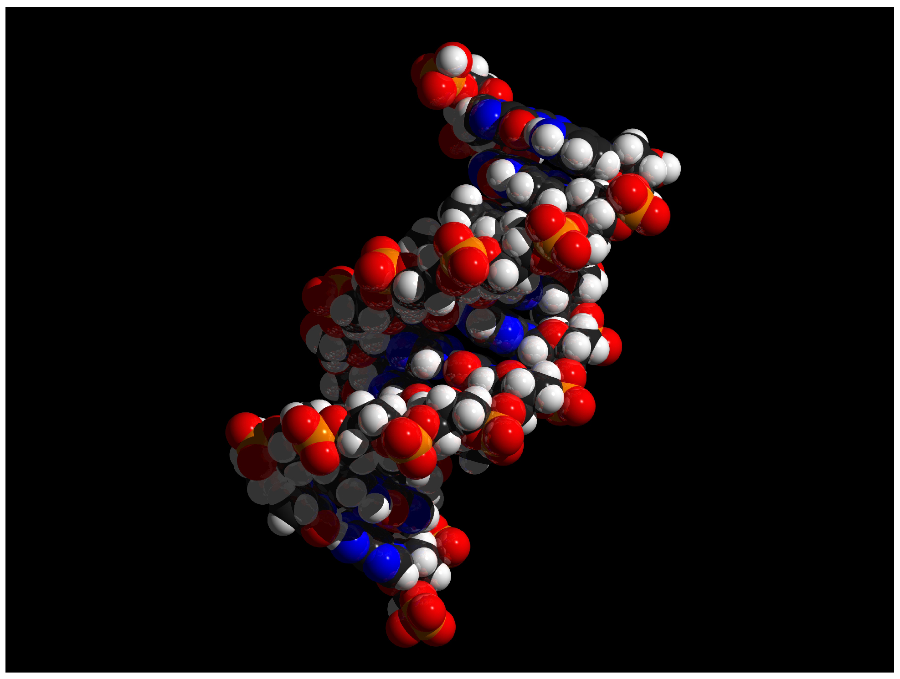

<?cnx.eoc class="summary" title="Chapter Review"?>

<?cnx.eoc class="interactive-exercise" title="Interactive Link Questions"?>

<?cnx.eoc class="multiple-choice" title="Review Questions" ?>

<?cnx.eoc class="free-response" title="Critical Thinking Questions"?>

 {: #fig-ch02_00_01 data-title="Human DNA "}

Chapter Objectives

After studying this chapter, you will be able to:

* Describe the fundamental composition of matter
* Identify the three subatomic particles
* Identify the four most abundant elements in the body
* Explain the relationship between an atom’s number of electrons and its relative stability
* Distinguish between ionic bonds, covalent bonds, and hydrogen bonds
* Explain how energy is invested, stored, and released via chemical reactions, particularly those reactions that are critical to life
* Explain the importance of the inorganic compounds that contribute to life, such as water, salts, acids, and bases
* Compare and contrast the four important classes of organic (carbon-based) compounds—proteins, carbohydrates, lipids and nucleic acids—according to their composition and functional importance to human life

The smallest, most fundamental material components of the human body are basic chemical elements. In fact, chemicals called nucleotide bases are the foundation of the genetic code with the instructions on how to build and maintain the human body from conception through old age. There are about three billion of these base pairs in human DNA.

Human chemistry includes organic molecules (carbon-based) and biochemicals (those produced by the body). Human chemistry also includes elements. In fact, life cannot exist without many of the elements that are part of the earth. All of the elements that contribute to chemical reactions, to the transformation of energy, and to electrical activity and muscle contraction—elements that include phosphorus, carbon, sodium, and calcium, to name a few—originated in stars.

These elements, in turn, can form both the inorganic and organic chemical compounds important to life, including, for example, water, glucose, and proteins. This chapter begins by examining elements and how the structures of atoms, the basic units of matter, determine the characteristics of elements by the number of protons, neutrons, and electrons in the atoms. The chapter then builds the framework of life from there.

