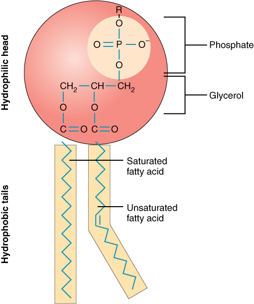
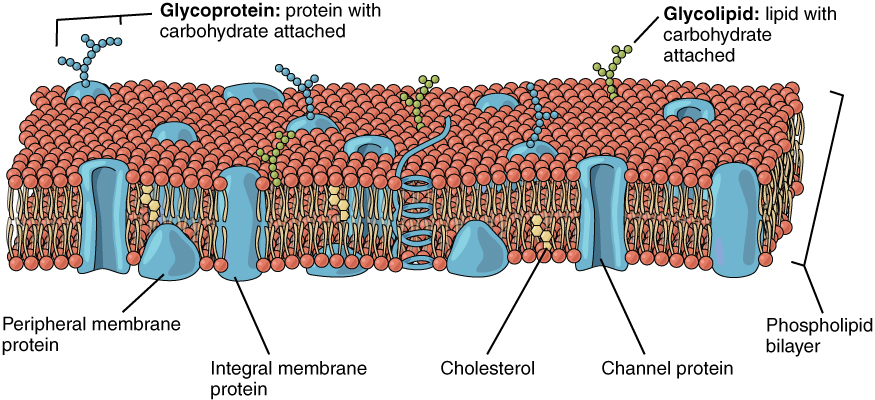
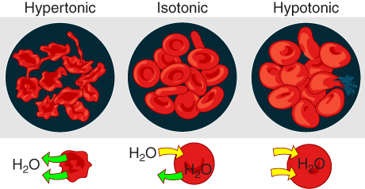
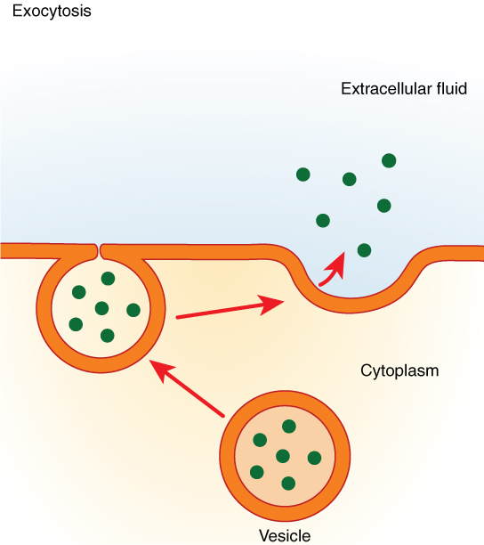

By the end of this section, you will be able to:
* Describe the molecular components that make up the cell membrane
* Explain the major features and properties of the cell membrane
* Differentiate between materials that can and cannot diffuse through the lipid bilayer
* Compare and contrast different types of passive transport with active transport, providing examples of each

Despite differences in structure and function, all living cells in multicellular organisms have a surrounding cell membrane. As the outer layer of your skin separates your body from its environment, the cell membrane (also known as the plasma membrane) separates the inner contents of a cell from its exterior environment. This cell membrane provides a protective barrier around the cell and regulates which materials can pass in or out.

# Structure and Composition of the Cell Membrane

The **cell membrane**{: data-type="term"} is an extremely pliable structure composed primarily of back-to-back phospholipids (a “bilayer”). Cholesterol is also present, which contributes to the fluidity of the membrane, and there are various proteins embedded within the membrane that have a variety of functions.

A single phospholipid molecule has a phosphate group on one end, called the “head,” and two side-by-side chains of fatty acids that make up the lipid tails ([\[link\]](#fig-ch03_01_01)). The phosphate group is negatively charged, making the head polar and hydrophilic—or “water loving.” A **hydrophilic**{: data-type="term"} molecule (or region of a molecule) is one that is attracted to water. The phosphate heads are thus attracted to the water molecules of both the extracellular and intracellular environments. The lipid tails, on the other hand, are uncharged, or nonpolar, and are hydrophobic—or “water fearing.” A **hydrophobic**{: data-type="term"} molecule (or region of a molecule) repels and is repelled by water. Some lipid tails consist of saturated fatty acids and some contain unsaturated fatty acids. This combination adds to the fluidity of the tails that are constantly in motion. Phospholipids are thus amphipathic molecules. An **amphipathic**{: data-type="term"} molecule is one that contains both a hydrophilic and a hydrophobic region. In fact, soap works to remove oil and grease stains because it has amphipathic properties. The hydrophilic portion can dissolve in water while the hydrophobic portion can trap grease in micelles that then can be washed away.

 {: #fig-ch03_01_01 data-title="Phospholipid Structure "}

The cell membrane consists of two adjacent layers of phospholipids. The lipid tails of one layer face the lipid tails of the other layer, meeting at the interface of the two layers. The phospholipid heads face outward, one layer exposed to the interior of the cell and one layer exposed to the exterior ([\[link\]](#fig-ch03_01_02)). Because the phosphate groups are polar and hydrophilic, they are attracted to water in the intracellular fluid.<strong data-type="term"> Intracellular fluid (ICF)</strong> is the fluid interior of the cell. The phosphate groups are also attracted to the extracellular fluid. **Extracellular fluid (ECF)**{: data-type="term"} is the fluid environment outside the enclosure of the cell membrane. **Interstitial fluid (IF)**{: data-type="term"} is the term given to extracellular fluid not contained within blood vessels. Because the lipid tails are hydrophobic, they meet in the inner region of the membrane, excluding watery intracellular and extracellular fluid from this space. The cell membrane has many proteins, as well as other lipids (such as cholesterol), that are associated with the phospholipid bilayer. An important feature of the membrane is that it remains fluid; the lipids and proteins in the cell membrane are not rigidly locked in place.

 {: #fig-ch03_01_02 data-title="Phospolipid Bilayer"}

# Membrane Proteins

The lipid bilayer forms the basis of the cell membrane, but it is peppered throughout with various proteins. Two different types of proteins that are commonly associated with the cell membrane are the integral proteins and peripheral protein ([\[link\]](#fig-ch03_01_03)). As its name suggests, an **integral protein**{: data-type="term"} is a protein that is embedded in the membrane. A **channel protein**{: data-type="term"} is an example of an integral protein that selectively allows particular materials, such as certain ions, to pass into or out of the cell.

 {: #fig-ch03_01_03 data-title="Cell Membrane"}

Another important group of integral proteins are cell recognition proteins, which serve to mark a cell’s identity so that it can be recognized by other cells. A **receptor**{: data-type="term"} is a type of recognition protein that can selectively bind a specific molecule outside the cell, and this binding induces a chemical reaction within the cell. A **ligand**{: data-type="term"} is the specific molecule that binds to and activates a receptor. Some integral proteins serve dual roles as both a receptor and an ion channel. One example of a receptor-ligand interaction is the receptors on nerve cells that bind neurotransmitters, such as dopamine. When a dopamine molecule binds to a dopamine receptor protein, a channel within the transmembrane protein opens to allow certain ions to flow into the cell.

Some integral membrane proteins are glycoproteins. A **glycoprotein**{: data-type="term"} is a protein that has carbohydrate molecules attached, which extend into the extracellular matrix. The attached carbohydrate tags on glycoproteins aid in cell recognition. The carbohydrates that extend from membrane proteins and even from some membrane lipids collectively form the glycocalyx. The **glycocalyx**{: data-type="term"} is a fuzzy-appearing coating around the cell formed from glycoproteins and other carbohydrates attached to the cell membrane. The glycocalyx can have various roles. For example, it may have molecules that allow the cell to bind to another cell, it may contain receptors for hormones, or it might have enzymes to break down nutrients. The glycocalyces found in a person’s body are products of that person’s genetic makeup. They give each of the individual’s trillions of cells the “identity” of belonging in the person’s body. This identity is the primary way that a person’s immune defense cells “know” not to attack the person’s own body cells, but it also is the reason organs donated by another person might be rejected.

**Peripheral proteins**{: data-type="term"} are typically found on the inner or outer surface of the lipid bilayer but can also be attached to the internal or external surface of an integral protein. These proteins typically perform a specific function for the cell. Some peripheral proteins on the surface of intestinal cells, for example, act as digestive enzymes to break down nutrients to sizes that can pass through the cells and into the bloodstream.

# Transport across the Cell Membrane

One of the great wonders of the cell membrane is its ability to regulate the concentration of substances inside the cell. These substances include ions such as Ca++, Na+, K+, and Cl–; nutrients including sugars, fatty acids, and amino acids; and waste products, particularly carbon dioxide (CO2), which must leave the cell.

The membrane’s lipid bilayer structure provides the first level of control. The phospholipids are tightly packed together, and the membrane has a hydrophobic interior. This structure causes the membrane to be selectively permeable. A membrane that has **selective permeability**{: data-type="term"} allows only substances meeting certain criteria to pass through it unaided. In the case of the cell membrane, only relatively small, nonpolar materials can move through the lipid bilayer (remember, the lipid tails of the membrane are nonpolar). Some examples of these are other lipids, oxygen and carbon dioxide gases, and alcohol. However, water-soluble materials—like glucose, amino acids, and electrolytes—need some assistance to cross the membrane because they are repelled by the hydrophobic tails of the phospholipid bilayer. All substances that move through the membrane do so by one of two general methods, which are categorized based on whether or not energy is required. **Passive transport**{: data-type="term"} is the movement of substances across the membrane without the expenditure of cellular energy. In contrast, **active transport**{: data-type="term"} is the movement of substances across the membrane using energy from adenosine triphosphate (ATP).

## Passive Transport

In order to understand <em>how </em>substances move passively across a cell membrane, it is necessary to understand concentration gradients and diffusion. A **concentration gradient**{: data-type="term"} is the difference in concentration of a substance across a space. Molecules (or ions) will spread/diffuse from where they are more concentrated to where they are less concentrated until they are equally distributed in that space. (When molecules move in this way, they are said to move<em> down</em> their concentration gradient.) **Diffusion**{: data-type="term"} is the movement of particles from an area of higher concentration to an area of lower concentration. A couple of common examples will help to illustrate this concept. Imagine being inside a closed bathroom. If a bottle of perfume were sprayed, the scent molecules would naturally diffuse from the spot where they left the bottle to all corners of the bathroom, and this diffusion would go on until no more concentration gradient remains. Another example is a spoonful of sugar placed in a cup of tea. Eventually the sugar will diffuse throughout the tea until no concentration gradient remains. In both cases, if the room is warmer or the tea hotter, diffusion occurs even faster as the molecules are bumping into each other and spreading out faster than at cooler temperatures. Having an internal body temperature around 98.6° F thus also aids in diffusion of particles within the body.

  
Visit this [link][1] to see diffusion and how it is propelled by the kinetic energy of molecules in solution. How does temperature affect diffusion rate, and why?

Whenever a substance exists in greater concentration on one side of a semipermeable membrane, such as the cell membranes, any substance that can move down its concentration gradient across the membrane will do so. Consider substances that can easily diffuse through the lipid bilayer of the cell membrane, such as the gases oxygen (O2) and CO2. O2 generally diffuses into cells because it is more concentrated outside of them, and CO2 typically diffuses out of cells because it is more concentrated inside of them. Neither of these examples requires any energy on the part of the cell, and therefore they use passive transport to move across the membrane.

Before moving on, you need to review the gases that can diffuse across a cell membrane. Because cells rapidly use up oxygen during metabolism, there is typically a lower concentration of O2 inside the cell than outside. As a result, oxygen will diffuse from the interstitial fluid directly through the lipid bilayer of the membrane and into the cytoplasm within the cell. On the other hand, because cells produce CO2 as a byproduct of metabolism, CO2 concentrations rise within the cytoplasm; therefore, CO2 will move from the cell through the lipid bilayer and into the interstitial fluid, where its concentration is lower. This mechanism of molecules spreading from where they are more concentrated to where they are less concentration is a form of passive transport called simple diffusion ([\[link\]](#fig-ch03_01_04)).

 {: #fig-ch03_01_04 data-title="Simple Diffusion across the Cell (Plasma) Membrane"}

Solutes dissolved in water on either side of the cell membrane will tend to diffuse down their concentration gradients, but because most substances cannot pass freely through the lipid bilayer of the cell membrane, their movement is restricted to protein channels and specialized transport mechanisms in the membrane. **Facilitated diffusion**{: data-type="term"} is the diffusion process used for those substances that cannot cross the lipid bilayer due to their size and/or polarity ([\[link\]](#fig-ch03_01_05)). A common example of facilitated diffusion is the movement of glucose into the cell, where it is used to make ATP. Although glucose can be more concentrated outside of a cell, it cannot cross the lipid bilayer via simple diffusion because it is both large and polar. To resolve this, a specialized carrier protein called the glucose transporter will transfer glucose molecules into the cell to facilitate its inward diffusion.

 Facilitated diffusion of substances crossing the cell (plasma) membrane takes place with the help of proteins such as channel proteins and carrier proteins. Channel proteins are less selective than carrier proteins, and usually mildly discriminate between their cargo based on size and charge. (b) Carrier proteins are more selective, often only allowing one particular type of molecule to cross."){: #fig-ch03_01_05 data-title="Facilitated Diffusion"}

As an example, even though sodium ions (Na+) are highly concentrated outside of cells, these electrolytes are polarized and cannot pass through the nonpolar lipid bilayer of the membrane. Their diffusion is facilitated by membrane proteins that form sodium channels (or “pores”), so that Na+ ions can move down their concentration gradient from outside the cells to inside the cells. There are many other solutes that must undergo facilitated diffusion to move into a cell, such as amino acids, or to move out of a cell, such as wastes. Because facilitated diffusion is a passive process, it does not require energy expenditure by the cell.

Water also can move freely across the cell membrane of all cells, either through protein channels or by slipping between the lipid tails of the membrane itself. **Osmosis**{: data-type="term"} is the diffusion of water through a semipermeable membrane ([\[link\]](#fig-ch03_01_06)).

 . In the beaker on the left, the solution on the right side of the membrane is hypertonic."){: #fig-ch03_01_06 data-title="Osmosis"}

The movement of water molecules is not itself regulated by cells, so it is important that cells are exposed to an environment in which the concentration of solutes outside of the cells (in the extracellular fluid) is equal to the concentration of solutes inside the cells (in the cytoplasm). Two solutions that have the same concentration of solutes are said to be **isotonic**{: data-type="term"} (equal tension). When cells and their extracellular environments are isotonic, the concentration of water molecules is the same outside and inside the cells, and the cells maintain their normal shape (and function).

Osmosis occurs when there is an imbalance of solutes outside of a cell versus inside the cell. A solution that has a higher concentration of solutes than another solution is said to be **hypertonic**{: data-type="term"}, and water molecules tend to diffuse into a hypertonic solution ([\[link\]](#fig-ch03_01_07)). Cells in a hypertonic solution will shrivel as water leaves the cell via osmosis. In contrast, a solution that has a lower concentration of solutes than another solution is said to be **hypotonic**{: data-type="term"}, and water molecules tend to diffuse out of a hypotonic solution. Cells in a hypotonic solution will take on too much water and swell, with the risk of eventually bursting. A critical aspect of homeostasis in living things is to create an internal environment in which all of the body’s cells are in an isotonic solution. Various organ systems, particularly the kidneys, work to maintain this homeostasis.

 {: #fig-ch03_01_07 data-title="Concentration of Solutions"}

Another mechanism besides diffusion to passively transport materials between compartments is filtration. Unlike diffusion of a substance from where it is more concentrated to less concentrated, filtration uses a hydrostatic pressure gradient that pushes the fluid—and the solutes within it—from a higher pressure area to a lower pressure area. Filtration is an extremely important process in the body. For example, the circulatory system uses filtration to move plasma and substances across the endothelial lining of capillaries and into surrounding tissues, supplying cells with the nutrients. Filtration pressure in the kidneys provides the mechanism to remove wastes from the bloodstream.

## Active Transport

For all of the transport methods described above, the cell expends no energy. Membrane proteins that aid in the passive transport of substances do so without the use of ATP. During active transport, ATP is required to move a substance across a membrane, often with the help of protein carriers, and usually *against* its concentration gradient.

One of the most common types of active transport involves proteins that serve as pumps. The word “pump” probably conjures up thoughts of using energy to pump up the tire of a bicycle or a basketball. Similarly, energy from ATP is required for these membrane proteins to transport substances—molecules or ions—across the membrane, usually against their concentration gradients (from an area of low concentration to an area of high concentration).

The **sodium-potassium pump**{: data-type="term"}, which is also called Na+/K+ ATPase, transports sodium out of a cell while moving potassium into the cell. The Na+/K+ pump is an important ion pump found in the membranes of many types of cells. These pumps are particularly abundant in nerve cells, which are constantly pumping out sodium ions and pulling in potassium ions to maintain an electrical gradient across their cell membranes. An **electrical gradient**{: data-type="term"} is a difference in electrical charge across a space. In the case of nerve cells, for example, the electrical gradient exists between the inside and outside of the cell, with the inside being negatively-charged (at around -70 mV) relative to the outside. The negative electrical gradient is maintained because each Na+/K+ pump moves three Na+ ions out of the cell and two K+ ions into the cell for each ATP molecule that is used ([\[link\]](#fig-ch03_01_08)). This process is so important for nerve cells that it accounts for the majority of their ATP usage.

 membranes. Powered by ATP, the pump moves sodium and potassium ions in opposite directions, each against its concentration gradient. In a single cycle of the pump, three sodium ions are extruded from and two potassium ions are imported into the cell."){: #fig-ch03_01_08 data-title="Sodium-Potassium Pump"}

Active transport pumps can also work together with other active or passive transport systems to move substances across the membrane. For example, the sodium-potassium pump maintains a high concentration of sodium ions outside of the cell. Therefore, if the cell needs sodium ions, all it has to do is open a passive sodium channel, as the concentration gradient of the sodium ions will drive them to diffuse into the cell. In this way, the action of an active transport pump (the sodium-potassium pump) powers the passive transport of sodium ions by creating a concentration gradient. When active transport powers the transport of another substance in this way, it is called secondary active transport.

Symporters are secondary active transporters that move two substances in the same direction. For example, the sodium-glucose symporter uses sodium ions to “pull” glucose molecules into the cell. Because cells store glucose for energy, glucose is typically at a higher concentration inside of the cell than outside. However, due to the action of the sodium-potassium pump, sodium ions will easily diffuse into the cell when the symporter is opened. The flood of sodium ions through the symporter provides the energy that allows glucose to move through the symporter and into the cell, against its concentration gradient.

Conversely, antiporters are secondary active transport systems that transport substances in opposite directions. For example, the sodium-hydrogen ion antiporter uses the energy from the inward flood of sodium ions to move hydrogen ions (H+) out of the cell. The sodium-hydrogen antiporter is used to maintain the pH of the cell\'s interior.

Other forms of active transport do not involve membrane carriers. **Endocytosis**{: data-type="term"} (bringing “into the cell”) is the process of a cell ingesting material by enveloping it in a portion of its cell membrane, and then pinching off that portion of membrane ([\[link\]](#fig-ch03_01_09)). Once pinched off, the portion of membrane and its contents becomes an independent, intracellular vesicle. A **vesicle**{: data-type="term"} is a membranous sac—a spherical and hollow organelle bounded by a lipid bilayer membrane. Endocytosis often brings materials into the cell that must to be broken down or digested. **Phagocytosis**{: data-type="term"} (“cell eating”) is the endocytosis of large particles. Many immune cells engage in phagocytosis of invading pathogens. Like little Pac-men, their job is to patrol body tissues for unwanted matter, such as invading bacterial cells, phagocytize them, and digest them. In contrast to phagocytosis, **pinocytosis**{: data-type="term"} (“cell drinking”) brings fluid containing dissolved substances into a cell through membrane vesicles.

  In phagocytosis, which is relatively nonselective, the cell takes in a large particle. (b) In pinocytosis, the cell takes in small particles in fluid. (c) In contrast, receptor-mediated endocytosis is quite selective. When external receptors bind a specific ligand, the cell responds by endocytosing the ligand."){: #fig-ch03_01_09 data-title="Three Forms of Endocytosis"}

Phagocytosis and pinocytosis take in large portions of extracellular material, and they are typically not highly selective in the substances they bring in. Cells regulate the endocytosis of specific substances via receptor-mediated endocytosis. **Receptor-mediated endocytosis**{: data-type="term"} is endocytosis by a portion of the cell membrane that contains many receptors that are specific for a certain substance. Once the surface receptors have bound sufficient amounts of the specific substance (the receptor’s ligand), the cell will endocytose the part of the cell membrane containing the receptor-ligand complexes. Iron, a required component of hemoglobin, is endocytosed by red blood cells in this way. Iron is bound to a protein called transferrin in the blood. Specific transferrin receptors on red blood cell surfaces bind the iron-transferrin molecules, and the cell endocytoses the receptor-ligand complexes.

In contrast with endocytosis, **exocytosis**{: data-type="term"} (taking “out of the cell”) is the process of a cell exporting material using vesicular transport ([\[link\]](#fig-ch03_01_10)). Many cells manufacture substances that must be secreted, like a factory manufacturing a product for export. These substances are typically packaged into membrane-bound vesicles within the cell. When the vesicle membrane fuses with the cell membrane, the vesicle releases it contents into the interstitial fluid. The vesicle membrane then becomes part of the cell membrane. Cells of the stomach and pancreas produce and secrete digestive enzymes through exocytosis ([\[link\]](#fig-ch03_01_11)). Endocrine cells produce and secrete hormones that are sent throughout the body, and certain immune cells produce and secrete large amounts of histamine, a chemical important for immune responses.

 {: #fig-ch03_01_10 data-title="Exocytosis"}

"){: #fig-ch03_01_11 data-title="Pancreatic Cells' Enzyme Products"}

  
View the University of Michigan WebScope at [http://virtualslides.med.umich.edu/Histology/EMsmallCharts/3%20Image%20Scope%20finals/226%20-%20Pancreas\\\_001.svs/view.apml][2] to explore the tissue sample in greater detail.

Diseases of the…

Cell: Cystic Fibrosis Cystic fibrosis (CF) affects approximately 30,000 people in the United States, with about 1,000 new cases reported each year. The genetic disease is most well known for its damage to the lungs, causing breathing difficulties and chronic lung infections, but it also affects the liver, pancreas, and intestines. Only about 50 years ago, the prognosis for children born with CF was very grim—a life expectancy rarely over 10 years. Today, with advances in medical treatment, many CF patients live into their 30s.

The symptoms of CF result from a malfunctioning membrane ion channel called the cystic fibrosis transmembrane conductance regulator, or CFTR. In healthy people, the CFTR protein is an integral membrane protein that transports Cl– ions out of the cell. In a person who has CF, the gene for the CFTR is mutated, thus, the cell manufactures a defective channel protein that typically is not incorporated into the membrane, but is instead degraded by the cell.

The CFTR requires ATP in order to function, making its Cl– transport a form of active transport. This characteristic puzzled researchers for a long time because the Cl– ions are actually flowing *down* their concentration gradient when transported out of cells. Active transport generally pumps ions *against* their concentration gradient, but the CFTR presents an exception to this rule.

In normal lung tissue, the movement of Cl– out of the cell maintains a Cl–-rich, negatively charged environment immediately outside of the cell. This is particularly important in the epithelial lining of the respiratory system. Respiratory epithelial cells secrete mucus, which serves to trap dust, bacteria, and other debris. A cilium (plural = cilia) is one of the hair-like appendages found on certain cells. Cilia on the epithelial cells move the mucus and its trapped particles up the airways away from the lungs and toward the outside. In order to be effectively moved upward, the mucus cannot be too viscous; rather it must have a thin, watery consistency. The transport of Cl– and the maintenance of an electronegative environment outside of the cell attract positive ions such as Na+ to the extracellular space. The accumulation of both Cl– and Na+ ions in the extracellular space creates solute-rich mucus, which has a low concentration of water molecules. As a result, through osmosis, water moves from cells and extracellular matrix into the mucus, “thinning” it out. This is how, in a normal respiratory system, the mucus is kept sufficiently watered-down to be propelled out of the respiratory system.

If the CFTR channel is absent, Cl– ions are not transported out of the cell in adequate numbers, thus preventing them from drawing positive ions. The absence of ions in the secreted mucus results in the lack of a normal water concentration gradient. Thus, there is no osmotic pressure pulling water into the mucus. The resulting mucus is thick and sticky, and the ciliated epithelia cannot effectively remove it from the respiratory system. Passageways in the lungs become blocked with mucus, along with the debris it carries. Bacterial infections occur more easily because bacterial cells are not effectively carried away from the lungs.

# Chapter Review

The cell membrane provides a barrier around the cell, separating its internal components from the extracellular environment. It is composed of a phospholipid bilayer, with hydrophobic internal lipid “tails” and hydrophilic external phosphate “heads.” Various membrane proteins are scattered throughout the bilayer, both inserted within it and attached to it peripherally. The cell membrane is selectively permeable, allowing only a limited number of materials to diffuse through its lipid bilayer. All materials that cross the membrane do so using passive (non energy-requiring) or active (energy-requiring) transport processes. During passive transport, materials move by simple diffusion or by facilitated diffusion through the membrane, down their concentration gradient. Water passes through the membrane in a diffusion process called osmosis. During active transport, energy is expended to assist material movement across the membrane in a direction against their concentration gradient. Active transport may take place with the help of protein pumps or through the use of vesicles.

# Interactive Link Questions

Visit this [link][1] to see diffusion and how it is propelled by the kinetic energy of molecules in solution. How does temperature affect diffusion rate, and why?

Higher temperatures speed up diffusion because molecules have more kinetic energy at higher temperatures.

# Review Questions

Because they are embedded within the membrane, ion channels are examples of \_\_\_\_\_\_\_\_.

1.  receptor proteins
2.  integral proteins
3.  peripheral proteins
4.  glycoproteins
{: data-number-style="lower-alpha"}

B

The diffusion of substances within a solution tends to move those substances \_\_\_\_\_\_\_\_ their \_\_\_\_\_\_\_\_ gradient.

1.  up; electrical
2.  up; electrochemical
3.  down; pressure
4.  down; concentration
{: data-number-style="lower-alpha"}

D

Ion pumps and phagocytosis are both examples of \_\_\_\_\_\_\_\_.

1.  endocytosis
2.  passive transport
3.  active transport
4.  facilitated diffusion
{: data-number-style="lower-alpha"}

C

Choose the answer that best completes the following analogy: Diffusion is to \_\_\_\_\_\_\_\_ as endocytosis is to \_\_\_\_\_\_\_\_.

1.  filtration; phagocytosis
2.  osmosis; pinocytosis
3.  solutes; fluid
4.  gradient; chemical energy
{: data-number-style="lower-alpha"}

B

# Critical Thinking Questions

What materials can easily diffuse through the lipid bilayer, and why?

Only materials that are relatively small and nonpolar can easily diffuse through the lipid bilayer. Large particles cannot fit in between the individual phospholipids that are packed together, and polar molecules are repelled by the hydrophobic/nonpolar lipids that line the inside of the bilayer.

Why is receptor-mediated endocytosis said to be more selective than phagocytosis or pinocytosis?

Receptor-mediated endocytosis is more selective because the substances that are brought into the cell are the specific ligands that could bind to the receptors being endocytosed. Phagocytosis or pinocytosis, on the other hand, have no such receptor-ligand specificity, and bring in whatever materials happen to be close to the membrane when it is enveloped.

What do osmosis, diffusion, filtration, and the movement of ions away from like charge all have in common? In what way do they differ?

These four phenomena are similar in the sense that they describe the movement of substances down a particular type of gradient. Osmosis and diffusion involve the movement of water and other substances down their concentration gradients, respectively. Filtration describes the movement of particles down a pressure gradient, and the movement of ions away from like charge describes their movement down their electrical gradient.

[1]: http://openstaxcollege.org/l/diffusion
[2]: http://openstaxcollege.org/l/pcells
