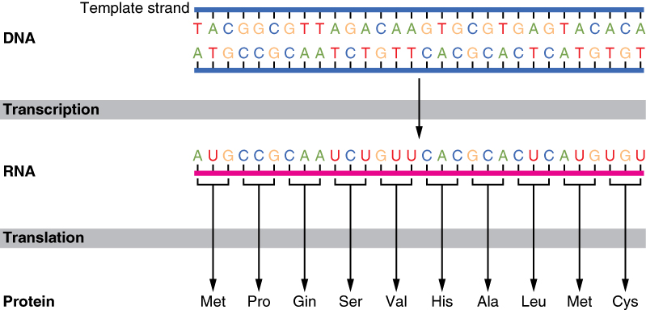
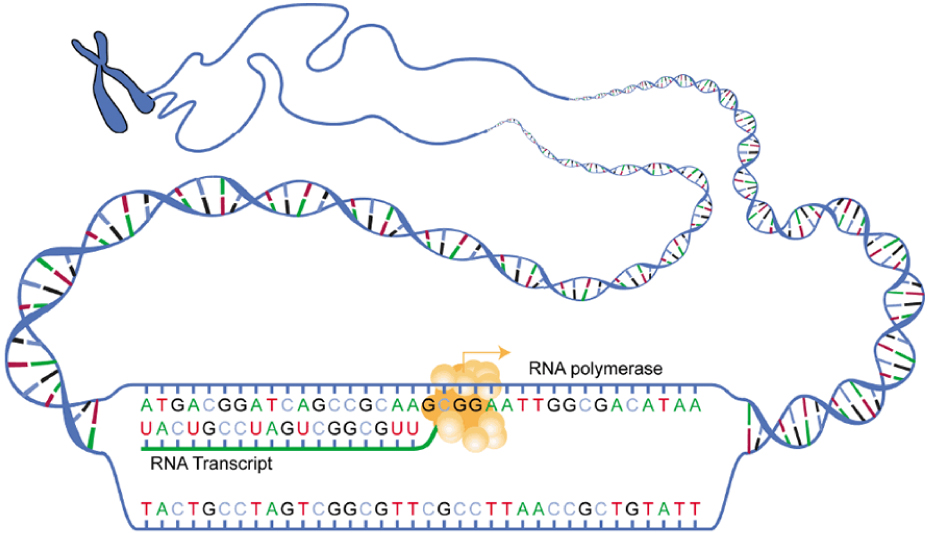
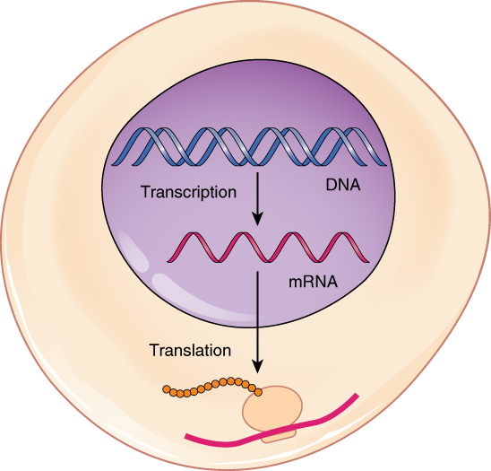

By the end of this section, you will be able to:
* Explain how the genetic code stored within DNA determines the protein that will form
* Describe the process of transcription
* Describe the process of translation
* Discuss the function of ribosomes

It was mentioned earlier that DNA provides a “blueprint” for the cell structure and physiology. This refers to the fact that DNA contains the information necessary for the cell to build one very important type of molecule: the protein. Most structural components of the cell are made up, at least in part, by proteins and virtually all the functions that a cell carries out are completed with the help of proteins. One of the most important classes of proteins is enzymes, which help speed up necessary biochemical reactions that take place inside the cell. Some of these critical biochemical reactions include building larger molecules from smaller components (such as occurs during DNA replication or synthesis of microtubules) and breaking down larger molecules into smaller components (such as when harvesting chemical energy from nutrient molecules). Whatever the cellular process may be, it is almost sure to involve proteins. Just as the cell’s genome describes its full complement of DNA, a cell’s **proteome**{: data-type="term"} is its full complement of proteins. Protein synthesis begins with genes. A **gene**{: data-type="term"} is a functional segment of DNA that provides the genetic information necessary to build a protein. Each particular gene provides the code necessary to construct a particular protein.<strong data-type="term"> Gene expression</strong>, which transforms the information coded in a gene to a final gene product, ultimately dictates the structure and function of a cell by determining which proteins are made.

The interpretation of genes works in the following way. Recall that proteins are polymers, or chains, of many amino acid building blocks. The sequence of bases in a gene (that is, its sequence of A, T, C, G nucleotides) translates to an amino acid sequence. A **triplet**{: data-type="term"} is a section of three DNA bases in a row that codes for a specific amino acid. Similar to the way in which the three-letter code *d-o-g* signals the image of a dog, the three-letter DNA base code signals the use of a particular amino acid. For example, the DNA triplet CAC (cytosine, adenine, and cytosine) specifies the amino acid valine. Therefore, a gene, which is composed of multiple triplets in a unique sequence, provides the code to build an entire protein, with multiple amino acids in the proper sequence ([\[link\]](#fig-ch03_04_01)). The mechanism by which cells turn the DNA code into a protein product is a two-step process, with an RNA molecule as the intermediate.

 {: #fig-ch03_04_01 data-title="The Genetic Code"}

# From DNA to RNA: Transcription

DNA is housed within the nucleus, and protein synthesis takes place in the cytoplasm, thus there must be some sort of intermediate messenger that leaves the nucleus and manages protein synthesis. This intermediate messenger is **messenger RNA (mRNA)**{: data-type="term"}, a single-stranded nucleic acid that carries a copy of the genetic code for a single gene out of the nucleus and into the cytoplasm where it is used to produce proteins.

There are several different types of RNA, each having different functions in the cell. The structure of RNA is similar to DNA with a few small exceptions. For one thing, unlike DNA, most types of RNA, including mRNA, are single-stranded and contain no complementary strand. Second, the ribose sugar in RNA contains an additional oxygen atom compared with DNA. Finally, instead of the base thymine, RNA contains the base uracil. This means that adenine will always pair up with uracil during the protein synthesis process.

Gene expression begins with the process called **transcription**{: data-type="term"}, which is the synthesis of a strand of mRNA that is complementary to the gene of interest. This process is called transcription because the mRNA is like a transcript, or copy, of the gene’s DNA code. Transcription begins in a fashion somewhat like DNA replication, in that a region of DNA unwinds and the two strands separate, however, only that small portion of the DNA will be split apart. The triplets within the gene on this section of the DNA molecule are used as the template to transcribe the complementary strand of RNA ([\[link\]](#fig-ch03_04_02)). A **codon**{: data-type="term"} is a three-base sequence of mRNA, so-called because they directly encode amino acids. Like DNA replication, there are three stages to transcription: initiation, elongation, and termination.

 {: #fig-ch03_04_02 data-title="Transcription: from DNA to mRNA"}

*Stage 1: Initiation.* A region at the beginning of the gene called a **promoter**{: data-type="term"}—a particular sequence of nucleotides—triggers the start of transcription.

*Stage 2: Elongation.* Transcription starts when RNA polymerase unwinds the DNA segment. One strand, referred to as the coding strand, becomes the template with the genes to be coded. The polymerase then aligns the correct nucleic acid (A, C, G, or U) with its complementary base on the coding strand of DNA. **RNA polymerase**{: data-type="term"} is an enzyme that adds new nucleotides to a growing strand of RNA. This process builds a strand of mRNA.

*Stage 3: Termination.* When the polymerase has reached the end of the gene, one of three specific triplets (UAA, UAG, or UGA) codes a “stop” signal, which triggers the enzymes to terminate transcription and release the mRNA transcript.

Before the mRNA molecule leaves the nucleus and proceeds to protein synthesis, it is modified in a number of ways. For this reason, it is often called a pre-mRNA at this stage. For example, your DNA, and thus complementary mRNA, contains long regions called non-coding regions that do not code for amino acids. Their function is still a mystery, but the process called **splicing**{: data-type="term"} removes these non-coding regions from the pre-mRNA transcript ([\[link\]](#fig-ch03_04_03)). A **spliceosome**{: data-type="term"}—a structure composed of various proteins and other molecules—attaches to the mRNA and “splices” or cuts out the non-coding regions. The removed segment of the transcript is called an **intron**{: data-type="term"}. The remaining exons are pasted together. An **exon**{: data-type="term"} is a segment of RNA that remains after splicing. Interestingly, some introns that are removed from mRNA are not always non-coding. When different coding regions of mRNA are spliced out, different variations of the protein will eventually result, with differences in structure and function. This process results in a much larger variety of possible proteins and protein functions. When the mRNA transcript is ready, it travels out of the nucleus and into the cytoplasm.

 within a pre-mRNA transcript and reconnects the exons."){: #fig-ch03_04_03 data-title="Splicing DNA"}

# From RNA to Protein: Translation

Like translating a book from one language into another, the codons on a strand of mRNA must be translated into the amino acid alphabet of proteins. **Translation**{: data-type="term"} is the process of synthesizing a chain of amino acids called a **polypeptide**{: data-type="term"}. Translation requires two major aids: first, a “translator,” the molecule that will conduct the translation, and second, a substrate on which the mRNA strand is translated into a new protein, like the translator’s “desk.” Both of these requirements are fulfilled by other types of RNA. The substrate on which translation takes place is the ribosome.

Remember that many of a cell’s ribosomes are found associated with the rough ER, and carry out the synthesis of proteins destined for the Golgi apparatus. **Ribosomal RNA (rRNA)**{: data-type="term"} is a type of RNA that, together with proteins, composes the structure of the ribosome. Ribosomes exist in the cytoplasm as two distinct components, a small and a large subunit. When an mRNA molecule is ready to be translated, the two subunits come together and attach to the mRNA. The ribosome provides a substrate for translation, bringing together and aligning the mRNA molecule with the molecular “translators” that must decipher its code.

The other major requirement for protein synthesis is the translator molecules that physically “read” the mRNA codons. **Transfer RNA (tRNA)**{: data-type="term"} is a type of RNA that ferries the appropriate corresponding amino acids to the ribosome, and attaches each new amino acid to the last, building the polypeptide chain one-by-one. Thus tRNA transfers specific amino acids from the cytoplasm to a growing polypeptide. The tRNA molecules must be able to recognize the codons on mRNA and match them with the correct amino acid. The tRNA is modified for this function. On one end of its structure is a binding site for a specific amino acid. On the other end is a base sequence that matches the codon specifying its particular amino acid. This sequence of three bases on the tRNA molecule is called an **anticodon**{: data-type="term"}. For example, a tRNA responsible for shuttling the amino acid glycine contains a binding site for glycine on one end. On the other end it contains an anticodon that complements the glycine codon (GGA is a codon for glycine, and so the tRNAs anticodon would read CCU). Equipped with its particular cargo and matching anticodon, a tRNA molecule can read its recognized mRNA codon and bring the corresponding amino acid to the growing chain ([\[link\]](#fig-ch03_04_04)).

 {: #fig-ch03_04_04 data-title="Translation from RNA to Protein"}

Much like the processes of DNA replication and transcription, translation consists of three main stages: initiation, elongation, and termination. Initiation takes place with the binding of a ribosome to an mRNA transcript. The elongation stage involves the recognition of a tRNA anticodon with the next mRNA codon in the sequence. Once the anticodon and codon sequences are bound (remember, they are complementary base pairs), the tRNA presents its amino acid cargo and the growing polypeptide strand is attached to this next amino acid. This attachment takes place with the assistance of various enzymes and requires energy. The tRNA molecule then releases the mRNA strand, the mRNA strand shifts one codon over in the ribosome, and the next appropriate tRNA arrives with its matching anticodon. This process continues until the final codon on the mRNA is reached which provides a “stop” message that signals termination of translation and triggers the release of the complete, newly synthesized protein. Thus, a gene within the DNA molecule is transcribed into mRNA, which is then translated into a protein product ([\[link\]](#fig-ch03_04_05)).

 {: #fig-ch03_04_05 data-title="From DNA to Protein: Transcription through Translation"}

Commonly, an mRNA transcription will be translated simultaneously by several adjacent ribosomes. This increases the efficiency of protein synthesis. A single ribosome might translate an mRNA molecule in approximately one minute; so multiple ribosomes aboard a single transcript could produce multiple times the number of the same protein in the same minute. A **polyribosome**{: data-type="term"} is a string of ribosomes translating a single mRNA strand.

  
Watch this [video][1] to learn about ribosomes. The ribosome binds to the mRNA molecule to start translation of its code into a protein. What happens to the small and large ribosomal subunits at the end of translation?

# Chapter Review

DNA stores the information necessary for instructing the cell to perform all of its functions. Cells use the genetic code stored within DNA to build proteins, which ultimately determine the structure and function of the cell. This genetic code lies in the particular sequence of nucleotides that make up each gene along the DNA molecule. To “read” this code, the cell must perform two sequential steps. In the first step, transcription, the DNA code is converted into a RNA code. A molecule of messenger RNA that is complementary to a specific gene is synthesized in a process similar to DNA replication. The molecule of mRNA provides the code to synthesize a protein. In the process of translation, the mRNA attaches to a ribosome. Next, tRNA molecules shuttle the appropriate amino acids to the ribosome, one-by-one, coded by sequential triplet codons on the mRNA, until the protein is fully synthesized. When completed, the mRNA detaches from the ribosome, and the protein is released. Typically, multiple ribosomes attach to a single mRNA molecule at once such that multiple proteins can be manufactured from the mRNA concurrently.

# Interactive Link Questions

Watch this [video][1] to learn about ribosomes. The ribosome binds to the mRNA molecule to start translation of its code into a protein. What happens to the small and large ribosomal subunits at the end of translation?

They separate and move and are free to join translation of other segments of mRNA.

# Review Questions

Which of the following is *not* a difference between DNA and RNA?

1.  DNA contains thymine whereas RNA contains uracil
2.  DNA contains deoxyribose and RNA contains ribose
3.  DNA contains alternating sugar-phosphate molecules whereas RNA does not contain sugars
4.  RNA is single stranded and DNA is double stranded
{: data-number-style="lower-alpha"}

C

Transcription and translation take place in the \_\_\_\_\_\_\_\_ and \_\_\_\_\_\_\_\_, respectively.

1.  nucleus; cytoplasm
2.  nucleolus; nucleus
3.  nucleolus; cytoplasm
4.  cytoplasm; nucleus
{: data-number-style="lower-alpha"}

A

How many “letters” of an RNA molecule, in sequence, does it take to provide the code for a single amino acid?

1.  1
2.  2
3.  3
4.  4
{: data-number-style="lower-alpha"}

C

Which of the following is *not* made out of RNA?

1.  the carriers that shuffle amino acids to a growing polypeptide strand
2.  the ribosome
3.  the messenger molecule that provides the code for protein synthesis
4.  the intron
{: data-number-style="lower-alpha"}

B

# Critical Thinking Questions

Briefly explain the similarities between transcription and DNA replication.

Transcription and DNA replication both involve the synthesis of nucleic acids. These processes share many common features—particularly, the similar processes of initiation, elongation, and termination. In both cases the DNA molecule must be untwisted and separated, and the coding (i.e., sense) strand will be used as a template. Also, polymerases serve to add nucleotides to the growing DNA or mRNA strand. Both processes are signaled to terminate when completed.

Contrast transcription and translation. Name at least three differences between the two processes.

Transcription is really a “copy” process and translation is really an “interpretation” process, because transcription involves copying the DNA message into a very similar RNA message whereas translation involves converting the RNA message into the very different amino acid message. The two processes also differ in their location: transcription occurs in the nucleus and translation in the cytoplasm. The mechanisms by which the two processes are performed are also completely different: transcription utilizes polymerase enzymes to build mRNA whereas translation utilizes different kinds of RNA to build protein.

## Glossary
{: data-type="glossary-title"}

anticodon
: consecutive sequence of three nucleotides on a tRNA molecule that is complementary to a specific codon on an mRNA molecule
{: .definition}

codon
: consecutive sequence of three nucleotides on an mRNA molecule that corresponds to a specific amino acid
{: .definition}

exon
: one of the coding regions of an mRNA molecule that remain after splicing
{: .definition}

gene
: functional length of DNA that provides the genetic information necessary to build a protein
{: .definition}

gene expression
: active interpretation of the information coded in a gene to produce a functional gene product
{: .definition}

intron
: non-coding regions of a pre-mRNA transcript that may be removed during splicing
{: .definition}

messenger RNA (mRNA)
: nucleotide molecule that serves as an intermediate in the genetic code between DNA and protein
{: .definition}

polypeptide
: chain of amino acids linked by peptide bonds
{: .definition}

polyribosome
: simultaneous translation of a single mRNA transcript by multiple ribosomes
{: .definition}

promoter
: region of DNA that signals transcription to begin at that site within the gene
{: .definition}

proteome
: full complement of proteins produced by a cell (determined by the cell’s specific gene expression)
{: .definition}

ribosomal RNA (rRNA)
: RNA that makes up the subunits of a ribosome
{: .definition}

RNA polymerase
: enzyme that unwinds DNA and then adds new nucleotides to a growing strand of RNA for the transcription phase of protein synthesis
{: .definition}

spliceosome
: complex of enzymes that serves to splice out the introns of a pre-mRNA transcript
{: .definition}

splicing
: the process of modifying a pre-mRNA transcript by removing certain, typically non-coding, regions
{: .definition}

transcription
: process of producing an mRNA molecule that is complementary to a particular gene of DNA
{: .definition}

transfer RNA (tRNA)
: molecules of RNA that serve to bring amino acids to a growing polypeptide strand and properly place them into the sequence
{: .definition}

translation
: process of producing a protein from the nucleotide sequence code of an mRNA transcript
{: .definition}

triplet
: consecutive sequence of three nucleotides on a DNA molecule that, when transcribed into an mRNA codon, corresponds to a particular amino acid
{: .definition}

[1]: http://openstaxcollege.org/l/ribosome
