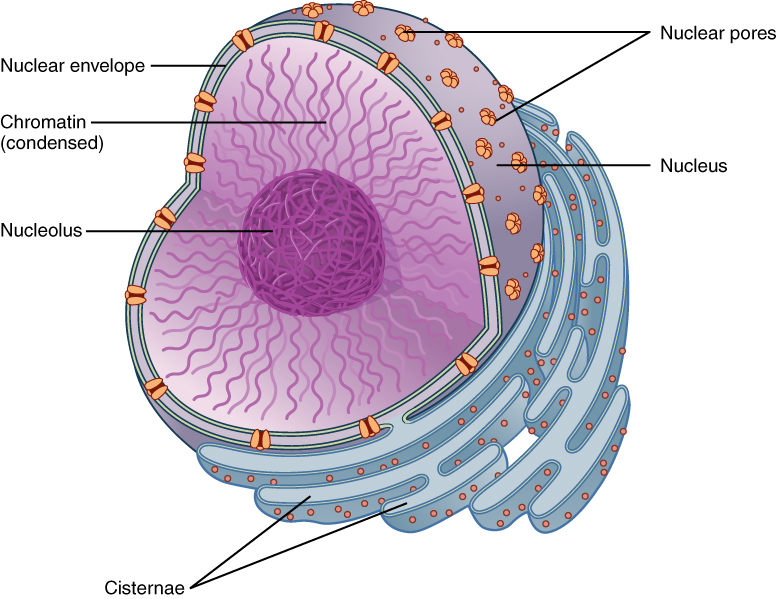

By the end of this section, you will be able to:
* Describe the structure and features of the nuclear membrane
* List the contents of the nucleus
* Explain the organization of the DNA molecule within the nucleus
* Describe the process of DNA replication

The nucleus is the largest and most prominent of a cell’s organelles ([\[link\]](#fig-ch03_03_01)). The nucleus is generally considered the control center of the cell because it stores all of the genetic instructions for manufacturing proteins. Interestingly, some cells in the body, such as muscle cells, contain more than one nucleus ([\[link\]](#fig-ch03_03_02)), which is known as multinucleated. Other cells, such as mammalian red blood cells (RBCs), do not contain nuclei at all. RBCs eject their nuclei as they mature, making space for the large numbers of hemoglobin molecules that carry oxygen throughout the body ([\[link\]](#fig-ch03_03_03)). Without nuclei, the life span of RBCs is short, and so the body must produce new ones constantly.

 {: #fig-ch03_03_01 data-title="The Nucleus"}

. During development, many smaller cells fuse to form a mature muscle fiber. The nuclei of the fused cells are conserved in the mature cell, thus imparting a multinucleate characteristic to mature muscle cells.  LM &#xD7; 104.3. (Micrograph provided by the Regents of University of Michigan Medical School &#xA9; 2012)"){: #fig-ch03_03_02 data-title="Multinucleate Muscle Cell"}

  
View the [University of Michigan WebScope][1] to explore the tissue sample in greater detail.

 "){: #fig-ch03_03_03 data-title="Red Blood Cell Extruding Its Nucleus"}

  
View the [University of Michigan WebScope][2] to explore the tissue sample in greater detail.

Inside the nucleus lies the blueprint that dictates everything a cell will do and all of the products it will make. This information is stored within DNA. The nucleus sends “commands” to the cell via molecular messengers that translate the information from DNA. Each cell in your body (with the exception of germ cells) contains the complete set of your DNA. When a cell divides, the DNA must be duplicated so that the each new cell receives a full complement of DNA. The following section will explore the structure of the nucleus and its contents, as well as the process of DNA replication.

### Organization of the Nucleus and Its DNA

Like most other cellular organelles, the nucleus is surrounded by a membrane called the **nuclear envelope**{: data-type="term"}. This membranous covering consists of two adjacent lipid bilayers with a thin fluid space in between them. Spanning these two bilayers are nuclear pores. A **nuclear pore**{: data-type="term"} is a tiny passageway for the passage of proteins, RNA, and solutes between the nucleus and the cytoplasm. Proteins called pore complexes lining the nuclear pores regulate the passage of materials into and out of the nucleus.

Inside the nuclear envelope is a gel-like nucleoplasm with solutes that include the building blocks of nucleic acids. There also can be a dark-staining mass often visible under a simple light microscope, called a **nucleolus**{: data-type="term"} (plural = nucleoli). The nucleolus is a region of the nucleus that is responsible for manufacturing the RNA necessary for construction of ribosomes. Once synthesized, newly made ribosomal subunits exit the cell’s nucleus through the nuclear pores.

The genetic instructions that are used to build and maintain an organism are arranged in an orderly manner in strands of DNA. Within the nucleus are threads of **chromatin**{: data-type="term"} composed of DNA and associated proteins ([\[link\]](#fig-ch03_03_04)). Along the chromatin threads, the DNA is wrapped around a set of **histone**{: data-type="term"} proteins. A **nucleosome**{: data-type="term"} is a single, wrapped DNA-histone complex. Multiple nucleosomes along the entire molecule of DNA appear like a beaded necklace, in which the string is the DNA and the beads are the associated histones. When a cell is in the process of division, the chromatin condenses into chromosomes, so that the DNA can be safely transported to the “daughter cells.” The **chromosome**{: data-type="term"} is composed of DNA and proteins; it is the condensed form of chromatin. It is estimated that humans have almost 22,000 genes distributed on 46 chromosomes.

 {: #fig-ch03_03_04 data-title="DNA Macrostructure"}

### DNA Replication

In order for an organism to grow, develop, and maintain its health, cells must reproduce themselves by dividing to produce two new daughter cells, each with the full complement of DNA as found in the original cell. Billions of new cells are produced in an adult human every day. Only very few cell types in the body do not divide, including nerve cells, skeletal muscle fibers, and cardiac muscle cells. The division time of different cell types varies. Epithelial cells of the skin and gastrointestinal lining, for instance, divide very frequently to replace those that are constantly being rubbed off of the surface by friction.

A DNA molecule is made of two strands that “complement” each other in the sense that the molecules that compose the strands fit together and bind to each other, creating a double-stranded molecule that looks much like a long, twisted ladder. Each side rail of the DNA ladder is composed of alternating sugar and phosphate groups ([\[link\]](#fig-ch03_03_05)). The two sides of the ladder are not identical, but are complementary. These two backbones are bonded to each other across pairs of protruding bases, each bonded pair forming one “rung,” or cross member. The four DNA bases are adenine (A), thymine (T), cytosine (C), and guanine (G). Because of their shape and charge, the two bases that compose a pair always bond together. Adenine always binds with thymine, and cytosine always binds with guanine. The particular sequence of bases along the DNA molecule determines the genetic code. Therefore, if the two complementary strands of DNA were pulled apart, you could infer the order of the bases in one strand from the bases in the other, complementary strand. For example, if one strand has a region with the sequence AGTGCCT, then the sequence of the complementary strand would be TCACGGA.

{: #fig-ch03_03_05 data-title="Molecular Structure of DNA"}

**DNA replication**{: data-type="term"} is the copying of DNA that occurs before cell division can take place. After a great deal of debate and experimentation, the general method of DNA replication was deduced in 1958 by two scientists in California, Matthew Meselson and Franklin Stahl. This method is illustrated in [\[link\]](#fig-ch03_03_06) and described below.

 {: #fig-ch03_03_06 data-title="DNA Replication"}

*Stage 1: Initiation.* The two complementary strands are separated, much like unzipping a zipper. Special enzymes, including **helicase**{: data-type="term"}, untwist and separate the two strands of DNA.

*Stage 2: Elongation.* Each strand becomes a template along which a new complementary strand is built. **DNA polymerase**{: data-type="term"} brings in the correct bases to complement the template strand, synthesizing a new strand base by base. A DNA polymerase is an enzyme that adds free nucleotides to the end of a chain of DNA, making a new double strand. This growing strand continues to be built until it has fully complemented the template strand.

*Stage 3: Termination.* Once the two original strands are bound to their own, finished, complementary strands, DNA replication is stopped and the two new identical DNA molecules are complete.

Each new DNA molecule contains one strand from the original molecule and one newly synthesized strand. The term for this mode of replication is “semiconservative,” because half of the original DNA molecule is conserved in each new DNA molecule. This process continues until the cell’s entire **genome**{: data-type="term"}, the entire complement of an organism’s DNA, is replicated. As you might imagine, it is very important that DNA replication take place precisely so that new cells in the body contain the exact same genetic material as their parent cells. Mistakes made during DNA replication, such as the accidental addition of an inappropriate nucleotide, have the potential to render a gene dysfunctional or useless. Fortunately, there are mechanisms in place to minimize such mistakes. A DNA proofreading process enlists the help of special enzymes that scan the newly synthesized molecule for mistakes and corrects them. Once the process of DNA replication is complete, the cell is ready to divide. You will explore the process of cell division later in the chapter.

  
Watch this [video][3] to learn about DNA replication. DNA replication proceeds simultaneously at several sites on the same molecule. What separates the base pair at the start of DNA replication?

### Chapter Review

The nucleus is the command center of the cell, containing the genetic instructions for all of the materials a cell will make (and thus all of its functions it can perform). The nucleus is encased within a membrane of two interconnected lipid bilayers, side-by-side. This nuclear envelope is studded with protein-lined pores that allow materials to be trafficked into and out of the nucleus. The nucleus contains one or more nucleoli, which serve as sites for ribosome synthesis. The nucleus houses the genetic material of the cell: DNA. DNA is normally found as a loosely contained structure called chromatin within the nucleus, where it is wound up and associated with a variety of histone proteins. When a cell is about to divide, the chromatin coils tightly and condenses to form chromosomes.

There is a pool of cells constantly dividing within your body. The result is billions of new cells being created each day. Before any cell is ready to divide, it must replicate its DNA so that each new daughter cell will receive an exact copy of the organism’s genome. A variety of enzymes are enlisted during DNA replication. These enzymes unwind the DNA molecule, separate the two strands, and assist with the building of complementary strands along each parent strand. The original DNA strands serve as templates from which the nucleotide sequence of the new strands are determined and synthesized. When replication is completed, two identical DNA molecules exist. Each one contains one original strand and one newly synthesized complementary strand.

### Interactive Link Questions

Watch this [video][3] to learn about DNA replication. DNA replication proceeds simultaneously at several sites on the same molecule. What separates the base pair at the start of DNA replication?

an enzyme

### Review Questions

The nucleus and mitochondria share which of the following features?

1.  protein-lined membrane pores
2.  a double cell membrane
3.  the synthesis of ribosomes
4.  the production of cellular energy
{: type="a"}

B

Which of the following structures could be found within the nucleolus?

1.  chromatin
2.  histones
3.  ribosomes
4.  nucleosomes
{: type="a"}

C

Which of the following sequences on a DNA molecule would be complementary to GCTTATAT?

1.  TAGGCGCG
2.  ATCCGCGC
3.  CGAATATA
4.  TGCCTCTC
{: type="a"}

C

Place the following structures in order from least to most complex organization: chromatin, nucleosome, DNA, chromosome

1.  DNA, nucleosome, chromatin, chromosome
2.  nucleosome, DNA, chromosome, chromatin
3.  DNA, chromatin, nucleosome, chromosome
4.  nucleosome, chromatin, DNA, chromosome
{: type="a"}

A

Which of the following is part of the elongation step of DNA synthesis?

1.  pulling apart the two DNA strands
2.  attaching complementary nucleotides to the template strand
3.  untwisting the DNA helix
4.  none of the above
{: type="a"}

B

### Critical Thinking Questions

Explain in your own words why DNA replication is said to be “semiconservative”?

DNA replication is said to be semiconservative because, after replication is complete, one of the two parent DNA strands makes up half of each new DNA molecule. The other half is a newly synthesized strand. Therefore, half (“semi”) of each daughter DNA molecule is from the parent molecule and half is a new molecule.

Why is it important that DNA replication take place before cell division? What would happen if cell division of a body cell took place without DNA replication, or when DNA replication was incomplete?

During cell division, one cell divides to produce two new cells. In order for all of the cells in your body to maintain a full genome, each cell must replicate its DNA before it divides so that a full genome can be allotted to each of its offspring cells. If DNA replication did not take place fully, or at all, the offspring cells would be missing some or all of the genome. This could be disastrous if a cell was missing genes necessary for its function and health.

### Glossary
{: data-type="glossary-title"}

chromatin
: substance consisting of DNA and associated proteins
^

chromosome
: condensed version of chromatin
^

DNA polymerase
: enzyme that functions in adding new nucleotides to a growing strand of DNA during DNA replication
^

DNA replication
: process of duplicating a molecule of DNA
^

genome
: entire complement of an organism’s DNA; found within virtually every cell
^

helicase
: enzyme that functions to separate the two DNA strands of a double helix during DNA replication
^

histone
: family of proteins that associate with DNA in the nucleus to form chromatin
^

nuclear envelope
: membrane that surrounds the nucleus; consisting of a double lipid-bilayer
^

nuclear pore
: one of the small, protein-lined openings found scattered throughout the nuclear envelope
^

nucleolus
: small region of the nucleus that functions in ribosome synthesis
^

nucleosome
: unit of chromatin consisting of a DNA strand wrapped around histone proteins

[1]: http://openstaxcollege.org/l/mnucleate
[2]: http://openstaxcollege.org/l/RBC
[3]: http://openstaxcollege.org/l/DNArep
