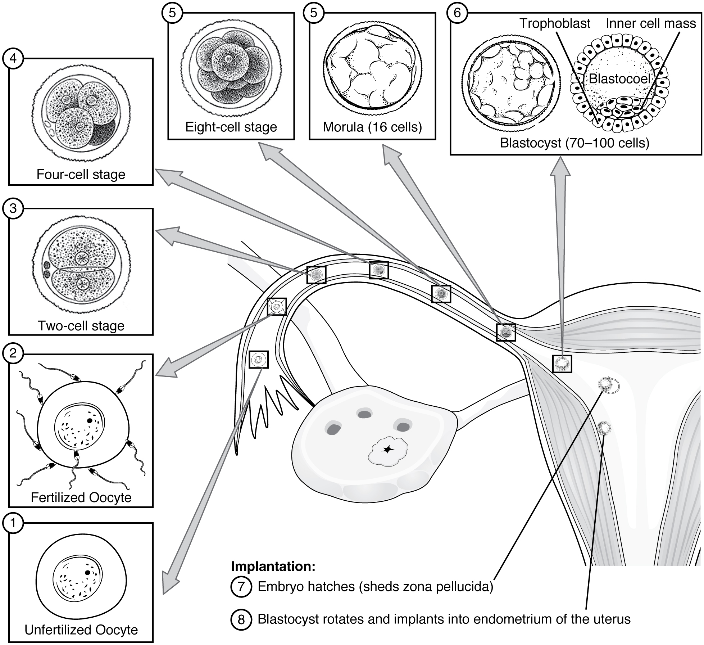
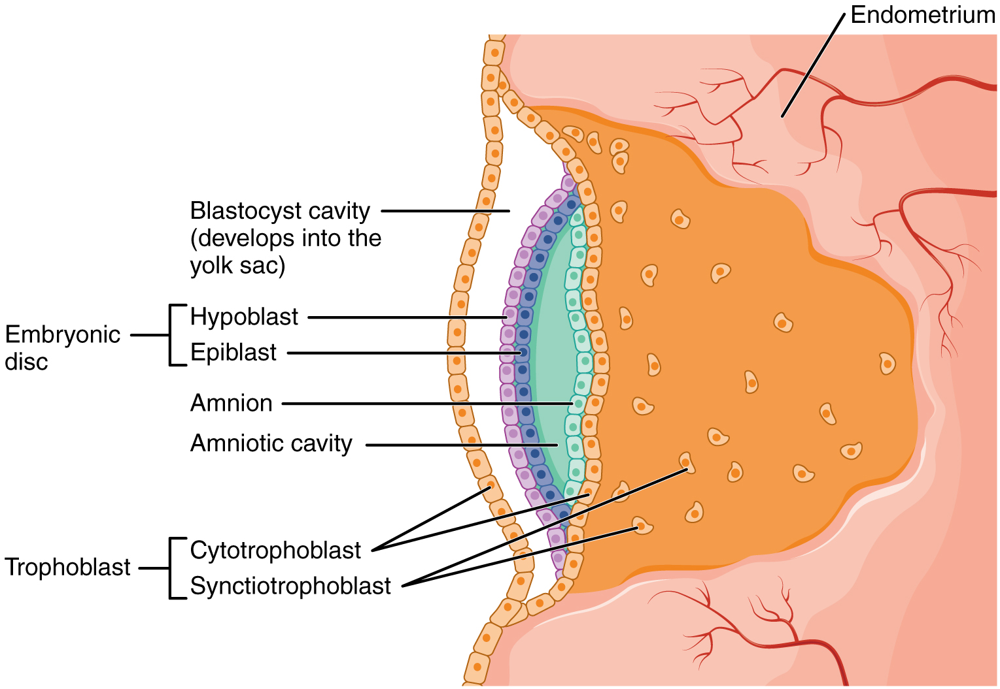
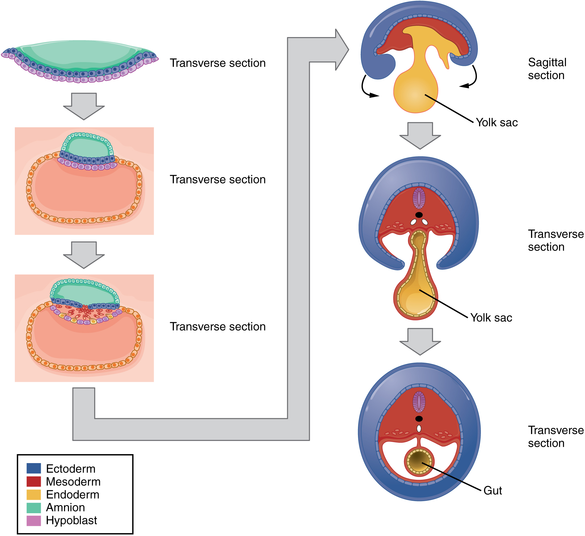

By the end of this section, you will be able to:
* Distinguish the stages of embryonic development that occur before implantation
* Describe the process of implantation
* List and describe four embryonic membranes
* Explain gastrulation
* Describe how the placenta is formed and identify its functions
* Explain how an embryo transforms from a flat disc of cells into a three-dimensional shape resembling a human
* Summarize the process of organogenesis

Throughout this chapter, we will express embryonic and fetal ages in terms of weeks from fertilization, commonly called conception. The period of time required for full development of a fetus in utero is referred to as **gestation**{: data-type="term"} (gestare = “to carry” or “to bear”). It can be subdivided into distinct gestational periods. The first 2 weeks of prenatal development are referred to as the pre-embryonic stage. A developing human is referred to as an **embryo**{: data-type="term"} during weeks 3–8, and a **fetus**{: data-type="term"} from the ninth week of gestation until birth. In this section, we’ll cover the pre-embryonic and embryonic stages of development, which are characterized by cell division, migration, and differentiation. By the end of the embryonic period, all of the organ systems are structured in rudimentary form, although the organs themselves are either nonfunctional or only semi-functional.

# Pre-implantation Embryonic Development

Following fertilization, the zygote and its associated membranes, together referred to as the **conceptus**{: data-type="term"}, continue to be projected toward the uterus by peristalsis and beating cilia. During its journey to the uterus, the zygote undergoes five or six rapid mitotic cell divisions. Although each **cleavage**{: data-type="term"} results in more cells, it does not increase the total volume of the conceptus ([\[link\]](#fig-ch29_02_01)). Each daughter cell produced by cleavage is called a **blastomere**{: data-type="term"} (blastos = “germ,” in the sense of a seed or sprout).

Approximately 3 days after fertilization, a 16-cell conceptus reaches the uterus. The cells that had been loosely grouped are now compacted and look more like a solid mass. The name given to this structure is the **morula**{: data-type="term"} (morula = “little mulberry”). Once inside the uterus, the conceptus floats freely for several more days. It continues to divide, creating a ball of approximately 100 cells, and consuming nutritive endometrial secretions called uterine milk while the uterine lining thickens. The ball of now tightly bound cells starts to secrete fluid and organize themselves around a fluid-filled cavity, the **blastocoel**{: data-type="term"}. At this developmental stage, the conceptus is referred to as a **blastocyst**{: data-type="term"}. Within this structure, a group of cells forms into an **inner cell mass**{: data-type="term"}, which is fated to become the embryo. The cells that form the outer shell are called **trophoblasts**{: data-type="term"} (trophe = “to feed” or “to nourish”). These cells will develop into the chorionic sac and the fetal portion of the **placenta**{: data-type="term"} (the organ of nutrient, waste, and gas exchange between mother and the developing offspring).

The inner mass of embryonic cells is totipotent during this stage, meaning that each cell has the potential to differentiate into any cell type in the human body. Totipotency lasts for only a few days before the cells’ fates are set as being the precursors to a specific lineage of cells.

 {: #fig-ch29_02_01 data-title="Pre-Embryonic Cleavages "}

As the blastocyst forms, the trophoblast excretes enzymes that begin to degrade the zona pellucida. In a process called “hatching,” the conceptus breaks free of the zona pellucida in preparation for implantation.

  
View this time-lapse [movie][1] of a conceptus starting at day 3. What is the first structure you see? At what point in the movie does the blastocoel first appear? What event occurs at the end of the movie?

# Implantation

At the end of the first week, the blastocyst comes in contact with the uterine wall and adheres to it, embedding itself in the uterine lining via the trophoblast cells. Thus begins the process of **implantation**{: data-type="term"}, which signals the end of the pre-embryonic stage of development ([\[link\]](#fig-ch29_02_02)). Implantation can be accompanied by minor bleeding. The blastocyst typically implants in the fundus of the uterus or on the posterior wall. However, if the endometrium is not fully developed and ready to receive the blastocyst, the blastocyst will detach and find a better spot. A significant percentage (50–75 percent) of blastocysts fail to implant; when this occurs, the blastocyst is shed with the endometrium during menses. The high rate of implantation failure is one reason why pregnancy typically requires several ovulation cycles to achieve.

 {: #fig-ch29_02_02 data-title="Pre-Embryonic Development "}

When implantation succeeds and the blastocyst adheres to the endometrium, the superficial cells of the trophoblast fuse with each other, forming the **syncytiotrophoblast**{: data-type="term"}, a multinucleated body that digests endometrial cells to firmly secure the blastocyst to the uterine wall. In response, the uterine mucosa rebuilds itself and envelops the blastocyst ([\[link\]](#fig-ch29_02_03)). The trophoblast secretes **human chorionic gonadotropin (hCG)**{: data-type="term"}, a hormone that directs the corpus luteum to survive, enlarge, and continue producing progesterone and estrogen to suppress menses. These functions of hCG are necessary for creating an environment suitable for the developing embryo. As a result of this increased production, hCG accumulates in the maternal bloodstream and is excreted in the urine. Implantation is complete by the middle of the second week. Just a few days after implantation, the trophoblast has secreted enough hCG for an at-home urine pregnancy test to give a positive result.

 {: #fig-ch29_02_03 data-title="Implantation "}

Most of the time an embryo implants within the body of the uterus in a location that can support growth and development. However, in one to two percent of cases, the embryo implants either outside the uterus (an **ectopic pregnancy**{: data-type="term"}) or in a region of uterus that can create complications for the pregnancy. If the embryo implants in the inferior portion of the uterus, the placenta can potentially grow over the opening of the cervix, a condition call **placenta previa**{: data-type="term"}.

Disorders of the…

Development of the Embryo In the vast majority of ectopic pregnancies, the embryo does not complete its journey to the uterus and implants in the uterine tube, referred to as a tubal pregnancy. However, there are also ovarian ectopic pregnancies (in which the egg never left the ovary) and abdominal ectopic pregnancies (in which an egg was “lost” to the abdominal cavity during the transfer from ovary to uterine tube, or in which an embryo from a tubal pregnancy re-implanted in the abdomen). Once in the abdominal cavity, an embryo can implant into any well-vascularized structure—the rectouterine cavity (Douglas’ pouch), the mesentery of the intestines, and the greater omentum are some common sites.

Tubal pregnancies can be caused by scar tissue within the tube following a sexually transmitted bacterial infection. The scar tissue impedes the progress of the embryo into the uterus—in some cases “snagging” the embryo and, in other cases, blocking the tube completely. Approximately one half of tubal pregnancies resolve spontaneously. Implantation in a uterine tube causes bleeding, which appears to stimulate smooth muscle contractions and expulsion of the embryo. In the remaining cases, medical or surgical intervention is necessary. If an ectopic pregnancy is detected early, the embryo’s development can be arrested by the administration of the cytotoxic drug methotrexate, which inhibits the metabolism of folic acid. If diagnosis is late and the uterine tube is already ruptured, surgical repair is essential.

Even if the embryo has successfully found its way to the uterus, it does not always implant in an optimal location (the fundus or the posterior wall of the uterus). Placenta previa can result if an embryo implants close to the internal os of the uterus (the internal opening of the cervix). As the fetus grows, the placenta can partially or completely cover the opening of the cervix ([\[link\]](#fig-ch29_02_04)). Although it occurs in only 0.5 percent of pregnancies, placenta previa is the leading cause of antepartum hemorrhage (profuse vaginal bleeding after week 24 of pregnancy but prior to childbirth).

{: #fig-ch29_02_04 data-title="Placenta Previa "}

# Embryonic Membranes

During the second week of development, with the embryo implanted in the uterus, cells within the blastocyst start to organize into layers. Some grow to form the extra-embryonic membranes needed to support and protect the growing embryo: the amnion, the yolk sac, the allantois, and the chorion.

At the beginning of the second week, the cells of the inner cell mass form into a two-layered disc of embryonic cells, and a space—the **amniotic cavity**{: data-type="term"}—opens up between it and the trophoblast ([\[link\]](#fig-ch29_02_05)). Cells from the upper layer of the disc (the **epiblast**{: data-type="term"}) extend around the amniotic cavity, creating a membranous sac that forms into the **amnion**{: data-type="term"} by the end of the second week. The amnion fills with amniotic fluid and eventually grows to surround the embryo. Early in development, amniotic fluid consists almost entirely of a filtrate of maternal plasma, but as the kidneys of the fetus begin to function at approximately the eighth week, they add urine to the volume of amniotic fluid. Floating within the amniotic fluid, the embryo—and later, the fetus—is protected from trauma and rapid temperature changes. It can move freely within the fluid and can prepare for swallowing and breathing out of the uterus.

 {: #fig-ch29_02_05 data-title="Development of the Embryonic Disc "}

On the ventral side of the embryonic disc, opposite the amnion, cells in the lower layer of the embryonic disk (the **hypoblast**{: data-type="term"}) extend into the blastocyst cavity and form a **yolk sac**{: data-type="term"}. The yolk sac supplies some nutrients absorbed from the trophoblast and also provides primitive blood circulation to the developing embryo for the second and third week of development. When the placenta takes over nourishing the embryo at approximately week 4, the yolk sac has been greatly reduced in size and its main function is to serve as the source of blood cells and germ cells (cells that will give rise to gametes). During week 3, a finger-like outpocketing of the yolk sac develops into the **allantois**{: data-type="term"}, a primitive excretory duct of the embryo that will become part of the urinary bladder. Together, the stalks of the yolk sac and allantois establish the outer structure of the umbilical cord.

The last of the extra-embryonic membranes is the **chorion**{: data-type="term"}, which is the one membrane that surrounds all others. The development of the chorion will be discussed in more detail shortly, as it relates to the growth and development of the placenta.

# Embryogenesis

As the third week of development begins, the two-layered disc of cells becomes a three-layered disc through the process of **gastrulation**{: data-type="term"}, during which the cells transition from totipotency to multipotency. The embryo, which takes the shape of an oval-shaped disc, forms an indentation called the **primitive streak**{: data-type="term"} along the dorsal surface of the epiblast. A node at the caudal or “tail” end of the primitive streak emits growth factors that direct cells to multiply and migrate. Cells migrate toward and through the primitive streak and then move laterally to create two new layers of cells. The first layer is the **endoderm**{: data-type="term"}, a sheet of cells that displaces the hypoblast and lies adjacent to the yolk sac. The second layer of cells fills in as the middle layer, or **mesoderm**{: data-type="term"}. The cells of the epiblast that remain (not having migrated through the primitive streak) become the **ectoderm**{: data-type="term"} ([\[link\]](#fig-ch29_02_06)).

 {: #fig-ch29_02_06 data-title="Germ Layers "}

Each of these germ layers will develop into specific structures in the embryo. Whereas the ectoderm and endoderm form tightly connected epithelial sheets, the mesodermal cells are less organized and exist as a loosely connected cell community. The ectoderm gives rise to cell lineages that differentiate to become the central and peripheral nervous systems, sensory organs, epidermis, hair, and nails. Mesodermal cells ultimately become the skeleton, muscles, connective tissue, heart, blood vessels, and kidneys. The endoderm goes on to form the epithelial lining of the gastrointestinal tract, liver, and pancreas, as well as the lungs ([\[link\]](#fig-ch29_02_07)).

 {: #fig-ch29_02_07 data-title="Fates of Germ Layers in Embryo "}

# Development of the Placenta

During the first several weeks of development, the cells of the endometrium—referred to as decidual cells—nourish the nascent embryo. During prenatal weeks 4–12, the developing placenta gradually takes over the role of feeding the embryo, and the decidual cells are no longer needed. The mature placenta is composed of tissues derived from the embryo, as well as maternal tissues of the endometrium. The placenta connects to the conceptus via the **umbilical cord**{: data-type="term"}, which carries deoxygenated blood and wastes from the fetus through two umbilical arteries; nutrients and oxygen are carried from the mother to the fetus through the single umbilical vein. The umbilical cord is surrounded by the amnion, and the spaces within the cord around the blood vessels are filled with Wharton’s jelly, a mucous connective tissue.

The maternal portion of the placenta develops from the deepest layer of the endometrium, the decidua basalis. To form the embryonic portion of the placenta, the syncytiotrophoblast and the underlying cells of the trophoblast (cytotrophoblast cells) begin to proliferate along with a layer of extraembryonic mesoderm cells. These form the **chorionic membrane**{: data-type="term"}, which envelops the entire conceptus as the chorion. The chorionic membrane forms finger-like structures called **chorionic villi**{: data-type="term"} that burrow into the endometrium like tree roots, making up the fetal portion of the placenta. The cytotrophoblast cells perforate the chorionic villi, burrow farther into the endometrium, and remodel maternal blood vessels to augment maternal blood flow surrounding the villi. Meanwhile, fetal mesenchymal cells derived from the mesoderm fill the villi and differentiate into blood vessels, including the three umbilical blood vessels that connect the embryo to the developing placenta ([\[link\]](#fig-ch29_02_08)).

 {: #fig-ch29_02_08 data-title="Cross-Section of the Placenta "}

The placenta develops throughout the embryonic period and during the first several weeks of the fetal period; **placentation**{: data-type="term"} is complete by weeks 14–16. As a fully developed organ, the placenta provides nutrition and excretion, respiration, and endocrine function ([\[link\]](#tbl-ch29_01) and [\[link\]](#fig-ch29_02_09)). It receives blood from the fetus through the umbilical arteries. Capillaries in the chorionic villi filter fetal wastes out of the blood and return clean, oxygenated blood to the fetus through the umbilical vein. Nutrients and oxygen are transferred from maternal blood surrounding the villi through the capillaries and into the fetal bloodstream. Some substances move across the placenta by simple diffusion. Oxygen, carbon dioxide, and any other lipid-soluble substances take this route. Other substances move across by facilitated diffusion. This includes water-soluble glucose. The fetus has a high demand for amino acids and iron, and those substances are moved across the placenta by active transport.

Maternal and fetal blood does not commingle because blood cells cannot move across the placenta. This separation prevents the mother’s cytotoxic T cells from reaching and subsequently destroying the fetus, which bears “non-self” antigens. Further, it ensures the fetal red blood cells do not enter the mother’s circulation and trigger antibody development (if they carry “non-self” antigens)—at least until the final stages of pregnancy or birth. This is the reason that, even in the absence of preventive treatment, an Rh− mother doesn’t develop antibodies that could cause hemolytic disease in her first Rh+ fetus.

Although blood cells are not exchanged, the chorionic villi provide ample surface area for the two-way exchange of substances between maternal and fetal blood. The rate of exchange increases throughout gestation as the villi become thinner and increasingly branched. The placenta is permeable to lipid-soluble fetotoxic substances: alcohol, nicotine, barbiturates, antibiotics, certain pathogens, and many other substances that can be dangerous or fatal to the developing embryo or fetus. For these reasons, pregnant women should avoid fetotoxic substances. Alcohol consumption by pregnant women, for example, can result in a range of abnormalities referred to as fetal alcohol spectrum disorders (FASD). These include organ and facial malformations, as well as cognitive and behavioral disorders.

<table id="tbl-ch29_01" summary=""><thead>
<tr>
<th colspan="3">Functions of the Placenta</th>
</tr>
<tr>
<th>Nutrition and digestion</th>
<th>Respiration</th>
<th>Endocrine function</th>
</tr>
</thead><tbody>
<tr>
<td>
<ul>
<li>Mediates diffusion of maternal glucose, amino acids, fatty acids, vitamins, and minerals</li>
<li>Stores nutrients during early pregnancy to accommodate increased fetal demand later in pregnancy</li>
<li>Excretes and filters fetal nitrogenous wastes into maternal blood</li>
</ul>
</td>
<td>
<ul>
<li>Mediates maternal-to-fetal oxygen transport and fetal-to-maternal carbon dioxide transport</li>
</ul>
</td>
<td>
<ul>
<li>Secretes several hormones, including hCG, estrogens, and progesterone, to maintain the pregnancy and stimulate maternal and fetal development</li>
<li>Mediates the transmission of maternal hormones into fetal blood and vice versa</li>
</ul>
</td>
</tr>
</tbody></table>

  are viewed from the fetal side."){: #fig-ch29_02_09 data-title="Placenta "}

# Organogenesis

Following gastrulation, rudiments of the central nervous system develop from the ectoderm in the process of **neurulation**{: data-type="term"} ([\[link\]](#fig-ch29_02_10)). Specialized neuroectodermal tissues along the length of the embryo thicken into the **neural plate**{: data-type="term"}. During the fourth week, tissues on either side of the plate fold upward into a **neural fold**{: data-type="term"}. The two folds converge to form the **neural tube**{: data-type="term"}. The tube lies atop a rod-shaped, mesoderm-derived **notochord**{: data-type="term"}, which eventually becomes the nucleus pulposus of intervertebral discs. Block-like structures called **somites**{: data-type="term"} form on either side of the tube, eventually differentiating into the axial skeleton, skeletal muscle, and dermis. During the fourth and fifth weeks, the anterior neural tube dilates and subdivides to form vesicles that will become the brain structures.

Folate, one of the B vitamins, is important to the healthy development of the neural tube. A deficiency of maternal folate in the first weeks of pregnancy can result in neural tube defects, including spina bifida—a birth defect in which spinal tissue protrudes through the newborn’s vertebral column, which has failed to completely close. A more severe neural tube defect is anencephaly, a partial or complete absence of brain tissue.

 {: #fig-ch29_02_10 data-title="Neurulation "}

The embryo, which begins as a flat sheet of cells, begins to acquire a cylindrical shape through the process of **embryonic folding**{: data-type="term"} ([\[link\]](#fig-ch29_02_11)). The embryo folds laterally and again at either end, forming a C-shape with distinct head and tail ends. The embryo envelops a portion of the yolk sac, which protrudes with the umbilical cord from what will become the abdomen. The folding essentially creates a tube, called the primitive gut, that is lined by the endoderm. The amniotic sac, which was sitting on top of the flat embryo, envelops the embryo as it folds.

 {: #fig-ch29_02_11 data-title="Embryonic Folding "}

Within the first 8 weeks of gestation, a developing embryo establishes the rudimentary structures of all of its organs and tissues from the ectoderm, mesoderm, and endoderm. This process is called **organogenesis**{: data-type="term"}.

Like the central nervous system, the heart also begins its development in the embryo as a tube-like structure, connected via capillaries to the chorionic villi. Cells of the primitive tube-shaped heart are capable of electrical conduction and contraction. The heart begins beating in the beginning of the fourth week, although it does not actually pump embryonic blood until a week later, when the oversized liver has begun producing red blood cells. (This is a temporary responsibility of the embryonic liver that the bone marrow will assume during fetal development.) During weeks 4–5, the eye pits form, limb buds become apparent, and the rudiments of the pulmonary system are formed.

During the sixth week, uncontrolled fetal limb movements begin to occur. The gastrointestinal system develops too rapidly for the embryonic abdomen to accommodate it, and the intestines temporarily loop into the umbilical cord. Paddle-shaped hands and feet develop fingers and toes by the process of apoptosis (programmed cell death), which causes the tissues between the fingers to disintegrate. By week 7, the facial structure is more complex and includes nostrils, outer ears, and lenses ([\[link\]](#fig-ch29_02_12)). By the eighth week, the head is nearly as large as the rest of the embryo’s body, and all major brain structures are in place. The external genitalia are apparent, but at this point, male and female embryos are indistinguishable. Bone begins to replace cartilage in the embryonic skeleton through the process of ossification. By the end of the embryonic period, the embryo is approximately 3 cm (1.2 in) from crown to rump and weighs approximately 8 g (0.25 oz).

  (credit: Ed Uthman)"){: #fig-ch29_02_12 data-title="Embryo at 7 Weeks "}

  
Use this interactive [tool][2] to view the process of embryogenesis from the perspective of the conceptus (left panel), as well as fetal development viewed from a maternal cross-section (right panel). Can you identify when neurulation occurs in the embryo?

# Chapter Review

As the zygote travels toward the uterus, it undergoes numerous cleavages in which the number of cells doubles (blastomeres). Upon reaching the uterus, the conceptus has become a tightly packed sphere of cells called the morula, which then forms into a blastocyst consisting of an inner cell mass within a fluid-filled cavity surrounded by trophoblasts. The blastocyst implants in the uterine wall, the trophoblasts fuse to form a syncytiotrophoblast, and the conceptus is enveloped by the endometrium. Four embryonic membranes form to support the growing embryo: the amnion, the yolk sac, the allantois, and the chorion. The chorionic villi of the chorion extend into the endometrium to form the fetal portion of the placenta. The placenta supplies the growing embryo with oxygen and nutrients; it also removes carbon dioxide and other metabolic wastes.

Following implantation, embryonic cells undergo gastrulation, in which they differentiate and separate into an embryonic disc and establish three primary germ layers (the endoderm, mesoderm, and ectoderm). Through the process of embryonic folding, the fetus begins to take shape. Neurulation starts the process of the development of structures of the central nervous system and organogenesis establishes the basic plan for all organ systems.

# Interactive Link Questions

View this time-lapse [movie][1] of a conceptus starting at day 3. What is the first structure you see? At what point in the movie does the blastocoel first appear? What event occurs at the end of the movie?

The first structure shown is the morula. The blastocoel appears at approximately 20 seconds. The movie ends with the hatching of the conceptus.

Use this interactive [tool][2] to view the process of embryogenesis from the perspective of the conceptus (left panel), as well as fetal development viewed from a maternal cross-section (right panel). Can you identify when neurulation occurs in the embryo?

Neurulation starts in week 4.

# Review Questions

Cleavage produces daughter cells called \_\_\_\_\_\_\_\_.

1.  trophoblasts
2.  blastocysts
3.  morulae
4.  blastomeres
{: data-number-style="lower-alpha"}

D

The conceptus, upon reaching the uterus, first \_\_\_\_\_\_\_\_.

1.  implants
2.  divides
3.  disintegrates
4.  hatches
{: data-number-style="lower-alpha"}

B

The inner cell mass of the blastocyst is destined to become the \_\_\_\_\_\_\_\_.

1.  embryo
2.  trophoblast
3.  chorionic villi
4.  placenta
{: data-number-style="lower-alpha"}

A

Which primary germ layer gave rise to the cells that eventually became the central nervous system?

1.  endoderm
2.  ectoderm
3.  acrosome
4.  mesoderm
{: data-number-style="lower-alpha"}

B

What would happen if the trophoblast did not secrete hCG upon implantation of the blastocyst?

1.  The cells would not continue to divide.
2.  The corpus luteum would continue to produce progesterone and estrogen.
3.  Menses would flush the blastocyst out of the uterus.
4.  The uterine mucosa would not envelop the blastocyst.
{: data-number-style="lower-alpha"}

C

During what process does the amnion envelop the embryo?

1.  embryonic folding
2.  gastrulation
3.  implantation
4.  organogenesis
{: data-number-style="lower-alpha"}

A

The placenta is formed from \_\_\_\_\_\_\_\_.

1.  the embryo’s mesenchymal cells
2.  the mother’s endometrium only
3.  the mother’s endometrium and the embryo’s chorionic membrane
4.  the mother’s endometrium and the embryo’s umbilical cord
{: data-number-style="lower-alpha"}

C

# Critical Thinking Questions

Approximately 3 weeks after her last menstrual period, a sexually active woman experiences a brief episode of abdominopelvic cramping and minor bleeding. What might be the explanation?

The timing of this discomfort and bleeding suggests that it is probably caused by implantation of the blastocyst into the uterine wall.

The Food and Nutrition Board of the Institute of Medicine recommends that all women who might become pregnant consume at least 400 µg/day of folate from supplements or fortified foods. Why?

Folate, one of the B vitamins, is important for the healthy formation of the embryonic neural tube, which occurs in the first few weeks following conception—often before a woman even realizes she is pregnant. A folate-deficient environment increases the risk of a neural tube defect, such as spina bidifa, in the newborn.

[1]: http://openstaxcollege.org/l/conceptus
[2]: http://openstaxcollege.org/l/embryogenesis
