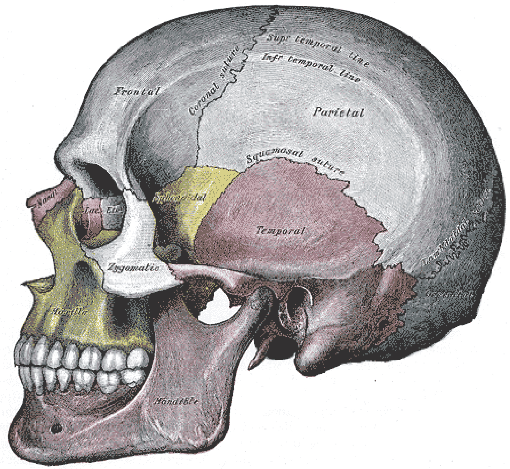

<?cnx.eoc class="summary" title="Chapter Review"?>
<?cnx.eoc class="interactive-exercise" title="Interactive Link Questions"?>
<?cnx.eoc class="multiple-choice" title="Review Questions" ?>
<?cnx.eoc class="free-response" title="Critical Thinking Questions"?>
<?cnx.eoc class=&#8221;references&#8221; title=&#8221;References&#8221;?>
{: #fig-ch07_00_01 data-media-type="image/jpg" data-title="Lateral View of the Human Skull "}

Chapter Objectives

After studying this chapter, you will be able to:

* Describe the functions of the skeletal system and define its two major
  subdivisions
* Identify the bones and bony structures of the skull, the cranial
  suture lines, the cranial fossae, and the openings in the skull
* Discuss the vertebral column and regional variations in its bony
  components and curvatures
* Describe the components of the thoracic cage
* Discuss the embryonic development of the axial skeleton

The skeletal system forms the rigid internal framework of the body. It
consists of the bones, cartilages, and ligaments. Bones support the
weight of the body, allow for body movements, and protect internal
organs. Cartilage provides flexible strength and support for body
structures such as the thoracic cage, the external ear, and the trachea
and larynx. At joints of the body, cartilage can also unite adjacent
bones or provide cushioning between them. Ligaments are the strong
connective tissue bands that hold the bones at a moveable joint together
and serve to prevent excessive movements of the joint that would result
in injury. Providing movement of the skeleton are the muscles of the
body, which are firmly attached to the skeleton via connective tissue
structures called tendons. As muscles contract, they pull on the bones
to produce movements of the body. Thus, without a skeleton, you would
not be able to stand, run, or even feed yourself!

Each bone of the body serves a particular function, and therefore bones
vary in size, shape, and strength based on these functions. For example,
the bones of the lower back and lower limb are thick and strong to
support your body weight. Similarly, the size of a bony landmark that
serves as a muscle attachment site on an individual bone is related to
the strength of this muscle. Muscles can apply very strong pulling
forces to the bones of the skeleton. To resist these forces, bones have
enlarged bony landmarks at sites where powerful muscles attach. This
means that not only the size of a bone, but also its shape, is related
to its function. For this reason, the identification of bony landmarks
is important during your study of the skeletal system.

Bones are also dynamic organs that can modify their strength and
thickness in response to changes in muscle strength or body weight.
Thus, muscle attachment sites on bones will thicken if you begin a
workout program that increases muscle strength. Similarly, the walls of
weight-bearing bones will thicken if you gain body weight or begin
pounding the pavement as part of a new running regimen. In contrast, a
reduction in muscle strength or body weight will cause bones to become
thinner. This may happen during a prolonged hospital stay, following
limb immobilization in a cast, or going into the weightlessness of outer
space. Even a change in diet, such as eating only soft food due to the
loss of teeth, will result in a noticeable decrease in the size and
thickness of the jaw bones.

