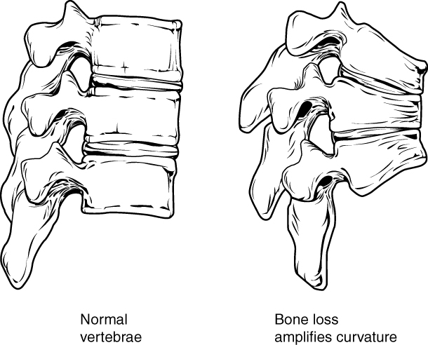
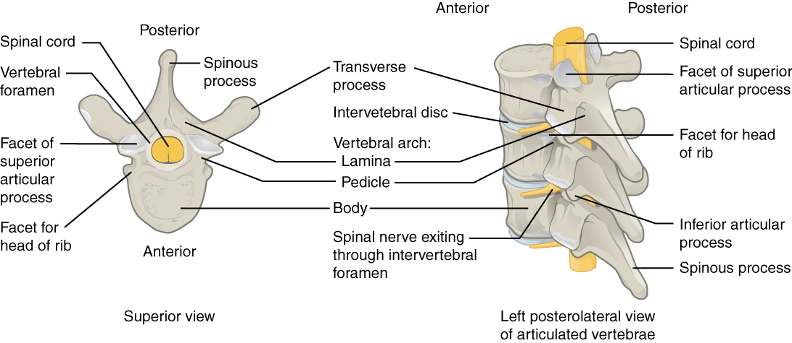
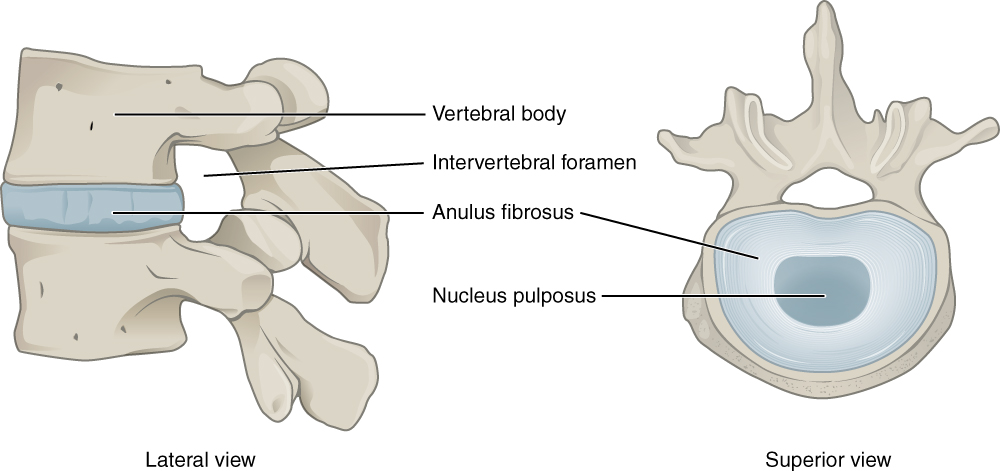
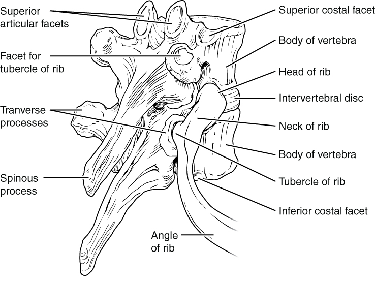
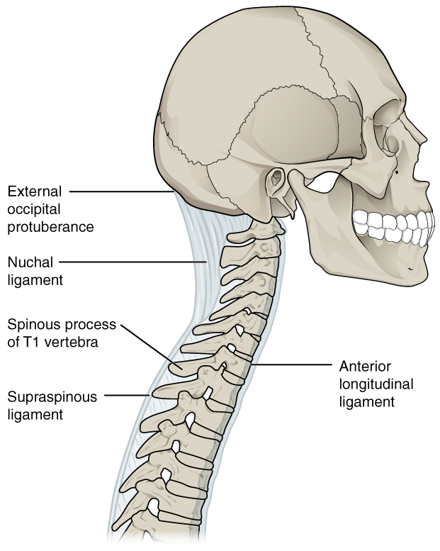

By the end of this section, you will be able to:
* Describe each region of the vertebral column and the number of bones in each region
* Discuss the curves of the vertebral column and how these change after birth
* Describe a typical vertebra and determine the distinguishing characteristics for vertebrae in each vertebral region and features of the sacrum and the coccyx
* Define the structure of an intervertebral disc
* Determine the location of the ligaments that provide support for the vertebral column

The vertebral column is also known as the spinal column or spine ([\[link\]](#fig-ch07_03_01)). It consists of a sequence of vertebrae (singular = vertebra), each of which is separated and united by an **intervertebral disc**{: data-type="term"}. Together, the vertebrae and intervertebral discs form the vertebral column. It is a flexible column that supports the head, neck, and body and allows for their movements. It also protects the spinal cord, which passes down the back through openings in the vertebrae.

  and two secondary curvatures (cervical and lumbar curves)."){: #fig-ch07_03_01 data-media-type="image/jpg" data-title="Vertebral Column"}

# Regions of the Vertebral Column

The vertebral column originally develops as a series of 33 vertebrae, but this number is eventually reduced to 24 vertebrae, plus the sacrum and coccyx. The vertebral column is subdivided into five regions, with the vertebrae in each area named for that region and numbered in descending order. In the neck, there are seven cervical vertebrae, each designated with the letter “C” followed by its number. Superiorly, the C1 vertebra articulates (forms a joint) with the occipital condyles of the skull. Inferiorly, C1 articulates with the C2 vertebra, and so on. Below these are the 12 thoracic vertebrae, designated T1–T12. The lower back contains the L1–L5 lumbar vertebrae. The single sacrum, which is also part of the pelvis, is formed by the fusion of five sacral vertebrae. Similarly, the coccyx, or tailbone, results from the fusion of four small coccygeal vertebrae. However, the sacral and coccygeal fusions do not start until age 20 and are not completed until middle age.

An interesting anatomical fact is that almost all mammals have seven cervical vertebrae, regardless of body size. This means that there are large variations in the size of cervical vertebrae, ranging from the very small cervical vertebrae of a shrew to the greatly elongated vertebrae in the neck of a giraffe. In a full-grown giraffe, each cervical vertebra is 11 inches tall.

# Curvatures of the Vertebral Column

The adult vertebral column does not form a straight line, but instead has four curvatures along its length (see [\[link\]](#fig-ch07_03_01)). These curves increase the vertebral column’s strength, flexibility, and ability to absorb shock. When the load on the spine is increased, by carrying a heavy backpack for example, the curvatures increase in depth (become more curved) to accommodate the extra weight. They then spring back when the weight is removed. The four adult curvatures are classified as either primary or secondary curvatures. Primary curves are retained from the original fetal curvature, while secondary curvatures develop after birth.

During fetal development, the body is flexed anteriorly into the fetal position, giving the entire vertebral column a single curvature that is concave anteriorly. In the adult, this fetal curvature is retained in two regions of the vertebral column as the **thoracic curve**{: data-type="term"}, which involves the thoracic vertebrae, and the **sacrococcygeal curve**{: data-type="term"}, formed by the sacrum and coccyx. Each of these is thus called a **primary curve**{: data-type="term"} because they are retained from the original fetal curvature of the vertebral column.

A **secondary curve**{: data-type="term"} develops gradually after birth as the child learns to sit upright, stand, and walk. Secondary curves are concave posteriorly, opposite in direction to the original fetal curvature. The **cervical curve**{: data-type="term"} of the neck region develops as the infant begins to hold their head upright when sitting. Later, as the child begins to stand and then to walk, the **lumbar curve**{: data-type="term"} of the lower back develops. In adults, the lumbar curve is generally deeper in females.

Disorders associated with the curvature of the spine include **kyphosis**{: data-type="term"} (an excessive posterior curvature of the thoracic region), **lordosis**{: data-type="term"} (an excessive anterior curvature of the lumbar region), and **scoliosis**{: data-type="term"} (an abnormal, lateral curvature, accompanied by twisting of the vertebral column).

Disorders of the...

Vertebral Column Developmental anomalies, pathological changes, or obesity can enhance the normal vertebral column curves, resulting in the development of abnormal or excessive curvatures ([\[link\]](#fig-ch07_03_02)). Kyphosis, also referred to as humpback or hunchback, is an excessive posterior curvature of the thoracic region. This can develop when osteoporosis causes weakening and erosion of the anterior portions of the upper thoracic vertebrae, resulting in their gradual collapse ([\[link\]](#fig-ch07_03_03)). Lordosis, or swayback, is an excessive anterior curvature of the lumbar region and is most commonly associated with obesity or late pregnancy. The accumulation of body weight in the abdominal region results an anterior shift in the line of gravity that carries the weight of the body. This causes in an anterior tilt of the pelvis and a pronounced enhancement of the lumbar curve.

Scoliosis is an abnormal, lateral curvature, accompanied by twisting of the vertebral column. Compensatory curves may also develop in other areas of the vertebral column to help maintain the head positioned over the feet. Scoliosis is the most common vertebral abnormality among girls. The cause is usually unknown, but it may result from weakness of the back muscles, defects such as differential growth rates in the right and left sides of the vertebral column, or differences in the length of the lower limbs. When present, scoliosis tends to get worse during adolescent growth spurts. Although most individuals do not require treatment, a back brace may be recommended for growing children. In extreme cases, surgery may be required.

Excessive vertebral curves can be identified while an individual stands in the anatomical position. Observe the vertebral profile from the side and then from behind to check for kyphosis or lordosis. Then have the person bend forward. If scoliosis is present, an individual will have difficulty in bending directly forward, and the right and left sides of the back will not be level with each other in the bent position.

 Scoliosis is an abnormal lateral bending of the vertebral column. (b) An excessive curvature of the upper thoracic vertebral column is called kyphosis. (c) Lordosis is an excessive curvature in the lumbar region of the vertebral column."){: #fig-ch07_03_02 data-media-type="image/jpg" data-title="Abnormal Curvatures of the Vertebral Column"}

{: #fig-ch07_03_03 data-media-type="image/jpg" data-title="Osteoporosis"}

 {: data-media-type="image/png"} 
Osteoporosis is a common age-related bone disease in which bone density and strength is decreased. Watch this [video][1] to get a better understanding of how thoracic vertebrae may become weakened and may fracture due to this disease. How may vertebral osteoporosis contribute to kyphosis?

# General Structure of a Vertebra

Within the different regions of the vertebral column, vertebrae vary in size and shape, but they all follow a similar structural pattern. A typical vertebra will consist of a body, a vertebral arch, and seven processes ([\[link\]](#fig-ch07_03_04)).

The body is the anterior portion of each vertebra and is the part that supports the body weight. Because of this, the vertebral bodies progressively increase in size and thickness going down the vertebral column. The bodies of adjacent vertebrae are separated and strongly united by an intervertebral disc.

The **vertebral arch**{: data-type="term"} forms the posterior portion of each vertebra. It consists of four parts, the right and left pedicles and the right and left laminae. Each **pedicle**{: data-type="term"} forms one of the lateral sides of the vertebral arch. The pedicles are anchored to the posterior side of the vertebral body. Each **lamina**{: data-type="term"} forms part of the posterior roof of the vertebral arch. The large opening between the vertebral arch and body is the **vertebral foramen**{: data-type="term"}, which contains the spinal cord. In the intact vertebral column, the vertebral foramina of all of the vertebrae align to form the **vertebral (spinal) canal**{: data-type="term"}, which serves as the bony protection and passageway for the spinal cord down the back. When the vertebrae are aligned together in the vertebral column, notches in the margins of the pedicles of adjacent vertebrae together form an **intervertebral foramen**{: data-type="term"}, the opening through which a spinal nerve exits from the vertebral column ([\[link\]](#fig-ch07_03_05)).

Seven processes arise from the vertebral arch. Each paired **transverse process**{: data-type="term"} projects laterally and arises from the junction point between the pedicle and lamina. The single **spinous process**{: data-type="term"} (vertebral spine) projects posteriorly at the midline of the back. The vertebral spines can easily be felt as a series of bumps just under the skin down the middle of the back. The transverse and spinous processes serve as important muscle attachment sites. A **superior articular process**{: data-type="term"} extends or faces upward, and an **inferior articular process**{: data-type="term"} faces or projects downward on each side of a vertebrae. The paired superior articular processes of one vertebra join with the corresponding paired inferior articular processes from the next higher vertebra. These junctions form slightly moveable joints between the adjacent vertebrae. The shape and orientation of the articular processes vary in different regions of the vertebral column and play a major role in determining the type and range of motion available in each region.

 {: #fig-ch07_03_04 data-media-type="image/jpg" data-title="Parts of a Typical Vertebra"}

{: #fig-ch07_03_05 data-media-type="image/jpg" data-title="Intervertebral Disc"}

# Regional Modifications of Vertebrae

In addition to the general characteristics of a typical vertebra described above, vertebrae also display characteristic size and structural features that vary between the different vertebral column regions. Thus, cervical vertebrae are smaller than lumbar vertebrae due to differences in the proportion of body weight that each supports. Thoracic vertebrae have sites for rib attachment, and the vertebrae that give rise to the sacrum and coccyx have fused together into single bones.

## Cervical Vertebrae

Typical **cervical vertebrae**{: data-type="term"}, such as C4 or C5, have several characteristic features that differentiate them from thoracic or lumbar vertebrae ([\[link\]](#fig-ch07_03_06)). Cervical vertebrae have a small body, reflecting the fact that they carry the least amount of body weight. Cervical vertebrae usually have a bifid (Y-shaped) spinous process. The spinous processes of the C3–C6 vertebrae are short, but the spine of C7 is much longer. You can find these vertebrae by running your finger down the midline of the posterior neck until you encounter the prominent C7 spine located at the base of the neck. The transverse processes of the cervical vertebrae are sharply curved (U-shaped) to allow for passage of the cervical spinal nerves. Each transverse process also has an opening called the **transverse foramen**{: data-type="term"}. An important artery that supplies the brain ascends up the neck by passing through these openings. The superior and inferior articular processes of the cervical vertebrae are flattened and largely face upward or downward, respectively.

The first and second cervical vertebrae are further modified, giving each a distinctive appearance. The first cervical (C1) vertebra is also called the **atlas**{: data-type="term"}, because this is the vertebra that supports the skull on top of the vertebral column (in Greek mythology, Atlas was the god who supported the heavens on his shoulders). The C1 vertebra does not have a body or spinous process. Instead, it is ring-shaped, consisting of an **anterior arch**{: data-type="term"} and a **posterior arch**{: data-type="term"}. The transverse processes of the atlas are longer and extend more laterally than do the transverse processes of any other cervical vertebrae. The superior articular processes face upward and are deeply curved for articulation with the occipital condyles on the base of the skull. The inferior articular processes are flat and face downward to join with the superior articular processes of the C2 vertebra.

The second cervical (C2) vertebra is called the **axis**{: data-type="term"}, because it serves as the axis for rotation when turning the head toward the right or left. The axis resembles typical cervical vertebrae in most respects, but is easily distinguished by the **dens**{: data-type="term"} (odontoid process), a bony projection that extends upward from the vertebral body. The dens joins with the inner aspect of the anterior arch of the atlas, where it is held in place by transverse ligament.

  does not have a body or spinous process. It consists of an anterior and a posterior arch and elongated transverse processes. The axis (C2 vertebra) has the upward projecting dens, which articulates with the anterior arch of the atlas."){: #fig-ch07_03_06 data-media-type="image/jpg" data-title="Cervical Vertebrae"}

## Thoracic Vertebrae

The bodies of the **thoracic vertebrae**{: data-type="term"} are larger than those of cervical vertebrae ([\[link\]](#fig-ch07_03_07)). The characteristic feature for a typical midthoracic vertebra is the spinous process, which is long and has a pronounced downward angle that causes it to overlap the next inferior vertebra. The superior articular processes of thoracic vertebrae face anteriorly and the inferior processes face posteriorly. These orientations are important determinants for the type and range of movements available to the thoracic region of the vertebral column.

Thoracic vertebrae have several additional articulation sites, each of which is called a **facet**{: data-type="term"}, where a rib is attached. Most thoracic vertebrae have two facets located on the lateral sides of the body, each of which is called a **costal facet**{: data-type="term"} (costal = “rib”). These are for articulation with the head (end) of a rib. An additional facet is located on the transverse process for articulation with the tubercle of a rib.

  on the vertebral body and a transverse process for rib attachment."){: #fig-ch07_03_07 data-media-type="image/jpg" data-title="Thoracic Vertebrae"}

{: #fig-ch07_03_08 data-media-type="image/jpg" data-title="Rib Articulation in Thoracic Vertebrae"}

## Lumbar Vertebrae

**Lumbar vertebrae**{: data-type="term"} carry the greatest amount of body weight and are thus characterized by the large size and thickness of the vertebral body ([\[link\]](#fig-ch07_03_09)). They have short transverse processes and a short, blunt spinous process that projects posteriorly. The articular processes are large, with the superior process facing backward and the inferior facing forward.

 {: #fig-ch07_03_09 data-media-type="image/jpg" data-title="Lumbar Vertebrae"}

## Sacrum and Coccyx

The sacrum is a triangular-shaped bone that is thick and wide across its superior base where it is weight bearing and then tapers down to an inferior, non-weight bearing apex ([\[link\]](#fig-ch07_03_10)). It is formed by the fusion of five sacral vertebrae, a process that does not begin until after the age of 20. On the anterior surface of the older adult sacrum, the lines of vertebral fusion can be seen as four transverse ridges. On the posterior surface, running down the midline, is the **median sacral crest**{: data-type="term"}, a bumpy ridge that is the remnant of the fused spinous processes (median = “midline”; while medial = “toward, but not necessarily at, the midline”). Similarly, the fused transverse processes of the sacral vertebrae form the **lateral sacral crest**{: data-type="term"}.

The **sacral promontory**{: data-type="term"} is the anterior lip of the superior base of the sacrum. Lateral to this is the roughened auricular surface, which joins with the ilium portion of the hipbone to form the immobile sacroiliac joints of the pelvis. Passing inferiorly through the sacrum is a bony tunnel called the **sacral canal**{: data-type="term"}, which terminates at the **sacral hiatus**{: data-type="term"} near the inferior tip of the sacrum. The anterior and posterior surfaces of the sacrum have a series of paired openings called **sacral foramina**{: data-type="term"} (singular = foramen) that connect to the sacral canal. Each of these openings is called a **posterior (dorsal) sacral foramen**{: data-type="term"} or **anterior (ventral) sacral foramen**{: data-type="term"}. These openings allow for the anterior and posterior branches of the sacral spinal nerves to exit the sacrum. The **superior articular process of the sacrum**{: data-type="term"}, one of which is found on either side of the superior opening of the sacral canal, articulates with the inferior articular processes from the L5 vertebra.

The coccyx, or tailbone, is derived from the fusion of four very small coccygeal vertebrae (see [\[link\]](#fig-ch07_03_10)). It articulates with the inferior tip of the sacrum. It is not weight bearing in the standing position, but may receive some body weight when sitting.

 {: #fig-ch07_03_10 data-media-type="image/jpg" data-title="Sacrum and Coccyx"}

# Intervertebral Discs and Ligaments of the Vertebral Column

The bodies of adjacent vertebrae are strongly anchored to each other by an intervertebral disc. This structure provides padding between the bones during weight bearing, and because it can change shape, also allows for movement between the vertebrae. Although the total amount of movement available between any two adjacent vertebrae is small, when these movements are summed together along the entire length of the vertebral column, large body movements can be produced. Ligaments that extend along the length of the vertebral column also contribute to its overall support and stability.

## Intervertebral Disc

An **intervertebral disc**{: data-type="term"} is a fibrocartilaginous pad that fills the gap between adjacent vertebral bodies (see [\[link\]](#fig-ch07_03_05)). Each disc is anchored to the bodies of its adjacent vertebrae, thus strongly uniting these. The discs also provide padding between vertebrae during weight bearing. Because of this, intervertebral discs are thin in the cervical region and thickest in the lumbar region, which carries the most body weight. In total, the intervertebral discs account for approximately 25 percent of your body height between the top of the pelvis and the base of the skull. Intervertebral discs are also flexible and can change shape to allow for movements of the vertebral column.

Each intervertebral disc consists of two parts. The **anulus fibrosus**{: data-type="term"} is the tough, fibrous outer layer of the disc. It forms a circle (anulus = “ring” or “circle”) and is firmly anchored to the outer margins of the adjacent vertebral bodies. Inside is the **nucleus pulposus**{: data-type="term"}, consisting of a softer, more gel-like material. It has a high water content that serves to resist compression and thus is important for weight bearing. With increasing age, the water content of the nucleus pulposus gradually declines. This causes the disc to become thinner, decreasing total body height somewhat, and reduces the flexibility and range of motion of the disc, making bending more difficult.

The gel-like nature of the nucleus pulposus also allows the intervertebral disc to change shape as one vertebra rocks side to side or forward and back in relation to its neighbors during movements of the vertebral column. Thus, bending forward causes compression of the anterior portion of the disc but expansion of the posterior disc. If the posterior anulus fibrosus is weakened due to injury or increasing age, the pressure exerted on the disc when bending forward and lifting a heavy object can cause the nucleus pulposus to protrude posteriorly through the anulus fibrosus, resulting in a herniated disc (“ruptured” or “slipped” disc) ([\[link\]](#fig-ch07_03_11)). The posterior bulging of the nucleus pulposus can cause compression of a spinal nerve at the point where it exits through the intervertebral foramen, with resulting pain and/or muscle weakness in those body regions supplied by that nerve. The most common sites for disc herniation are the L4/L5 or L5/S1 intervertebral discs, which can cause sciatica, a widespread pain that radiates from the lower back down the thigh and into the leg. Similar injuries of the C5/C6 or C6/C7 intervertebral discs, following forcible hyperflexion of the neck from a collision accident or football injury, can produce pain in the neck, shoulder, and upper limb.

 of the nucleus pulposus and compression of a spinal nerve, resulting in pain and/or muscle weakness in the body regions supplied by that nerve."){: #fig-ch07_03_11 data-media-type="image/jpg" data-title="Herniated Intervertebral Disc"}

 {: data-media-type="image/jpg"} 
Watch this [animation][2] to see what it means to “slip” a disk. Watch this second [animation][3] to see one possible treatment for a herniated disc, removing and replacing the damaged disc with an artificial one that allows for movement between the adjacent certebrae. How could lifting a heavy object produce pain in a lower limb?

## Ligaments of the Vertebral Column

Adjacent vertebrae are united by ligaments that run the length of the vertebral column along both its posterior and anterior aspects ([\[link\]](#fig-ch07_03_12)). These serve to resist excess forward or backward bending movements of the vertebral column, respectively.

The **anterior longitudinal ligament**{: data-type="term"} runs down the anterior side of the entire vertebral column, uniting the vertebral bodies. It serves to resist excess backward bending of the vertebral column. Protection against this movement is particularly important in the neck, where extreme posterior bending of the head and neck can stretch or tear this ligament, resulting in a painful whiplash injury. Prior to the mandatory installation of seat headrests, whiplash injuries were common for passengers involved in a rear-end automobile collision.

The **supraspinous ligament**{: data-type="term"} is located on the posterior side of the vertebral column, where it interconnects the spinous processes of the thoracic and lumbar vertebrae. This strong ligament supports the vertebral column during forward bending motions. In the posterior neck, where the cervical spinous processes are short, the supraspinous ligament expands to become the **nuchal ligament**{: data-type="term"} (nuchae = “nape” or “back of the neck”). The nuchal ligament is attached to the cervical spinous processes and extends upward and posteriorly to attach to the midline base of the skull, out to the external occipital protuberance. It supports the skull and prevents it from falling forward. This ligament is much larger and stronger in four-legged animals such as cows, where the large skull hangs off the front end of the vertebral column. You can easily feel this ligament by first extending your head backward and pressing down on the posterior midline of your neck. Then tilt your head forward and you will fill the nuchal ligament popping out as it tightens to limit anterior bending of the head and neck.

Additional ligaments are located inside the vertebral canal, next to the spinal cord, along the length of the vertebral column. The **posterior longitudinal ligament**{: data-type="term"} is found anterior to the spinal cord, where it is attached to the posterior sides of the vertebral bodies. Posterior to the spinal cord is the **ligamentum flavum**{: data-type="term"} (“yellow ligament”). This consists of a series of short, paired ligaments, each of which interconnects the lamina regions of adjacent vertebrae. The ligamentum flavum has large numbers of elastic fibers, which have a yellowish color, allowing it to stretch and then pull back. Both of these ligaments provide important support for the vertebral column when bending forward.

 {: #fig-ch07_03_12 data-media-type="image/jpg" data-title="Ligaments of Vertebral Column"}

 {: data-media-type="image/png"} 
Use this [tool][4] to identify the bones, intervertebral discs, and ligaments of the vertebral column. The thickest portions of the anterior longitudinal ligament and the supraspinous ligament are found in which regions of the vertebral column?

Career Connections

Chiropractor Chiropractors are health professionals who use nonsurgical techniques to help patients with musculoskeletal system problems that involve the bones, muscles, ligaments, tendons, or nervous system. They treat problems such as neck pain, back pain, joint pain, or headaches. Chiropractors focus on the patient’s overall health and can also provide counseling related to lifestyle issues, such as diet, exercise, or sleep problems. If needed, they will refer the patient to other medical specialists.

Chiropractors use a drug-free, hands-on approach for patient diagnosis and treatment. They will perform a physical exam, assess the patient’s posture and spine, and may perform additional diagnostic tests, including taking X-ray images. They primarily use manual techniques, such as spinal manipulation, to adjust the patient’s spine or other joints. They can recommend therapeutic or rehabilitative exercises, and some also include acupuncture, massage therapy, or ultrasound as part of the treatment program. In addition to those in general practice, some chiropractors specialize in sport injuries, neurology, orthopaedics, pediatrics, nutrition, internal disorders, or diagnostic imaging.

To become a chiropractor, students must have 3–4 years of undergraduate education, attend an accredited, four-year Doctor of Chiropractic (D.C.) degree program, and pass a licensure examination to be licensed for practice in their state. With the aging of the baby-boom generation, employment for chiropractors is expected to increase.

# Chapter Review

The vertebral column forms the neck and back. The vertebral column originally develops as 33 vertebrae, but is eventually reduced to 24 vertebrae, plus the sacrum and coccyx. The vertebrae are divided into the cervical region (C1–C7 vertebrae), the thoracic region (T1–T12 vertebrae), and the lumbar region (L1–L5 vertebrae). The sacrum arises from the fusion of five sacral vertebrae and the coccyx from the fusion of four small coccygeal vertebrae. The vertebral column has four curvatures, the cervical, thoracic, lumbar, and sacrococcygeal curves. The thoracic and sacrococcygeal curves are primary curves retained from the original fetal curvature. The cervical and lumbar curves develop after birth and thus are secondary curves. The cervical curve develops as the infant begins to hold up the head, and the lumbar curve appears with standing and walking.

A typical vertebra consists of an enlarged anterior portion called the body, which provides weight-bearing support. Attached posteriorly to the body is a vertebral arch, which surrounds and defines the vertebral foramen for passage of the spinal cord. The vertebral arch consists of the pedicles, which attach to the vertebral body, and the laminae, which come together to form the roof of the arch. Arising from the vertebral arch are the laterally projecting transverse processes and the posteriorly oriented spinous process. The superior articular processes project upward, where they articulate with the downward projecting inferior articular processes of the next higher vertebrae.

A typical cervical vertebra has a small body, a bifid (Y-shaped) spinous process, and U-shaped transverse processes with a transverse foramen. In addition to these characteristics, the axis (C2 vertebra) also has the dens projecting upward from the vertebral body. The atlas (C1 vertebra) differs from the other cervical vertebrae in that it does not have a body, but instead consists of bony ring formed by the anterior and posterior arches. The atlas articulates with the dens from the axis. A typical thoracic vertebra is distinguished by its long, downward projecting spinous process. Thoracic vertebrae also have articulation facets on the body and transverse processes for attachment of the ribs. Lumbar vertebrae support the greatest amount of body weight and thus have a large, thick body. They also have a short, blunt spinous process. The sacrum is triangular in shape. The median sacral crest is formed by the fused vertebral spinous processes and the lateral sacral crest is derived from the fused transverse processes. Anterior (ventral) and posterior (dorsal) sacral foramina allow branches of the sacral spinal nerves to exit the sacrum. The auricular surfaces are articulation sites on the lateral sacrum that anchor the sacrum to the hipbones to form the pelvis. The coccyx is small and derived from the fusion of four small vertebrae.

The intervertebral discs fill in the gaps between the bodies of adjacent vertebrae. They provide strong attachments and padding between the vertebrae. The outer, fibrous layer of a disc is called the anulus fibrosus. The gel-like interior is called the nucleus pulposus. The disc can change shape to allow for movement between vertebrae. If the anulus fibrosus is weakened or damaged, the nucleus pulposus can protrude outward, resulting in a herniated disc.

The anterior longitudinal ligament runs along the full length of the anterior vertebral column, uniting the vertebral bodies. The supraspinous ligament is located posteriorly and interconnects the spinous processes of the thoracic and lumbar vertebrae. In the neck, this ligament expands to become the nuchal ligament. The nuchal ligament is attached to the cervical spinous processes and superiorly to the base of the skull, out to the external occipital protuberance. The posterior longitudinal ligament runs within the vertebral canal and unites the posterior sides of the vertebral bodies. The ligamentum flavum unites the lamina of adjacent vertebrae.

# Interactive Link Questions

Osteoporosis is a common age-related bone disease in which bone density and strength is decreased. Watch this [video][1] to get a better understanding of how thoracic vertebrae may become weakened and may fractured due to this disease. How may vertebral osteoporosis contribute to kyphosis?

Osteoporosis causes thinning and weakening of the vertebral bodies. When this occurs in thoracic vertebrae, the bodies may collapse producing kyphosis, an enhanced anterior curvature of the thoracic vertebral column.

Watch this [animation][2] to see what it means to “slip” a disk. Watch this second [animation][3] to see one possible treatment for a herniated disc, removing and replacing the damaged disc with an artificial one that allows for movement between the adjacent certebrae. How could lifting a heavy object produce pain in a lower limb?

Lifting a heavy object can cause an intervertebral disc in the lower back to bulge and compress a spinal nerve as it exits through the intervertebral foramen, thus producing pain in those regions of the lower limb supplied by that nerve.

Use this [tool][4] to identify the bones, intervertebral discs, and ligaments of the vertebral column. The thickest portions of the anterior longitudinal ligament and the supraspinous ligament are found in which regions of the vertebral column?

The anterior longitudinal ligament is thickest in the thoracic region of the vertebral column, while the supraspinous ligament is thickest in the lumbar region.

# Review Questions

The cervical region of the vertebral column consists of \_\_\_\_\_\_\_\_.

1.  seven vertebrae
2.  12 vertebrae
3.  five vertebrae
4.  a single bone derived from the fusion of five vertebrae
{: data-number-style="lower-alpha"}

A

The primary curvatures of the vertebral column \_\_\_\_\_\_\_\_.

1.  include the lumbar curve
2.  are remnants of the original fetal curvature
3.  include the cervical curve
4.  develop after the time of birth
{: data-number-style="lower-alpha"}

B

A typical vertebra has \_\_\_\_\_\_\_\_.

1.  a vertebral foramen that passes through the body
2.  a superior articular process that projects downward to articulate with the superior portion of the next lower vertebra
3.  lamina that spans between the transverse process and spinous process
4.  a pair of laterally projecting spinous processes
{: data-number-style="lower-alpha"}

C

A typical lumbar vertebra has \_\_\_\_\_\_\_\_.

1.  a short, rounded spinous process
2.  a bifid spinous process
3.  articulation sites for ribs
4.  a transverse foramen
{: data-number-style="lower-alpha"}

A

Which is found only in the cervical region of the vertebral column?

1.  nuchal ligament
2.  ligamentum flavum
3.  supraspinous ligament
4.  anterior longitudinal ligament
{: data-number-style="lower-alpha"}

A

# Critical Thinking Questions

Describe the vertebral column and define each region.

Answer: The adult vertebral column consists of 24 vertebrae, plus the sacrum and coccyx. The vertebrae are subdivided into cervical, thoracic, and lumbar regions. There are seven cervical vertebrae (C1–C7), 12 thoracic vertebrae (T1–T12), and five lumbar vertebrae (L1–L5). The sacrum is derived from the fusion of five sacral vertebrae and the coccyx is formed by the fusion of four small coccygeal vertebrae.

Describe a typical vertebra.

A typical vertebra consists of an anterior body and a posterior vertebral arch. The body serves for weight bearing. The vertebral arch surrounds and protects the spinal cord. The vertebral arch is formed by the pedicles, which are attached to the posterior side of the vertebral body, and the lamina, which come together to form the top of the arch. A pair of transverse processes extends laterally from the vertebral arch, at the junction between each pedicle and lamina. The spinous process extends posteriorly from the top of the arch. A pair of superior articular processes project upward and a pair of inferior articular processes project downward. Together, the notches found in the margins of the pedicles of adjacent vertebrae form an intervertebral foramen.

Describe the sacrum.

The sacrum is a single, triangular-shaped bone formed by the fusion of five sacral vertebrae. On the posterior sacrum, the median sacral crest is derived from the fused spinous processes, and the lateral sacral crest results from the fused transverse processes. The sacral canal contains the sacral spinal nerves, which exit via the anterior (ventral) and posterior (dorsal) sacral foramina. The sacral promontory is the anterior lip. The sacrum also forms the posterior portion of the pelvis.

Describe the structure and function of an intervertebral disc.

An intervertebral disc fills in the space between adjacent vertebrae, where it provides padding and weight-bearing ability, and allows for movements between the vertebrae. It consists of an outer anulus fibrosus and an inner nucleus pulposus. The anulus fibrosus strongly anchors the adjacent vertebrae to each other, and the high water content of the nucleus pulposus resists compression for weight bearing and can change shape to allow for vertebral column movements.

Define the ligaments of the vertebral column.

The anterior longitudinal ligament is attached to the vertebral bodies on the anterior side of the vertebral column. The supraspinous ligament is located on the posterior side, where it interconnects the thoracic and lumbar spinous processes. In the posterior neck, this ligament expands to become the nuchal ligament, which attaches to the cervical spinous processes and the base of the skull. The posterior longitudinal ligament and ligamentum flavum are located inside the vertebral canal. The posterior longitudinal ligament unites the posterior sides of the vertebral bodies. The ligamentum flavum unites the lamina of adjacent vertebrae.

[1]: http://openstaxcollege.org/l/osteoporosis
[2]: http://openstaxcollege.org/l/diskslip
[3]: http://openstaxcollege.org/l/herndisc
[4]: http://openstaxcollege.org/l/vertcolumn
