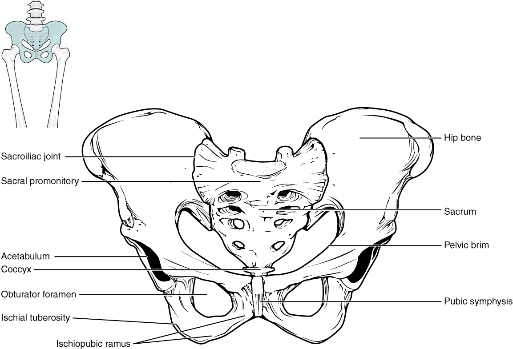
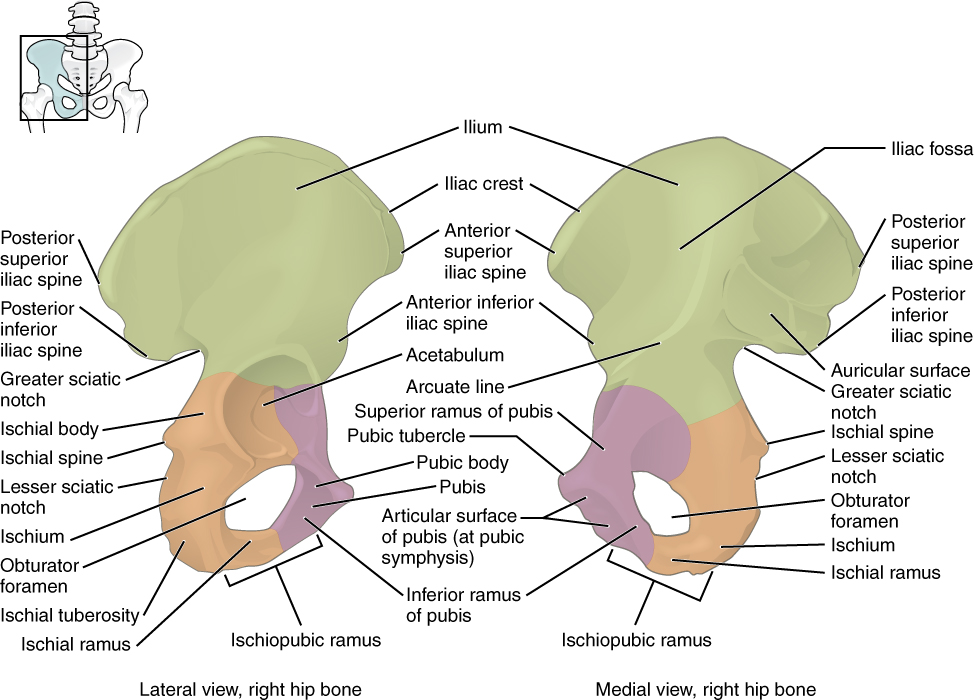
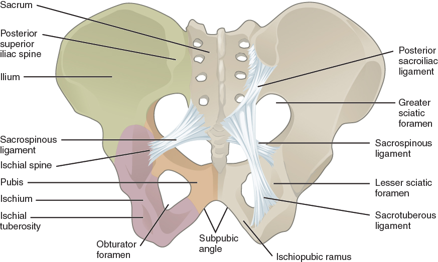
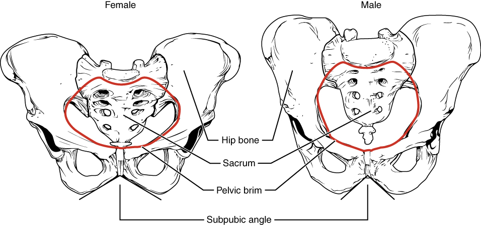

By the end of this section, you will be able to:
* Define the pelvic girdle and describe the bones and ligaments of the
  pelvis
* Explain the three regions of the hip bone and identify their bony
  landmarks
* Describe the openings of the pelvis and the boundaries of the greater
  and lesser pelvis

The pelvic girdle (hip girdle) is formed
by a single bone, the hip bone or coxal bone (coxal = “hip”), which serves as the
attachment point for each lower limb. Each hip bone, in turn, is firmly
joined to the axial skeleton via its attachment to the sacrum of the
vertebral column. The right and left hip bones also converge anteriorly
to attach to each other. The bony pelvis
is the entire structure formed by the two hip bones, the sacrum, and,
attached inferiorly to the sacrum, the coccyx
([\[link\]](#fig-ch08_03_01){: .autogenerated-content}).

Unlike the bones of the pectoral girdle, which are highly mobile to
enhance the range of upper limb movements, the bones of the pelvis are
strongly united to each other to form a largely immobile, weight-bearing
structure. This is important for stability because it enables the weight
of the body to be easily transferred laterally from the vertebral
column, through the pelvic girdle and hip joints, and into either lower
limb whenever the other limb is not bearing weight. Thus, the immobility
of the pelvis provides a strong foundation for the upper body as it
rests on top of the mobile lower limbs.

{: #fig-ch08_03_01 data-media-type="image/jpg" data-title="Pelvis "}

# Hip Bone

The hip bone, or coxal bone, forms the pelvic girdle portion of the
pelvis. The paired hip bones are the large, curved bones that form the
lateral and anterior aspects of the pelvis. Each adult hip bone is
formed by three separate bones that fuse together during the late
teenage years. These bony components are the ilium, ischium, and pubis
([\[link\]](#fig-ch08_03_02){: .autogenerated-content}). These names are
retained and used to define the three regions of the adult hip bone.

{: #fig-ch08_03_02 data-media-type="image/jpg" data-title="The Hip Bone "}

The ilium is the fan-like, superior region
that forms the largest part of the hip bone. It is firmly united to the
sacrum at the largely immobile sacroiliac
joint (see [\[link\]](#fig-ch08_03_01){:
.autogenerated-content}). The ischium
forms the posteroinferior region of each hip bone. It supports the body
when sitting. The pubis forms the anterior
portion of the hip bone. The pubis curves medially, where it joins to
the pubis of the opposite hip bone at a specialized joint called the
pubic symphysis.

## Ilium

When you place your hands on your waist, you can feel the arching,
superior margin of the ilium along your waistline (see
[\[link\]](#fig-ch08_03_02){: .autogenerated-content}). This curved,
superior margin of the ilium is the iliac
crest. The rounded, anterior termination of the iliac crest is
the anterior superior iliac spine. This
important bony landmark can be felt at your anterolateral hip. Inferior
to the anterior superior iliac spine is a rounded protuberance called
the anterior inferior iliac spine. Both of
these iliac spines serve as attachment points for muscles of the thigh.
Posteriorly, the iliac crest curves downward to terminate as the posterior superior iliac spine. Muscles and
ligaments surround but do not cover this bony landmark, thus sometimes
producing a depression seen as a “dimple” located on the lower back.
More inferiorly is the posterior inferior iliac
spine. This is located at the inferior end of a large, roughened
area called the auricular surface of the
ilium. The auricular surface articulates with the auricular
surface of the sacrum to form the sacroiliac joint. Both the posterior
superior and posterior inferior iliac spines serve as attachment points
for the muscles and very strong ligaments that support the sacroiliac
joint.

The shallow depression located on the anteromedial (internal) surface of
the upper ilium is called the iliac fossa.
The inferior margin of this space is formed by the arcuate line of the ilium, the ridge formed by
the pronounced change in curvature between the upper and lower portions
of the ilium. The large, inverted U-shaped indentation located on the
posterior margin of the lower ilium is called the greater sciatic notch.

## Ischium

The ischium forms the posterolateral portion of the hip bone (see
[\[link\]](#fig-ch08_03_02){: .autogenerated-content}). The large,
roughened area of the inferior ischium is the ischial tuberosity. This serves as the
attachment for the posterior thigh muscles and also carries the weight
of the body when sitting. You can feel the ischial tuberosity if you
wiggle your pelvis against the seat of a chair. Projecting superiorly
and anteriorly from the ischial tuberosity is a narrow segment of bone
called the ischial ramus. The slightly
curved posterior margin of the ischium above the ischial tuberosity is
the lesser sciatic notch. The bony
projection separating the lesser sciatic notch and greater sciatic notch
is the ischial spine.

## Pubis

The pubis forms the anterior portion of the hip bone (see
[\[link\]](#fig-ch08_03_02){: .autogenerated-content}). The enlarged
medial portion of the pubis is the pubic
body. Located superiorly on the pubic body is a small bump called
the pubic tubercle. The superior pubic ramus is the segment of bone that
passes laterally from the pubic body to join the ilium. The narrow ridge
running along the superior margin of the superior pubic ramus is the
pectineal line of the pubis.

The pubic body is joined to the pubic body of the opposite hip bone by
the pubic symphysis. Extending downward and laterally from the body is
the inferior pubic ramus. The pubic arch is the bony structure formed by the
pubic symphysis, and the bodies and inferior pubic rami of the adjacent
pubic bones. The inferior pubic ramus extends downward to join the
ischial ramus. Together, these form the single ischiopubic ramus, which extends from the pubic
body to the ischial tuberosity. The inverted V-shape formed as the
ischiopubic rami from both sides come together at the pubic symphysis is
called the subpubic angle.

# Pelvis

The pelvis consists of four bones: the right and left hip bones, the
sacrum, and the coccyx (see [\[link\]](#fig-ch08_03_01){:
.autogenerated-content}). The pelvis has several important functions.
Its primary role is to support the weight of the upper body when sitting
and to transfer this weight to the lower limbs when standing. It serves
as an attachment point for trunk and lower limb muscles, and also
protects the internal pelvic organs. When standing in the anatomical
position, the pelvis is tilted anteriorly. In this position, the
anterior superior iliac spines and the pubic tubercles lie in the same
vertical plane, and the anterior (internal) surface of the sacrum faces
forward and downward.

The three areas of each hip bone, the ilium, pubis, and ischium,
converge centrally to form a deep, cup-shaped cavity called the acetabulum. This is located on the lateral side
of the hip bone and is part of the hip joint. The large opening in the
anteroinferior hip bone between the ischium and pubis is the obturator foramen. This space is largely filled
in by a layer of connective tissue and serves for the attachment of
muscles on both its internal and external surfaces.

Several ligaments unite the bones of the pelvis
([\[link\]](#fig-ch08_03_03){: .autogenerated-content}). The largely
immobile sacroiliac joint is supported by a pair of strong ligaments
that are attached between the sacrum and ilium portions of the hip bone.
These are the anterior sacroiliac ligament
on the anterior side of the joint and the posterior sacroiliac ligament on the posterior
side. Also spanning the sacrum and hip bone are two additional
ligaments. The sacrospinous ligament runs
from the sacrum to the ischial spine, and the sacrotuberous ligament runs from the sacrum to
the ischial tuberosity. These ligaments help to support and immobilize
the sacrum as it carries the weight of the body.

{: #fig-ch08_03_03 data-media-type="image/jpg" data-title="Ligaments of the Pelvis "}

 {:
data-media-type="image/png"} 
Watch this [video][1] for a 3-D view of the pelvis and its associated
ligaments. What is the large opening in the bony pelvis, located between
the ischium and pubic regions, and what two parts of the pubis
contribute to the formation of this opening?

The sacrospinous and sacrotuberous ligaments also help to define two
openings on the posterolateral sides of the pelvis through which
muscles, nerves, and blood vessels for the lower limb exit. The superior
opening is the greater sciatic foramen.
This large opening is formed by the greater sciatic notch of the hip
bone, the sacrum, and the sacrospinous ligament. The smaller, more
inferior lesser sciatic foramen is formed
by the lesser sciatic notch of the hip bone, together with the
sacrospinous and sacrotuberous ligaments.

The space enclosed by the bony pelvis is divided into two regions
([\[link\]](#fig-ch08_03_04){: .autogenerated-content}). The broad,
superior region, defined laterally by the large, fan-like portion of the
upper hip bone, is called the greater
pelvis (greater pelvic cavity; false pelvis). This broad area is
occupied by portions of the small and large intestines, and because it
is more closely associated with the abdominal cavity, it is sometimes
referred to as the false pelvis. More inferiorly, the narrow, rounded
space of the lesser pelvis (lesser pelvic
cavity; true pelvis) contains the bladder and other pelvic organs, and
thus is also known as the true pelvis. The pelvic
brim (also known as the pelvic
inlet) forms the superior margin of the lesser pelvis, separating
it from the greater pelvis. The pelvic brim is defined by a line formed
by the upper margin of the pubic symphysis anteriorly, and the pectineal
line of the pubis, the arcuate line of the ilium, and the sacral
promontory (the anterior margin of the superior sacrum) posteriorly. The
inferior limit of the lesser pelvic cavity is called the pelvic outlet. This large opening is defined by
the inferior margin of the pubic symphysis anteriorly, and the
ischiopubic ramus, the ischial tuberosity, the sacrotuberous ligament,
and the inferior tip of the coccyx posteriorly. Because of the anterior
tilt of the pelvis, the lesser pelvis is also angled, giving it an
anterosuperior (pelvic inlet) to posteroinferior (pelvic outlet)
orientation.

{: #fig-ch08_03_04 data-media-type="image/jpg" data-title="Male and Female Pelvis"}

## Comparison of the Female and Male Pelvis

The differences between the adult female and male pelvis relate to
function and body size. In general, the bones of the male pelvis are
thicker and heavier, adapted for support of the male’s heavier physical
build and stronger muscles. The greater sciatic notch of the male hip
bone is narrower and deeper than the broader notch of females. Because
the female pelvis is adapted for childbirth, it is wider than the male
pelvis, as evidenced by the distance between the anterior superior iliac
spines (see [\[link\]](#fig-ch08_03_04){: .autogenerated-content}). The
ischial tuberosities of females are also farther apart, which increases
the size of the pelvic outlet. Because of this increased pelvic width,
the subpubic angle is larger in females (greater than 80 degrees) than
it is in males (less than 70 degrees). The female sacrum is wider,
shorter, and less curved, and the sacral promontory projects less into
the pelvic cavity, thus giving the female pelvic inlet (pelvic brim) a
more rounded or oval shape compared to males. The lesser pelvic cavity
of females is also wider and more shallow than the narrower, deeper, and
tapering lesser pelvis of males. Because of the obvious differences
between female and male hip bones, this is the one bone of the body that
allows for the most accurate sex determination.
[\[link\]](#tbl-ch08_01){: .autogenerated-content} provides an overview
of the general differences between the female and male pelvis.

<table id="tbl-ch08_01" summary=""><thead> <tr> <th colspan="3">Overview of Differences between the Female and Male Pelvis</th> </tr> <tr> <th /> <th>Female pelvis</th> <th>Male pelvis</th> </tr> </thead><tbody> <tr> <td><strong>Pelvic weight</strong></td> <td>Bones of the pelvis are lighter and thinner</td> <td>Bones of the pelvis are thicker and heavier</td> </tr> <tr> <td><strong>Pelvic inlet shape</strong></td> <td>Pelvic inlet has a round or oval shape</td> <td>Pelvic inlet is heart-shaped</td> </tr> <tr> <td><strong>Lesser pelvic cavity shape</strong></td> <td>Lesser pelvic cavity is shorter and wider</td> <td>Lesser pelvic cavity is longer and narrower</td> </tr> <tr> <td><strong>Subpubic angle</strong></td> <td>Subpubic angle is greater than 80 degrees</td> <td>Subpubic angle is less than 70 degrees</td> </tr> <tr> <td><strong>Pelvic outlet shape</strong></td> <td>Pelvic outlet is rounded and larger</td> <td>Pelvic outlet is smaller</td> </tr> </tbody></table>

Career Connection

Forensic Pathology and Forensic
Anthropology A forensic pathologist (also known as a medical
examiner) is a medically trained physician who has been specifically
trained in pathology to examine the bodies of the deceased to determine
the cause of death. A forensic pathologist applies his or her
understanding of disease as well as toxins, blood and DNA analysis,
firearms and ballistics, and other factors to assess the cause and
manner of death. At times, a forensic pathologist will be called to
testify under oath in situations that involve a possible crime. Forensic
pathology is a field that has received much media attention on
television shows or following a high-profile death.

While forensic pathologists are responsible for determining whether the
cause of someone’s death was natural, a suicide, accidental, or a
homicide, there are times when uncovering the cause of death is more
complex, and other skills are needed. Forensic anthropology brings the
tools and knowledge of physical anthropology and human osteology (the
study of the skeleton) to the task of investigating a death. A forensic
anthropologist assists medical and legal professionals in identifying
human remains. The science behind forensic anthropology involves the
study of archaeological excavation; the examination of hair; an
understanding of plants, insects, and footprints; the ability to
determine how much time has elapsed since the person died; the analysis
of past medical history and toxicology; the ability to determine whether
there are any postmortem injuries or alterations of the skeleton; and
the identification of the decedent (deceased person) using skeletal and
dental evidence.

Due to the extensive knowledge and understanding of excavation
techniques, a forensic anthropologist is an integral and invaluable team
member to have on-site when investigating a crime scene, especially when
the recovery of human skeletal remains is involved. When remains are
bought to a forensic anthropologist for examination, he or she must
first determine whether the remains are in fact human. Once the remains
have been identified as belonging to a person and not to an animal, the
next step is to approximate the individual’s age, sex, race, and height.
The forensic anthropologist does not determine the cause of death, but
rather provides information to the forensic pathologist, who will use
all of the data collected to make a final determination regarding the
cause of death.

# Chapter Review

The pelvic girdle, consisting of a hip bone, serves to attach a lower
limb to the axial skeleton. The hip bone articulates posteriorly at the
sacroiliac joint with the sacrum, which is part of the axial skeleton.
The right and left hip bones converge anteriorly and articulate with
each other at the pubic symphysis. The combination of the hip bone, the
sacrum, and the coccyx forms the pelvis. The pelvis has a pronounced
anterior tilt. The primary function of the pelvis is to support the
upper body and transfer body weight to the lower limbs. It also serves
as the site of attachment for multiple muscles.

The hip bone consists of three regions: the ilium, ischium, and pubis.
The ilium forms the large, fan-like region of the hip bone. The superior
margin of this area is the iliac crest. Located at either end of the
iliac crest are the anterior superior and posterior superior iliac
spines. Inferior to these are the anterior inferior and posterior
inferior iliac spines. The auricular surface of the ilium articulates
with the sacrum to form the sacroiliac joint. The medial surface of the
upper ilium forms the iliac fossa, with the arcuate line marking the
inferior limit of this area. The posterior margin of the ilium has the
large greater sciatic notch.

The posterolateral portion of the hip bone is the ischium. It has the
expanded ischial tuberosity, which supports body weight when sitting.
The ischial ramus projects anteriorly and superiorly. The posterior
margin of the ischium has the shallow lesser sciatic notch and the
ischial spine, which separates the greater and lesser sciatic notches.

The pubis forms the anterior portion of the hip bone. The body of the
pubis articulates with the pubis of the opposite hip bone at the pubic
symphysis. The superior margin of the pubic body has the pubic tubercle.
The pubis is joined to the ilium by the superior pubic ramus, the
superior surface of which forms the pectineal line. The inferior pubic
ramus projects inferiorly and laterally. The pubic arch is formed by the
pubic symphysis, the bodies of the adjacent pubic bones, and the two
inferior pubic rami. The inferior pubic ramus joins the ischial ramus to
form the ischiopubic ramus. The subpubic angle is formed by the medial
convergence of the right and left ischiopubic rami.

The lateral side of the hip bone has the cup-like acetabulum, which is
part of the hip joint. The large anterior opening is the obturator
foramen. The sacroiliac joint is supported by the anterior and posterior
sacroiliac ligaments. The sacrum is also joined to the hip bone by the
sacrospinous ligament, which attaches to the ischial spine, and the
sacrotuberous ligament, which attaches to the ischial tuberosity. The
sacrospinous and sacrotuberous ligaments contribute to the formation of
the greater and lesser sciatic foramina.

The broad space of the upper pelvis is the greater pelvis, and the
narrow, inferior space is the lesser pelvis. These areas are separated
by the pelvic brim (pelvic inlet). The inferior opening of the pelvis is
the pelvic outlet. Compared to the male, the female pelvis is wider to
accommodate childbirth, has a larger subpubic angle, and a broader
greater sciatic notch.

# Interactive Link Questions

Watch this [video][1] for a 3-D view of the pelvis and its associated
ligaments. What is the large opening in the bony pelvis, located between
the ischium and pubic regions, and what two parts of the pubis
contribute to the formation of this opening?

The obturator foramen is located between the ischium and the pubis. The
superior and inferior pubic rami contribute to the boundaries of the
obturator foramen.

# Review Questions

How many bones fuse in adulthood to form the hip bone?

1.  2
2.  3
3.  4
4.  5
{: data-number-style="lower-alpha"}

B

Which component forms the superior part of the hip bone?

1.  ilium
2.  pubis
3.  ischium
4.  sacrum
{: data-number-style="lower-alpha"}

A

Which of the following supports body weight when sitting?

1.  iliac crest
2.  ischial tuberosity
3.  ischiopubic ramus
4.  pubic body
{: data-number-style="lower-alpha"}

B

The ischial spine is found between which of the following structures?

1.  inferior pubic ramus and ischial ramus
2.  pectineal line and arcuate line
3.  lesser sciatic notch and greater sciatic notch
4.  anterior superior iliac spine and posterior superior iliac spine
{: data-number-style="lower-alpha"}

C

The pelvis ________.

1.  has a subpubic angle that is larger in females
2.  consists of the two hip bones, but does not include the sacrum or
    coccyx
3.  has an obturator foramen, an opening that is defined in part by the
    sacrospinous and sacrotuberous ligaments
4.  has a space located inferior to the pelvic brim called the greater
    pelvis
{: data-number-style="lower-alpha"}

A

# Critical Thinking Questions

Describe the articulations and ligaments that unite the four bones of
the pelvis to each other.

The pelvis is formed by the combination of the right and left hip bones,
the sacrum, and the coccyx. The auricular surfaces of each hip bone
articulate with the auricular surface of the sacrum to form the
sacroiliac joint. This joint is supported on either side by the strong
anterior and posterior sacroiliac ligaments. The right and left hip
bones converge anteriorly, where the pubic bodies articulate with each
other to form the pubic symphysis joint. The sacrum is also attached to
the hip bone by the sacrospinous ligament, which spans the sacrum to the
ischial spine, and the sacrotuberous ligament, which runs from the
sacrum to the ischial tuberosity. The coccyx is attached to the inferior
end of the sacrum.

Discuss the ways in which the female pelvis is adapted for childbirth.

Compared to the male, the female pelvis is wider to accommodate
childbirth. Thus, the female pelvis has greater distances between the
anterior superior iliac spines and between the ischial tuberosities. The
greater width of the female pelvis results in a larger subpubic angle.
This angle, formed by the anterior convergence of the right and left
ischiopubic rami, is larger in females (greater than 80 degrees) than in
males (less than 70 degrees). The female sacral promontory does not
project anteriorly as far as it does in males, which gives the pelvic
brim (pelvic inlet) of the female a rounded or oval shape. The lesser
pelvic cavity is wider and more shallow in females, and the pelvic
outlet is larger than in males. Thus, the greater width of the female
pelvis, with its larger pelvic inlet, lesser pelvis, and pelvic outlet,
are important for childbirth because the baby must pass through the
pelvis during delivery.

[1]: http://openstaxcollege.org/l/3Dpelvis
