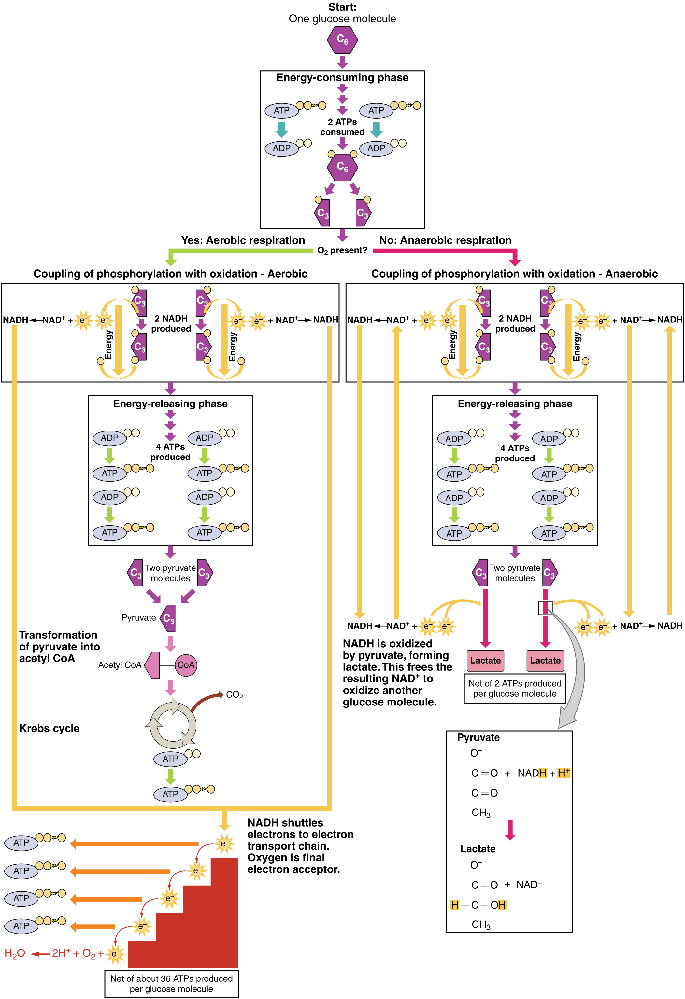
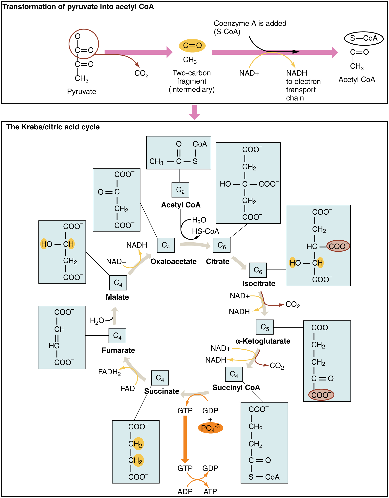
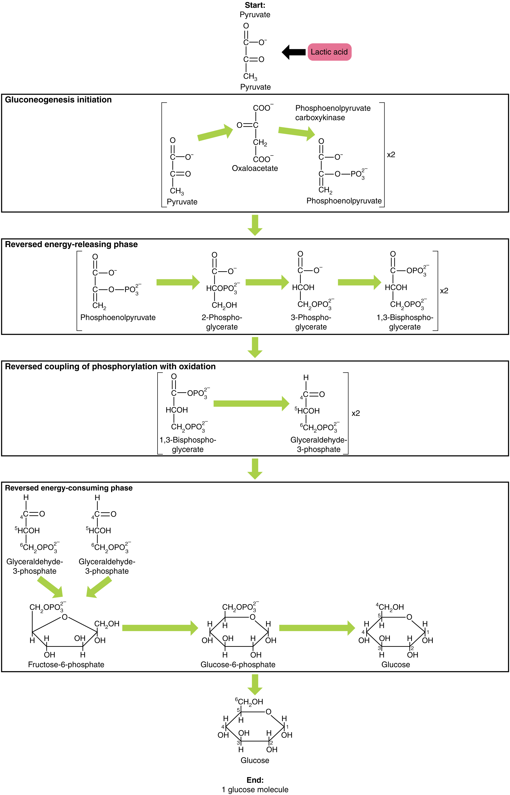

By the end of this section, you will be able to:
* Explain the processes of glycolysis
* Describe the pathway of a pyruvate molecule through the Krebs cycle
* Explain the transport of electrons through the electron transport chain
* Describe the process of ATP production through oxidative phosphorylation
* Summarize the process of gluconeogenesis

Carbohydrates are organic molecules composed of carbon, hydrogen, and oxygen atoms. The family of carbohydrates includes both simple and complex sugars. Glucose and fructose are examples of simple sugars, and starch, glycogen, and cellulose are all examples of complex sugars. The complex sugars are also called **polysaccharides**{: data-type="term"} and are made of multiple **monosaccharide**{: data-type="term"} molecules. Polysaccharides serve as energy storage (e.g., starch and glycogen) and as structural components (e.g., chitin in insects and cellulose in plants).

During digestion, carbohydrates are broken down into simple, soluble sugars that can be transported across the intestinal wall into the circulatory system to be transported throughout the body. Carbohydrate digestion begins in the mouth with the action of **salivary amylase**{: data-type="term"} on starches and ends with monosaccharides being absorbed across the epithelium of the small intestine. Once the absorbed monosaccharides are transported to the tissues, the process of **cellular respiration**{: data-type="term"} begins ([\[link\]](#fig-ch25_02_01)). This section will focus first on glycolysis, a process where the monosaccharide glucose is oxidized, releasing the energy stored in its bonds to produce ATP.

 {: #fig-ch25_02_01 data-title="Cellular Respiration "}

# Glycolysis

Glucose is the body’s most readily available source of energy. After digestive processes break polysaccharides down into monosaccharides, including glucose, the monosaccharides are transported across the wall of the small intestine and into the circulatory system, which transports them to the liver. In the liver, hepatocytes either pass the glucose on through the circulatory system or store excess glucose as glycogen. Cells in the body take up the circulating glucose in response to insulin and, through a series of reactions called **glycolysis**{: data-type="term"}, transfer some of the energy in glucose to ADP to form ATP ([\[link\]](#fig-ch25_02_02)). The last step in glycolysis produces the product **pyruvate**{: data-type="term"}.

Glycolysis begins with the phosphorylation of glucose by hexokinase to form glucose-6-phosphate. This step uses one ATP, which is the donor of the phosphate group. Under the action of phosphofructokinase, glucose-6-phosphate is converted into fructose-6-phosphate. At this point, a second ATP donates its phosphate group, forming fructose-1,6-bisphosphate. This six-carbon sugar is split to form two phosphorylated three-carbon molecules, glyceraldehyde-3-phosphate and dihydroxyacetone phosphate, which are both converted into glyceraldehyde-3-phosphate. The glyceraldehyde-3-phosphate is further phosphorylated with groups donated by dihydrogen phosphate present in the cell to form the three-carbon molecule 1,3-bisphosphoglycerate. The energy of this reaction comes from the oxidation of (removal of electrons from) glyceraldehyde-3-phosphate. In a series of reactions leading to pyruvate, the two phosphate groups are then transferred to two ADPs to form two ATPs. Thus, glycolysis uses two ATPs but generates four ATPs, yielding a net gain of two ATPs and two molecules of pyruvate. In the presence of oxygen, pyruvate continues on to the Krebs cycle (also called the **citric acid cycle**{: data-type="term"} or **tricarboxylic acid cycle (TCA)**{: data-type="term"}, where additional energy is extracted and passed on.

  of two electrons from each three-carbon compound. During the energy-releasing phase, the phosphates are removed from both three-carbon compounds and used to produce four ATP molecules."){: #fig-ch25_02_02 data-title="Glycolysis Overview "}

  
Watch this [video][1] to learn about glycolysis.

Glycolysis can be divided into two phases: energy consuming (also called chemical priming) and energy yielding. The first phase is the **energy-consuming phase**{: data-type="term"}, so it requires two ATP molecules to start the reaction for each molecule of glucose. However, the end of the reaction produces four ATPs, resulting in a net gain of two ATP energy molecules.

Glycolysis can be expressed as the following equation:

<math xmlns="http://www.w3.org/1998/Math/MathML" display="block"> <semantics> <mrow> <msup> <mrow> <mtext>Glucose + 2ATP + 2NAD</mtext> </mrow> <mtext>+</mtext> </msup> <msub> <mrow> <mtext> + 4ADP + 2P</mtext> </mrow> <mi>i</mi> </msub> <mtext> </mtext><mo stretchy="false">→</mo><msup> <mrow> <mtext> 2 Pyruvate + 4ATP + 2NADH + 2H</mtext> </mrow> <mtext>+</mtext> </msup> </mrow> <annotation encoding="MathType-MTEF">MathType@MTEF@5@5@+=feaagyart1ev2aaatCvAUfeBSjuyZL2yd9gzLbvyNv2CaerbuLwBLnhiov2DGi1BTfMBaeXatLxBI9gBaerbd9wDYLwzYbItLDharqqtubsr4rNCHbGeaGqiVu0Je9sqqrpepC0xbbL8F4rqqrFfpeea0xe9Lq=Jc9vqaqpepm0xbba9pwe9Q8fs0=yqaqpepae9pg0FirpepeKkFr0xfr=xfr=xb9adbaqaaeGaciGaaiaabeqaamaabaabaaGcbaGaae4raiaabYgacaqG1bGaae4yaiaab+gacaqGZbGaaeyzaiaabccacaqGRaGaaeiiaiaabkdacaqGbbGaaeivaiaabcfacaqGGaGaae4kaiaabccacaqGYaGaaeOtaiaabgeacaqGebWaaWbaaSqabeaacaqGRaaaaOGaaeiiaiaabUcacaqGGaGaaeinaiaabgeacaqGebGaaeiuaiaabccacaqGRaGaaeiiaiaabkdacaqGqbWaaSbaaSqaaiaadMgaaeqaaOGaaeiiaiabgkziUkaabccacaqGYaGaaeiiaiaabcfacaqG5bGaaeOCaiaabwhacaqG2bGaaeyyaiaabshacaqGLbGaaeiiaiaabUcacaqGGaGaaeOmaiaab6eacaqGbbGaaeiraiaabIeacaqGGaGaae4kaiaabccacaqGYaGaaeisamaaCaaaleqabaGaae4kaaaaaaa@6726@</annotation> </semantics> </math>

This equation states that glucose, in combination with ATP (the energy source), NAD+ (a coenzyme that serves as an electron acceptor), and inorganic phosphate, breaks down into two pyruvate molecules, generating four ATP molecules—for a net yield of two ATP—and two energy-containing NADH coenzymes. The NADH that is produced in this process will be used later to produce ATP in the mitochondria. Importantly, by the end of this process, one glucose molecule generates two pyruvate molecules, two high-energy ATP molecules, and two electron-carrying NADH molecules.

The following discussions of glycolysis include the enzymes responsible for the reactions. When glucose enters a cell, the enzyme hexokinase (or glucokinase, in the liver) rapidly adds a phosphate to convert it into **glucose-6-phosphate**{: data-type="term"}. A kinase is a type of enzyme that adds a phosphate molecule to a substrate (in this case, glucose, but it can be true of other molecules also). This conversion step requires one ATP and essentially traps the glucose in the cell, preventing it from passing back through the plasma membrane, thus allowing glycolysis to proceed. It also functions to maintain a concentration gradient with higher glucose levels in the blood than in the tissues. By establishing this concentration gradient, the glucose in the blood will be able to flow from an area of high concentration (the blood) into an area of low concentration (the tissues) to be either used or stored. **Hexokinase**{: data-type="term"} is found in nearly every tissue in the body. **Glucokinase**{: data-type="term"}, on the other hand, is expressed in tissues that are active when blood glucose levels are high, such as the liver. Hexokinase has a higher affinity for glucose than glucokinase and therefore is able to convert glucose at a faster rate than glucokinase. This is important when levels of glucose are very low in the body, as it allows glucose to travel preferentially to those tissues that require it more.

In the next step of the first phase of glycolysis, the enzyme glucose-6-phosphate isomerase converts glucose-6-phosphate into fructose-6-phosphate. Like glucose, fructose is also a six carbon-containing sugar. The enzyme phosphofructokinase-1 then adds one more phosphate to convert fructose-6-phosphate into fructose-1-6-bisphosphate, another six-carbon sugar, using another ATP molecule. Aldolase then breaks down this fructose-1-6-bisphosphate into two three-carbon molecules, glyceraldehyde-3-phosphate and dihydroxyacetone phosphate. The triosephosphate isomerase enzyme then converts dihydroxyacetone phosphate into a second glyceraldehyde-3-phosphate molecule. Therefore, by the end of this chemical-priming or energy-consuming phase, one glucose molecule is broken down into two glyceraldehyde-3-phosphate molecules.

The second phase of glycolysis, the **energy-yielding phase**{: data-type="term"}, creates the energy that is the product of glycolysis. Glyceraldehyde-3-phosphate dehydrogenase converts each three-carbon glyceraldehyde-3-phosphate produced during the energy-consuming phase into 1,3-bisphosphoglycerate. This reaction releases an electron that is then picked up by NAD+ to create an NADH molecule. NADH is a high-energy molecule, like ATP, but unlike ATP, it is not used as energy currency by the cell. Because there are two glyceraldehyde-3-phosphate molecules, two NADH molecules are synthesized during this step. Each 1,3-bisphosphoglycerate is subsequently dephosphorylated (i.e., a phosphate is removed) by phosphoglycerate kinase into 3-phosphoglycerate. Each phosphate released in this reaction can convert one molecule of ADP into one high-energy ATP molecule, resulting in a gain of two ATP molecules.

The enzyme phosphoglycerate mutase then converts the 3-phosphoglycerate molecules into 2-phosphoglycerate. The enolase enzyme then acts upon the 2-phosphoglycerate molecules to convert them into phosphoenolpyruvate molecules. The last step of glycolysis involves the dephosphorylation of the two phosphoenolpyruvate molecules by pyruvate kinase to create two pyruvate molecules and two ATP molecules.

In summary, one glucose molecule breaks down into two pyruvate molecules, and creates two net ATP molecules and two NADH molecules by glycolysis. Therefore, glycolysis generates energy for the cell and creates pyruvate molecules that can be processed further through the aerobic Krebs cycle (also called the citric acid cycle or tricarboxylic acid cycle); converted into lactic acid or alcohol (in yeast) by fermentation; or used later for the synthesis of glucose through gluconeogenesis.

## Anaerobic Respiration

When oxygen is limited or absent, pyruvate enters an anaerobic pathway. In these reactions, pyruvate can be converted into lactic acid. In addition to generating an additional ATP, this pathway serves to keep the pyruvate concentration low so glycolysis continues, and it oxidizes NADH into the NAD+ needed by glycolysis. In this reaction, lactic acid replaces oxygen as the final electron acceptor. Anaerobic respiration occurs in most cells of the body when oxygen is limited or mitochondria are absent or nonfunctional. For example, because erythrocytes (red blood cells) lack mitochondria, they must produce their ATP from anaerobic respiration. This is an effective pathway of ATP production for short periods of time, ranging from seconds to a few minutes. The lactic acid produced diffuses into the plasma and is carried to the liver, where it is converted back into pyruvate or glucose via the Cori cycle. Similarly, when a person exercises, muscles use ATP faster than oxygen can be delivered to them. They depend on glycolysis and lactic acid production for rapid ATP production.

## Aerobic Respiration

In the presence of oxygen, pyruvate can enter the Krebs cycle where additional energy is extracted as electrons are transferred from the pyruvate to the receptors NAD+, GDP, and FAD, with carbon dioxide being a “waste product” ([\[link\]](#fig-ch25_02_03)). The NADH and FADH2 pass electrons on to the electron transport chain, which uses the transferred energy to produce ATP. As the terminal step in the electron transport chain, oxygen is the **terminal electron acceptor**{: data-type="term"} and creates water inside the mitochondria.

 {: #fig-ch25_02_03 data-title="Aerobic versus Anaerobic Respiration "}

# Krebs Cycle/Citric Acid Cycle/Tricarboxylic Acid Cycle

The pyruvate molecules generated during glycolysis are transported across the mitochondrial membrane into the inner mitochondrial matrix, where they are metabolized by enzymes in a pathway called the **Krebs cycle**{: data-type="term"} ([\[link\]](#fig-ch25_02_04)). The Krebs cycle is also commonly called the citric acid cycle or the tricarboxylic acid (TCA) cycle. During the Krebs cycle, high-energy molecules, including ATP, NADH, and FADH2, are created. NADH and FADH2 then pass electrons through the electron transport chain in the mitochondria to generate more ATP molecules.

 {: #fig-ch25_02_04 data-title="Krebs Cycle "}

  
Watch this [animation][2] to observe the Krebs cycle.

The three-carbon pyruvate molecule generated during glycolysis moves from the cytoplasm into the mitochondrial matrix, where it is converted by the enzyme pyruvate dehydrogenase into a two-carbon **acetyl coenzyme A (acetyl CoA)**{: data-type="term"} molecule. This reaction is an oxidative decarboxylation reaction. It converts the three-carbon pyruvate into a two-carbon acetyl CoA molecule, releasing carbon dioxide and transferring two electrons that combine with NAD+ to form NADH. Acetyl CoA enters the Krebs cycle by combining with a four-carbon molecule, oxaloacetate, to form the six-carbon molecule citrate, or citric acid, at the same time releasing the coenzyme A molecule.

The six-carbon citrate molecule is systematically converted to a five-carbon molecule and then a four-carbon molecule, ending with oxaloacetate, the beginning of the cycle. Along the way, each citrate molecule will produce one ATP, one FADH2, and three NADH. The FADH2 and NADH will enter the oxidative phosphorylation system located in the inner mitochondrial membrane. In addition, the Krebs cycle supplies the starting materials to process and break down proteins and fats.

To start the Krebs cycle, citrate synthase combines acetyl CoA and oxaloacetate to form a six-carbon citrate molecule; CoA is subsequently released and can combine with another pyruvate molecule to begin the cycle again. The aconitase enzyme converts citrate into isocitrate. In two successive steps of oxidative decarboxylation, two molecules of CO2 and two NADH molecules are produced when isocitrate dehydrogenase converts isocitrate into the five-carbon α-ketoglutarate, which is then catalyzed and converted into the four-carbon succinyl CoA by α-ketoglutarate dehydrogenase. The enzyme succinyl CoA dehydrogenase then converts succinyl CoA into succinate and forms the high-energy molecule GTP, which transfers its energy to ADP to produce ATP. Succinate dehydrogenase then converts succinate into fumarate, forming a molecule of FADH2. Fumarase then converts fumarate into malate, which malate dehydrogenase then converts back into oxaloacetate while reducing NAD+ to NADH. Oxaloacetate is then ready to combine with the next acetyl CoA to start the Krebs cycle again (see [\[link\]](#fig-ch25_02_04)). For each turn of the cycle, three NADH, one ATP (through GTP), and one FADH2 are created. Each carbon of pyruvate is converted into CO2, which is released as a byproduct of oxidative (aerobic) respiration.

# Oxidative Phosphorylation and the Electron Transport Chain

The **electron transport chain (ETC)**{: data-type="term"} uses the NADH and FADH2 produced by the Krebs cycle to generate ATP. Electrons from NADH and FADH2 are transferred through protein complexes embedded in the inner mitochondrial membrane by a series of enzymatic reactions. The electron transport chain consists of a series of four enzyme complexes (Complex I – Complex IV) and two coenzymes (ubiquinone and Cytochrome c), which act as electron carriers and proton pumps used to transfer H+ ions into the space between the inner and outer mitochondrial membranes ([\[link\]](#fig-ch25_02_05)). The ETC couples the transfer of electrons between a donor (like NADH) and an electron acceptor (like O2) with the transfer of protons (H+ ions) across the inner mitochondrial membrane, enabling the process of **oxidative phosphorylation**{: data-type="term"}. In the presence of oxygen, energy is passed, stepwise, through the electron carriers to collect gradually the energy needed to attach a phosphate to ADP and produce ATP. The role of molecular oxygen, O2, is as the terminal electron acceptor for the ETC. This means that once the electrons have passed through the entire ETC, they must be passed to another, separate molecule. These electrons, O2, and H+ ions from the matrix combine to form new water molecules. This is the basis for your need to breathe in oxygen. Without oxygen, electron flow through the ETC ceases.

 {: #fig-ch25_02_05 data-title="Electron Transport Chain "}

  
Watch this [video][3] to learn about the electron transport chain.

The electrons released from NADH and FADH2 are passed along the chain by each of the carriers, which are reduced when they receive the electron and oxidized when passing it on to the next carrier. Each of these reactions releases a small amount of energy, which is used to pump H+ ions across the inner membrane. The accumulation of these protons in the space between the membranes creates a proton gradient with respect to the mitochondrial matrix.

Also embedded in the inner mitochondrial membrane is an amazing protein pore complex called **ATP synthase**{: data-type="term"}. Effectively, it is a turbine that is powered by the flow of H+ ions across the inner membrane down a gradient and into the mitochondrial matrix. As the H+ ions traverse the complex, the shaft of the complex rotates. This rotation enables other portions of ATP synthase to encourage ADP and P*i* to create ATP. In accounting for the total number of ATP produced per glucose molecule through aerobic respiration, it is important to remember the following points:

* A net of two ATP are produced through glycolysis (four produced and two consumed during the energy-consuming stage). However, these two ATP are used for transporting the NADH produced during glycolysis from the cytoplasm into the mitochondria. Therefore, the net production of ATP during glycolysis is zero.
* In all phases after glycolysis, the number of ATP, NADH, and FADH2 produced must be multiplied by two to reflect how each glucose molecule produces two pyruvate molecules.
* In the ETC, about three ATP are produced for every oxidized NADH. However, only about two ATP are produced for every oxidized FADH2. The electrons from FADH2 produce less ATP, because they start at a lower point in the ETC (Complex II) compared to the electrons from NADH (Complex I) (see [\[link\]](#fig-ch25_02_05)).

Therefore, for every glucose molecule that enters aerobic respiration, a net total of 36 ATPs are produced ([\[link\]](#fig-ch25_02_06)).

 {: #fig-ch25_02_06 data-title="Carbohydrate Metabolism "}

# Gluconeogenesis

**Gluconeogenesis**{: data-type="term"} is the synthesis of new glucose molecules from pyruvate, lactate, glycerol, or the amino acids alanine or glutamine. This process takes place primarily in the liver during periods of low glucose, that is, under conditions of fasting, starvation, and low carbohydrate diets. So, the question can be raised as to why the body would create something it has just spent a fair amount of effort to break down? Certain key organs, including the brain, can use only glucose as an energy source; therefore, it is essential that the body maintain a minimum blood glucose concentration. When the blood glucose concentration falls below that certain point, new glucose is synthesized by the liver to raise the blood concentration to normal.

Gluconeogenesis is not simply the reverse of glycolysis. There are some important differences ([\[link\]](#fig-ch25_02_07)). Pyruvate is a common starting material for gluconeogenesis. First, the pyruvate is converted into oxaloacetate. Oxaloacetate then serves as a substrate for the enzyme phosphoenolpyruvate carboxykinase (PEPCK), which transforms oxaloacetate into phosphoenolpyruvate (PEP). From this step, gluconeogenesis is nearly the reverse of glycolysis. PEP is converted back into 2-phosphoglycerate, which is converted into 3-phosphoglycerate. Then, 3-phosphoglycerate is converted into 1,3 bisphosphoglycerate and then into glyceraldehyde-3-phosphate. Two molecules of glyceraldehyde-3-phosphate then combine to form fructose-1-6-bisphosphate, which is converted into fructose 6-phosphate and then into glucose-6-phosphate. Finally, a series of reactions generates glucose itself. In gluconeogenesis (as compared to glycolysis), the enzyme hexokinase is replaced by glucose-6-phosphatase, and the enzyme phosphofructokinase-1 is replaced by fructose-1,6-bisphosphatase. This helps the cell to regulate glycolysis and gluconeogenesis independently of each other.

As will be discussed as part of lipolysis, fats can be broken down into glycerol, which can be phosphorylated to form dihydroxyacetone phosphate or DHAP. DHAP can either enter the glycolytic pathway or be used by the liver as a substrate for gluconeogenesis.

 {: #fig-ch25_02_07 data-title="Gluconeogenesis "}

Aging and the…

Body’s Metabolic Rate The human body’s metabolic rate decreases nearly 2 percent per decade after age 30. Changes in body composition, including reduced lean muscle mass, are mostly responsible for this decrease. The most dramatic loss of muscle mass, and consequential decline in metabolic rate, occurs between 50 and 70 years of age. Loss of muscle mass is the equivalent of reduced strength, which tends to inhibit seniors from engaging in sufficient physical activity. This results in a positive-feedback system where the reduced physical activity leads to even more muscle loss, further reducing metabolism.

There are several things that can be done to help prevent general declines in metabolism and to fight back against the cyclic nature of these declines. These include eating breakfast, eating small meals frequently, consuming plenty of lean protein, drinking water to remain hydrated, exercising (including strength training), and getting enough sleep. These measures can help keep energy levels from dropping and curb the urge for increased calorie consumption from excessive snacking. While these strategies are not guaranteed to maintain metabolism, they do help prevent muscle loss and may increase energy levels. Some experts also suggest avoiding sugar, which can lead to excess fat storage. Spicy foods and green tea might also be beneficial. Because stress activates cortisol release, and cortisol slows metabolism, avoiding stress, or at least practicing relaxation techniques, can also help.

# Chapter Review

Metabolic enzymes catalyze catabolic reactions that break down carbohydrates contained in food. The energy released is used to power the cells and systems that make up your body. Excess or unutilized energy is stored as fat or glycogen for later use. Carbohydrate metabolism begins in the mouth, where the enzyme salivary amylase begins to break down complex sugars into monosaccharides. These can then be transported across the intestinal membrane into the bloodstream and then to body tissues. In the cells, glucose, a six-carbon sugar, is processed through a sequence of reactions into smaller sugars, and the energy stored inside the molecule is released. The first step of carbohydrate catabolism is glycolysis, which produces pyruvate, NADH, and ATP. Under anaerobic conditions, the pyruvate can be converted into lactate to keep glycolysis working. Under aerobic conditions, pyruvate enters the Krebs cycle, also called the citric acid cycle or tricarboxylic acid cycle. In addition to ATP, the Krebs cycle produces high-energy FADH2 and NADH molecules, which provide electrons to the oxidative phosphorylation process that generates more high-energy ATP molecules. For each molecule of glucose that is processed in glycolysis, a net of 36 ATPs can be created by aerobic respiration.

Under anaerobic conditions, ATP production is limited to those generated by glycolysis. While a total of four ATPs are produced by glycolysis, two are needed to begin glycolysis, so there is a net yield of two ATP molecules.

In conditions of low glucose, such as fasting, starvation, or low carbohydrate diets, glucose can be synthesized from lactate, pyruvate, glycerol, alanine, or glutamate. This process, called gluconeogenesis, is almost the reverse of glycolysis and serves to create glucose molecules for glucose-dependent organs, such as the brain, when glucose levels fall below normal.

# Review Questions

Glycolysis results in the production of two \_\_\_\_\_\_\_\_ molecules from a single molecule of glucose. In the absence of \_\_\_\_\_\_\_\_, the end product of glycolysis is \_\_\_\_\_\_\_\_.

1.  acetyl CoA, pyruvate, lactate
2.  ATP, carbon, pyruvate
3.  pyruvate, oxygen, lactate
4.  pyruvate, carbon, acetyl CoA
{: data-number-style="lower-alpha"}

C

The Krebs cycle converts \_\_\_\_\_\_\_\_ through a cycle of reactions. In the process, ATP, \_\_\_\_\_\_\_\_, and \_\_\_\_\_\_\_\_ are produced.

1.  acetyl CoA; FAD, NAD
2.  acetyl CoA; FADH2; NADH
3.  pyruvate; NAD; FADH2
4.  pyruvate; oxygen; oxaloacetate
{: data-number-style="lower-alpha"}

B

Which pathway produces the most ATP molecules?

1.  lactic acid fermentation
2.  the Krebs cycle
3.  the electron transport chain
4.  glycolysis
{: data-number-style="lower-alpha"}

C

Aerobic cellular respiration results in the production of these two products.

1.  NADH and FADH2
2.  ATP and pyruvate
3.  ATP and glucose
4.  ATP and H2O
{: data-number-style="lower-alpha"}

D

When NAD+ becomes NADH, the coenzyme has been \_\_\_\_\_\_\_\_.

1.  reduced
2.  oxidized
3.  metabolized
4.  hydrolyzed
{: data-number-style="lower-alpha"}

A

# Critical Thinking Questions

Explain how glucose is metabolized to yield ATP.

Glucose is oxidized during glycolysis, creating pyruvate, which is processed through the Krebs cycle to produce NADH, FADH2, ATP, and CO2. The FADH2 and NADH yield ATP.

Insulin is released when food is ingested and stimulates the uptake of glucose into the cell. Discuss the mechanism cells employ to create a concentration gradient to ensure continual uptake of glucose from the bloodstream.

Upon entry into the cell, hexokinase or glucokinase phosphorylates glucose, converting it into glucose-6-phosphate. In this form, glucose-6-phosphate is trapped in the cell. Because all of the glucose has been phosphorylated, new glucose molecules can be transported into the cell according to its concentration gradient.

## Glossary
{: data-type="glossary-title"}

acetyl coenzyme A (acetyl CoA)
: starting molecule of the Krebs cycle
{: .definition}

ATP synthase
: protein pore complex that creates ATP
{: .definition}

cellular respiration
: production of ATP from glucose oxidation via glycolysis, the Krebs cycle, and oxidative phosphorylation
{: .definition}

citric acid cycle
: also called the Krebs cycle or the tricarboxylic acid cycle; converts pyruvate into CO2 and high-energy FADH2, NADH, and ATP molecules
{: .definition}

electron transport chain (ETC)
: ATP production pathway in which electrons are passed through a series of oxidation-reduction reactions that forms water and produces a proton gradient
{: .definition}

energy-consuming phase
: first phase of glycolysis, in which two molecules of ATP are necessary to start the reaction
{: .definition}

energy-yielding phase
: second phase of glycolysis, during which energy is produced
{: .definition}

glucokinase
: cellular enzyme, found in the liver, which converts glucose into glucose-6-phosphate upon uptake into the cell
{: .definition}

gluconeogenesis
: process of glucose synthesis from pyruvate or other molecules
{: .definition}

glucose-6-phosphate
: phosphorylated glucose produced in the first step of glycolysis
{: .definition}

glycolysis
: series of metabolic reactions that breaks down glucose into pyruvate and produces ATP
{: .definition}

hexokinase
: cellular enzyme, found in most tissues, that converts glucose into glucose-6-phosphate upon uptake into the cell
{: .definition}

Krebs cycle
: also called the citric acid cycle or the tricarboxylic acid cycle, converts pyruvate into CO2 and high-energy FADH2, NADH, and ATP molecules
{: .definition}

monosaccharide
: smallest, monomeric sugar molecule
{: .definition}

oxidative phosphorylation
: process that converts high-energy NADH and FADH2 into ATP
{: .definition}

polysaccharides
: complex carbohydrates made up of many monosaccharides
{: .definition}

pyruvate
: three-carbon end product of glycolysis and starting material that is converted into acetyl CoA that enters the Krebs cycle
{: .definition}

salivary amylase
: digestive enzyme that is found in the saliva and begins the digestion of carbohydrates in the mouth
{: .definition}

terminal electron acceptor
: oxygen, the recipient of the free hydrogen at the end of the electron transport chain
{: .definition}

tricarboxylic acid cycle (TCA)
: also called the Krebs cycle or the citric acid cycle; converts pyruvate into CO2 and high-energy FADH2, NADH, and ATP molecules
{: .definition}

[1]: http://openstaxcollege.org/l/glycolysis1
[2]: http://openstaxcollege.org/l/krebscycle
[3]: http://openstaxcollege.org/l/ETchain
