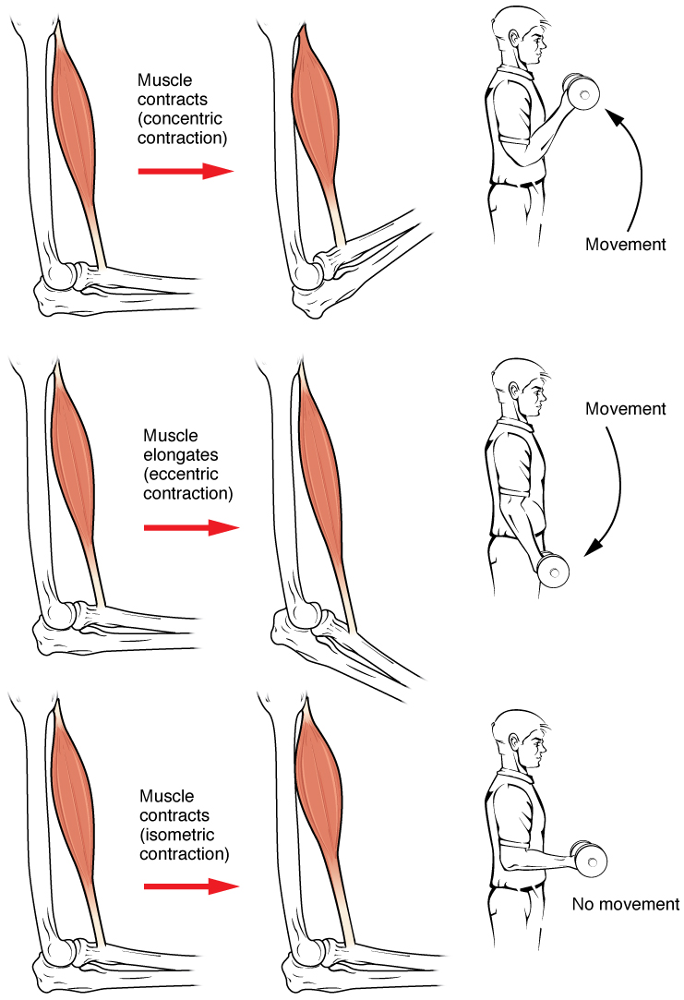
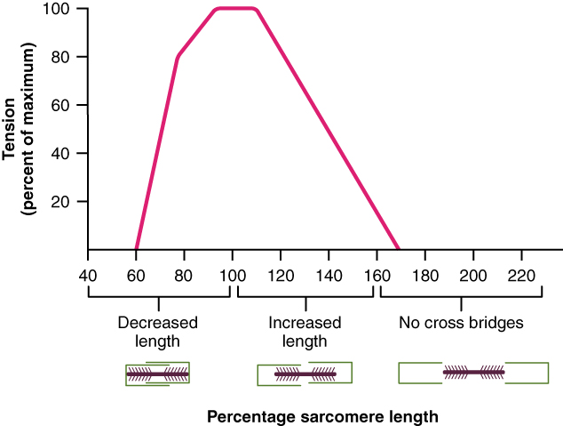
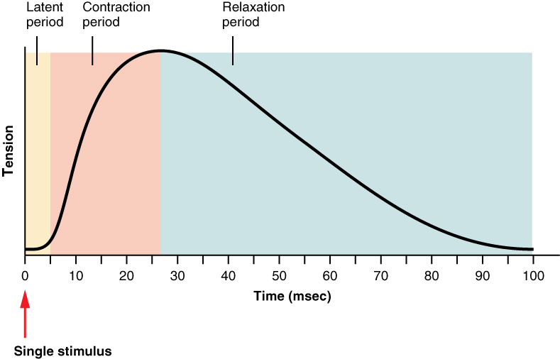
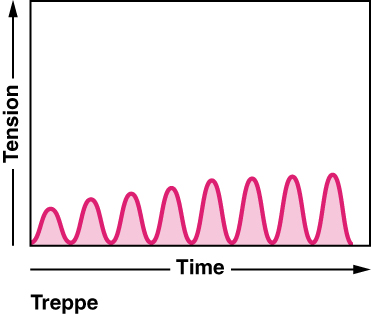

By the end of this section, you will be able to:
* Explain concentric, isotonic, and eccentric contractions
* Describe the length-tension relationship
* Describe the three phases of a muscle twitch
* Define wave summation, tetanus, and treppe

To move an object, referred to as load, the sarcomeres in the muscle fibers of the skeletal muscle must shorten. The force generated by the contraction of the muscle (or shortening of the sarcomeres) is called **muscle tension**{: data-type="term"}. However, muscle tension also is generated when the muscle is contracting against a load that does not move, resulting in two main types of skeletal muscle contractions: isotonic contractions and isometric contractions.

In **isotonic contractions**{: data-type="term"}, where the tension in the muscle stays constant, a load is moved as the length of the muscle changes (shortens). There are two types of isotonic contractions: concentric and eccentric. A **concentric contraction**{: data-type="term"} involves the muscle shortening to move a load. An example of this is the biceps brachii muscle contracting when a hand weight is brought upward with increasing muscle tension. As the biceps brachii contract, the angle of the elbow joint decreases as the forearm is brought toward the body. Here, the biceps brachii contracts as sarcomeres in its muscle fibers are shortening and cross-bridges form; the myosin heads pull the actin. An **eccentric contraction**{: data-type="term"} occurs as the muscle tension diminishes and the muscle lengthens. In this case, the hand weight is lowered in a slow and controlled manner as the amount of cross-bridges being activated by nervous system stimulation decreases. In this case, as tension is released from the biceps brachii, the angle of the elbow joint increases. Eccentric contractions are also used for movement and balance of the body.

An **isometric contraction**{: data-type="term"} occurs as the muscle produces tension without changing the angle of a skeletal joint. Isometric contractions involve sarcomere shortening and increasing muscle tension, but do not move a load, as the force produced cannot overcome the resistance provided by the load. For example, if one attempts to lift a hand weight that is too heavy, there will be sarcomere activation and shortening to a point, and ever-increasing muscle tension, but no change in the angle of the elbow joint. In everyday living, isometric contractions are active in maintaining posture and maintaining bone and joint stability. However, holding your head in an upright position occurs not because the muscles cannot move the head, but because the goal is to remain stationary and not produce movement. Most actions of the body are the result of a combination of isotonic and isometric contractions working together to produce a wide range of outcomes ([\[link\]](#fig-ch10_04_01)).

 {: #fig-ch10_04_01 data-title="Types of Muscle Contractions "}

All of these muscle activities are under the exquisite control of the nervous system. Neural control regulates concentric, eccentric and isometric contractions, muscle fiber recruitment, and muscle tone. A crucial aspect of nervous system control of skeletal muscles is the role of motor units.

# Motor Units

As you have learned, every skeletal muscle fiber must be innervated by the axon terminal of a motor neuron in order to contract. Each muscle fiber is innervated by only one motor neuron. The actual group of muscle fibers in a muscle innervated by a single motor neuron is called a **motor unit**{: data-type="term"}. The size of a motor unit is variable depending on the nature of the muscle.

A small motor unit is an arrangement where a single motor neuron supplies a small number of muscle fibers in a muscle. Small motor units permit very fine motor control of the muscle. The best example in humans is the small motor units of the extraocular eye muscles that move the eyeballs. There are thousands of muscle fibers in each muscle, but every six or so fibers are supplied by a single motor neuron, as the axons branch to form synaptic connections at their individual NMJs. This allows for exquisite control of eye movements so that both eyes can quickly focus on the same object. Small motor units are also involved in the many fine movements of the fingers and thumb of the hand for grasping, texting, etc.

A large motor unit is an arrangement where a single motor neuron supplies a large number of muscle fibers in a muscle. Large motor units are concerned with simple, or “gross,” movements, such as powerfully extending the knee joint. The best example is the large motor units of the thigh muscles or back muscles, where a single motor neuron will supply thousands of muscle fibers in a muscle, as its axon splits into thousands of branches.

There is a wide range of motor units within many skeletal muscles, which gives the nervous system a wide range of control over the muscle. The small motor units in the muscle will have smaller, lower-threshold motor neurons that are more excitable, firing first to their skeletal muscle fibers, which also tend to be the smallest. Activation of these smaller motor units, results in a relatively small degree of contractile strength (tension) generated in the muscle. As more strength is needed, larger motor units, with bigger, higher-threshold motor neurons are enlisted to activate larger muscle fibers. This increasing activation of motor units produces an increase in muscle contraction known as **recruitment**{: data-type="term"}. As more motor units are recruited, the muscle contraction grows progressively stronger. In some muscles, the largest motor units may generate a contractile force of 50 times more than the smallest motor units in the muscle. This allows a feather to be picked up using the biceps brachii arm muscle with minimal force, and a heavy weight to be lifted by the same muscle by recruiting the largest motor units.

When necessary, the maximal number of motor units in a muscle can be recruited simultaneously, producing the maximum force of contraction for that muscle, but this cannot last for very long because of the energy requirements to sustain the contraction. To prevent complete muscle fatigue, motor units are generally not all simultaneously active, but instead some motor units rest while others are active, which allows for longer muscle contractions. The nervous system uses recruitment as a mechanism to efficiently utilize a skeletal muscle.

# The Length-Tension Range of a Sarcomere

When a skeletal muscle fiber contracts, myosin heads attach to actin to form cross-bridges followed by the thin filaments sliding over the thick filaments as the heads pull the actin, and this results in sarcomere shortening, creating the tension of the muscle contraction. The cross-bridges can only form where thin and thick filaments already overlap, so that the length of the sarcomere has a direct influence on the force generated when the sarcomere shortens. This is called the length-tension relationship.

The ideal length of a sarcomere to produce maximal tension occurs at 80 percent to 120 percent of its resting length, with 100 percent being the state where the medial edges of the thin filaments are just at the most-medial myosin heads of the thick filaments ([\[link\]](#fig-ch10_04_02)). This length maximizes the overlap of actin-binding sites and myosin heads. If a sarcomere is stretched past this ideal length (beyond 120 percent), thick and thin filaments do not overlap sufficiently, which results in less tension produced. If a sarcomere is shortened beyond 80 percent, the zone of overlap is reduced with the thin filaments jutting beyond the last of the myosin heads and shrinks the H zone, which is normally composed of myosin tails. Eventually, there is nowhere else for the thin filaments to go and the amount of tension is diminished. If the muscle is stretched to the point where thick and thin filaments do not overlap at all, no cross-bridges can be formed, and no tension is produced in that sarcomere. This amount of stretching does not usually occur, as accessory proteins and connective tissue oppose extreme stretching.

 {: #fig-ch10_04_02 data-title="The Ideal Length of a Sarcomere "}

# The Frequency of Motor Neuron Stimulation

A single action potential from a motor neuron will produce a single contraction in the muscle fibers of its motor unit. This isolated contraction is called a **twitch**{: data-type="term"}. A twitch can last for a few milliseconds or 100 milliseconds, depending on the muscle type. The tension produced by a single twitch can be measured by a **myogram**{: data-type="term"}, an instrument that measures the amount of tension produced over time ([\[link\]](#fig-ch10_04_03)). Each twitch undergoes three phases. The first phase is the **latent period**{: data-type="term"}, during which the action potential is being propagated along the sarcolemma and Ca++ ions are released from the SR. This is the phase during which excitation and contraction are being coupled but contraction has yet to occur. The **contraction phase**{: data-type="term"} occurs next. The Ca++ ions in the sarcoplasm have bound to troponin, tropomyosin has shifted away from actin-binding sites, cross-bridges formed, and sarcomeres are actively shortening to the point of peak tension. The last phase is the **relaxation phase**{: data-type="term"}, when tension decreases as contraction stops. Ca++ ions are pumped out of the sarcoplasm into the SR, and cross-bridge cycling stops, returning the muscle fibers to their resting state.

 {: #fig-ch10_04_03 data-title="A Myogram of a Muscle Twitch "}

Although a person can experience a muscle “twitch,” a single twitch does not produce any significant muscle activity in a living body. A series of action potentials to the muscle fibers is necessary to produce a muscle contraction that can produce work. Normal muscle contraction is more sustained, and it can be modified by input from the nervous system to produce varying amounts of force; this is called a **graded muscle response**{: data-type="term"}. The frequency of action potentials (nerve impulses) from a motor neuron and the number of motor neurons transmitting action potentials both affect the tension produced in skeletal muscle.

The rate at which a motor neuron fires action potentials affects the tension produced in the skeletal muscle. If the fibers are stimulated while a previous twitch is still occurring, the second twitch will be stronger. This response is called **wave summation**{: data-type="term"}, because the excitation-contraction coupling effects of successive motor neuron signaling is summed, or added together ([\[link\]](#fig-ch10_04_04)**a**). At the molecular level, summation occurs because the second stimulus triggers the release of more Ca++ ions, which become available to activate additional sarcomeres while the muscle is still contracting from the first stimulus. Summation results in greater contraction of the motor unit.

  The excitation-contraction coupling effects of successive motor neuron signaling is added together which is referred to as wave summation. The bottom of each wave, the end of the relaxation phase, represents the point of stimulus. (b) When the stimulus frequency is so high that the relaxation phase disappears completely, the contractions become continuous; this is called tetanus."){: #fig-ch10_04_04 data-title="Wave Summation and Tetanus "}

If the frequency of motor neuron signaling increases, summation and subsequent muscle tension in the motor unit continues to rise until it reaches a peak point. The tension at this point is about three to four times greater than the tension of a single twitch, a state referred to as incomplete tetanus. During incomplete tetanus, the muscle goes through quick cycles of contraction with a short relaxation phase for each. If the stimulus frequency is so high that the relaxation phase disappears completely, contractions become continuous in a process called complete **tetanus**{: data-type="term"} ([\[link\]](#fig-ch10_04_04)**b**).

During tetanus, the concentration of Ca++ ions in the sarcoplasm allows virtually all of the sarcomeres to form cross-bridges and shorten, so that a contraction can continue uninterrupted (until the muscle fatigues and can no longer produce tension).

# Treppe

When a skeletal muscle has been dormant for an extended period and then activated to contract, with all other things being equal, the initial contractions generate about one-half the force of later contractions. The muscle tension increases in a graded manner that to some looks like a set of stairs. This tension increase is called **treppe**{: data-type="term"}, a condition where muscle contractions become more efficient. It’s also known as the “staircase effect” ([\[link\]](#fig-ch10_04_05)).

 {: #fig-ch10_04_05 data-title="Treppe "}

It is believed that treppe results from a higher concentration of Ca++ in the sarcoplasm resulting from the steady stream of signals from the motor neuron. It can only be maintained with adequate ATP.

# Muscle Tone

Skeletal muscles are rarely completely relaxed, or flaccid. Even if a muscle is not producing movement, it is contracted a small amount to maintain its contractile proteins and produce **muscle tone**{: data-type="term"}. The tension produced by muscle tone allows muscles to continually stabilize joints and maintain posture.

Muscle tone is accomplished by a complex interaction between the nervous system and skeletal muscles that results in the activation of a few motor units at a time, most likely in a cyclical manner. In this manner, muscles never fatigue completely, as some motor units can recover while others are active.

The absence of the low-level contractions that lead to muscle tone is referred to as **hypotonia**{: data-type="term"} or atrophy, and can result from damage to parts of the central nervous system (CNS), such as the cerebellum, or from loss of innervations to a skeletal muscle, as in poliomyelitis. Hypotonic muscles have a flaccid appearance and display functional impairments, such as weak reflexes. Conversely, excessive muscle tone is referred to as **hypertonia**{: data-type="term"}, accompanied by hyperreflexia (excessive reflex responses), often the result of damage to upper motor neurons in the CNS. Hypertonia can present with muscle rigidity (as seen in Parkinson’s disease) or spasticity, a phasic change in muscle tone, where a limb will “snap” back from passive stretching (as seen in some strokes).

# Chapter Review

The number of cross-bridges formed between actin and myosin determines the amount of tension produced by a muscle. The length of a sarcomere is optimal when the zone of overlap between thin and thick filaments is greatest. Muscles that are stretched or compressed too greatly do not produce maximal amounts of power. A motor unit is formed by a motor neuron and all of the muscle fibers that are innervated by that same motor neuron. A single contraction is called a twitch. A muscle twitch has a latent period, a contraction phase, and a relaxation phase. A graded muscle response allows variation in muscle tension. Summation occurs as successive stimuli are added together to produce a stronger muscle contraction. Tetanus is the fusion of contractions to produce a continuous contraction. Increasing the number of motor neurons involved increases the amount of motor units activated in a muscle, which is called recruitment. Muscle tone is the constant low-level contractions that allow for posture and stability.

# Review Questions

During which phase of a twitch in a muscle fiber is tension the greatest?

1.  resting phase
2.  repolarization phase
3.  contraction phase
4.  relaxation phase
{: data-number-style="lower-alpha"}

C

# Critical Thinking Questions

Why does a motor unit of the eye have few muscle fibers compared to a motor unit of the leg?

Eyes require fine movements and a high degree of control, which is permitted by having fewer muscle fibers associated with a neuron.

What factors contribute to the amount of tension produced in an individual muscle fiber?

The length, size and types of muscle fiber and the frequency of neural stimulation contribute to the amount of tension produced in an individual muscle fiber.

## Glossary
{: data-type="glossary-title"}

concentric contraction
: muscle contraction that shortens the muscle to move a load
{: .definition}

contraction phase
: twitch contraction phase when tension increases
{: .definition}

eccentric contraction
: muscle contraction that lengthens the muscle as the tension is diminished
{: .definition}

graded muscle response
: modification of contraction strength
{: .definition}

hypertonia
: abnormally high muscle tone
{: .definition}

hypotonia
: abnormally low muscle tone caused by the absence of low-level contractions
{: .definition}

isometric contraction
: muscle contraction that occurs with no change in muscle length
{: .definition}

isotonic contraction
: muscle contraction that involves changes in muscle length
{: .definition}

latent period
: the time when a twitch does not produce contraction
{: .definition}

motor unit
: motor neuron and the group of muscle fibers it innervates
{: .definition}

muscle tension
: force generated by the contraction of the muscle; tension generated during isotonic contractions and isometric contractions
{: .definition}

muscle tone
: low levels of muscle contraction that occur when a muscle is not producing movement
{: .definition}

myogram
: instrument used to measure twitch tension
{: .definition}

recruitment
: increase in the number of motor units involved in contraction
{: .definition}

relaxation phase
: period after twitch contraction when tension decreases
{: .definition}

tetanus
: a continuous fused contraction
{: .definition}

treppe
: stepwise increase in contraction tension
{: .definition}

twitch
: single contraction produced by one action potential
{: .definition}

wave summation
: addition of successive neural stimuli to produce greater contraction
{: .definition}

