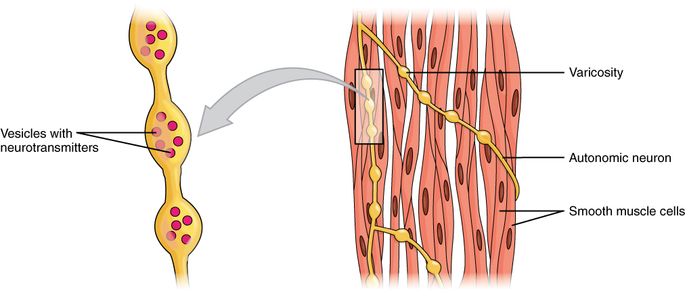

By the end of this section, you will be able to:
* Describe a dense body
* Explain how smooth muscle works with internal organs and passageways through the body
* Explain how smooth muscles differ from skeletal and cardiac muscles
* Explain the difference between single-unit and multi-unit smooth muscle

Smooth muscle (so-named because the cells do not have striations) is present in the walls of hollow organs like the urinary bladder, uterus, stomach, intestines, and in the walls of passageways, such as the arteries and veins of the circulatory system, and the tracts of the respiratory, urinary, and reproductive systems ([\[link\]](#fig-ch10_08_01)**ab**). Smooth muscle is also present in the eyes, where it functions to change the size of the iris and alter the shape of the lens; and in the skin where it causes hair to stand erect in response to cold temperature or fear.

 "){: #fig-ch10_08_01 data-media-type="image/jpg" data-title="Smooth Muscle Tissue "}

 {: data-media-type="image/png"} 
View the University of Michigan WebScope at [ http://virtualslides.med.umich.edu/Histology/Digestive%20System/Intestines/169\\\_HISTO\\\_40X.svs/view.apml][1] to explore the tissue sample in greater detail.

Smooth muscle fibers are spindle-shaped (wide in the middle and tapered at both ends, somewhat like a football) and have a single nucleus; they range from about 30 to 200 *μ*m (thousands of times shorter than skeletal muscle fibers), and they produce their own connective tissue, endomysium. Although they do not have striations and sarcomeres, smooth muscle fibers do have actin and myosin contractile proteins, and thick and thin filaments. These thin filaments are anchored by dense bodies. A **dense body**{: data-type="term"} is analogous to the Z-discs of skeletal and cardiac muscle fibers and is fastened to the sarcolemma. Calcium ions are supplied by the SR in the fibers and by sequestration from the extracellular fluid through membrane indentations called calveoli.

Because smooth muscle cells do not contain troponin, cross-bridge formation is not regulated by the troponin-tropomyosin complex but instead by the regulatory protein **calmodulin**{: data-type="term"}. In a smooth muscle fiber, external Ca++ ions passing through opened calcium channels in the sarcolemma, and additional Ca++ released from SR, bind to calmodulin. The Ca++-calmodulin complex then activates an enzyme called myosin (light chain) kinase, which, in turn, activates the myosin heads by phosphorylating them (converting ATP to ADP and Pi, with the Pi attaching to the head). The heads can then attach to actin-binding sites and pull on the thin filaments. The thin filaments also are anchored to the dense bodies; the structures invested in the inner membrane of the sarcolemma (at adherens junctions) that also have cord-like intermediate filaments attached to them. When the thin filaments slide past the thick filaments, they pull on the dense bodies, structures tethered to the sarcolemma, which then pull on the intermediate filaments networks throughout the sarcoplasm. This arrangement causes the entire muscle fiber to contract in a manner whereby the ends are pulled toward the center, causing the midsection to bulge in a corkscrew motion ([\[link\]](#fig-ch10_08_02)).

 {: #fig-ch10_08_02 data-media-type="image/jpg" data-title="Muscle Contraction "}

Although smooth muscle contraction relies on the presence of Ca++ ions, smooth muscle fibers have a much smaller diameter than skeletal muscle cells. T-tubules are not required to reach the interior of the cell and therefore not necessary to transmit an action potential deep into the fiber. Smooth muscle fibers have a limited calcium-storing SR but have calcium channels in the sarcolemma (similar to cardiac muscle fibers) that open during the action potential along the sarcolemma. The influx of extracellular Ca++ ions, which diffuse into the sarcoplasm to reach the calmodulin, accounts for most of the Ca++ that triggers contraction of a smooth muscle cell.

Muscle contraction continues until ATP-dependent calcium pumps actively transport Ca++ ions back into the SR and out of the cell. However, a low concentration of calcium remains in the sarcoplasm to maintain muscle tone. This remaining calcium keeps the muscle slightly contracted, which is important in certain tracts and around blood vessels.

Because most smooth muscles must function for long periods without rest, their power output is relatively low, but contractions can continue without using large amounts of energy. Some smooth muscle can also maintain contractions even as Ca++ is removed and myosin kinase is inactivated/dephosphorylated. This can happen as a subset of cross-bridges between myosin heads and actin, called **latch-bridges**{: data-type="term"}, keep the thick and thin filaments linked together for a prolonged period, and without the need for ATP. This allows for the maintaining of muscle “tone” in smooth muscle that lines arterioles and other visceral organs with very little energy expenditure.

Smooth muscle is not under voluntary control; thus, it is called involuntary muscle. The triggers for smooth muscle contraction include hormones, neural stimulation by the ANS, and local factors. In certain locations, such as the walls of visceral organs, stretching the muscle can trigger its contraction (the stretch-relaxation response).

Axons of neurons in the ANS do not form the highly organized NMJs with smooth muscle, as seen between motor neurons and skeletal muscle fibers. Instead, there is a series of neurotransmitter-filled bulges called varicosities as an axon courses through smooth muscle, loosely forming motor units ([\[link\]](#fig-ch10_08_03)). A **varicosity**{: data-type="term"} releases neurotransmitters into the synaptic cleft. Also, visceral muscle in the walls of the hollow organs (except the heart) contains pacesetter cells. A **pacesetter cell**{: data-type="term"} can spontaneously trigger action potentials and contractions in the muscle.

 {: #fig-ch10_08_03 data-media-type="image/jpg" data-title="Motor Units "}

Smooth muscle is organized in two ways: as single-unit smooth muscle, which is much more common; and as multiunit smooth muscle. The two types have different locations in the body and have different characteristics. Single-unit muscle has its muscle fibers joined by gap junctions so that the muscle contracts as a single unit. This type of smooth muscle is found in the walls of all visceral organs except the heart (which has cardiac muscle in its walls), and so it is commonly called **visceral muscle**{: data-type="term"}. Because the muscle fibers are not constrained by the organization and stretchability limits of sarcomeres, visceral smooth muscle has a **stress-relaxation response**{: data-type="term"}. This means that as the muscle of a hollow organ is stretched when it fills, the mechanical stress of the stretching will trigger contraction, but this is immediately followed by relaxation so that the organ does not empty its contents prematurely. This is important for hollow organs, such as the stomach or urinary bladder, which continuously expand as they fill. The smooth muscle around these organs also can maintain a muscle tone when the organ empties and shrinks, a feature that prevents “flabbiness” in the empty organ. In general, visceral smooth muscle produces slow, steady contractions that allow substances, such as food in the digestive tract, to move through the body.

Multiunit smooth muscle cells rarely possess gap junctions, and thus are not electrically coupled. As a result, contraction does not spread from one cell to the next, but is instead confined to the cell that was originally stimulated. Stimuli for multiunit smooth muscles come from autonomic nerves or hormones but not from stretching. This type of tissue is found around large blood vessels, in the respiratory airways, and in the eyes.

# Hyperplasia in Smooth Muscle

Similar to skeletal and cardiac muscle cells, smooth muscle can undergo hypertrophy to increase in size. Unlike other muscle, smooth muscle can also divide to produce more cells, a process called **hyperplasia**{: data-type="term"}. This can most evidently be observed in the uterus at puberty, which responds to increased estrogen levels by producing more uterine smooth muscle fibers, and greatly increases the size of the myometrium.

# Sections Summary

Smooth muscle is found throughout the body around various organs and tracts. Smooth muscle cells have a single nucleus, and are spindle-shaped. Smooth muscle cells can undergo hyperplasia, mitotically dividing to produce new cells. The smooth cells are nonstriated, but their sarcoplasm is filled with actin and myosin, along with dense bodies in the sarcolemma to anchor the thin filaments and a network of intermediate filaments involved in pulling the sarcolemma toward the fiber’s middle, shortening it in the process. Ca++ ions trigger contraction when they are released from SR and enter through opened voltage-gated calcium channels. Smooth muscle contraction is initiated when the Ca++ binds to intracellular calmodulin, which then activates an enzyme called myosin kinase that phosphorylates myosin heads so they can form the cross-bridges with actin and then pull on the thin filaments. Smooth muscle can be stimulated by pacesetter cells, by the autonomic nervous system, by hormones, spontaneously, or by stretching. The fibers in some smooth muscle have latch-bridges, cross-bridges that cycle slowly without the need for ATP; these muscles can maintain low-level contractions for long periods. Single-unit smooth muscle tissue contains gap junctions to synchronize membrane depolarization and contractions so that the muscle contracts as a single unit. Single-unit smooth muscle in the walls of the viscera, called visceral muscle, has a stress-relaxation response that permits muscle to stretch, contract, and relax as the organ expands. Multiunit smooth muscle cells do not possess gap junctions, and contraction does not spread from one cell to the next.

# Multiple Choice

Smooth muscles differ from skeletal and cardiac muscles in that they \_\_\_\_\_\_\_\_.

1.  lack myofibrils
2.  are under voluntary control
3.  lack myosin
4.  lack actin
{: data-number-style="lower-alpha"}

A

Which of the following statements describes smooth muscle cells?

1.  They are resistant to fatigue.
2.  They have a rapid onset of contractions.
3.  They cannot exhibit tetanus.
4.  They primarily use anaerobic metabolism.
{: data-number-style="lower-alpha"}

A

# Free Response

Why can smooth muscles contract over a wider range of resting lengths than skeletal and cardiac muscle?

Smooth muscles can contract over a wider range of resting lengths because the actin and myosin filaments in smooth muscle are not as rigidly organized as those in skeletal and cardiac muscle.

Describe the differences between single-unit smooth muscle and multiunit smooth muscle.

Single-unit smooth muscle is found in the walls of hollow organs; multiunit smooth muscle is found in airways to the lungs and large arteries. Single-unit smooth muscle cells contract synchronously, they are coupled by gap junctions, and they exhibit spontaneous action potential. Multiunit smooth cells lack gap junctions, and their contractions are not synchronous.

[1]: http://openstaxcollege.org/l/smoothmuscMG
