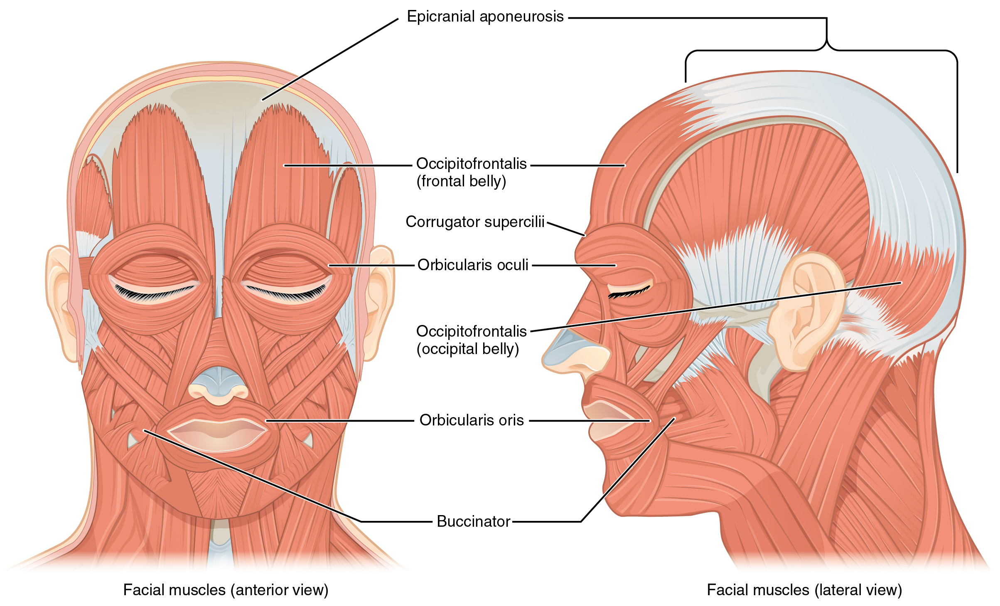
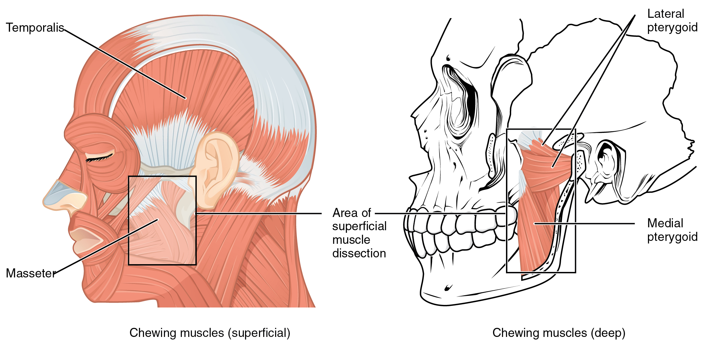
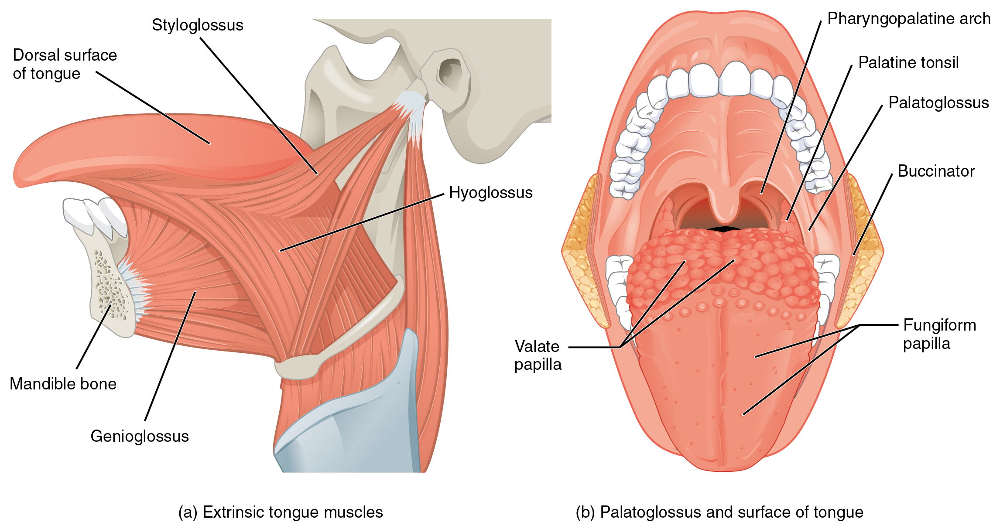
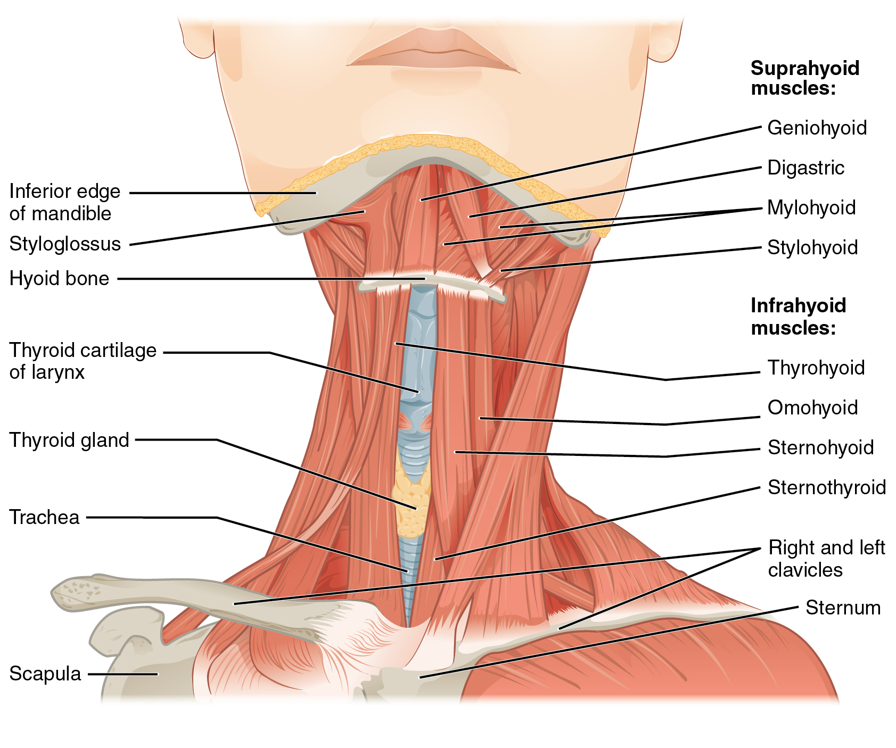
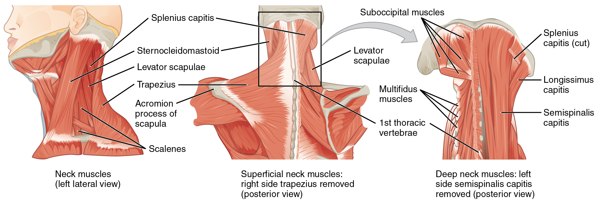

By the end of this section, you will be able to:
* Identify the axial muscles of the face, head, and neck
* Identify the movement and function of the face, head, and neck muscles

The skeletal muscles are divided into **axial**{: data-type="term"} (muscles of the trunk and head) and **appendicular**{: data-type="term"} (muscles of the arms and legs) categories. This system reflects the bones of the skeleton system, which are also arranged in this manner. The axial muscles are grouped based on location, function, or both. Some of the axial muscles may seem to blur the boundaries because they cross over to the appendicular skeleton. The first grouping of the axial muscles you will review includes the muscles of the head and neck, then you will review the muscles of the vertebral column, and finally you will review the oblique and rectus muscles.

# Muscles That Create Facial Expression

The origins of the muscles of facial expression are on the surface of the skull (remember, the origin of a muscle does not move). The insertions of these muscles have fibers intertwined with connective tissue and the dermis of the skin. Because the muscles insert in the skin rather than on bone, when they contract, the skin moves to create facial expression ([\[link\]](#fig-ch11_03_01)).

 {: #fig-ch11_03_01 data-media-type="image/jpg" data-title="Muscles of Facial Expression "}

The **orbicularis oris**{: data-type="term"} is a circular muscle that moves the lips, and the **orbicularis oculi**{: data-type="term"} is a circular muscle that closes the eye. The **occipitofrontalis**{: data-type="term"} muscle moves up the scalp and eyebrows. The muscle has a frontal belly and an occipital (near the occipital bone on the posterior part of the skull) belly. In other words, there is a muscle on the forehead (**frontalis**{: data-type="term"}) and one on the back of the head (**occipitalis**{: data-type="term"}), but there is no muscle across the top of the head. Instead, the two bellies are connected by a broad tendon called the **epicranial aponeurosis**{: data-type="term"}, or galea aponeurosis (galea = “apple”). The physicians originally studying human anatomy thought the skull looked like an apple.

The majority of the face is composed of the **buccinator**{: data-type="term"} muscle, which compresses the cheek. This muscle allows you to whistle, blow, and suck; and it contributes to the action of chewing. There are several small facial muscles, one of which is the **corrugator supercilii**{: data-type="term"}, which is the prime mover of the eyebrows. Place your finger on your eyebrows at the point of the bridge of the nose. Raise your eyebrows as if you were surprised and lower your eyebrows as if you were frowning. With these movements, you can feel the action of the corrugator supercilli. Additional muscles of facial expression are presented in [\[link\]](#fig-ch11_03_02).

![This table describes the muscles used in facial expressions. To furrow the brow, the skin of the scalp moves in an anterior direction. The prime mover is the occipitofrontalis frontal belly, which originates from the epicraneal aponeurosis and inserts underneath the skin of the forehead. To unfurrow the brow, the skin of the scalp moves in the posterior direction. The prime mover is the occipitofrontalis occipital belly, which originates from the occipital bone and the mastoid process of the temporal bone and inserts into the epicraneal aponeurosis. To lower the eyebrows, as when scowling or frowning, the skin underneath the eyebrows moves in an inferior direction. The prime mover is the corrugator supercilii, which originates from the frontal bone and inserts into the skin underneath the eyebrow. To flare the nostrils, the nasal cartilage is compressed in an inferior and posterior direction. The prime mover is the nasalis, which originates from the maxilla and inserts into the nasal bone. Raising the upper lip involves elevating the upper lip tissue. The prime mover is the levator labii superioris, which originates from the maxilla and inserts underneath the skin at the corners of the mouth and also into the orbicularis oris. Lowering the lower lip involves depressing the lip and also moving it laterally. The prime mover is the depressor angulus oris, which originates from the mandible and inserts underneath the skin of the lower lip. Opening the mouth and sliding the lower jaw left and right involves depressing the lower jaw and also moving it laterally. The prime mover is thecdepressor angulus oris, which originates from the mandible and inserts underneath the skin at the corners of the mouth. Smiling involves elevating the corners of the mouth and also moving them in a lateral direction. The prime mover is the zygomaticus major, which originates from the zygomatic bone and inserts underneath the skin at the corners of the mouth in the dimple area, and also into the orbicularis oris. Shaping of the lips as during speech involves moving the lips in multiple directions. The prime mover is the orbicularis oris which originates from the tissue surrounding the lips and inserts underneath the skin at the corners of the mouth. Lateral movement of the cheeks such as when sucking on a straw or to compress air in the mouth while blowing involves moving the cheeks in a lateral direction. The prime mover is the buccinator, which originates from the maxilla, the mandible, and the sphenoid bone via the pterygomandibular raphae, and inserts into the orbicularis oris. Pursing of the lips by straightening them laterally involves moving the corners of the mouth in a lateral direction. The prime mover is the risorius, which originates from the fascia of the parotid salivary gland and inserts underneath the skin at the corners of the mouth. Protrusion of the lower lip, as when making a pouting expression, involves protracting the lower lip and the skin of the chin. The prime mover is the mentalis, which originates from the mandible and inserts underneath the skin of the chin. Raising the upper lip involves elevating the upper lip. The prime mover is the levator labii superioris, which originates from the maxilla and inserts underneath the skin at the corners of the mouth and also into the orbicularis oris.](../resources/1125_Muscles_in_Facial_Expression.jpg){: #fig-ch11_03_02 data-media-type="image/jpeg" data-title="Muscles in Facial Expression "}

# Muscles That Move the Eyes

The movement of the eyeball is under the control of the **extrinsic eye muscles**{: data-type="term"}, which originate outside the eye and insert onto the outer surface of the white of the eye. These muscles are located inside the eye socket and cannot be seen on any part of the visible eyeball ([\[link\]](#fig-ch11_03_03) and [\[link\]](#tbl-ch11_03)). If you have ever been to a doctor who held up a finger and asked you to follow it up, down, and to both sides, he or she is checking to make sure your eye muscles are acting in a coordinated pattern.

 The extrinsic eye muscles originate outside of the eye on the skull. (b) Each muscle inserts onto the eyeball."){: #fig-ch11_03_03 data-media-type="image/jpg" data-title="Muscles of the Eyes "}

<table id="tbl-ch11_03" summary=""><thead>
<tr>
<th colspan="6">Muscles of the Eyes</th>
</tr>
<tr>
<th>Movement</th>
<th>Target</th>
<th>Target motion direction</th>
<th>Prime mover</th>
<th>Origin</th>
<th>Insertion</th>
</tr>
</thead><tbody>
<tr>
<td>Moves eyes up and toward nose; rotates eyes from 1 o’clock to 3 o’clock</td>
<td>Eyeballs</td>
<td>Superior (elevates); medial (adducts)</td>
<td>Superior rectus</td>
<td>Common tendinous ring (ring attaches to optic foramen)</td>
<td>Superior surface of eyeball</td>
</tr>
<tr>
<td>Moves eyes down and toward nose; rotates eyes from 6 o’clock to 3 o’clock</td>
<td>Eyeballs</td>
<td>Inferior (depresses); medial (adducts)</td> 
<td>Inferior rectus</td>
<td>Common tendinous ring (ring attaches to optic foramen)</td>
<td>Inferior surface of eyeball</td>
</tr>
<tr>
<td>Moves eyes away from nose</td>
<td>Eyeballs</td>
<td>Lateral (abducts)</td>
<td>Lateral rectus</td>
<td>Common tendinous ring (ring attaches to optic foramen)</td>
<td>Lateral surface of eyeball</td>
</tr>
<tr>
<td>Moves eyes toward nose</td>
<td>Eyeballs</td>
<td>Medial (adducts)</td>
<td>Medial rectus</td>
<td>Common tendinous ring (ring attaches to optic foramen)</td>
<td>Medial surface of eyeball</td>
</tr>
<tr>
<td>Moves eyes up and away from nose; rotates eyeball from 12 o’clock to 9 o’clock</td>
<td>Eyeballs</td>
<td>Superior (elevates); lateral (abducts)</td>
<td>Inferior oblique</td>
<td>Floor of orbit (maxilla)</td>
<td>Surface of eyeball between inferior rectus and lateral rectus</td>
</tr>
<tr>
<td>Moves eyes down and away from nose; rotates eyeball from 6 o’clock to 9 o’clock</td>
<td>Eyeballs</td>
<td>Superior (elevates); lateral (abducts)</td>
<td>Superior oblique</td>
<td>Sphenoid bone</td>
<td>Suface of eyeball between superior rectus and lateral rectus</td>
</tr>
<tr>
<td>Opens eyes</td>
<td>Upper eyelid</td>
<td>Superior (elevates)</td>
<td>Levator palpabrae superioris</td>
<td>Roof of orbit (sphenoid bone)</td>
<td>Skin of upper eyelids</td>
</tr>
<tr>
<td>Closes eyelids</td>
<td>Eyelid skin</td>
<td>Compression along superior–inferior axis</td>
<td>Orbicularis oculi</td>
<td>Medial bones composing the orbit</td>
<td>Circumference of orbit</td>
</tr>
</tbody></table>

# Muscles That Move the Lower Jaw

In anatomical terminology, chewing is called **mastication**{: data-type="term"}. Muscles involved in chewing must be able to exert enough pressure to bite through and then chew food before it is swallowed ([\[link\]](#fig-ch11_03_04) and [\[link\]](#tbl-ch11_04)). The **masseter**{: data-type="term"} muscle is the main muscle used for chewing because it elevates the mandible (lower jaw) to close the mouth, and it is assisted by the **temporalis**{: data-type="term"} muscle, which retracts the mandible. You can feel the temporalis move by putting your fingers to your temple as you chew.

{: #fig-ch11_03_04 data-media-type="image/jpg" data-title="Muscles That Move the Lower Jaw "}

<table id="tbl-ch11_04" summary=""><thead>
<tr>
<th colspan="6">Muscles of the Lower Jaw</th>
</tr>
<tr>
<th>Movement</th>
<th>Target</th>
<th>Target motion direction</th>
<th>Prime mover</th>
<th>Origin</th>
<th>Insertion</th>
</tr>
</thead><tbody>
<tr>
<td>Closes mouth; aids chewing</td>
<td>Mandible</td>
<td>Superior (elevates)</td>
<td>Masseter</td>
<td>Maxilla arch; zygomatic arch (for masseter)</td>
<td>Mandible</td>
</tr>
<tr>
<td>Closes mouth; pulls lower jaw in under upper jaw</td>
<td>Mandible</td>
<td>Superior (elevates); posterior (retracts)</td>
<td>Temporalis</td>
<td>Temporal bone</td>
<td>Mandible</td>
</tr>
<tr>
<td>Opens mouth; pushes lower jaw out under upper jaw; moves lower jaw side-to-side</td>
<td>Mandible</td>
<td>Inferior (depresses); posterior (protracts); lateral (abducts); medial (adducts)</td> 
<td>Lateral pterygoid</td>
<td>Pterygoid process of sphenoid bone</td>
<td>Mandible</td>
</tr>
<tr>
<td>Closes mouth; pushes lower jaw out under upper jaw; moves lower jaw side-to-side</td>
<td>Mandible</td>
<td>Superior (elevates); posterior (protracts); lateral (abducts); medial (adducts)</td> 
<td>Medial pterygoid</td>
<td>Sphenoid bone; maxilla</td>
<td>Mandible; temporo-mandibular joint</td>
</tr>
</tbody></table>

Although the masseter and temporalis are responsible for elevating and closing the jaw to break food into digestible pieces, the **medial pterygoid**{: data-type="term"} and **lateral pterygoid**{: data-type="term"} muscles provide assistance in chewing and moving food within the mouth.

# Muscles That Move the Tongue

Although the tongue is obviously important for tasting food, it is also necessary for mastication, **deglutition**{: data-type="term"} (swallowing), and speech ([\[link\]](#eip-id2442164) and [\[link\]](#fig-ch11_03_05)). Because it is so moveable, the tongue facilitates complex speech patterns and sounds.

{: #eip-id2442164 data-media-type="image/jpeg" data-title="Muscles that Move the Tongue "}

![This table describes the muscles used in tongue movement, swallowing, and speech. The genioglossus moves the tongue down and sticks the tongue out of the mouth. It originates in the mandible. The styloglossus moves the tongue up and retracts the tongue back into the mouth. It originates in the temporal bone. The hyoglossus flattens the tongue. It originates in the hyoid bone. The palatoglossus bulges the tongue. It originates in the soft palate. The digastric raises the hyoid bone in a way that also raises the larynx, allowing the epiglottis to cover the glottis during deglutition; it also assists in opening the mouth by depressing the mandible. It originates in the mandible and temporal bone. The stylohyoid raises and retracts the hyoid bone in a way that elongates the oral cavity during deglutition. It originates in the temporal bone. The mylohyoid raises the hyoid bone in a way that presses the tongue against the roof of the mouth, pushing food back into the pharynx during deglutition. It originates in the mandible. The geniohyoid raises and moves the hyoid bone forward, widening the pharynx during deglutition. It originates in the mandible. The ornohyoid retracts the hyoid bone and moves it down during later phases of deglutition. It originates in the scapula. The sternohyoid depresses the hyoid bone during swallowing and speaking. It originates in the clavicle. The thyrohyoid shrinks the distance between thyroid cartilage and the hyoid bone, allowing production of high-pitch vocalizations. It originates in the hyroid cartilage. The sternothyroid depresses the larynx, thyroid cartilage, and hyoid bone to create different vocal tones. It originates in the sternum. The sternocleidomastoid and semispinalis capitis rotate and tilt the head to the side and forward. They originate in the sternum and clavicle. The splenius capitis and longissimus capitis rotate and tilt the head to the side and backwards.](../resources/1127_Muscles_for_Tongue_Movement_Swallowing_and_Speech.jpg){: #fig-ch11_03_05 data-media-type="image/jpeg" data-title="Muscles for Tongue Movement, Swallowing, and Speech "}

Tongue muscles can be extrinsic or intrinsic. Extrinsic tongue muscles insert into the tongue from outside origins, and the intrinsic tongue muscles insert into the tongue from origins within it. The extrinsic muscles move the whole tongue in different directions, whereas the intrinsic muscles allow the tongue to change its shape (such as, curling the tongue in a loop or flattening it).

The extrinsic muscles all include the word root glossus (glossus = “tongue”), and the muscle names are derived from where the muscle originates. The **genioglossus**{: data-type="term"} (genio = “chin”) originates on the mandible and allows the tongue to move downward and forward. The **styloglossus**{: data-type="term"} originates on the styloid bone, and allows upward and backward motion. The **palatoglossus**{: data-type="term"} originates on the soft palate to elevate the back of the tongue, and the **hyoglossus**{: data-type="term"} originates on the hyoid bone to move the tongue downward and flatten it.

Everyday Connections

Anesthesia and the Tongue Muscles Before surgery, a patient must be made ready for general anesthesia. The normal homeostatic controls of the body are put “on hold” so that the patient can be prepped for surgery. Control of respiration must be switched from the patient’s homeostatic control to the control of the anesthesiologist. The drugs used for anesthesia relax a majority of the body’s muscles.

Among the muscles affected during general anesthesia are those that are necessary for breathing and moving the tongue. Under anesthesia, the tongue can relax and partially or fully block the airway, and the muscles of respiration may not move the diaphragm or chest wall. To avoid possible complications, the safest procedure to use on a patient is called endotracheal intubation. Placing a tube into the trachea allows the doctors to maintain a patient’s (open) airway to the lungs and seal the airway off from the oropharynx. Post-surgery, the anesthesiologist gradually changes the mixture of the gases that keep the patient unconscious, and when the muscles of respiration begin to function, the tube is removed. It still takes about 30 minutes for a patient to wake up, and for breathing muscles to regain control of respiration. After surgery, most people have a sore or scratchy throat for a few days.

# Muscles of the Anterior Neck

The muscles of the anterior neck assist in deglutition (swallowing) and speech by controlling the positions of the larynx (voice box), and the hyoid bone, a horseshoe-shaped bone that functions as a solid foundation on which the tongue can move. The muscles of the neck are categorized according to their position relative to the hyoid bone ([\[link\]](#fig-ch11_03_06)). **Suprahyoid muscles**{: data-type="term"} are superior to it, and the **infrahyoid muscles**{: data-type="term"} are located inferiorly.

{: #fig-ch11_03_06 data-media-type="image/jpeg" data-title="Muscles of the Anterior Neck "}

The suprahyoid muscles raise the hyoid bone, the floor of the mouth, and the larynx during deglutition. These include the **digastric**{: data-type="term"} muscle, which has anterior and posterior bellies that work to elevate the hyoid bone and larynx when one swallows; it also depresses the mandible. The **stylohyoid**{: data-type="term"} muscle moves the hyoid bone posteriorly, elevating the larynx, and the **mylohyoid**{: data-type="term"} muscle lifts it and helps press the tongue to the top of the mouth. The **geniohyoid**{: data-type="term"} depresses the mandible in addition to raising and pulling the hyoid bone anteriorly.

The strap-like infrahyoid muscles generally depress the hyoid bone and control the position of the larynx. The **omohyoid**{: data-type="term"} muscle, which has superior and inferior bellies, depresses the hyoid bone in conjunction with the **sternohyoid**{: data-type="term"} and **thyrohyoid**{: data-type="term"} muscles. The thyrohyoid muscle also elevates the larynx’s thyroid cartilage, whereas the **sternothyroid**{: data-type="term"} depresses it to create different tones of voice.

# Muscles That Move the Head

The head, attached to the top of the vertebral column, is balanced, moved, and rotated by the neck muscles ([\[link\]](#tbl-ch11_05)). When these muscles act unilaterally, the head rotates. When they contract bilaterally, the head flexes or extends. The major muscle that laterally flexes and rotates the head is the **sternocleidomastoid**{: data-type="term"}. In addition, both muscles working together are the flexors of the head. Place your fingers on both sides of the neck and turn your head to the left and to the right. You will feel the movement originate there. This muscle divides the neck into anterior and posterior triangles when viewed from the side ([\[link\]](#fig-ch11_03_07)).

{: #fig-ch11_03_07 data-media-type="image/jpg" data-title="Posterior and Lateral Views of the Neck "}

<table id="tbl-ch11_05" summary=""><thead>
<tr>
<th colspan="6">Muscles That Move the Head</th>
</tr>
<tr>
<th>Movement</th>
<th>Target</th>
<th>Target motion direction</th>
<th>Prime mover</th>
<th>Origin</th>
<th>Insertion</th>
</tr>
</thead><tbody>
<tr>
<td>Rotates and tilts head to the side; tilts head forward</td>
<td>Skull; vertebrae</td>
<td>Individually: rotates head to opposite side; bilaterally: flexion</td>
<td>Sternocleidomastoid</td>
<td>Sternum; clavicle</td>
<td>Temporal bone (mastoid process); occipital bone</td>
</tr>
<tr>
<td>Rotates and tilts head backward</td>
<td>Skull; vertebrae</td>
<td>Individually: laterally flexes and rotates head to same side; bilaterally: extension</td>
<td>Semispinalis capitis</td>
<td>Transverse and articular processes of cervical and thoracic vertebra</td>
<td>Occipital bone</td>
</tr>
<tr>
<td>Rotates and tilts head to the side; tilts head backward</td>
<td>Skull; vertebrae</td>
<td>Individually: laterally flexes and rotates head to same side; bilaterally: extension</td>
<td>Splenius capitis</td>
<td>Spinous processes of cervical and thoracic vertebra</td>
<td>Temporal bone (mastoid process); occipital bone</td>
</tr>
<tr>
<td>Rotates and tilts head to the side; tilts head backward</td>
<td>Skull; vertebrae</td>
<td>Individually: laterally flexes and rotates head to same side; bilaterally: extension</td>
<td>Longissimus capitis</td>
<td>Transverse and articular processes of cervical and thoracic vertebra</td>
<td>Temporal bone (mastoid process)</td>
</tr>
</tbody></table>

# Muscles of the Posterior Neck and the Back

The posterior muscles of the neck are primarily concerned with head movements, like extension. The back muscles stabilize and move the vertebral column, and are grouped according to the lengths and direction of the fascicles.

The **splenius**{: data-type="term"} muscles originate at the midline and run laterally and superiorly to their insertions. From the sides and the back of the neck, the **splenius capitis**{: data-type="term"} inserts onto the head region, and the **splenius cervicis**{: data-type="term"} extends onto the cervical region. These muscles can extend the head, laterally flex it, and rotate it ([\[link\]](#fig-ch11_03_08)).

{: #fig-ch11_03_08 data-media-type="image/jpg" data-title="Muscles of the Neck and Back "}

The **erector spinae group**{: data-type="term"} forms the majority of the muscle mass of the back and it is the primary extensor of the vertebral column. It controls flexion, lateral flexion, and rotation of the vertebral column, and maintains the lumbar curve. The erector spinae comprises the iliocostalis (laterally placed) group, the longissimus (intermediately placed) group, and the spinalis (medially placed) group.

The **iliocostalis group**{: data-type="term"} includes the **iliocostalis cervicis**{: data-type="term"}, associated with the cervical region; the **iliocostalis thoracis**{: data-type="term"}, associated with the thoracic region; and the **iliocostalis lumborum**{: data-type="term"}, associated with the lumbar region. The three muscles of the **longissimus group**{: data-type="term"} are the **longissimus capitis**{: data-type="term"}, associated with the head region; the **longissimus cervicis**{: data-type="term"}, associated with the cervical region; and the **longissimus thoracis**{: data-type="term"}, associated with the thoracic region. The third group, the **spinalis group**{: data-type="term"}, comprises the **spinalis capitis**{: data-type="term"} (head region), the **spinalis cervicis**{: data-type="term"} (cervical region), and the **spinalis thoracis**{: data-type="term"} (thoracic region).

The **transversospinales**{: data-type="term"} muscles run from the transverse processes to the spinous processes of the vertebrae. Similar to the erector spinae muscles, the semispinalis muscles in this group are named for the areas of the body with which they are associated. The semispinalis muscles include the **semispinalis capitis**{: data-type="term"}, the **semispinalis cervicis**{: data-type="term"}, and the **semispinalis thoracis**{: data-type="term"}. The **multifidus**{: data-type="term"} muscle of the lumbar region helps extend and laterally flex the vertebral column.

Important in the stabilization of the vertebral column is the **segmental muscle group**{: data-type="term"}, which includes the interspinales and intertransversarii muscles. These muscles bring together the spinous and transverse processes of each consecutive vertebra. Finally, the **scalene muscles**{: data-type="term"} work together to flex, laterally flex, and rotate the head. They also contribute to deep inhalation. The scalene muscles include the **anterior scalene**{: data-type="term"} muscle (anterior to the middle scalene), the **middle scalene**{: data-type="term"} muscle (the longest, intermediate between the anterior and posterior scalenes), and the **posterior scalene**{: data-type="term"} muscle (the smallest, posterior to the middle scalene).

# Chapter Review

Muscles are either axial muscles or appendicular. The axial muscles are grouped based on location, function, or both. Some axial muscles cross over to the appendicular skeleton. The muscles of the head and neck are all axial. The muscles in the face create facial expression by inserting into the skin rather than onto bone. Muscles that move the eyeballs are extrinsic, meaning they originate outside of the eye and insert onto it. Tongue muscles are both extrinsic and intrinsic. The genioglossus depresses the tongue and moves it anteriorly; the styloglossus lifts the tongue and retracts it; the palatoglossus elevates the back of the tongue; and the hyoglossus depresses and flattens it. The muscles of the anterior neck facilitate swallowing and speech, stabilize the hyoid bone and position the larynx. The muscles of the neck stabilize and move the head. The sternocleidomastoid divides the neck into anterior and posterior triangles.

The muscles of the back and neck that move the vertebral column are complex, overlapping, and can be divided into five groups. The splenius group includes the splenius capitis and the splenius cervicis. The erector spinae has three subgroups. The iliocostalis group includes the iliocostalis cervicis, the iliocostalis thoracis, and the iliocostalis lumborum. The longissimus group includes the longissimus capitis, the longissimus cervicis, and the longissimus thoracis. The spinalis group includes the spinalis capitis, the spinalis cervicis, and the spinalis thoracis. The transversospinales include the semispinalis capitis, semispinalis cervicis, semispinalis thoracis, multifidus, and rotatores. The segmental muscles include the interspinales and intertransversarii. Finally, the scalenes include the anterior scalene, middle scalene, and posterior scalene.

# Review Questions

Which of the following is a prime mover in head flexion?

1.  occipitofrontalis
2.  corrugator supercilii
3.  sternocleidomastoid
4.  masseter
{: data-number-style="lower-alpha"}

C

Where is the inferior oblique muscle located?

1.  in the abdomen
2.  in the eye socket
3.  in the anterior neck
4.  in the face
{: data-number-style="lower-alpha"}

B

What is the action of the masseter?

1.  swallowing
2.  chewing
3.  moving the lips
4.  closing the eye
{: data-number-style="lower-alpha"}

B

The names of the extrinsic tongue muscles commonly end in \_\_\_\_\_\_\_\_.

1.  -glottis
2.  -glossus
3.  -gluteus
4.  -hyoid
{: data-number-style="lower-alpha"}

B

What is the function of the erector spinae?

1.  movement of the arms
2.  stabilization of the pelvic girdle
3.  postural support
4.  rotating of the vertebral column
{: data-number-style="lower-alpha"}

C

# Critical Thinking Questions

Explain the difference between axial and appendicular muscles.

Axial muscles originate on the axial skeleton (the bones in the head, neck, and core of the body), whereas appendicular muscles originate on the bones that make up the body’s limbs.

Describe the muscles of the anterior neck.

The muscles of the anterior neck are arranged to facilitate swallowing and speech. They work on the hyoid bone, with the suprahyoid muscles pulling up and the infrahyoid muscles pulling down.

Why are the muscles of the face different from typical skeletal muscle?

Most skeletal muscles create movement by actions on the skeleton. Facial muscles are different in that they create facial movements and expressions by pulling on the skin—no bone movements are involved.

