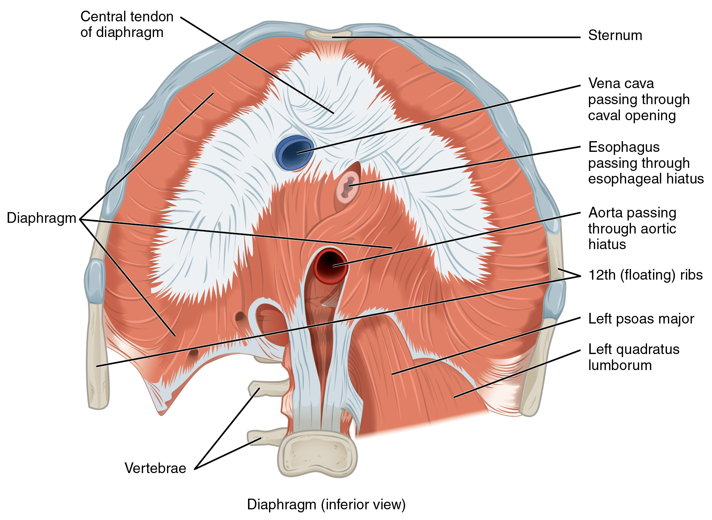
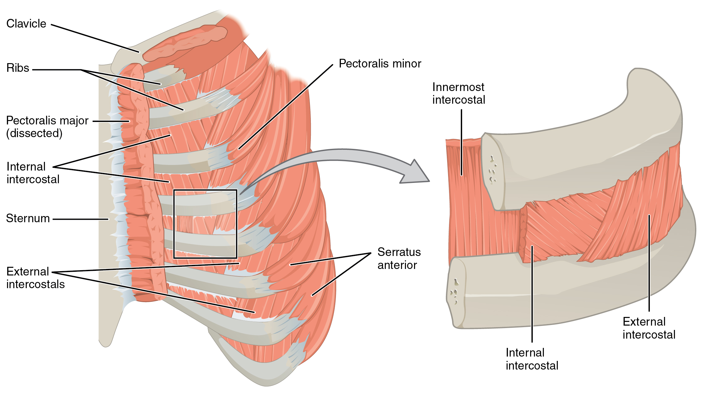
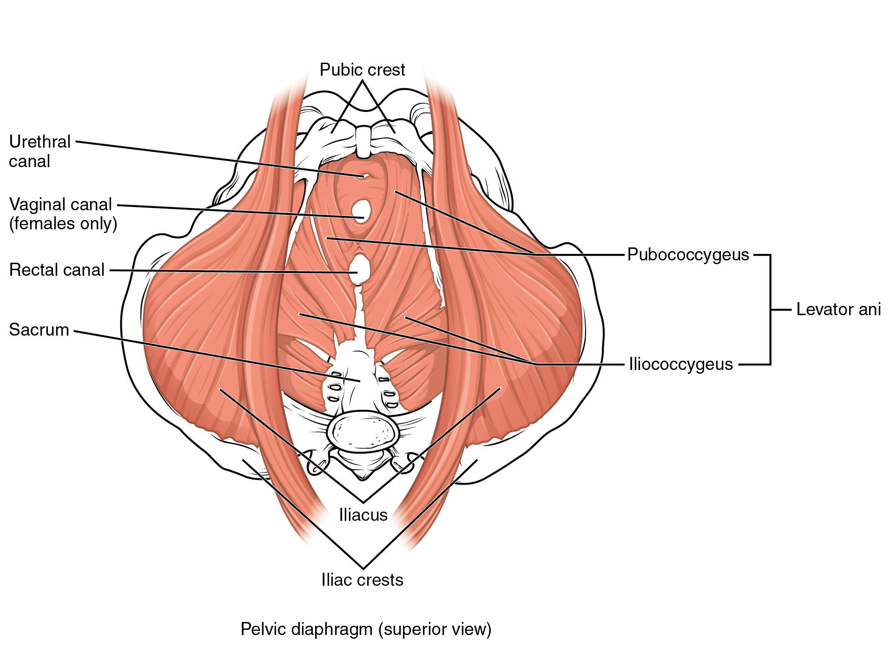
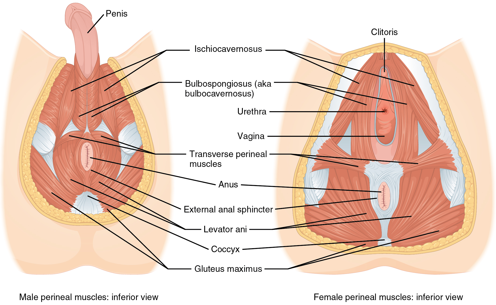

By the end of this section, you will be able to:
* Identify the intrinsic skeletal muscles of the back and neck, and the skeletal muscles of the abdominal wall and thorax
* Identify the movement and function of the intrinsic skeletal muscles of the back and neck, and the skeletal muscles of the abdominal wall and thorax

It is a complex job to balance the body on two feet and walk upright. The muscles of the vertebral column, thorax, and abdominal wall extend, flex, and stabilize different parts of the body’s trunk. The deep muscles of the core of the body help maintain posture as well as carry out other functions. The brain sends out electrical impulses to these various muscle groups to control posture by alternate contraction and relaxation. This is necessary so that no single muscle group becomes fatigued too quickly. If any one group fails to function, body posture will be compromised.

# Muscles of the Abdomen

There are four pairs of abdominal muscles that cover the anterior and lateral abdominal region and meet at the anterior midline. These muscles of the anterolateral abdominal wall can be divided into four groups: the external obliques, the internal obliques, the transversus abdominis, and the rectus abdominis ([\[link\]](#fig-ch11_04_01) and [\[link\]](#tbl-ch11_06)).

 The anterior abdominal muscles include the medially located rectus femoris, which is covered by a sheet of connective tissue called the linea alba. On the flanks of the body, medial to the rectus femoris, the abdominal wall is composed of three layers. The external oblique muscles form the outermost layer, while the internal oblique muscles form the middle layer, and the transverses abdominus forms the innermost layer. (b) The muscles of the lower back move the lumbar spine but also assist in femur movements."){: #fig-ch11_04_01 data-media-type="image/jpg" data-title="Muscles of the Abdomen "}

<table id="tbl-ch11_06" summary=""><thead>
<tr>
<th colspan="6">Muscles of the Abdomen</th>
</tr>
<tr>
<th>Movement</th>
<th>Target</th>
<th>Target motion direction</th>
<th>Prime mover</th>
<th>Origin</th>
<th>Insertion</th>
</tr>
</thead><tbody>
<tr>
<td>Twisting at waist; also bending to the side</td>
<td>Vertebral column</td>
<td>Supination; lateral flexion</td>
<td>External obliques; internal obliques</td>
<td>Ribs 5–12; ilium</td>
<td>Ribs 7–10; linea alba; ilium</td>
</tr>
<tr>
<td>Squeezing abdomen during forceful exhalations, defecation, urination, and childbirth</td> 
<td>Abdominal cavity</td>
<td>Compression</td>
<td>Transversus abdominus</td>
<td>Ilium; ribs 5–10</td>
<td>Sternum; linea alba; pubis</td>
</tr>
<tr>
<td>Sitting up</td>
<td>Vertebral column</td>
<td>Flexion</td>
<td>Rectus abdominis</td>
<td>Pubis</td>
<td>Sternum; ribs 5 and 7</td>
</tr>
<tr>
<td>Bending to the side</td>
<td>Vertebral column</td>
<td>Lateral flexion</td>
<td>Quadratus lumborum</td>
<td>Ilium; ribs 5–10</td>
<td>Rib 12; vertebrae L1–L4</td>
</tr>
</tbody></table>

There are three flat skeletal muscles in the antero-lateral wall of the abdomen. The **external oblique**{: data-type="term"}, closest to the surface, extend inferiorly and medially, in the direction of sliding one’s four fingers into pants pockets. Perpendicular to it is the intermediate **internal oblique**{: data-type="term"}, extending superiorly and medially, the direction the thumbs usually go when the other fingers are in the pants pocket. The deep muscle, the **transversus abdominis**{: data-type="term"}, is arranged transversely around the abdomen, similar to the front of a belt on a pair of pants. This arrangement of three bands of muscles in different orientations allows various movements and rotations of the trunk. The three layers of muscle also help to protect the internal abdominal organs in an area where there is no bone.

The **linea alba**{: data-type="term"} is a white, fibrous band that is made of the bilateral **rectus sheaths**{: data-type="term"} that join at the anterior midline of the body. These enclose the **rectus abdominis**{: data-type="term"} muscles (a pair of long, linear muscles, commonly called the “sit-up” muscles) that originate at the pubic crest and symphysis, and extend the length of the body’s trunk. Each muscle is segmented by three transverse bands of collagen fibers called the **tendinous intersections**{: data-type="term"}. This results in the look of “six-pack abs,” as each segment hypertrophies on individuals at the gym who do many sit-ups.

The posterior abdominal wall is formed by the lumbar vertebrae, parts of the ilia of the hip bones, psoas major and iliacus muscles, and **quadratus lumborum**{: data-type="term"} muscle. This part of the core plays a key role in stabilizing the rest of the body and maintaining posture.

Career Connections

Physical Therapists Those who have a muscle or joint injury will most likely be sent to a physical therapist (PT) after seeing their regular doctor. PTs have a master’s degree or doctorate, and are highly trained experts in the mechanics of body movements. Many PTs also specialize in sports injuries.

If you injured your shoulder while you were kayaking, the first thing a physical therapist would do during your first visit is to assess the functionality of the joint. The range of motion of a particular joint refers to the normal movements the joint performs. The PT will ask you to abduct and adduct, circumduct, and flex and extend the arm. The PT will note the shoulder’s degree of function, and based on the assessment of the injury, will create an appropriate physical therapy plan.

The first step in physical therapy will probably be applying a heat pack to the injured site, which acts much like a warm-up to draw blood to the area, to enhance healing. You will be instructed to do a series of exercises to continue the therapy at home, followed by icing, to decrease inflammation and swelling, which will continue for several weeks. When physical therapy is complete, the PT will do an exit exam and send a detailed report on the improved range of motion and return of normal limb function to your doctor. Gradually, as the injury heals, the shoulder will begin to function correctly. A PT works closely with patients to help them get back to their normal level of physical activity.

# Muscles of the Thorax

The muscles of the chest serve to facilitate breathing by changing the size of the thoracic cavity ([\[link\]](#tbl-ch11_07)). When you inhale, your chest rises because the cavity expands. Alternately, when you exhale, your chest falls because the thoracic cavity decreases in size.

<table id="tbl-ch11_07" summary=""><thead>
<tr>
<th colspan="6">Muscles of the Thorax</th>
</tr>
<tr>
<th>Movement</th>
<th>Target</th>
<th>Target motion direction</th>
<th>Prime mover</th>
<th>Origin</th>
<th>Insertion</th>
</tr>
</thead><tbody>
<tr>
<td>Inhalation; exhalation</td>
<td>Thoracic cavity</td>
<td>Compression; expansion</td>
<td>Diaphragm</td>
<td>Sternum; ribs 6–12; lumbar vertebrae</td>
<td>Central tendon</td>
</tr>
<tr>
<td>Inhalation;exhalation</td>
<td>Ribs</td>
<td>Elevation (expands thoracic cavity)</td>
<td>External intercostals</td>
<td>Rib superior to each intercostal muscle</td>
<td>Rib inferior to each intercostal muscle</td>
</tr>
<tr>
<td>Forced exhalation</td>
<td>Ribs</td>
<td>Movement along superior/inferior axis to bring ribs closer together</td>
<td>Internal intercostals</td>
<td>Rib inferior to each intercostal muscle</td>
<td>Rib superior to each intercostal muscle</td>
</tr>
</tbody></table>

## The Diaphragm

The change in volume of the thoracic cavity during breathing is due to the alternate contraction and relaxation of the **diaphragm**{: data-type="term"} ([\[link\]](#fig-ch11_04_02)). It separates the thoracic and abdominal cavities, and is dome-shaped at rest. The superior surface of the diaphragm is convex, creating the elevated floor of the thoracic cavity. The inferior surface is concave, creating the curved roof of the abdominal cavity.

 {: #fig-ch11_04_02 data-media-type="image/jpg" data-title="Muscles of the Diaphragm "}

Defecating, urination, and even childbirth involve cooperation between the diaphragm and abdominal muscles (this cooperation is referred to as the “Valsalva maneuver”). You hold your breath by a steady contraction of the diaphragm; this stabilizes the volume and pressure of the peritoneal cavity. When the abdominal muscles contract, the pressure cannot push the diaphragm up, so it increases pressure on the intestinal tract (defecation), urinary tract (urination), or reproductive tract (childbirth).

The inferior surface of the pericardial sac and the inferior surfaces of the pleural membranes (parietal pleura) fuse onto the central tendon of the diaphragm. To the sides of the tendon are the skeletal muscle portions of the diaphragm, which insert into the tendon while having a number of origins including the xiphoid process of the sternum anteriorly, the inferior six ribs and their cartilages laterally, and the lumbar vertebrae and 12th ribs posteriorly.

The diaphragm also includes three openings for the passage of structures between the thorax and the abdomen. The inferior vena cava passes through the **caval opening**{: data-type="term"}, and the esophagus and attached nerves pass through the esophageal hiatus. The aorta, thoracic duct, and azygous vein pass through the aortic hiatus of the posterior diaphragm.

## The Intercostal Muscles

There are three sets of muscles, called **intercostal muscles**{: data-type="term"}, which span each of the intercostal spaces. The principal role of the intercostal muscles is to assist in breathing by changing the dimensions of the rib cage ([\[link\]](#fig-ch11_04_03)).

 {: #fig-ch11_04_03 data-media-type="image/jpg" data-title="Intercostal Muscles "}

The 11 pairs of superficial **external intercostal**{: data-type="term"} muscles aid in inspiration of air during breathing because when they contract, they raise the rib cage, which expands it. The 11 pairs of **internal intercostal**{: data-type="term"} muscles, just under the externals, are used for expiration because they draw the ribs together to constrict the rib cage. The **innermost intercostal**{: data-type="term"} muscles are the deepest, and they act as synergists for the action of the internal intercostals.

# Muscles of the Pelvic Floor and Perineum

The pelvic floor is a muscular sheet that defines the inferior portion of the pelvic cavity. The **pelvic diaphragm**{: data-type="term"}, spanning anteriorly to posteriorly from the pubis to the coccyx, comprises the levator ani and the ischiococcygeus. Its openings include the anal canal and urethra, and the vagina in women.

The large **levator ani**{: data-type="term"} consists of two skeletal muscles, the **pubococcygeus**{: data-type="term"} and the **iliococcygeus**{: data-type="term"} ([\[link\]](#fig-ch11_04_04)). The levator ani is considered the most important muscle of the pelvic floor because it supports the pelvic viscera. It resists the pressure produced by contraction of the abdominal muscles so that the pressure is applied to the colon to aid in defecation and to the uterus to aid in childbirth (assisted by the **ischiococcygeus**{: data-type="term"}, which pulls the coccyx anteriorly). This muscle also creates skeletal muscle sphincters at the urethra and anus.

{: #fig-ch11_04_04 data-media-type="image/jpg" data-title="Muscles of the Pelvic Floor "}

The **perineum**{: data-type="term"} is the diamond-shaped space between the pubic symphysis (anteriorly), the coccyx (posteriorly), and the ischial tuberosities (laterally), lying just inferior to the pelvic diaphragm (levator ani and coccygeus). Divided transversely into triangles, the anterior is the **urogenital triangle**{: data-type="term"}, which includes the external genitals. The posterior is the **anal triangle**{: data-type="term"}, which contains the anus ([\[link\]](#fig-ch11_04_05)). The perineum is also divided into superficial and deep layers with some of the muscles common to men and women ([\[link\]](#fig-ch11_04_06)). Women also have the **compressor urethrae**{: data-type="term"} and the **sphincter urethrovaginalis**{: data-type="term"}, which function to close the vagina. In men, there is the **deep transverse perineal**{: data-type="term"} muscle that plays a role in ejaculation.

{: #fig-ch11_04_05 data-media-type="image/jpg" data-title="Muscles of the Perineum "}

![This table describes the muscles of the perineum that are common to men and women. The levator ani pubococcygeus and levator ani iliococcygeus control movements during defaction, urination, coughing, and giving birth. They originate in the pubis and ischium. The superficial transverse perineal supports the perineal body maintaining the anus at the center of the perineum. It originates in the ischium. The bulbospongiosus is a superficial muscle that causes an involuntary response that compresses the urethra when excreting urine in both sexes or while ejaculating in males; it also aids in erection of the penis in males. It originates in the perineal body. The ischiocavernosus is a superficial muscle that compresses veins to maintain erection of the penis in males and erection of the clitoris in females. It originates in the ischium, ischial rami, and pubic rami. The external uretral sphincter is a deep muscle that voluntarily compresses the urethra during urination. It originates in the ischial rami and pubic rami. The external anal sphincter is a deep muscle that closes the anus. It originates in the anoccoccygeal ligament.](../resources/1128_Muscles_of_the_Perineum_Common_to_Men_and_Women.jpg){: #fig-ch11_04_06 data-media-type="image/jpg" data-title="Muscles of the Perineum Common to Men and Women "}

# Chapter Review

Made of skin, fascia, and four pairs of muscle, the anterior abdominal wall protects the organs located in the abdomen and moves the vertebral column. These muscles include the rectus abdominis, which extends through the entire length of the trunk, the external oblique, the internal oblique, and the transversus abdominus. The quadratus lumborum forms the posterior abdominal wall.

The muscles of the thorax play a large role in breathing, especially the dome-shaped diaphragm. When it contracts and flattens, the volume inside the pleural cavities increases, which decreases the pressure within them. As a result, air will flow into the lungs. The external and internal intercostal muscles span the space between the ribs and help change the shape of the rib cage and the volume-pressure ratio inside the pleural cavities during inspiration and expiration.

The perineum muscles play roles in urination in both sexes, ejaculation in men, and vaginal contraction in women. The pelvic floor muscles support the pelvic organs, resist intra-abdominal pressure, and work as sphincters for the urethra, rectum, and vagina.

# Review Questions

Which of the following abdominal muscles is not a part of the anterior abdominal wall?

1.  quadratus lumborum
2.  rectus abdominis
3.  interior oblique
4.  exterior oblique
{: data-number-style="lower-alpha"}

A

Which muscle pair plays a role in respiration?

1.  intertransversarii, interspinales
2.  semispinalis cervicis, semispinalis thoracis
3.  trapezius, rhomboids
4.  diaphragm, scalene
{: data-number-style="lower-alpha"}

D

What is the linea alba?

1.  a small muscle that helps with compression of the abdominal organs
2.  a long tendon that runs down the middle of the rectus abdominis
3.  a long band of collagen fibers that connects the hip to the knee
4.  another name for the tendinous inscription
{: data-number-style="lower-alpha"}

B

# Critical Thinking Questions

Describe the fascicle arrangement in the muscles of the abdominal wall. How do they relate to each other?

Arranged into layers, the muscles of the abdominal wall are the internal and external obliques, which run on diagonals, the rectus abdominis, which runs straight down the midline of the body, and the transversus abdominis, which wraps across the trunk of the body.

What are some similarities and differences between the diaphragm and the pelvic diaphragm?

Both diaphragms are thin sheets of skeletal muscle that horizontally span areas of the trunk. The diaphragm separating the thoracic and abdominal cavities is the primary muscle of breathing. The pelvic diaphragm, consisting of two paired muscles, the coccygeus and the levator ani, forms the pelvic floor at the inferior end of the trunk.

