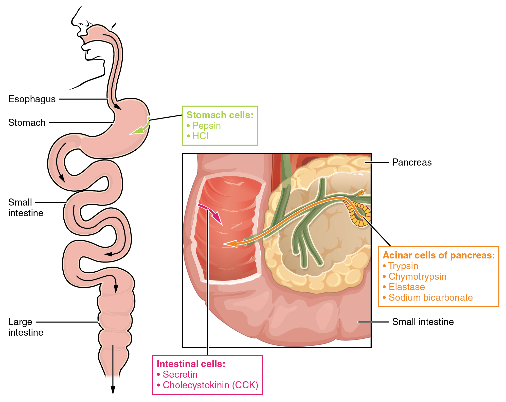
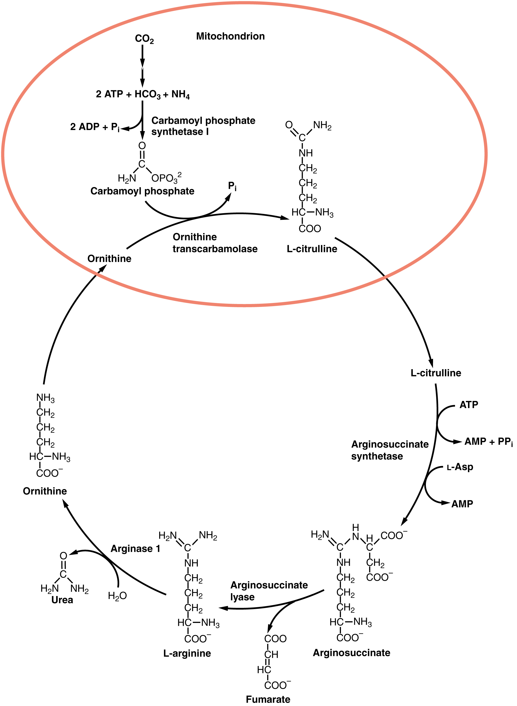
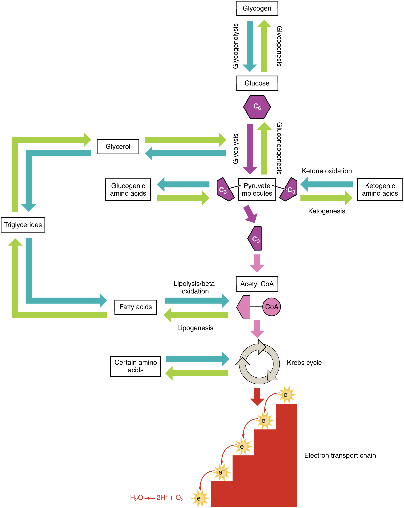

By the end of this section, you will be able to:
* Describe how the body digests proteins
* Explain how the urea cycle prevents toxic concentrations of nitrogen
* Differentiate between glucogenic and ketogenic amino acids
* Explain how protein can be used for energy

Much of the body is made of protein, and these proteins take on a myriad of forms. They represent cell signaling receptors, signaling molecules, structural members, enzymes, intracellular trafficking components, extracellular matrix scaffolds, ion pumps, ion channels, oxygen and CO2 transporters (hemoglobin). That is not even the complete list! There is protein in bones (collagen), muscles, and tendons; the hemoglobin that transports oxygen; and enzymes that catalyze all biochemical reactions. Protein is also used for growth and repair. Amid all these necessary functions, proteins also hold the potential to serve as a metabolic fuel source. Proteins are not stored for later use, so excess proteins must be converted into glucose or triglycerides, and used to supply energy or build energy reserves. Although the body can synthesize proteins from amino acids, food is an important source of those amino acids, especially because humans cannot synthesize all of the 20 amino acids used to build proteins.

The digestion of proteins begins in the stomach. When protein-rich foods enter the stomach, they are greeted by a mixture of the enzyme **pepsin**{: data-type="term"} and hydrochloric acid (HCl; 0.5 percent). The latter produces an environmental pH of 1.5–3.5 that denatures proteins within food. Pepsin cuts proteins into smaller polypeptides and their constituent amino acids. When the food-gastric juice mixture (chyme) enters the small intestine, the pancreas releases **sodium bicarbonate**{: data-type="term"} to neutralize the HCl. This helps to protect the lining of the intestine. The small intestine also releases digestive hormones, including **secretin**{: data-type="term"} and CCK, which stimulate digestive processes to break down the proteins further. Secretin also stimulates the pancreas to release sodium bicarbonate. The pancreas releases most of the digestive enzymes, including the proteases trypsin, chymotrypsin, and **elastase**{: data-type="term"}, which aid protein digestion. Together, all of these enzymes break complex proteins into smaller individual amino acids ([\[link\]](#fig-ch25_04_01)), which are then transported across the intestinal mucosa to be used to create new proteins, or to be converted into fats or acetyl CoA and used in the Krebs cycle.

 {: #fig-ch25_04_01 data-media-type="image/jpg" data-title="Digestive Enzymes and Hormones "}

In order to avoid breaking down the proteins that make up the pancreas and small intestine, pancreatic enzymes are released as **inactive proenzymes**{: data-type="term"} that are only activated in the small intestine. In the pancreas, vesicles store **trypsin**{: data-type="term"} and **chymotrypsin**{: data-type="term"} as **trypsinogen**{: data-type="term"} and **chymotrypsinogen**{: data-type="term"}. Once released into the small intestine, an enzyme found in the wall of the small intestine, called **enterokinase**{: data-type="term"}, binds to trypsinogen and converts it into its active form, trypsin. Trypsin then binds to chymotrypsinogen to convert it into the active chymotrypsin. Trypsin and chymotrypsin break down large proteins into smaller peptides, a process called **proteolysis**{: data-type="term"}. These smaller peptides are catabolized into their constituent amino acids, which are transported across the apical surface of the intestinal mucosa in a process that is mediated by sodium-amino acid transporters. These transporters bind sodium and then bind the amino acid to transport it across the membrane. At the basal surface of the mucosal cells, the sodium and amino acid are released. The sodium can be reused in the transporter, whereas the amino acids are transferred into the bloodstream to be transported to the liver and cells throughout the body for protein synthesis.

Freely available amino acids are used to create proteins. If amino acids exist in excess, the body has no capacity or mechanism for their storage; thus, they are converted into glucose or ketones, or they are decomposed. Amino acid decomposition results in hydrocarbons and nitrogenous waste. However, high concentrations of nitrogen are toxic. The urea cycle processes nitrogen and facilitates its excretion from the body.

# Urea Cycle

The **urea cycle**{: data-type="term"} is a set of biochemical reactions that produces urea from ammonium ions in order to prevent a toxic level of ammonium in the body. It occurs primarily in the liver and, to a lesser extent, in the kidney. Prior to the urea cycle, ammonium ions are produced from the breakdown of amino acids. In these reactions, an amine group, or ammonium ion, from the amino acid is exchanged with a keto group on another molecule. This **transamination**{: data-type="term"} event creates a molecule that is necessary for the Krebs cycle and an ammonium ion that enters into the urea cycle to be eliminated.

In the urea cycle, ammonium is combined with CO2, resulting in urea and water. The urea is eliminated through the kidneys in the urine ([\[link\]](#fig-ch25_04_02)).

 {: #fig-ch25_04_02 data-media-type="image/jpg" data-title="Urea Cycle "}

Amino acids can also be used as a source of energy, especially in times of starvation. Because the processing of amino acids results in the creation of metabolic intermediates, including pyruvate, acetyl CoA, acetoacyl CoA, oxaloacetate, and α-ketoglutarate, amino acids can serve as a source of energy production through the Krebs cycle ([\[link\]](#fig-ch25_04_03)). [\[link\]](#fig-ch25_04_04) summarizes the pathways of catabolism and anabolism for carbohydrates, lipids, and proteins.

  can enter the cycle through more than one pathway."){: #fig-ch25_04_03 data-media-type="image/jpg" data-title="Energy from Amino Acids "}

{: #fig-ch25_04_04 data-media-type="image/jpg" data-title="Catabolic and Anabolic Pathways "}

Disorders of the...

Metabolism: Pyruvate Dehydrogenase Complex Deficiency and Phenylketonuria Pyruvate dehydrogenase complex deficiency (PDCD) and phenylketonuria (PKU) are genetic disorders. Pyruvate dehydrogenase is the enzyme that converts pyruvate into acetyl CoA, the molecule necessary to begin the Krebs cycle to produce ATP. With low levels of the pyruvate dehydrogenase complex (PDC), the rate of cycling through the Krebs cycle is dramatically reduced. This results in a decrease in the total amount of energy that is produced by the cells of the body. PDC deficiency results in a neurodegenerative disease that ranges in severity, depending on the levels of the PDC enzyme. It may cause developmental defects, muscle spasms, and death. Treatments can include diet modification, vitamin supplementation, and gene therapy; however, damage to the central nervous system usually cannot be reversed.

PKU affects about 1 in every 15,000 births in the United States. People afflicted with PKU lack sufficient activity of the enzyme phenylalanine hydroxylase and are therefore unable to break down phenylalanine into tyrosine adequately. Because of this, levels of phenylalanine rise to toxic levels in the body, which results in damage to the central nervous system and brain. Symptoms include delayed neurological development, hyperactivity, mental retardation, seizures, skin rash, tremors, and uncontrolled movements of the arms and legs. Pregnant women with PKU are at a high risk for exposing the fetus to too much phenylalanine, which can cross the placenta and affect fetal development. Babies exposed to excess phenylalanine in utero may present with heart defects, physical and/or mental retardation, and microcephaly. Every infant in the United States and Canada is tested at birth to determine whether PKU is present. The earlier a modified diet is begun, the less severe the symptoms will be. The person must closely follow a strict diet that is low in phenylalanine to avoid symptoms and damage. Phenylalanine is found in high concentrations in artificial sweeteners, including aspartame. Therefore, these sweeteners must be avoided. Some animal products and certain starches are also high in phenylalanine, and intake of these foods should be carefully monitored.

# Chapter Review

Digestion of proteins begins in the stomach, where HCl and pepsin begin the process of breaking down proteins into their constituent amino acids. As the chyme enters the small intestine, it mixes with bicarbonate and digestive enzymes. The bicarbonate neutralizes the acidic HCl, and the digestive enzymes break down the proteins into smaller peptides and amino acids. Digestive hormones secretin and CCK are released from the small intestine to aid in digestive processes, and digestive proenzymes are released from the pancreas (trypsinogen and chymotrypsinogen). Enterokinase, an enzyme located in the wall of the small intestine, activates trypsin, which in turn activates chymotrypsin. These enzymes liberate the individual amino acids that are then transported via sodium-amino acid transporters across the intestinal wall into the cell. The amino acids are then transported into the bloodstream for dispersal to the liver and cells throughout the body to be used to create new proteins. When in excess, the amino acids are processed and stored as glucose or ketones. The nitrogen waste that is liberated in this process is converted to urea in the urea acid cycle and eliminated in the urine. In times of starvation, amino acids can be used as an energy source and processed through the Krebs cycle.

# Review Questions

Digestion of proteins begins in the \_\_\_\_\_\_\_\_ where \_\_\_\_\_\_\_\_ and \_\_\_\_\_\_\_\_ mix with food to break down protein into \_\_\_\_\_\_\_\_.

1.  stomach; amylase; HCl; amino acids
2.  mouth; pepsin; HCl; fatty acids
3.  stomach; lipase; HCl; amino acids
4.  stomach; pepsin; HCl; amino acids
{: data-number-style="lower-alpha"}

D

Amino acids are needed to \_\_\_\_\_\_\_\_.

1.  build new proteins
2.  serve as fat stores
3.  supply energy for the cell
4.  create red blood cells
{: data-number-style="lower-alpha"}

A

If an amino acid is not used to create new proteins, it can be \_\_\_\_\_\_\_\_.

1.  converted to acetyl CoA
2.  converted to glucose or ketones
3.  converted to nitrogen
4.  stored to be used later
{: data-number-style="lower-alpha"}

B

# Critical Thinking Questions

Amino acids are not stored in the body. Describe how excess amino acids are processed in the cell.

Amino acids are not stored in the body. The individual amino acids are broken down into pyruvate, acetyl CoA, or intermediates of the Krebs cycle, and used for energy or for lipogenesis reactions to be stored as fats.

Release of trypsin and chymotrypsin in their active form can result in the digestion of the pancreas or small intestine itself. What mechanism does the body employ to prevent its self-destruction?

Trypsin and chymotrypsin are released as inactive proenzymes. They are only activated in the small intestine, where they act upon ingested proteins in the food. This helps avoid unintended breakdown of the pancreas or small intestine.

