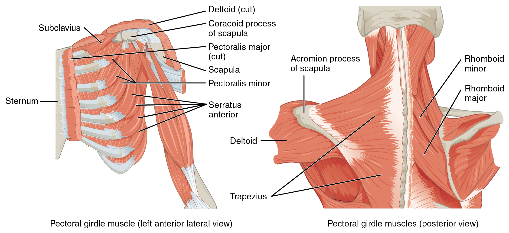
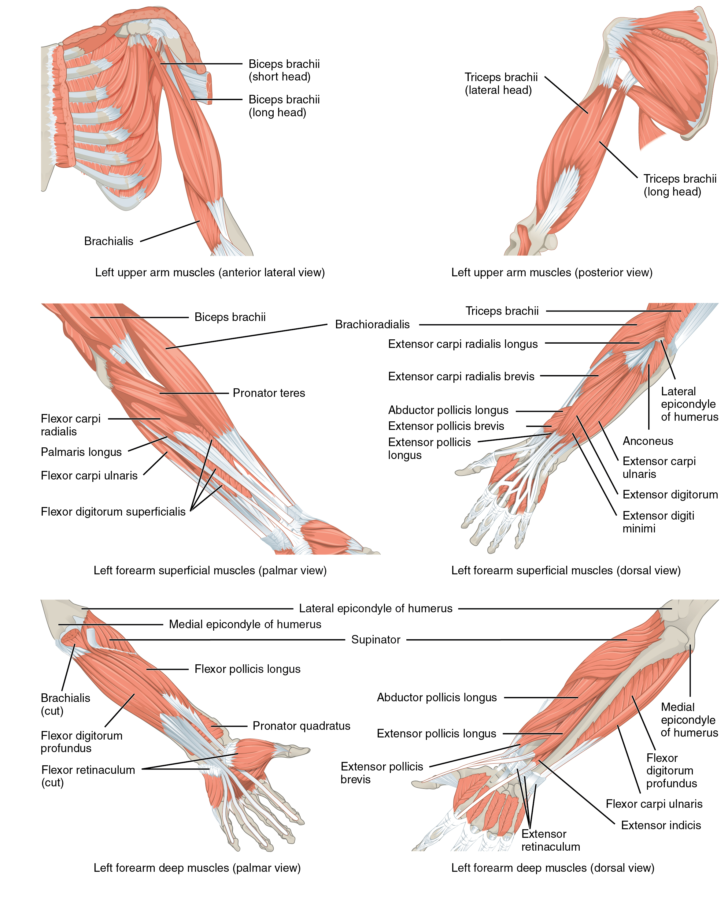
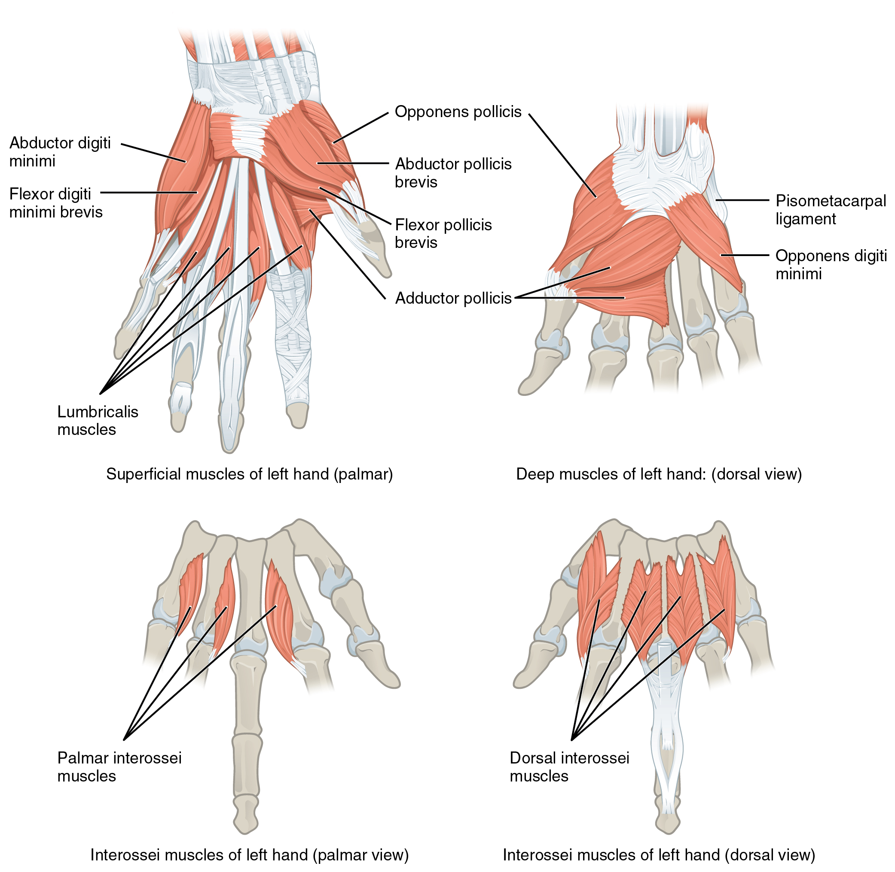

By the end of this section, you will be able to:
* Identify the muscles of the pectoral girdle and upper limbs
* Identify the movement and function of the pectoral girdle and upper limbs

Muscles of the shoulder and upper limb can be divided into four groups: muscles that stabilize and position the pectoral girdle, muscles that move the arm, muscles that move the forearm, and muscles that move the wrists, hands, and fingers. The **pectoral girdle**{: data-type="term"}, or shoulder girdle, consists of the lateral ends of the clavicle and scapula, along with the proximal end of the humerus, and the muscles covering these three bones to stabilize the shoulder joint. The girdle creates a base from which the head of the humerus, in its ball-and-socket joint with the glenoid fossa of the scapula, can move the arm in multiple directions.

### Muscles That Position the Pectoral Girdle

Muscles that position the pectoral girdle are located either on the anterior thorax or on the posterior thorax ([\[link\]](#fig-ch11_05_01) and [\[link\]](#tbl-ch11_08)). The anterior muscles include the **subclavius**{: data-type="term"}, **pectoralis minor**{: data-type="term"}, and **serratus anterior**{: data-type="term"}. The posterior muscles include the **trapezius**{: data-type="term"}, **rhomboid major**{: data-type="term"}, and **rhomboid minor**{: data-type="term"}. When the rhomboids are contracted, your scapula moves medially, which can pull the shoulder and upper limb posteriorly.

{: #fig-ch11_05_01 data-title="Muscles That Position the Pectoral Girdle "}

<table id="tbl-ch11_08" summary=""><thead>
<tr>
<th colspan="7">Muscles that Position the Pectoral Girdle</th>
</tr>
<tr>
<th>Position in the thorax</th>
<th>Movement</th>
<th>Target</th>
<th>Target motion direction</th>
<th>Prime mover</th>
<th>Origin</th>
<th>Insertion</th>
</tr>
</thead><tbody>
<tr>
<td>Anterior thorax</td>
<td>Stabilizes clavicle during movement by depressing it</td>
<td>Clavicle</td>
<td>Depression</td>
<td>Subclavius</td>
<td>First rib</td>
<td>Inferior surface of clavicle</td>
</tr>
<tr>
<td>Anterior thorax</td>
<td>Rotates shoulder anteriorly (throwing motion); assists with inhalation</td>
<td>Scapula; ribs</td>
<td>Scapula: depresses; ribs: elevates</td>
<td>Pectoralis minor</td>
<td>Anterior surfaces of certain ribs (2–4 or 3–5)</td>
<td>Coracoid process of scapula</td>
</tr>
<tr>
<td>Anterior thorax</td>
<td>Moves arm from side of body to front of body; assists with inhalation</td>
<td>Scapula; ribs</td>
<td>Scapula: protracts; ribs: elevates</td>
<td>Serratus anterior</td> 
<td>Muscle slips from certain ribs (1–8 or 1–9)</td>
<td>Anterior surface of vertebral border of scapula</td>
</tr>
<tr>
<td>Posterior thorax</td>
<td>Elevates shoulders (shrugging); pulls shoulder blades together; tilts head backwards</td>
<td>Scapula; cervical spine</td>
<td>Scapula: rotests inferiorly, retracts, elevates, and depresses; spine: extends</td>
<td>Trapezius</td>
<td>Skull; vertebral column</td>
<td>Acromion and spine of scapula; clavicle</td>
</tr>
<tr>
<td>Posterior thorax</td>
<td>Stabilizes scapula during pectoral girdle movement</td>
<td>Scapula</td>
<td>Retracts; rotates inferiorly</td>
<td>Rhomboid major </td>
<td>Thoracic vertebrae (T2–T5)</td>
<td>Medial border of scapula</td>
</tr>
<tr>
<td>Posterior thorax</td>
<td>Stabilizes scapula during pectoral girdle movement</td>
<td>Scapula</td>
<td>Retracts; rotates inferiorly</td>
<td>Rhomboid minor</td>
<td>Cervical and thoracic vertebrae (C7 and T1)</td>
<td>Medial border of scapula</td>
</tr>
</tbody></table>

### Muscles That Move the Humerus

Similar to the muscles that position the pectoral girdle, muscles that cross the shoulder joint and move the humerus bone of the arm include both axial and scapular muscles ([\[link\]](#fig-ch11_05_02) and [\[link\]](#fig-ch11_05_03)). The two axial muscles are the pectoralis major and the latissimus dorsi. The **pectoralis major**{: data-type="term"} is thick and fan-shaped, covering much of the superior portion of the anterior thorax. The broad, triangular **latissimus dorsi**{: data-type="term"} is located on the inferior part of the back, where it inserts into a thick connective tissue shealth called an aponeurosis.

 The muscles that move the humerus anteriorly are generally located on the anterior side of the body and originate from the sternum (e.g., pectoralis major) or the anterior side of the scapula (e.g., subscapularis). (b) The muscles that move the humerus superiorly generally originate from the superior surfaces of the scapula and/or the clavicle (e.g., deltoids). The muscles that move the humerus inferiorly generally originate from middle or lower back (e.g., latissiumus dorsi). (d) The muscles that move the humerus posteriorly are generally located on the posterior side of the body and insert into the scapula (e.g., infraspinatus)."){: #fig-ch11_05_02 data-title="Muscles That Move the Humerus "}

![This table describes the muscles that move the humerus. The pectoralis major is an axial muscle that brings the elbows together and moves the elbows up (as during an uppercut punch). It originates in the clavicle, sternum, cartilage of ribs 1 through 6 or 1 through 7, and the aponeurosis of the external oblique muscle. The latissimus dorsi is an axial muscle that moves the elbow back (as in elbowing someone standing behind you) or spreads the elbows apart. It originates in the thoracic vertebrae (T7 through T12), the lower vertebrae, ribs 9 through 12, and the iliac crest. The deltoid is a scapular muscle that lifts arms at the shoulder. It originates in the trapezius, clavicle, acromion, and spine of scapula. The subscapularis is a scapular muscle that assists the pectoralis major in bringing the elbows together and stabilizes the shoulder joint during movement of the pectoral girdle. It originates in the subscapular fossa of the scapula. The supraspinatus is a scapular muscle that rotates the elbow outwards, as during a tennis swing. It originates in the supraspinous fossa of the scapula. The infraspinatus is a scapular muscle that rotates the elbow outwards, as during a tennis swing. It originates in the infraspinous fossa of the scapula. The teres major is a scapular muscle that assists the infraspinatus in rotating the elbow outwards. It originates in the posterior surface of the scapula. The teres minor is a scapular muscle that assists the infraspinatus in rotating the elbow outwards. It originates in the lateral border of the dorsal scapular surface. The coracobra chialis is a scapular muscle that moves the elbow up and across the body, as when putting a hand on the chest. It originates in the coracoid process of the scapula.](../resources/1129_Muscles_that_Moves_the_Humerus.jpg){: #fig-ch11_05_03 data-title="Muscles That Move the Humerus "}

The rest of the shoulder muscles originate on the scapula. The anatomical and ligamental structure of the shoulder joint and the arrangements of the muscles covering it, allows the arm to carry out different types of movements. The **deltoid**{: data-type="term"}, the thick muscle that creates the rounded lines of the shoulder is the major abductor of the arm, but it also facilitates flexing and medial rotation, as well as extension and lateral rotation. The **subscapularis**{: data-type="term"} originates on the anterior scapula and medially rotates the arm. Named for their locations, the **supraspinatus**{: data-type="term"} (superior to the spine of the scapula) and the **infraspinatus**{: data-type="term"} (inferior to the spine of the scapula) abduct the arm, and laterally rotate the arm, respectively. The thick and flat **teres major**{: data-type="term"} is inferior to the teres minor and extends the arm, and assists in adduction and medial rotation of it. The long **teres minor**{: data-type="term"} laterally rotates and extends the arm. Finally, the **coracobrachialis**{: data-type="term"} flexes and adducts the arm.

The tendons of the deep subscapularis, supraspinatus, infraspinatus, and teres minor connect the scapula to the humerus, forming the **rotator cuff**{: data-type="term"} (musculotendinous cuff), the circle of tendons around the shoulder joint. When baseball pitchers undergo shoulder surgery it is usually on the rotator cuff, which becomes pinched and inflamed, and may tear away from the bone due to the repetitive motion of bring the arm overhead to throw a fast pitch.

### Muscles That Move the Forearm

The forearm, made of the radius and ulna bones, has four main types of action at the hinge of the elbow joint: flexion, extension, pronation, and supination. The forearm flexors include the biceps brachii, brachialis, and brachioradialis. The extensors are the **triceps brachii**{: data-type="term"} and **anconeus**{: data-type="term"}. The pronators are the **pronator teres**{: data-type="term"} and the **pronator quadratus**{: data-type="term"}, and the **supinator**{: data-type="term"} is the only one that turns the forearm anteriorly. When the forearm faces anteriorly, it is supinated. When the forearm faces posteriorly, it is pronated.

The biceps brachii, brachialis, and brachioradialis flex the forearm. The two-headed **biceps brachii**{: data-type="term"} crosses the shoulder and elbow joints to flex the forearm, also taking part in supinating the forearm at the radioulnar joints and flexing the arm at the shoulder joint. Deep to the biceps brachii, the **brachialis**{: data-type="term"} provides additional power in flexing the forearm. Finally, the **brachioradialis**{: data-type="term"} can flex the forearm quickly or help lift a load slowly. These muscles and their associated blood vessels and nerves form the **anterior compartment of the arm**{: data-type="term"} (anterior flexor compartment of the arm) ([\[link\]](#fig-ch11_05_04) and [\[link\]](#fig-ch11_05_05)).

{: #fig-ch11_05_04 data-title="Muscles That Move the Forearm "}

![This table describes the muscles that move the forearm. The biceps brachii are anterior muscles that perform a bicep curl; they also allow the palm of the hand to point toward the body while flexing. They originate in the coracoid process and the tubercle above the glenoid cavity. The brachialis originates in the front of the distal humerus. The brachioradialis is an anterior muscle that assists and stablizes the elbow during bicep-curl motion. It originates in the lateral supracondylar ridge at the distal end of the humerus. The triceps brachii are posterior muscles that extend the forearm, as during a punch. They originate in the infraglenoid tubercle of the scapula, the posterior shaft of the humerus, and the posterior humeral shaft distal to the radial groove. The aconeus is a posterior muscle that assists in extending the forearm; it also allows the forearm to extend away from the body. It originates in the lateral epicondyle of the humerus. The pronator teres is an anterior muscle that turns the hand palm-down. It originates in the medial epicondyle of the humerus and the coronoid process of the ulna. The pronator quadratus is an anterior muscle that assists in turning the hand palm-down. It originates in the distal portion of the anterior ulnar shaft. The supinator is a posterior muscle that turns the hand palm-down. It originates in the lateral epicondyle of the humerus and the proximal ulna.](../resources/1130_Muscles_that_Move_the_Forearm.jpg){: #fig-ch11_05_05 data-title="Muscles That Move the Forearm "}

### Muscles That Move the Wrist, Hand, and Fingers

Wrist, hand, and finger movements are facilitated by two groups of muscles. The forearm is the origin of the **extrinsic muscles of the hand**{: data-type="term"}. The palm is the origin of the intrinsic muscles of the hand.

#### Muscles of the Arm That Move the Wrists, Hands, and Fingers

The muscles in the **anterior compartment of the forearm**{: data-type="term"} (anterior flexor compartment of the forearm) originate on the humerus and insert onto different parts of the hand. These make up the bulk of the forearm. From lateral to medial, the **superficial anterior compartment of the forearm**{: data-type="term"} includes the **flexor carpi radialis**{: data-type="term"}, **palmaris longus**{: data-type="term"}, **flexor carpi ulnaris**{: data-type="term"}, and **flexor digitorum superficialis**{: data-type="term"}. The flexor digitorum superficialis flexes the hand as well as the digits at the knuckles, which allows for rapid finger movements, as in typing or playing a musical instrument (see [\[link\]](#fig-ch11_05_06) and [\[link\]](#tbl-ch11_09)). However, poor ergonomics can irritate the tendons of these muscles as they slide back and forth with the carpal tunnel of the anterior wrist and pinch the median nerve, which also travels through the tunnel, causing Carpal Tunnel Syndrome. The **deep anterior compartment**{: data-type="term"} produces flexion and bends fingers to make a fist. These are the **flexor pollicis longus**{: data-type="term"} and the **flexor digitorum profundus**{: data-type="term"}.

The muscles in the **superficial posterior compartment of the forearm**{: data-type="term"} (superficial posterior extensor compartment of the forearm) originate on the humerus. These are the **extensor radialis longus**{: data-type="term"}, **extensor carpi radialis brevis**{: data-type="term"}, **extensor digitorum**{: data-type="term"}, **extensor digiti minimi**{: data-type="term"}, and the **extensor carpi ulnaris**{: data-type="term"}.

The muscles of the **deep posterior compartment of the forearm**{: data-type="term"} (deep posterior extensor compartment of the forearm) originate on the radius and ulna. These include the **abductor pollicis longus**{: data-type="term"}, **extensor pollicis brevis**{: data-type="term"}, **extensor pollicis longus**{: data-type="term"}, and **extensor indicis**{: data-type="term"} (see [\[link\]](#fig-ch11_05_06)).

![This table describes the muscles that move the wrist, hands, and forearm. These muscles make up the superficial anterior compartment of the forearm. The flexor carpi radialis bends the wrist toward the body; it also tilts the hand to the side away from the body. It originates in the medial epicondyle of the humerus. The palmaris longus assists in bending the hand up toward the shoulder. It originates in the medial epicondyle of the humerus. The flexor carpi ulnaris assists in bending the hand up toward the shoulder; it also tilts the hand to the side away from the body and stabilizes the wrist. It originates in the medial epicondyle of the humerus, the olecranon process, and the posterior surface of the ulna. The flexor digitorum superficialis bends the fingers to make a fist. It originates in the medial epicondyle of the humerus, the coronoid process of the ulna, and the shaft of the radius. These muscles make up the deep anterior compartment of the forearm. The flexor pollicis longus bends the tip of the thumb. It originates in the anterior surface of the radius and the interosseous membrane. The flexor digitorum profundus bends the fingers to make a fist; it also bends the wrist toward the body. It originates in the coronoid process, the anteromedial surface of the ulna, and the interosseous membrane. These muscles make up the superficial posterior compartment of the forearm. The extensor radialis longus straightens the wrist away from the body; it also tilts the hand to the side away from the body. It originates in the lateral supracondylar ridge of the humerus. The extensor carpi radialis brevis assists the extensor radialis longus in extending and abducting the wrist; it also stabilizes the hand during finger flexion. It originates in the lateral epicondyle of the humerus. The extensor digitorum opens the fingers and moves them sideways away from the body. It originates in the lateral epicondyle of the humerus. The extensor digiti minimi extends the little finger. It originates in the lateral epicondyle of the humerus. The extensor carpi ulnaris straightens the wrist away from the body; it also tilts the hand to the side toward the body. It originates in the lateral epicondyle of the humerus and the posterior of the ulna. These muscles make up the deep posterior compartment of the forearm. The abductor pollicis longus moves the thumb sideways toward the body; it also extends the thumb and moves the hand sideways toward the body. It originates in the posterior surface of the radius and ulna and in the interosseous membrane. The extensor pollicis brevis extends the thumb. It originates in the dorsal shaft of the radius and ulna and in the interosseous membrane. The extensor pollicis longus extends the thumb. It originates in the dorsal shaft of the radius and ulna and in the interosseous membrane. The extensor indicis extends the index finger; it also straightens the wrist away from the body. It originates in the posterior surface of the distal ulna and in the interosseous membrane.](../resources/1131_Muscles_that_Moves_the_Wrist_Hands_and_Fingers.jpg){: #fig-ch11_05_06 data-title="Muscles That Move the Wrist, Hands, and Forearm"}

The tendons of the forearm muscles attach to the wrist and extend into the hand. Fibrous bands called **retinacula**{: data-type="term"} sheath the tendons at the wrist. The **flexor retinaculum**{: data-type="term"} extends over the palmar surface of the hand while the **extensor retinaculum**{: data-type="term"} extends over the dorsal surface of the hand.

#### Intrinsic Muscles of the Hand

The **intrinsic muscles of the hand**{: data-type="term"} both originate and insert within it ([\[link\]](#fig-ch11_05_07)). These muscles allow your fingers to also make precise movements for actions, such as typing or writing. These muscles are divided into three groups. The **thenar**{: data-type="term"} muscles are on the radial aspect of the palm. The **hypothenar**{: data-type="term"} muscles are on the medial aspect of the palm, and the **intermediate**{: data-type="term"} muscles are midpalmar.

The thenar muscles include the **abductor pollicis brevis**{: data-type="term"}, **opponens pollicis**{: data-type="term"}, **flexor pollicis brevis**{: data-type="term"}, and the **adductor pollicis**{: data-type="term"}. These muscles form the **thenar eminence**{: data-type="term"}, the rounded contour of the base of the thumb, and all act on the thumb. The movements of the thumb play an integral role in most precise movements of the hand.

The hypothenar muscles include the **abductor digiti minimi**{: data-type="term"}, **flexor digiti minimi brevis**{: data-type="term"}, and the **opponens digiti minimi**{: data-type="term"}. These muscles form the **hypothenar eminence**{: data-type="term"}, the rounded contour of the little finger, and as such, they all act on the little finger. Finally, the intermediate muscles act on all the fingers and include the **lumbrical**{: data-type="term"}, the **palmar interossei**{: data-type="term"}, and the **dorsal interossei**{: data-type="term"}.

 {: #fig-ch11_05_07 data-title="Intrinsic Muscles of the Hand "}

<table id="tbl-ch11_09" summary=""><thead>
<tr>
<th colspan="7">Intrinsic Muscles of the Hand</th>
</tr>
<tr>
<th>Muscle</th>
<th>Movement</th>
<th>Target</th>
<th>Target motion direction</th>
<th>Prime mover</th>
<th>Origin</th>
<th>Insertion</th>
</tr>
</thead><tbody>
<tr>
<td>Thenar muscles</td>
<td>Moves thumb toward body</td>
<td>Thumb</td>
<td>Abduction</td>
<td>Abductor pollicis brevis</td>
<td>Flexor retinaculum; and nearby carpals</td>
<td>Lateral base of proximal phalanx of thumb</td>
</tr>
<tr>
<td>Thenar muscles</td>
<td>Moves thumb across palm to touch other fingers</td>
<td>Thumb</td>
<td>Opposition</td>
<td>Opponens pollicis</td> 
<td>Flexor retinaculum; trapezium</td>
<td>Anterior of first metacarpal</td>
</tr>
<tr>
<td>Thenar muscles</td>
<td>Flexes thumb</td>
<td>Thumb</td>
<td>Flexion</td>
<td>Flexor pollicis brevis</td> 
<td>Flexor retinaculum; trapezium</td>
<td>Lateral base of proximal phalanx of thumb</td>
</tr>
<tr>
<td>Thenar muscles</td>
<td>Moves thumb away from body</td>
<td>Thumb</td>
<td>Adduction</td>
<td>Adductor pollicis</td> 
<td>Capitate bone; bases of metacarpals 2–4; front of metacarpal 3</td>
<td>Medial base of proximal phalanx of thumb</td>
</tr>
<tr>
<td>Hypothenar muscles</td>
<td>Moves little finger toward body</td>
<td>Little finger</td>
<td>Abduction</td>
<td>Abductor digiti minimi</td> 
<td>Pisiform bone</td>
<td>Medial side of proximal phalanx of little finger</td>
</tr>
<tr>
<td>Hypothenar muscles</td>
<td>Flexes little finger</td>
<td>Little finger</td>
<td>Flexion</td>
<td>Flexor digiti minimi brevis</td> 
<td>Hamate bone; flexor retinaculum</td>
<td>Medial side of proximal phalanx of little finger</td>
</tr>
<tr>
<td>Hypothenar muscles</td>
<td>Moves little finger across palm to touch thumb</td>
<td>Little finger</td>
<td>Opposition</td>
<td>Opponens digiti minimi</td> 
<td>Hamate bone; flexor retinaculum</td>
<td>Medial side of fifth metacarpal</td>
</tr>
<tr>
<td>Intermediate muscles</td>
<td>Flexes each finger at metacarpo-phalangeal joints; extends each finger at interphalangeal joints</td>
<td>Fingers</td>
<td>Flexion</td>
<td>Lumbricals</td>
<td>Palm (lateral sides of tendons in flexor digitorum profundus)</td>
<td>Fingers 2–5 (lateral edges of extensional expansions on first phalanges)</td>
</tr>
<tr>
<td>Intermediate muscles</td>
<td>Adducts and flexes each finger at metacarpo-phalangeal joints; extends each finger at interphalangeal joints</td>
<td>Fingers</td>
<td>Adduction; flexion; extension</td>
<td>Palmar interossei</td> 
<td>Side of each metacarpal that faces metacarpal 3 (absent from metacarpal 3)</td>
<td>Extensor expansion on first phalanx of each finger (except finger 3) on side facing finger 3</td>
</tr>
<tr>
<td>Intermediate muscles</td>
<td>Abducts and flexes the three middle fingers at metacarpo-phalangeal joints; extends the three middle fingers at interphalangeal joints</td>
<td>Fingers</td>
<td>Abduction; flexion; extension</td>
<td>Dorsal interossei</td> 
<td>Sides of metacarpals</td>
<td>Both sides of finger 3; for each other finger, extensor expansion over first phalanx on side opposite finger 3</td>
</tr>
</tbody></table>

### Chapter Review

The clavicle and scapula make up the pectoral girdle, which provides a stable origin for the muscles that move the humerus. The muscles that position and stabilize the pectoral girdle are located on the thorax. The anterior thoracic muscles are the subclavius, pectoralis minor, and the serratus anterior. The posterior thoracic muscles are the trapezius, levator scapulae, rhomboid major, and rhomboid minor. Nine muscles cross the shoulder joint to move the humerus. The ones that originate on the axial skeleton are the pectoralis major and the latissimus dorsi. The deltoid, subscapularis, supraspinatus, infraspinatus, teres major, teres minor, and coracobrachialis originate on the scapula.

The forearm flexors include the biceps brachii, brachialis, and brachioradialis. The extensors are the triceps brachii and anconeus. The pronators are the pronator teres and the pronator quadratus. The supinator is the only one that turns the forearm anteriorly.

The extrinsic muscles of the hands originate along the forearm and insert into the hand in order to facilitate crude movements of the wrists, hands, and fingers. The superficial anterior compartment of the forearm produces flexion. These muscles are the flexor carpi radialis, palmaris longus, flexor carpi ulnaris, and the flexor digitorum superficialis. The deep anterior compartment produces flexion as well. These are the flexor pollicis longus and the flexor digitorum profundus. The rest of the compartments produce extension. The extensor carpi radialis longus, extensor carpi radialis brevis, extensor digitorum, extensor digiti minimi, and extensor carpi ulnaris are the muscles found in the superficial posterior compartment. The deep posterior compartment includes the abductor longus, extensor pollicis brevis, extensor pollicis longus, and the extensor indicis.

Finally, the intrinsic muscles of the hands allow our fingers to make precise movements, such as typing and writing. They both originate and insert within the hand. The thenar muscles, which are located on the lateral part of the palm, are the abductor pollicis brevis, opponens pollicis, flexor pollicis brevis, and adductor pollicis. The hypothenar muscles, which are located on the medial part of the palm, are the abductor digiti minimi, flexor digiti minimi brevis, and opponens digiti minimi. The intermediate muscles, located in the middle of the palm, are the lumbricals, palmar interossei, and dorsal interossei.

### Review Questions

The rhomboid major and minor muscles are deep to the \_\_\_\_\_\_\_\_.

1.  rectus abdominis
2.  scalene muscles
3.  trapezius
4.  ligamentum nuchae
{: data-number-style="lower-alpha"}

C

Which muscle extends the forearm?

1.  biceps brachii
2.  triceps brachii
3.  brachialis
4.  deltoid
{: data-number-style="lower-alpha"}

B

What is the origin of the wrist flexors?

1.  the lateral epicondyle of the humerus
2.  the medial epicondyle of the humerus
3.  the carpal bones of the wrist
4.  the deltoid tuberosity of the humerus
{: data-number-style="lower-alpha"}

B

Which muscles stabilize the pectoral girdle?

1.  axial and scapular
2.  axial
3.  appendicular
4.  axial and appendicular
{: data-number-style="lower-alpha"}

A

### Critical Thinking Questions

The tendons of which muscles form the rotator cuff? Why is the rotator cuff important?

Tendons of the infraspinatus, supraspinatus, teres minor, and the subscapularis form the rotator cuff, which forms a foundation on which the arms and shoulders can be stabilized and move.

List the general muscle groups of the shoulders and upper limbs as well as their subgroups.

The muscles that make up the shoulders and upper limbs include the muscles that position the pelvic girdle, the muscles that move the humerus, the muscles that move the forearm, and the muscles that move the wrists, hands, and fingers.

### Glossary
{: data-type="glossary-title"}

abductor digiti minimi
: muscle that abducts the little finger
^

adductor pollicis
: muscle that adducts the thumb
^

abductor pollicis brevis
: muscle that abducts the thumb
^

abductor pollicis longus
: muscle that inserts into the first metacarpal
^

anconeus
: small muscle on the lateral posterior elbow that extends the forearm
^

anterior compartment of the arm
: (anterior flexor compartment of the arm) the biceps brachii, brachialis, brachioradialis, and their associated blood vessels and nerves
^

anterior compartment of the forearm
: (anterior flexor compartment of the forearm) deep and superficial muscles that originate on the humerus and insert into the hand
^

biceps brachii
: two-headed muscle that crosses the shoulder and elbow joints to flex the forearm while assisting in supinating it and flexing the arm at the shoulder
^

brachialis
: muscle deep to the biceps brachii that provides power in flexing the forearm.
^

brachioradialis
: muscle that can flex the forearm quickly or help lift a load slowly
^

coracobrachialis
: muscle that flexes and adducts the arm
^

deep anterior compartment
: flexor pollicis longus, flexor digitorum profundus, and their associated blood vessels and nerves
^

deep posterior compartment of the forearm
: (deep posterior extensor compartment of the forearm) the abductor pollicis longus, extensor pollicis brevis, extensor pollicis longus, extensor indicis, and their associated blood vessels and nerves
^

deltoid
: shoulder muscle that abducts the arm as well as flexes and medially rotates it, and extends and laterally rotates it
^

dorsal interossei
: muscles that abduct and flex the three middle fingers at the metacarpophalangeal joints and extend them at the interphalangeal joints
^

extensor carpi radialis brevis
: muscle that extends and abducts the hand at the wrist
^

extensor carpi ulnaris
: muscle that extends and adducts the hand
^

extensor digiti minimi
: muscle that extends the little finger
^

extensor digitorum
: muscle that extends the hand at the wrist and the phalanges
^

extensor indicis
: muscle that inserts onto the tendon of the extensor digitorum of the index finger
^

extensor pollicis brevis
: muscle that inserts onto the base of the proximal phalanx of the thumb
^

extensor pollicis longus
: muscle that inserts onto the base of the distal phalanx of the thumb
^

extensor radialis longus
: muscle that extends and abducts the hand at the wrist
^

extensor retinaculum
: band of connective tissue that extends over the dorsal surface of the hand
^

extrinsic muscles of the hand
: muscles that move the wrists, hands, and fingers and originate on the arm
^

flexor carpi radialis
: muscle that flexes and abducts the hand at the wrist
^

flexor carpi ulnaris
: muscle that flexes and adducts the hand at the wrist
^

flexor digiti minimi brevis
: muscle that flexes the little finger
^

flexor digitorum profundus
: muscle that flexes the phalanges of the fingers and the hand at the wrist
^

flexor digitorum superficialis
: muscle that flexes the hand and the digits
^

flexor pollicis brevis
: muscle that flexes the thumb
^

flexor pollicis longus
: muscle that flexes the distal phalanx of the thumb
^

flexor retinaculum
: band of connective tissue that extends over the palmar surface of the hand
^

hypothenar
: group of muscles on the medial aspect of the palm
^

hypothenar eminence
: rounded contour of muscle at the base of the little finger
^

infraspinatus
: muscle that laterally rotates the arm
^

intermediate
: group of midpalmar muscles
^

intrinsic muscles of the hand
: muscles that move the wrists, hands, and fingers and originate in the palm
^

latissimus dorsi
: broad, triangular axial muscle located on the inferior part of the back
^

lumbrical
: muscle that flexes each finger at the metacarpophalangeal joints and extend each finger at the interphalangeal joints
^

opponens digiti minimi
: muscle that brings the little finger across the palm to meet the thumb
^

opponens pollicis
: muscle that moves the thumb across the palm to meet another finger
^

palmar interossei
: muscles that abduct and flex each finger at the metacarpophalangeal joints and extend each finger at the interphalangeal joints
^

palmaris longus
: muscle that provides weak flexion of the hand at the wrist
^

pectoral girdle
: shoulder girdle, made up of the clavicle and scapula
^

pectoralis major
: thick, fan-shaped axial muscle that covers much of the superior thorax
^

pectoralis minor
: muscle that moves the scapula and assists in inhalation
^

pronator quadratus
: pronator that originates on the ulna and inserts on the radius
^

pronator teres
: pronator that originates on the humerus and inserts on the radius
^

retinacula
: fibrous bands that sheath the tendons at the wrist
^

rhomboid major
: muscle that attaches the vertebral border of the scapula to the spinous process of the thoracic vertebrae
^

rhomboid minor
: muscle that attaches the vertebral border of the scapula to the spinous process of the thoracic vertebrae
^

rotator cuff
: (also, musculotendinous cuff) the circle of tendons around the shoulder joint
^

serratus anterior
: large and flat muscle that originates on the ribs and inserts onto the scapula
^

subclavius
: muscle that stabilizes the clavicle during movement
^

subscapularis
: muscle that originates on the anterior scapula and medially rotates the arm
^

superficial anterior compartment of the forearm
: flexor carpi radialis, palmaris longus, flexor carpi ulnaris, flexor digitorum superficialis, and their associated blood vessels and nerves
^

superficial posterior compartment of the forearm
: extensor radialis longus, extensor carpi radialis brevis, extensor digitorum, extensor digiti minimi, extensor carpi ulnaris, and their associated blood vessels and nerves
^

supinator
: muscle that moves the palm and forearm anteriorly
^

supraspinatus
: muscle that abducts the arm
^

teres major
: muscle that extends the arm and assists in adduction and medial rotation of it
^

teres minor
: muscle that laterally rotates and extends the arm
^

thenar
: group of muscles on the lateral aspect of the palm
^

thenar eminence
: rounded contour of muscle at the base of the thumb
^

trapezius
: muscle that stabilizes the upper part of the back
^

triceps brachii
: three-headed muscle that extends the forearm

