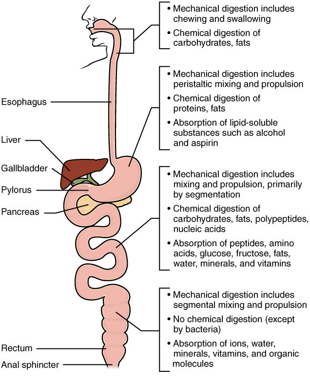
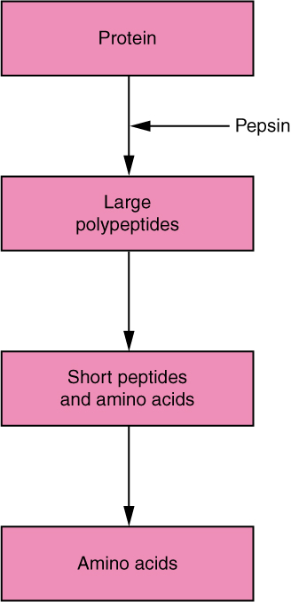
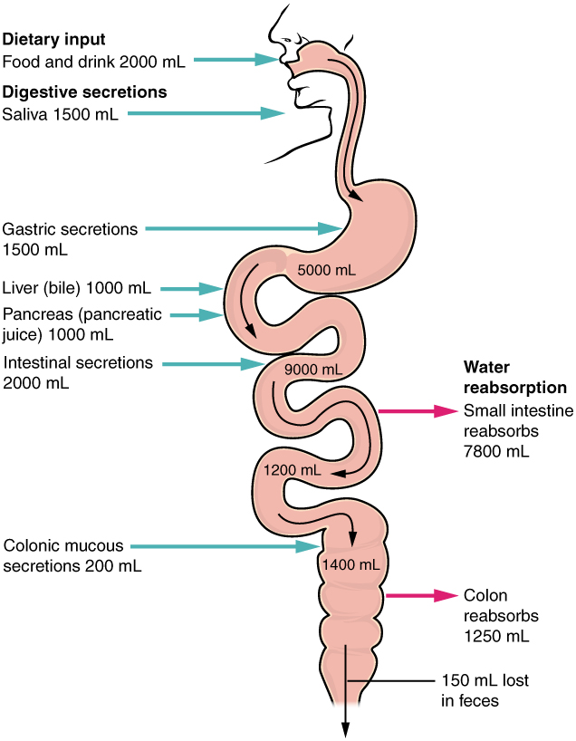

By the end of this section, you will be able to:
* Identify the locations and primary secretions involved in the chemical digestion of carbohydrates, proteins, lipids, and nucleic acids
* Compare and contrast absorption of the hydrophilic and hydrophobic nutrients

As you have learned, the process of mechanical digestion is relatively simple. It involves the physical breakdown of food but does not alter its chemical makeup. Chemical digestion, on the other hand, is a complex process that reduces food into its chemical building blocks, which are then absorbed to nourish the cells of the body ([\[link\]](#fig-ch24_07_01)). In this section, you will look more closely at the processes of chemical digestion and absorption.

 {: #fig-ch24_07_01 data-media-type="image/jpg" data-title="Digestion and Absorption "}

# Chemical Digestion

Large food molecules (for example, proteins, lipids, nucleic acids, and starches) must be broken down into subunits that are small enough to be absorbed by the lining of the alimentary canal. This is accomplished by enzymes through hydrolysis. The many enzymes involved in chemical digestion are summarized in [\[link\]](#tbl-ch24_08).

<table id="tbl-ch24_08" summary="The Digestive Enzymes"><caption>*These enzymes have been activated by other substances.</caption><thead>
<tr>
<th colspan="5">The Digestive Enzymes</th>
</tr>
<tr>
<th>Enzyme Category</th>
<th>Enzyme Name</th>
<th>Source</th>
<th>Substrate</th>
<th>Product</th>
</tr>
</thead><tbody>
<tr>
<td>Salivary Enzymes</td>
<td>Lingual lipase</td>
<td>Lingual glands</td>
<td>Triglycerides</td>
<td>Free fatty acids, and mono- and diglycerides</td>
</tr>
<tr>
<td>Salivary Enzymes</td>
<td>Salivary amylase</td>
<td>Salivary glands</td>
<td>Polysaccharides</td>
<td>Disaccharides and trisaccharides</td>
</tr>
<tr>
<td>Gastric enzymes</td>
<td>Gastric lipase</td>
<td>Chief cells</td>
<td>Triglycerides</td>
<td>Fatty acids and monoacylglycerides</td>
</tr>
<tr>
<td>Gastric enzymes</td>
<td>Pepsin*</td>
<td>Chief cells</td>
<td>Proteins</td>
<td>Peptides</td>
</tr>
<tr>
<td>Brush border enzymes</td>
<td>α-Dextrinase</td>
<td>Small intestine</td>
<td>α-Dextrins</td>
<td>Glucose</td>
</tr>
<tr>
<td>Brush border enzymes</td>
<td>Enteropeptidase</td>
<td>Small intestine</td>
<td>Trypsinogen</td>
<td>Trypsin</td>
</tr>
<tr>
<td>Brush border enzymes</td>
<td>Lactase</td>
<td>Small intestine</td>
<td>Lactose</td>
<td>Glucose and galactose</td>
</tr>
<tr>
<td>Brush border enzymes</td>
<td>Maltase</td>
<td>Small intestine</td>
<td>Maltose</td>
<td>Glucose</td>
</tr>
<tr>
<td>Brush border enzymes</td>
<td>Nucleosidases and phosphatases</td>
<td>Small intestine</td>
<td>Nucleotides</td>
<td>Phosphates, nitrogenous bases, and pentoses</td>
</tr>
<tr>
<td>Brush border enzymes</td>
<td>Peptidases</td>
<td>Small intestine</td>
<td>
<ul data-bullet-style="none"><li>Aminopeptidase: amino acids at the amino end of peptides</li>
<li>Dipeptidase: dipeptides</li>
</ul></td>
<td>
<ul data-bullet-style="none"><li>Aminopeptidase: amino acids and peptides</li>
<li>Dipeptidase: amino acids</li>
</ul></td>
</tr>
<tr>
<td>Brush border enzymes</td>
<td>Sucrase</td>
<td>Small intestine</td>
<td>Sucrose</td>
<td>Glucose and fructose</td>
</tr>
<tr>
<td>Pancreatic enzymes</td>
<td>Carboxy-peptidase*</td>
<td>Pancreatic acinar cells</td>
<td>Amino acids at the carboxyl end of peptides</td>
<td>Amino acids and peptides</td>
</tr>
<tr>
<td>Pancreatic enzymes</td>
<td>Chymotrypsin*</td>
<td>Pancreatic acinar cells</td>
<td>Proteins</td>
<td>Peptides</td>
</tr>
<tr>
<td>Pancreatic enzymes</td>
<td>Elastase*</td>
<td>Pancreatic acinar cells</td>
<td>Proteins</td>
<td>Peptides</td>
</tr>
<tr>
<td>Pancreatic enzymes</td>
<td>Nucleases</td>
<td>Pancreatic acinar cells</td>
<td>
<ul data-bullet-style="none"><li>Ribonuclease: ribonucleic acids</li>
<li>Deoxyribonuclease: deoxyribonucleic acids</li>
</ul></td>
<td>Nucleotides</td>
</tr>

<tr>
<td>Pancreatic enzymes</td>
<td>Pancreatic amylase</td>
<td>Pancreatic acinar cells</td>
<td>Polysaccharides (starches)</td>
<td>α-Dextrins, disaccharides (maltose), trisaccharides (maltotriose)</td>
</tr>

<tr>
<td>Pancreatic enzymes</td>
<td>Pancreatic lipase</td>
<td>Pancreatic acinar cells</td>
<td>Triglycerides that have been emulsified by bile salts</td>
<td>Fatty acids and monoacylglycerides</td>
</tr>
<tr>
<td>Pancreatic enzymes</td>
<td>Trypsin*</td>
<td>Pancreatic acinar cells</td>
<td>Proteins</td>
<td>Peptides</td>
</tr>
</tbody></table>

## Carbohydrate Digestion

The average American diet is about 50 percent carbohydrates, which may be classified according to the number of monomers they contain of simple sugars (monosaccharides and disaccharides) and/or complex sugars (polysaccharides). Glucose, galactose, and fructose are the three monosaccharides that are commonly consumed and are readily absorbed. Your digestive system is also able to break down the disaccharide sucrose (regular table sugar: glucose + fructose), lactose (milk sugar: glucose + galactose), and maltose (grain sugar: glucose + glucose), and the polysaccharides glycogen and starch (chains of monosaccharides). Your bodies do not produce enzymes that can break down most fibrous polysaccharides, such as cellulose. While indigestible polysaccharides do not provide any nutritional value, they do provide dietary fiber, which helps propel food through the alimentary canal.

The chemical digestion of starches begins in the mouth and has been reviewed above.

In the small intestine, **pancreatic amylase**{: data-type="term"} does the ‘heavy lifting’ for starch and carbohydrate digestion ([\[link\]](#fig-ch24_07_02)). After amylases break down starch into smaller fragments, the brush border enzyme **α-dextrinase**{: data-type="term"} starts working on **α-dextrin**{: data-type="term"}, breaking off one glucose unit at a time. Three brush border enzymes hydrolyze sucrose, lactose, and maltose into monosaccharides. **Sucrase**{: data-type="term"} splits sucrose into one molecule of fructose and one molecule of glucose; **maltase**{: data-type="term"} breaks down maltose and maltotriose into two and three glucose molecules, respectively; and **lactase**{: data-type="term"} breaks down lactose into one molecule of glucose and one molecule of galactose. Insufficient lactase can lead to lactose intolerance.

 {: #fig-ch24_07_02 data-media-type="image/jpg" data-title="Carbohydrate Digestion Flow Chart "}

## Protein Digestion

Proteins are polymers composed of amino acids linked by peptide bonds to form long chains. Digestion reduces them to their constituent amino acids. You usually consume about 15 to 20 percent of your total calorie intake as protein.

The digestion of protein starts in the stomach, where HCl and pepsin break proteins into smaller polypeptides, which then travel to the small intestine ([\[link\]](#fig-ch24_07_03)). Chemical digestion in the small intestine is continued by pancreatic enzymes, including chymotrypsin and trypsin, each of which act on specific bonds in amino acid sequences. At the same time, the cells of the brush border secrete enzymes such as **aminopeptidase**{: data-type="term"} and **dipeptidase**{: data-type="term"}, which further break down peptide chains. This results in molecules small enough to enter the bloodstream ([\[link\]](#fig-ch24_07_04)).

 .jpg> "The digestion of protein begins in the stomach and is completed in the small intestine."){: #fig-ch24_07_03 data-media-type="image/jpg" data-title="Digestion of Protein "}

{: #fig-ch24_07_04 data-media-type="image/jpg" data-title="Digestion of Protein Flow Chart "}

## Lipid Digestion

A healthy diet limits lipid intake to 35 percent of total calorie intake. The most common dietary lipids are triglycerides, which are made up of a glycerol molecule bound to three fatty acid chains. Small amounts of dietary cholesterol and phospholipids are also consumed.

The three lipases responsible for lipid digestion are lingual lipase, gastric lipase, and **pancreatic lipase**{: data-type="term"}. However, because the pancreas is the only consequential source of lipase, virtually all lipid digestion occurs in the small intestine. Pancreatic lipase breaks down each triglyceride into two free fatty acids and a monoglyceride. The fatty acids include both short-chain (less than 10 to 12 carbons) and long-chain fatty acids.

## Nucleic Acid Digestion

The nucleic acids DNA and RNA are found in most of the foods you eat. Two types of **pancreatic nuclease**{: data-type="term"} are responsible for their digestion: **deoxyribonuclease**{: data-type="term"}, which digests DNA, and **ribonuclease**{: data-type="term"}, which digests RNA. The nucleotides produced by this digestion are further broken down by two intestinal brush border enzymes (**nucleosidase**{: data-type="term"} and **phosphatase**{: data-type="term"}) into pentoses, phosphates, and nitrogenous bases, which can be absorbed through the alimentary canal wall. The large food molecules that must be broken down into subunits are summarized [\[link\]](#tbl-ch24_09)

<table id="tbl-ch24_09" summary=""><thead>
<tr>
<th colspan="2">Absorbable Food Substances</th>
</tr>
<tr>
<th>Source</th>
<th>Substance</th>
</tr>
</thead><tbody>
<tr>
<td>Carbohydrates</td>
<td>Monosaccharides: glucose, galactose, and fructose</td>
</tr>
<tr>
<td>Proteins</td>
<td>Single amino acids, dipeptides, and tripeptides</td>
</tr>
<tr>
<td>Triglycerides</td>
<td>Monoacylglycerides, glycerol, and free fatty acids</td>
</tr>
<tr>
<td>Nucleic acids</td>
<td>Pentose sugars, phosphates, and nitrogenous bases</td>
</tr>
</tbody></table>

# Absorption

The mechanical and digestive processes have one goal: to convert food into molecules small enough to be absorbed by the epithelial cells of the intestinal villi. The absorptive capacity of the alimentary canal is almost endless. Each day, the alimentary canal processes up to 10 liters of food, liquids, and GI secretions, yet less than one liter enters the large intestine. Almost all ingested food, 80 percent of electrolytes, and 90 percent of water are absorbed in the small intestine. Although the entire small intestine is involved in the absorption of water and lipids, most absorption of carbohydrates and proteins occurs in the jejunum. Notably, bile salts and vitamin B12 are absorbed in the terminal ileum. By the time chyme passes from the ileum into the large intestine, it is essentially indigestible food residue (mainly plant fibers like cellulose), some water, and millions of bacteria ([\[link\]](#fig-ch24_07_05)).

 {: #fig-ch24_07_05 data-media-type="image/jpg" data-title="Digestive Secretions and Absorption of Water "}

Absorption can occur through five mechanisms: (1) active transport, (2) passive diffusion, (3) facilitated diffusion, (4) co-transport (or secondary active transport), and (5) endocytosis. As you will recall from Chapter 3, active transport refers to the movement of a substance across a cell membrane going from an area of lower concentration to an area of higher concentration (up the concentration gradient). In this type of transport, proteins within the cell membrane act as “pumps,” using cellular energy (ATP) to move the substance. Passive diffusion refers to the movement of substances from an area of higher concentration to an area of lower concentration, while facilitated diffusion refers to the movement of substances from an area of higher to an area of lower concentration using a carrier protein in the cell membrane. Co-transport uses the movement of one molecule through the membrane from higher to lower concentration to power the movement of another from lower to higher. Finally, endocytosis is a transportation process in which the cell membrane engulfs material. It requires energy, generally in the form of ATP.

Because the cell’s plasma membrane is made up of hydrophobic phospholipids, water-soluble nutrients must use transport molecules embedded in the membrane to enter cells. Moreover, substances cannot pass between the epithelial cells of the intestinal mucosa because these cells are bound together by tight junctions. Thus, substances can only enter blood capillaries by passing through the apical surfaces of epithelial cells and into the interstitial fluid. Water-soluble nutrients enter the capillary blood in the villi and travel to the liver via the hepatic portal vein.

In contrast to the water-soluble nutrients, lipid-soluble nutrients can diffuse through the plasma membrane. Once inside the cell, they are packaged for transport via the base of the cell and then enter the lacteals of the villi to be transported by lymphatic vessels to the systemic circulation via the thoracic duct. The absorption of most nutrients through the mucosa of the intestinal villi requires active transport fueled by ATP. The routes of absorption for each food category are summarized in [\[link\]](#tbl-ch24_10).

<table id="tbl-ch24_10" summary=""><thead>
<tr>
<th colspan="5">Absorption in the Alimentary Canal</th>
</tr>
<tr>
<th>Food</th>
<th>Breakdown products</th>
<th>Absorption mechanism</th>
<th>Entry to bloodstream</th>
<th>Destination</th>
</tr>
</thead><tbody>
<tr><td>Carbohydrates</td>
 <td>Glucose</td>
<td>Co-transport with sodium ions</td>
<td>Capillary blood in villi</td>
<td>Liver via hepatic portal vein</td>
</tr>
<tr>
<td>Carbohydrates</td>
 <td>Galactose</td>
<td>Co-transport with sodium ions</td>
<td>Capillary blood in villi</td>
<td>Liver via hepatic portal vein</td>
</tr>
<tr>
<td>Carbohydrates</td>
 <td>Fructose</td>
<td>Facilitated diffusion</td>
<td>Capillary blood in villi</td>
<td>Liver via hepatic portal vein</td>
</tr>
<tr>
<td>Protein</td>
 <td>Amino acids</td>
<td>Co-transport with sodium ions</td>
<td>Capillary blood in villi</td>
<td>Liver via hepatic portal vein</td>
</tr>
<tr>
<td>Lipids</td>
<td>Long-chain fatty acids</td>
<td>Diffusion into intestinal cells, where they are combined with proteins to create chylomicrons</td>
<td>Lacteals of villi</td>
<td>Systemic circulation via lymph entering thoracic duct</td>
</tr>
<tr>
<td>Lipids</td>
 <td>Monoacylglycerides</td>
<td>Diffusion into intestinal cells, where they are combined with proteins to create chylomicrons</td>
<td>Lacteals of villi</td>
<td>Systemic circulation via lymph entering thoracic duct</td>
</tr>
<tr>
<td>Lipids</td>
<td>Short-chain fatty acids</td>
<td>Simple diffusion</td>
<td>Capillary blood in villi</td>
<td>Liver via hepatic portal vein</td>
</tr>
<tr>
<td>Lipids</td>
<td>Glycerol</td>
<td>Simple diffusion</td>
<td>Capillary blood in villi</td>
<td>Liver via hepatic portal vein</td>
</tr>
<tr>
<td>Lipids</td>
<td>Nucleic acid digestion products</td>
<td>Active transport via membrane carriers</td>
<td>Capillary blood in villi</td>
<td>Liver via hepatic portal vein</td>
</tr>
</tbody></table>

## Carbohydrate Absorption

All carbohydrates are absorbed in the form of monosaccharides. The small intestine is highly efficient at this, absorbing monosaccharides at an estimated rate of 120 grams per hour. All normally digested dietary carbohydrates are absorbed; indigestible fibers are eliminated in the feces. The monosaccharides glucose and galactose are transported into the epithelial cells by common protein carriers via secondary active transport (that is, co-transport with sodium ions). The monosaccharides leave these cells via facilitated diffusion and enter the capillaries through intercellular clefts. The monosaccharide fructose (which is in fruit) is absorbed and transported by facilitated diffusion alone. The monosaccharides combine with the transport proteins immediately after the disaccharides are broken down.

## Protein Absorption

Active transport mechanisms, primarily in the duodenum and jejunum, absorb most proteins as their breakdown products, amino acids. Almost all (95 to 98 percent) protein is digested and absorbed in the small intestine. The type of carrier that transports an amino acid varies. Most carriers are linked to the active transport of sodium. Short chains of two amino acids (dipeptides) or three amino acids (tripeptides) are also transported actively. However, after they enter the absorptive epithelial cells, they are broken down into their amino acids before leaving the cell and entering the capillary blood via diffusion.

## Lipid Absorption

About 95 percent of lipids are absorbed in the small intestine. Bile salts not only speed up lipid digestion, they are also essential to the absorption of the end products of lipid digestion. Short-chain fatty acids are relatively water soluble and can enter the absorptive cells (enterocytes) directly. Despite being hydrophobic, the small size of short-chain fatty acids enables them to be absorbed by enterocytes via simple diffusion, and then take the same path as monosaccharides and amino acids into the blood capillary of a villus.

The large and hydrophobic long-chain fatty acids and monoacylglycerides are not so easily suspended in the watery intestinal chyme. However, bile salts and lecithin resolve this issue by enclosing them in a **micelle**{: data-type="term"}, which is a tiny sphere with polar (hydrophilic) ends facing the watery environment and hydrophobic tails turned to the interior, creating a receptive environment for the long-chain fatty acids. The core also includes cholesterol and fat-soluble vitamins. Without micelles, lipids would sit on the surface of chyme and never come in contact with the absorptive surfaces of the epithelial cells. Micelles can easily squeeze between microvilli and get very near the luminal cell surface. At this point, lipid substances exit the micelle and are absorbed via simple diffusion.

The free fatty acids and monoacylglycerides that enter the epithelial cells are reincorporated into triglycerides. The triglycerides are mixed with phospholipids and cholesterol, and surrounded with a protein coat. This new complex, called a **chylomicron**{: data-type="term"}, is a water-soluble lipoprotein. After being processed by the Golgi apparatus, chylomicrons are released from the cell ([\[link\]](#fig-ch24_07_06)). Too big to pass through the basement membranes of blood capillaries, chylomicrons instead enter the large pores of lacteals. The lacteals come together to form the lymphatic vessels. The chylomicrons are transported in the lymphatic vessels and empty through the thoracic duct into the subclavian vein of the circulatory system. Once in the bloodstream, the enzyme **lipoprotein lipase**{: data-type="term"} breaks down the triglycerides of the chylomicrons into free fatty acids and glycerol. These breakdown products then pass through capillary walls to be used for energy by cells or stored in adipose tissue as fat. Liver cells combine the remaining chylomicron remnants with proteins, forming lipoproteins that transport cholesterol in the blood.

 {: #fig-ch24_07_06 data-media-type="image/jpg" data-title="Lipid Absorption "}

## Nucleic Acid Absorption

The products of nucleic acid digestion—pentose sugars, nitrogenous bases, and phosphate ions—are transported by carriers across the villus epithelium via active transport. These products then enter the bloodstream.

## Mineral Absorption

The electrolytes absorbed by the small intestine are from both GI secretions and ingested foods. Since electrolytes dissociate into ions in water, most are absorbed via active transport throughout the entire small intestine. During absorption, co-transport mechanisms result in the accumulation of sodium ions inside the cells, whereas anti-port mechanisms reduce the potassium ion concentration inside the cells. To restore the sodium-potassium gradient across the cell membrane, a sodium-potassium pump requiring ATP pumps sodium out and potassium in.

In general, all minerals that enter the intestine are absorbed, whether you need them or not. Iron and calcium are exceptions; they are absorbed in the duodenum in amounts that meet the body’s current requirements, as follows:

*Iron*—The ionic iron needed for the production of hemoglobin is absorbed into mucosal cells via active transport. Once inside mucosal cells, ionic iron binds to the protein ferritin, creating iron-ferritin complexes that store iron until needed. When the body has enough iron, most of the stored iron is lost when worn-out epithelial cells slough off. When the body needs iron because, for example, it is lost during acute or chronic bleeding, there is increased uptake of iron from the intestine and accelerated release of iron into the bloodstream. Since women experience significant iron loss during menstruation, they have around four times as many iron transport proteins in their intestinal epithelial cells as do men.

*Calcium*—Blood levels of ionic calcium determine the absorption of dietary calcium. When blood levels of ionic calcium drop, parathyroid hormone (PTH) secreted by the parathyroid glands stimulates the release of calcium ions from bone matrices and increases the reabsorption of calcium by the kidneys. PTH also upregulates the activation of vitamin D in the kidney, which then facilitates intestinal calcium ion absorption.

## Vitamin Absorption

The small intestine absorbs the vitamins that occur naturally in food and supplements. Fat-soluble vitamins (A, D, E, and K) are absorbed along with dietary lipids in micelles via simple diffusion. This is why you are advised to eat some fatty foods when you take fat-soluble vitamin supplements. Most water-soluble vitamins (including most B vitamins and vitamin C) also are absorbed by simple diffusion. An exception is vitamin B12, which is a very large molecule. Intrinsic factor secreted in the stomach binds to vitamin B12, preventing its digestion and creating a complex that binds to mucosal receptors in the terminal ileum, where it is taken up by endocytosis.

## Water Absorption

Each day, about nine liters of fluid enter the small intestine. About 2.3 liters are ingested in foods and beverages, and the rest is from GI secretions. About 90 percent of this water is absorbed in the small intestine. Water absorption is driven by the concentration gradient of the water: The concentration of water is higher in chyme than it is in epithelial cells. Thus, water moves down its concentration gradient from the chyme into cells. As noted earlier, much of the remaining water is then absorbed in the colon.

# Chapter Review

The small intestine is the site of most chemical digestion and almost all absorption. Chemical digestion breaks large food molecules down into their chemical building blocks, which can then be absorbed through the intestinal wall and into the general circulation. Intestinal brush border enzymes and pancreatic enzymes are responsible for the majority of chemical digestion. The breakdown of fat also requires bile.

Most nutrients are absorbed by transport mechanisms at the apical surface of enterocytes. Exceptions include lipids, fat-soluble vitamins, and most water-soluble vitamins. With the help of bile salts and lecithin, the dietary fats are emulsified to form micelles, which can carry the fat particles to the surface of the enterocytes. There, the micelles release their fats to diffuse across the cell membrane. The fats are then reassembled into triglycerides and mixed with other lipids and proteins into chylomicrons that can pass into lacteals. Other absorbed monomers travel from blood capillaries in the villus to the hepatic portal vein and then to the liver.

# Review Questions

Where does the chemical digestion of starch begin?

1.  mouth
2.  esophagus
3.  stomach
4.  small intestine
{: data-number-style="lower-alpha"}

A

Which of these is involved in the chemical digestion of protein?

1.  pancreatic amylase
2.  trypsin
3.  sucrase
4.  pancreatic nuclease
{: data-number-style="lower-alpha"}

B

Where are most fat-digesting enzymes produced?

1.  small intestine
2.  gallbladder
3.  liver
4.  pancreas
{: data-number-style="lower-alpha"}

D

Which of these nutrients is absorbed mainly in the duodenum?

1.  glucose
2.  iron
3.  sodium
4.  water
{: data-number-style="lower-alpha"}

B

# Critical Thinking Questions

Explain the role of bile salts and lecithin in the emulsification of lipids (fats).

Bile salts and lecithin can emulsify large lipid globules because they are amphipathic; they have a nonpolar (hydrophobic) region that attaches to the large fat molecules as well as a polar (hydrophilic) region that interacts with the watery chime in the intestine.

How is vitamin B12 absorbed?

Intrinsic factor secreted in the stomach binds to the large B12 compound, creating a combination that can bind to mucosal receptors in the ileum.

