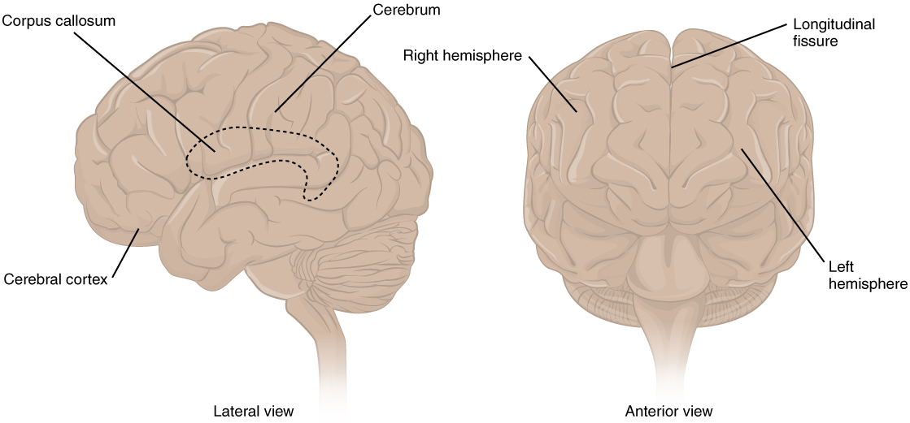
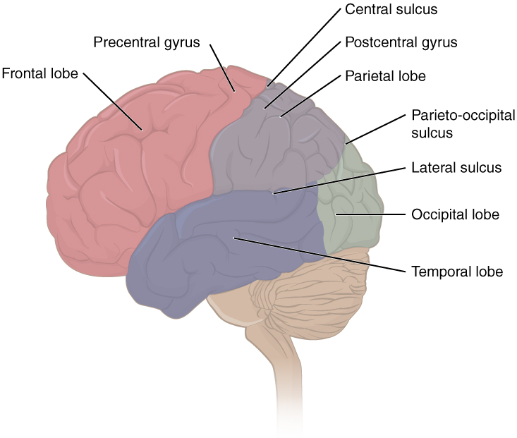
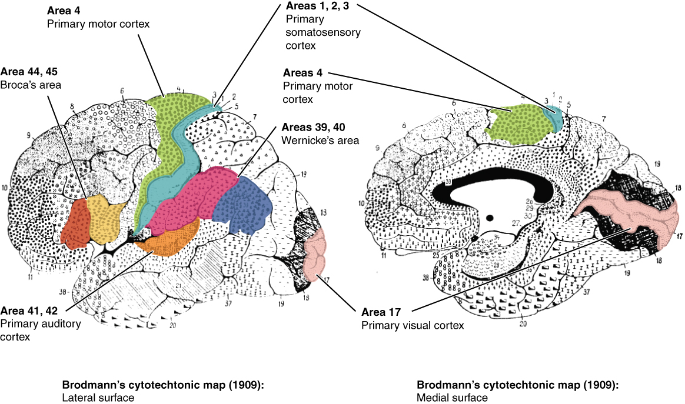
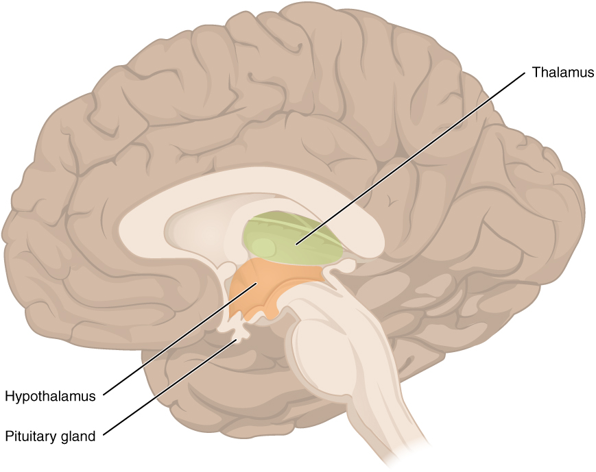
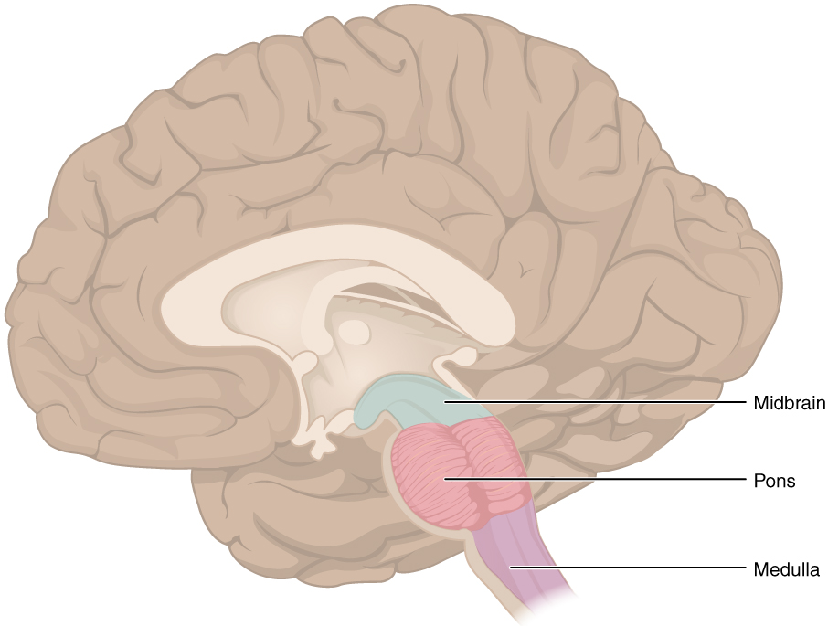
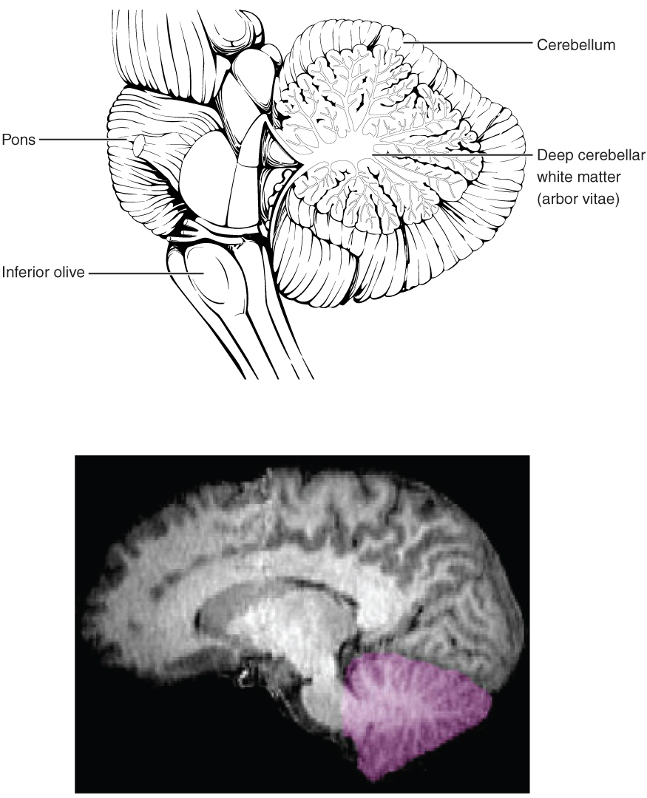

By the end of this section, you will be able to:
* Name the major regions of the adult brain
* Describe the connections between the cerebrum and brain stem through the diencephalon, and from those regions into the spinal cord
* Recognize the complex connections within the subcortical structures of the basal nuclei
* Explain the arrangement of gray and white matter in the spinal cord

The brain and the spinal cord are the central nervous system, and they represent the main organs of the nervous system. The spinal cord is a single structure, whereas the adult brain is described in terms of four major regions: the cerebrum, the diencephalon, the brain stem, and the cerebellum. A person’s conscious experiences are based on neural activity in the brain. The regulation of homeostasis is governed by a specialized region in the brain. The coordination of reflexes depends on the integration of sensory and motor pathways in the spinal cord.

### The Cerebrum

The iconic gray mantle of the human brain, which appears to make up most of the mass of the brain, is the **cerebrum**{: data-type="term"} ([\[link\]](#fig-ch13_02_01)). The wrinkled portion is the **cerebral cortex**{: data-type="term"}, and the rest of the structure is beneath that outer covering. There is a large separation between the two sides of the cerebrum called the **longitudinal fissure**{: data-type="term"}. It separates the cerebrum into two distinct halves, a right and left **cerebral hemisphere**{: data-type="term"}. Deep within the cerebrum, the white matter of the **corpus callosum**{: data-type="term"} provides the major pathway for communication between the two hemispheres of the cerebral cortex.

 {: #fig-ch13_02_01 data-title="The Cerebrum "}

Many of the higher neurological functions, such as memory, emotion, and consciousness, are the result of cerebral function. The complexity of the cerebrum is different across vertebrate species. The cerebrum of the most primitive vertebrates is not much more than the connection for the sense of smell. In mammals, the cerebrum comprises the outer gray matter that is the cortex (from the Latin word meaning “bark of a tree”) and several deep nuclei that belong to three important functional groups. The **basal nuclei**{: data-type="term"} are responsible for cognitive processing, the most important function being that associated with planning movements. The **basal forebrain**{: data-type="term"} contains nuclei that are important in learning and memory. The **limbic cortex**{: data-type="term"} is the region of the cerebral cortex that is part of the **limbic system**{: data-type="term"}, a collection of structures involved in emotion, memory, and behavior.

#### Cerebral Cortex

The cerebrum is covered by a continuous layer of gray matter that wraps around either side of the forebrain—the cerebral cortex. This thin, extensive region of wrinkled gray matter is responsible for the higher functions of the nervous system. A **gyrus**{: data-type="term"} (plural = gyri) is the ridge of one of those wrinkles, and a **sulcus**{: data-type="term"} (plural = sulci) is the groove between two gyri. The pattern of these folds of tissue indicates specific regions of the cerebral cortex.

The head is limited by the size of the birth canal, and the brain must fit inside the cranial cavity of the skull. Extensive folding in the cerebral cortex enables more gray matter to fit into this limited space. If the gray matter of the cortex were peeled off of the cerebrum and laid out flat, its surface area would be roughly equal to one square meter.

The folding of the cortex maximizes the amount of gray matter in the cranial cavity. During embryonic development, as the telencephalon expands within the skull, the brain goes through a regular course of growth that results in everyone’s brain having a similar pattern of folds. The surface of the brain can be mapped on the basis of the locations of large gyri and sulci. Using these landmarks, the cortex can be separated into four major regions, or lobes ([\[link\]](#fig-ch13_02_02)). The **lateral sulcus**{: data-type="term"} that separates the **temporal lobe**{: data-type="term"} from the other regions is one such landmark. Superior to the lateral sulcus are the **parietal lobe**{: data-type="term"} and **frontal lobe**{: data-type="term"}, which are separated from each other by the **central sulcus**{: data-type="term"}. The posterior region of the cortex is the **occipital lobe**{: data-type="term"}, which has no obvious anatomical border between it and the parietal or temporal lobes on the lateral surface of the brain. From the medial surface, an obvious landmark separating the parietal and occipital lobes is called the **parieto-occipital sulcus**{: data-type="term"}. The fact that there is no obvious anatomical border between these lobes is consistent with the functions of these regions being interrelated.

 {: #fig-ch13_02_02 data-title="Lobes of the Cerebral Cortex "}

Different regions of the cerebral cortex can be associated with particular functions, a concept known as localization of function. In the early 1900s, a German neuroscientist named Korbinian Brodmann performed an extensive study of the microscopic anatomy—the cytoarchitecture—of the cerebral cortex and divided the cortex into 52 separate regions on the basis of the histology of the cortex. His work resulted in a system of classification known as **Brodmann’s areas**{: data-type="term"}, which is still used today to describe the anatomical distinctions within the cortex ([\[link\]](#fig-ch13_02_03)). The results from Brodmann’s work on the anatomy align very well with the functional differences within the cortex. Areas 17 and 18 in the occipital lobe are responsible for primary visual perception. That visual information is complex, so it is processed in the temporal and parietal lobes as well.

The temporal lobe is associated with primary auditory sensation, known as Brodmann’s areas 41 and 42 in the superior temporal lobe. Because regions of the temporal lobe are part of the limbic system, memory is an important function associated with that lobe. Memory is essentially a sensory function; memories are recalled sensations such as the smell of Mom’s baking or the sound of a barking dog. Even memories of movement are really the memory of sensory feedback from those movements, such as stretching muscles or the movement of the skin around a joint. Structures in the temporal lobe are responsible for establishing long-term memory, but the ultimate location of those memories is usually in the region in which the sensory perception was processed.

The main sensation associated with the parietal lobe is **somatosensation**{: data-type="term"}, meaning the general sensations associated with the body. Posterior to the central sulcus is the **postcentral gyrus**{: data-type="term"}, the primary somatosensory cortex, which is identified as Brodmann’s areas 1, 2, and 3. All of the tactile senses are processed in this area, including touch, pressure, tickle, pain, itch, and vibration, as well as more general senses of the body such as **proprioception**{: data-type="term"} and **kinesthesia**{: data-type="term"}, which are the senses of body position and movement, respectively.

Anterior to the central sulcus is the frontal lobe, which is primarily associated with motor functions. The **precentral gyrus**{: data-type="term"} is the primary motor cortex. Cells from this region of the cerebral cortex are the upper motor neurons that instruct cells in the spinal cord to move skeletal muscles. Anterior to this region are a few areas that are associated with planned movements. The **premotor area**{: data-type="term"} is responsible for thinking of a movement to be made. The **frontal eye fields**{: data-type="term"} are important in eliciting eye movements and in attending to visual stimuli. **Broca’s area**{: data-type="term"} is responsible for the production of language, or controlling movements responsible for speech; in the vast majority of people, it is located only on the left side. Anterior to these regions is the **prefrontal lobe**{: data-type="term"}, which serves cognitive functions that can be the basis of personality, short-term memory, and consciousness. The prefrontal lobotomy is an outdated mode of treatment for personality disorders (psychiatric conditions) that profoundly affected the personality of the patient.

 {: #fig-ch13_02_03 data-title="Brodmann's Areas of the Cerebral Cortex "}

#### Subcortical structures

Beneath the cerebral cortex are sets of nuclei known as **subcortical nuclei**{: data-type="term"} that augment cortical processes. The nuclei of the basal forebrain serve as the primary location for acetylcholine production, which modulates the overall activity of the cortex, possibly leading to greater attention to sensory stimuli. Alzheimer’s disease is associated with a loss of neurons in the basal forebrain. The **hippocampus**{: data-type="term"} and **amygdala**{: data-type="term"} are medial-lobe structures that, along with the adjacent cortex, are involved in long-term memory formation and emotional responses. The basal nuclei are a set of nuclei in the cerebrum responsible for comparing cortical processing with the general state of activity in the nervous system to influence the likelihood of movement taking place. For example, while a student is sitting in a classroom listening to a lecture, the basal nuclei will keep the urge to jump up and scream from actually happening. (The basal nuclei are also referred to as the basal ganglia, although that is potentially confusing because the term ganglia is typically used for peripheral structures.)

The major structures of the basal nuclei that control movement are the **caudate**{: data-type="term"}, **putamen**{: data-type="term"}, and **globus pallidus**{: data-type="term"}, which are located deep in the cerebrum. The caudate is a long nucleus that follows the basic C-shape of the cerebrum from the frontal lobe, through the parietal and occipital lobes, into the temporal lobe. The putamen is mostly deep in the anterior regions of the frontal and parietal lobes. Together, the caudate and putamen are called the **striatum**{: data-type="term"}. The globus pallidus is a layered nucleus that lies just medial to the putamen; they are called the lenticular nuclei because they look like curved pieces fitting together like lenses. The globus pallidus has two subdivisions, the external and internal segments, which are lateral and medial, respectively. These nuclei are depicted in a frontal section of the brain in [\[link\]](#fig-ch13_02_04).

 , the putamen (inferior to the caudate and separated by the large white-matter structure called the internal capsule), and the globus pallidus (medial to the putamen)."){: #fig-ch13_02_04 data-title="Frontal Section of Cerebral Cortex and Basal Nuclei "}

The basal nuclei in the cerebrum are connected with a few more nuclei in the brain stem that together act as a functional group that forms a motor pathway. Two streams of information processing take place in the basal nuclei. All input to the basal nuclei is from the cortex into the striatum ([\[link\]](#fig-ch13_02_05)). The **direct pathway**{: data-type="term"} is the projection of axons from the striatum to the globus pallidus internal segment (GPi) and the **substantia nigra pars reticulata**{: data-type="term"} (SNr). The GPi/SNr then projects to the thalamus, which projects back to the cortex. The **indirect pathway**{: data-type="term"} is the projection of axons from the striatum to the globus pallidus external segment (GPe), then to the subthalamic nucleus (STN), and finally to GPi/SNr. The two streams both target the GPi/SNr, but one has a direct projection and the other goes through a few intervening nuclei. The direct pathway causes the **disinhibition**{: data-type="term"} of the thalamus (inhibition of one cell on a target cell that then inhibits the first cell), whereas the indirect pathway causes, or reinforces, the normal inhibition of the thalamus. The thalamus then can either excite the cortex (as a result of the direct pathway) or fail to excite the cortex (as a result of the indirect pathway).

 . This is an inhibitory pathway, in which GABA is released at the synapse, and the target cells are hyperpolarized and less likely to fire. The output from the basal nuclei is to the thalamus, which is an inhibitory projection using GABA."){: #fig-ch13_02_05 data-title="Connections of Basal Nuclei "}

The switch between the two pathways is the **substantia nigra pars compacta**{: data-type="term"}, which projects to the striatum and releases the neurotransmitter dopamine. Dopamine receptors are either excitatory (D1-type receptors) or inhibitory (D2-type receptors). The direct pathway is activated by dopamine, and the indirect pathway is inhibited by dopamine. When the substantia nigra pars compacta is firing, it signals to the basal nuclei that the body is in an active state, and movement will be more likely. When the substantia nigra pars compacta is silent, the body is in a passive state, and movement is inhibited. To illustrate this situation, while a student is sitting listening to a lecture, the substantia nigra pars compacta would be silent and the student less likely to get up and walk around. Likewise, while the professor is lecturing, and walking around at the front of the classroom, the professor’s substantia nigra pars compacta would be active, in keeping with his or her activity level.

  
Watch this [video][1] to learn about the basal nuclei (also known as the basal ganglia), which have two pathways that process information within the cerebrum. As shown in this video, the direct pathway is the shorter pathway through the system that results in increased activity in the cerebral cortex and increased motor activity. The direct pathway is described as resulting in “disinhibition” of the thalamus. What does disinhibition mean? What are the two neurons doing individually to cause this?

  
Watch this [video][2] to learn about the basal nuclei (also known as the basal ganglia), which have two pathways that process information within the cerebrum. As shown in this video, the indirect pathway is the longer pathway through the system that results in decreased activity in the cerebral cortex, and therefore less motor activity. The indirect pathway has an extra couple of connections in it, including disinhibition of the subthalamic nucleus. What is the end result on the thalamus, and therefore on movement initiated by the cerebral cortex?

Everyday Connections

The Myth of Left Brain/Right Brain There is a persistent myth that people are “right-brained” or “left-brained,” which is an oversimplification of an important concept about the cerebral hemispheres. There is some lateralization of function, in which the left side of the brain is devoted to language function and the right side is devoted to spatial and nonverbal reasoning. Whereas these functions are predominantly associated with those sides of the brain, there is no monopoly by either side on these functions. Many pervasive functions, such as language, are distributed globally around the cerebrum.

Some of the support for this misconception has come from studies of split brains. A drastic way to deal with a rare and devastating neurological condition (intractable epilepsy) is to separate the two hemispheres of the brain. After sectioning the corpus callosum, a split-brained patient will have trouble producing verbal responses on the basis of sensory information processed on the right side of the cerebrum, leading to the idea that the left side is responsible for language function.

However, there are well-documented cases of language functions lost from damage to the right side of the brain. The deficits seen in damage to the left side of the brain are classified as aphasia, a loss of speech function; damage on the right side can affect the use of language. Right-side damage can result in a loss of ability to understand figurative aspects of speech, such as jokes, irony, or metaphors. Nonverbal aspects of speech can be affected by damage to the right side, such as facial expression or body language, and right-side damage can lead to a “flat affect” in speech, or a loss of emotional expression in speech—sounding like a robot when talking.

### The Diencephalon

The diencephalon is the one region of the adult brain that retains its name from embryologic development. The etymology of the word diencephalon translates to “through brain.” It is the connection between the cerebrum and the rest of the nervous system, with one exception. The rest of the brain, the spinal cord, and the PNS all send information to the cerebrum through the diencephalon. Output from the cerebrum passes through the diencephalon. The single exception is the system associated with **olfaction**{: data-type="term"}, or the sense of smell, which connects directly with the cerebrum. In the earliest vertebrate species, the cerebrum was not much more than olfactory bulbs that received peripheral information about the chemical environment (to call it smell in these organisms is imprecise because they lived in the ocean).

The diencephalon is deep beneath the cerebrum and constitutes the walls of the third ventricle. The diencephalon can be described as any region of the brain with “thalamus” in its name. The two major regions of the diencephalon are the thalamus itself and the hypothalamus ([\[link\]](#fig-ch13_02_06)). There are other structures, such as the **epithalamus**{: data-type="term"}, which contains the pineal gland, or the **subthalamus**{: data-type="term"}, which includes the subthalamic nucleus that is part of the basal nuclei.

#### Thalamus

The **thalamus**{: data-type="term"} is a collection of nuclei that relay information between the cerebral cortex and the periphery, spinal cord, or brain stem. All sensory information, except for the sense of smell, passes through the thalamus before processing by the cortex. Axons from the peripheral sensory organs, or intermediate nuclei, synapse in the thalamus, and thalamic neurons project directly to the cerebrum. It is a requisite synapse in any sensory pathway, except for olfaction. The thalamus does not just pass the information on, it also processes that information. For example, the portion of the thalamus that receives visual information will influence what visual stimuli are important, or what receives attention.

The cerebrum also sends information down to the thalamus, which usually communicates motor commands. This involves interactions with the cerebellum and other nuclei in the brain stem. The cerebrum interacts with the basal nuclei, which involves connections with the thalamus. The primary output of the basal nuclei is to the thalamus, which relays that output to the cerebral cortex. The cortex also sends information to the thalamus that will then influence the effects of the basal nuclei.

#### Hypothalamus

Inferior and slightly anterior to the thalamus is the **hypothalamus**{: data-type="term"}, the other major region of the diencephalon. The hypothalamus is a collection of nuclei that are largely involved in regulating homeostasis. The hypothalamus is the executive region in charge of the autonomic nervous system and the endocrine system through its regulation of the anterior pituitary gland. Other parts of the hypothalamus are involved in memory and emotion as part of the limbic system.

 {: #fig-ch13_02_06 data-title="The Diencephalon "}

### Brain Stem

The midbrain and hindbrain (composed of the pons and the medulla) are collectively referred to as the brain stem ([\[link\]](#fig-ch13_02_07)). The structure emerges from the ventral surface of the forebrain as a tapering cone that connects the brain to the spinal cord. Attached to the brain stem, but considered a separate region of the adult brain, is the cerebellum. The midbrain coordinates sensory representations of the visual, auditory, and somatosensory perceptual spaces. The pons is the main connection with the cerebellum. The pons and the medulla regulate several crucial functions, including the cardiovascular and respiratory systems and rates.

The cranial nerves connect through the brain stem and provide the brain with the sensory input and motor output associated with the head and neck, including most of the special senses. The major ascending and descending pathways between the spinal cord and brain, specifically the cerebrum, pass through the brain stem.

 {: #fig-ch13_02_07 data-title="The Brain Stem "}

#### Midbrain

One of the original regions of the embryonic brain, the midbrain is a small region between the thalamus and pons. It is separated into the **tectum**{: data-type="term"} and **tegmentum**{: data-type="term"}, from the Latin words for roof and floor, respectively. The cerebral aqueduct passes through the center of the midbrain, such that these regions are the roof and floor of that canal.

The tectum is composed of four bumps known as the colliculi (singular = colliculus), which means “little hill” in Latin. The **inferior colliculus**{: data-type="term"} is the inferior pair of these enlargements and is part of the auditory brain stem pathway. Neurons of the inferior colliculus project to the thalamus, which then sends auditory information to the cerebrum for the conscious perception of sound. The **superior colliculus**{: data-type="term"} is the superior pair and combines sensory information about visual space, auditory space, and somatosensory space. Activity in the superior colliculus is related to orienting the eyes to a sound or touch stimulus. If you are walking along the sidewalk on campus and you hear chirping, the superior colliculus coordinates that information with your awareness of the visual location of the tree right above you. That is the correlation of auditory and visual maps. If you suddenly feel something wet fall on your head, your superior colliculus integrates that with the auditory and visual maps and you know that the chirping bird just relieved itself on you. You want to look up to see the culprit, but do not.

The tegmentum is continuous with the gray matter of the rest of the brain stem. Throughout the midbrain, pons, and medulla, the tegmentum contains the nuclei that receive and send information through the cranial nerves, as well as regions that regulate important functions such as those of the cardiovascular and respiratory systems.

#### Pons

The word pons comes from the Latin word for bridge. It is visible on the anterior surface of the brain stem as the thick bundle of white matter attached to the cerebellum. The pons is the main connection between the cerebellum and the brain stem. The bridge-like white matter is only the anterior surface of the pons; the gray matter beneath that is a continuation of the tegmentum from the midbrain. Gray matter in the tegmentum region of the pons contains neurons receiving descending input from the forebrain that is sent to the cerebellum.

#### Medulla

The medulla is the region known as the myelencephalon in the embryonic brain. The initial portion of the name, “myel,” refers to the significant white matter found in this region—especially on its exterior, which is continuous with the white matter of the spinal cord. The tegmentum of the midbrain and pons continues into the medulla because this gray matter is responsible for processing cranial nerve information. A diffuse region of gray matter throughout the brain stem, known as the **reticular formation**{: data-type="term"}, is related to sleep and wakefulness, such as general brain activity and attention.

### The Cerebellum

The **cerebellum**{: data-type="term"}, as the name suggests, is the “little brain.” It is covered in gyri and sulci like the cerebrum, and looks like a miniature version of that part of the brain ([\[link\]](#fig-ch13_02_08)). The cerebellum is largely responsible for comparing information from the cerebrum with sensory feedback from the periphery through the spinal cord. It accounts for approximately 10 percent of the mass of the brain.

 {: #fig-ch13_02_08 data-title="The Cerebellum "}

Descending fibers from the cerebrum have branches that connect to neurons in the pons. Those neurons project into the cerebellum, providing a copy of motor commands sent to the spinal cord. Sensory information from the periphery, which enters through spinal or cranial nerves, is copied to a nucleus in the medulla known as the **inferior olive**{: data-type="term"}. Fibers from this nucleus enter the cerebellum and are compared with the descending commands from the cerebrum. If the primary motor cortex of the frontal lobe sends a command down to the spinal cord to initiate walking, a copy of that instruction is sent to the cerebellum. Sensory feedback from the muscles and joints, proprioceptive information about the movements of walking, and sensations of balance are sent to the cerebellum through the inferior olive and the cerebellum compares them. If walking is not coordinated, perhaps because the ground is uneven or a strong wind is blowing, then the cerebellum sends out a corrective command to compensate for the difference between the original cortical command and the sensory feedback. The output of the cerebellum is into the midbrain, which then sends a descending input to the spinal cord to correct the messages going to skeletal muscles.

### The Spinal Cord

The description of the CNS is concentrated on the structures of the brain, but the spinal cord is another major organ of the system. Whereas the brain develops out of expansions of the neural tube into primary and then secondary vesicles, the spinal cord maintains the tube structure and is only specialized into certain regions. As the spinal cord continues to develop in the newborn, anatomical features mark its surface. The anterior midline is marked by the **anterior median fissure**{: data-type="term"}, and the posterior midline is marked by the **posterior median sulcus**{: data-type="term"}. Axons enter the posterior side through the **dorsal (posterior) nerve root**{: data-type="term"}, which marks the **posterolateral sulcus**{: data-type="term"} on either side. The axons emerging from the anterior side do so through the **ventral (anterior) nerve root**{: data-type="term"}. Note that it is common to see the terms dorsal (dorsal = “back”) and ventral (ventral = “belly”) used interchangeably with posterior and anterior, particularly in reference to nerves and the structures of the spinal cord. You should learn to be comfortable with both.

On the whole, the posterior regions are responsible for sensory functions and the anterior regions are associated with motor functions. This comes from the initial development of the spinal cord, which is divided into the **basal plate**{: data-type="term"} and the **alar plate**{: data-type="term"}. The basal plate is closest to the ventral midline of the neural tube, which will become the anterior face of the spinal cord and gives rise to motor neurons. The alar plate is on the dorsal side of the neural tube and gives rise to neurons that will receive sensory input from the periphery.

The length of the spinal cord is divided into regions that correspond to the regions of the vertebral column. The name of a spinal cord region corresponds to the level at which spinal nerves pass through the intervertebral foramina. Immediately adjacent to the brain stem is the cervical region, followed by the thoracic, then the lumbar, and finally the sacral region. The spinal cord is not the full length of the vertebral column because the spinal cord does not grow significantly longer after the first or second year, but the skeleton continues to grow. The nerves that emerge from the spinal cord pass through the intervertebral formina at the respective levels. As the vertebral column grows, these nerves grow with it and result in a long bundle of nerves that resembles a horse’s tail and is named the **cauda equina**{: data-type="term"}. The sacral spinal cord is at the level of the upper lumbar vertebral bones. The spinal nerves extend from their various levels to the proper level of the vertebral column.

#### Gray Horns

In cross-section, the gray matter of the spinal cord has the appearance of an ink-blot test, with the spread of the gray matter on one side replicated on the other—a shape reminiscent of a bulbous capital “H.” As shown in [\[link\]](#fig-ch13_02_09), the gray matter is subdivided into regions that are referred to as horns. The **posterior horn**{: data-type="term"} is responsible for sensory processing. The **anterior horn**{: data-type="term"} sends out motor signals to the skeletal muscles. The **lateral horn**{: data-type="term"}, which is only found in the thoracic, upper lumbar, and sacral regions, is the central component of the sympathetic division of the autonomic nervous system.

Some of the largest neurons of the spinal cord are the multipolar motor neurons in the anterior horn. The fibers that cause contraction of skeletal muscles are the axons of these neurons. The motor neuron that causes contraction of the big toe, for example, is located in the sacral spinal cord. The axon that has to reach all the way to the belly of that muscle may be a meter in length. The neuronal cell body that maintains that long fiber must be quite large, possibly several hundred micrometers in diameter, making it one of the largest cells in the body.

 "){: #fig-ch13_02_09 data-title="Cross-section of Spinal Cord "}

#### White Columns

Just as the gray matter is separated into horns, the white matter of the spinal cord is separated into columns. **Ascending tracts**{: data-type="term"} of nervous system fibers in these columns carry sensory information up to the brain, whereas **descending tracts**{: data-type="term"} carry motor commands from the brain. Looking at the spinal cord longitudinally, the columns extend along its length as continuous bands of white matter. Between the two posterior horns of gray matter are the **posterior columns**{: data-type="term"}. Between the two anterior horns, and bounded by the axons of motor neurons emerging from that gray matter area, are the **anterior columns**{: data-type="term"}. The white matter on either side of the spinal cord, between the posterior horn and the axons of the anterior horn neurons, are the **lateral columns**{: data-type="term"}. The posterior columns are composed of axons of ascending tracts. The anterior and lateral columns are composed of many different groups of axons of both ascending and descending tracts—the latter carrying motor commands down from the brain to the spinal cord to control output to the periphery.

  
Watch this [video][3] to learn about the gray matter of the spinal cord that receives input from fibers of the dorsal (posterior) root and sends information out through the fibers of the ventral (anterior) root. As discussed in this video, these connections represent the interactions of the CNS with peripheral structures for both sensory and motor functions. The cervical and lumbar spinal cords have enlargements as a result of larger populations of neurons. What are these enlargements responsible for?

Disorders of the…

Basal Nuclei Parkinson’s disease is a disorder of the basal nuclei, specifically of the substantia nigra, that demonstrates the effects of the direct and indirect pathways. Parkinson’s disease is the result of neurons in the substantia nigra pars compacta dying. These neurons release dopamine into the striatum. Without that modulatory influence, the basal nuclei are stuck in the indirect pathway, without the direct pathway being activated. The direct pathway is responsible for increasing cortical movement commands. The increased activity of the indirect pathway results in the hypokinetic disorder of Parkinson’s disease.

Parkinson’s disease is neurodegenerative, meaning that neurons die that cannot be replaced, so there is no cure for the disorder. Treatments for Parkinson’s disease are aimed at increasing dopamine levels in the striatum. Currently, the most common way of doing that is by providing the amino acid L-DOPA, which is a precursor to the neurotransmitter dopamine and can cross the blood-brain barrier. With levels of the precursor elevated, the remaining cells of the substantia nigra pars compacta can make more neurotransmitter and have a greater effect. Unfortunately, the patient will become less responsive to L-DOPA treatment as time progresses, and it can cause increased dopamine levels elsewhere in the brain, which are associated with psychosis or schizophrenia.

  
Visit this [site][4] for a thorough explanation of Parkinson’s disease.

  
Compared with the nearest evolutionary relative, the chimpanzee, the human has a brain that is huge. At a point in the past, a common ancestor gave rise to the two species of humans and chimpanzees. That evolutionary history is long and is still an area of intense study. But something happened to increase the size of the human brain relative to the chimpanzee. Read this [article][5] in which the author explores the current understanding of why this happened.

According to one hypothesis about the expansion of brain size, what tissue might have been sacrificed so energy was available to grow our larger brain? Based on what you know about that tissue and nervous tissue, why would there be a trade-off between them in terms of energy use?

### Chapter Review

The adult brain is separated into four major regions: the cerebrum, the diencephalon, the brain stem, and the cerebellum. The cerebrum is the largest portion and contains the cerebral cortex and subcortical nuclei. It is divided into two halves by the longitudinal fissure.

The cortex is separated into the frontal, parietal, temporal, and occipital lobes. The frontal lobe is responsible for motor functions, from planning movements through executing commands to be sent to the spinal cord and periphery. The most anterior portion of the frontal lobe is the prefrontal cortex, which is associated with aspects of personality through its influence on motor responses in decision-making.

The other lobes are responsible for sensory functions. The parietal lobe is where somatosensation is processed. The occipital lobe is where visual processing begins, although the other parts of the brain can contribute to visual function. The temporal lobe contains the cortical area for auditory processing, but also has regions crucial for memory formation.

Nuclei beneath the cerebral cortex, known as the subcortical nuclei, are responsible for augmenting cortical functions. The basal nuclei receive input from cortical areas and compare it with the general state of the individual through the activity of a dopamine-releasing nucleus. The output influences the activity of part of the thalamus that can then increase or decrease cortical activity that often results in changes to motor commands. The basal forebrain is responsible for modulating cortical activity in attention and memory. The limbic system includes deep cerebral nuclei that are responsible for emotion and memory.

The diencephalon includes the thalamus and the hypothalamus, along with some other structures. The thalamus is a relay between the cerebrum and the rest of the nervous system. The hypothalamus coordinates homeostatic functions through the autonomic and endocrine systems.

The brain stem is composed of the midbrain, pons, and medulla. It controls the head and neck region of the body through the cranial nerves. There are control centers in the brain stem that regulate the cardiovascular and respiratory systems.

The cerebellum is connected to the brain stem, primarily at the pons, where it receives a copy of the descending input from the cerebrum to the spinal cord. It can compare this with sensory feedback input through the medulla and send output through the midbrain that can correct motor commands for coordination.

### Interactive Link Questions

Watch this [video][1] to learn about the basal nuclei (also known as the basal ganglia), which have two pathways that process information within the cerebrum. As shown in this video, the direct pathway is the shorter pathway through the system that results in increased activity in the cerebral cortex and increased motor activity. The direct pathway is described as resulting in “disinhibition” of the thalamus. What does disinhibition mean? What are the two neurons doing individually to cause this?

Both cells are inhibitory. The first cell inhibits the second one. Therefore, the second cell can no longer inhibit its target. This is disinhibition of that target across two synapses.

Watch this [video][2] to learn about the basal nuclei (also known as the basal ganglia), which have two pathways that process information within the cerebrum. As shown in this video, the indirect pathway is the longer pathway through the system that results in decreased activity in the cerebral cortex, and therefore less motor activity. The indirect pathway has an extra couple of connections in it, including disinhibition of the subthalamic nucleus. What is the end result on the thalamus, and therefore on movement initiated by the cerebral cortex?

By disinhibiting the subthalamic nucleus, the indirect pathway increases excitation of the globus pallidus internal segment. That, in turn, inhibits the thalamus, which is the opposite effect of the direct pathway that disinhibits the thalamus.

Watch this [video][3] to learn about the gray matter of the spinal cord that receives input from fibers of the dorsal (posterior) root and sends information out through the fibers of the ventral (anterior) root. As discussed in this video, these connections represent the interactions of the CNS with peripheral structures for both sensory and motor functions. The cervical and lumbar spinal cords have enlargements as a result of larger populations of neurons. What are these enlargements responsible for?

There are more motor neurons in the anterior horns that are responsible for movement in the limbs. The cervical enlargement is for the arms, and the lumbar enlargement is for the legs.

Compared with the nearest evolutionary relative, the chimpanzee, the human has a brain that is huge. At a point in the past, a common ancestor gave rise to the two species of humans and chimpanzees. That evolutionary history is long and is still an area of intense study. But something happened to increase the size of the human brain relative to the chimpanzee. Read this [article][5] in which the author explores the current understanding of why this happened.

According to one hypothesis about the expansion of brain size, what tissue might have been sacrificed so energy was available to grow our larger brain? Based on what you know about that tissue and nervous tissue, why would there be a trade-off between them in terms of energy use?

Energy is needed for the brain to develop and perform higher cognitive functions. That energy is not available for the muscle tissues to develop and function. The hypothesis suggests that humans have larger brains and less muscle mass, and chimpanzees have the smaller brains but more muscle mass.

### Review Questions

Which lobe of the cerebral cortex is responsible for generating motor commands?

1.  temporal
2.  parietal
3.  occipital
4.  frontal
{: type="a"}

D

What region of the diencephalon coordinates homeostasis?

1.  thalamus
2.  epithalamus
3.  hypothalamus
4.  subthalamus
{: type="a"}

C

What level of the brain stem is the major input to the cerebellum?

1.  midbrain
2.  pons
3.  medulla
4.  spinal cord
{: type="a"}

B

What region of the spinal cord contains motor neurons that direct the movement of skeletal muscles?

1.  anterior horn
2.  posterior horn
3.  lateral horn
4.  alar plate
{: type="a"}

A

Brodmann’s areas map different regions of the \_\_\_\_\_\_\_\_ to particular functions.

1.  cerebellum
2.  cerebral cortex
3.  basal forebrain
4.  corpus callosum
{: type="a"}

B

### Critical Thinking Questions

Damage to specific regions of the cerebral cortex, such as through a stroke, can result in specific losses of function. What functions would likely be lost by a stroke in the temporal lobe?

The temporal lobe has sensory functions associated with hearing and vision, as well as being important for memory. A stroke in the temporal lobe can result in specific sensory deficits in these systems (known as agnosias) or losses in memory.

Why do the anatomical inputs to the cerebellum suggest that it can compare motor commands and sensory feedback?

A copy of descending input from the cerebrum to the spinal cord, through the pons, and sensory feedback from the spinal cord and special senses like balance, through the medulla, both go to the cerebellum. It can therefore send output through the midbrain that will correct spinal cord control of skeletal muscle movements.

### Glossary
{: data-type="glossary-title"}

alar plate
: developmental region of the spinal cord that gives rise to the posterior horn of the gray matter
^

amygdala
: nucleus deep in the temporal lobe of the cerebrum that is related to memory and emotional behavior
^

anterior column
: white matter between the anterior horns of the spinal cord composed of many different groups of axons of both ascending and descending tracts
^

anterior horn
: gray matter of the spinal cord containing multipolar motor neurons, sometimes referred to as the ventral horn
^

anterior median fissure
: deep midline feature of the anterior spinal cord, marking the separation between the right and left sides of the cord
^

ascending tract
: central nervous system fibers carrying sensory information from the spinal cord or periphery to the brain
^

basal forebrain
: nuclei of the cerebrum related to modulation of sensory stimuli and attention through broad projections to the cerebral cortex, loss of which is related to Alzheimer’s disease
^

basal nuclei
: nuclei of the cerebrum (with a few components in the upper brain stem and diencephalon) that are responsible for assessing cortical movement commands and comparing them with the general state of the individual through broad modulatory activity of dopamine neurons; largely related to motor functions, as evidenced through the symptoms of Parkinson’s and Huntington’s diseases
^

basal plate
: developmental region of the spinal cord that gives rise to the lateral and anterior horns of gray matter
^

Broca’s area
: region of the frontal lobe associated with the motor commands necessary for speech production and located only in the cerebral hemisphere responsible for language production, which is the left side in approximately 95 percent of the population
^

Brodmann’s areas
: mapping of regions of the cerebral cortex based on microscopic anatomy that relates specific areas to functional differences, as described by Brodmann in the early 1900s
^

cauda equina
: bundle of spinal nerve roots that descend from the lower spinal cord below the first lumbar vertebra and lie within the vertebral cavity; has the appearance of a horse\'s tail
^

caudate
: nucleus deep in the cerebrum that is part of the basal nuclei; along with the putamen, it is part of the striatum
^

central sulcus
: surface landmark of the cerebral cortex that marks the boundary between the frontal and parietal lobes
^

cerebral cortex
: outer gray matter covering the forebrain, marked by wrinkles and folds known as gyri and sulci
^

cerebrum
: region of the adult brain that develops from the telencephalon and is responsible for higher neurological functions such as memory, emotion, and consciousness
^

cerebellum
: region of the adult brain connected primarily to the pons that developed from the metencephalon (along with the pons) and is largely responsible for comparing information from the cerebrum with sensory feedback from the periphery through the spinal cord
^

cerebral hemisphere
: one half of the bilaterally symmetrical cerebrum
^

corpus callosum
: large white matter structure that connects the right and left cerebral hemispheres
^

descending tract
: central nervous system fibers carrying motor commands from the brain to the spinal cord or periphery
^

direct pathway
: connections within the basal nuclei from the striatum to the globus pallidus internal segment and substantia nigra pars reticulata that disinhibit the thalamus to increase cortical control of movement
^

disinhibition
: disynaptic connection in which the first synapse inhibits the second cell, which then stops inhibiting the final target
^

dorsal (posterior) nerve root
: axons entering the posterior horn of the spinal cord
^

epithalamus
: region of the diecephalon containing the pineal gland
^

frontal eye field
: region of the frontal lobe associated with motor commands to orient the eyes toward an object of visual attention
^

frontal lobe
: region of the cerebral cortex directly beneath the frontal bone of the cranium
^

globus pallidus
: nuclei deep in the cerebrum that are part of the basal nuclei and can be divided into the internal and external segments
^

gyrus
: ridge formed by convolutions on the surface of the cerebrum or cerebellum
^

hippocampus
: gray matter deep in the temporal lobe that is very important for long-term memory formation
^

hypothalamus
: major region of the diencephalon that is responsible for coordinating autonomic and endocrine control of homeostasis
^

indirect pathway
: connections within the basal nuclei from the striatum through the globus pallidus external segment and subthalamic nucleus to the globus pallidus internal segment/substantia nigra pars compacta that result in inhibition of the thalamus to decrease cortical control of movement
^

inferior colliculus
: half of the midbrain tectum that is part of the brain stem auditory pathway
^

inferior olive
: nucleus in the medulla that is involved in processing information related to motor control
^

kinesthesia
: general sensory perception of movement of the body
^

lateral column
: white matter of the spinal cord between the posterior horn on one side and the axons from the anterior horn on the same side; composed of many different groups of axons, of both ascending and descending tracts, carrying motor commands to and from the brain
^

lateral horn
: region of the spinal cord gray matter in the thoracic, upper lumbar, and sacral regions that is the central component of the sympathetic division of the autonomic nervous system
^

lateral sulcus
: surface landmark of the cerebral cortex that marks the boundary between the temporal lobe and the frontal and parietal lobes
^

limbic cortex
: collection of structures of the cerebral cortex that are involved in emotion, memory, and behavior and are part of the larger limbic system
^

limbic system
: structures at the edge (limit) of the boundary between the forebrain and hindbrain that are most associated with emotional behavior and memory formation
^

longitudinal fissure
: large separation along the midline between the two cerebral hemispheres
^

occipital lobe
: region of the cerebral cortex directly beneath the occipital bone of the cranium
^

olfaction
: special sense responsible for smell, which has a unique, direct connection to the cerebrum
^

parietal lobe
: region of the cerebral cortex directly beneath the parietal bone of the cranium
^

parieto-occipital sulcus
: groove in the cerebral cortex representing the border between the parietal and occipital cortices
^

postcentral gyrus
: primary motor cortex located in the frontal lobe of the cerebral cortex
^

posterior columns
: white matter of the spinal cord that lies between the posterior horns of the gray matter, sometimes referred to as the dorsal column; composed of axons of ascending tracts that carry sensory information up to the brain
^

posterior horn
: gray matter region of the spinal cord in which sensory input arrives, sometimes referred to as the dorsal horn
^

posterior median sulcus
: midline feature of the posterior spinal cord, marking the separation between right and left sides of the cord
^

posterolateral sulcus
: feature of the posterior spinal cord marking the entry of posterior nerve roots and the separation between the posterior and lateral columns of the white matter
^

precentral gyrus
: ridge just posterior to the central sulcus, in the parietal lobe, where somatosensory processing initially takes place in the cerebrum
^

prefrontal lobe
: specific region of the frontal lobe anterior to the more specific motor function areas, which can be related to the early planning of movements and intentions to the point of being personality-type functions
^

premotor area
: region of the frontal lobe responsible for planning movements that will be executed through the primary motor cortex
^

proprioception
: general sensory perceptions providing information about location and movement of body parts; the “sense of the self”
^

putamen
: nucleus deep in the cerebrum that is part of the basal nuclei; along with the caudate, it is part of the striatum
^

reticular formation
: diffuse region of gray matter throughout the brain stem that regulates sleep, wakefulness, and states of consciousness
^

somatosensation
: general senses related to the body, usually thought of as the senses of touch, which would include pain, temperature, and proprioception
^

striatum
: the caudate and putamen collectively, as part of the basal nuclei, which receive input from the cerebral cortex
^

subcortical nucleus
: all the nuclei beneath the cerebral cortex, including the basal nuclei and the basal forebrain
^

substantia nigra pars compacta
: nuclei within the basal nuclei that release dopamine to modulate the function of the striatum; part of the motor pathway
^

substantia nigra pars reticulata
: nuclei within the basal nuclei that serve as an output center of the nuclei; part of the motor pathway
^

subthalamus
: nucleus within the basal nuclei that is part of the indirect pathway
^

sulcus
: groove formed by convolutions in the surface of the cerebral cortex
^

superior colliculus
: half of the midbrain tectum that is responsible for aligning visual, auditory, and somatosensory spatial perceptions
^

tectum
: region of the midbrain, thought of as the roof of the cerebral aqueduct, which is subdivided into the inferior and superior colliculi
^

tegmentum
: region of the midbrain, thought of as the floor of the cerebral aqueduct, which continues into the pons and medulla as the floor of the fourth ventricle
^

temporal lobe
: region of the cerebral cortex directly beneath the temporal bone of the cranium
^

thalamus
: major region of the diencephalon that is responsible for relaying information between the cerebrum and the hindbrain, spinal cord, and periphery
^

ventral (anterior) nerve root
: axons emerging from the anterior or lateral horns of the spinal cord

[1]: http://openstax.org/l/basalnuclei1
[2]: http://openstax.org/l/basalnuclei2
[3]: http://openstax.org/l/graymatter
[4]: http://openstax.org/l/parkinsons
[5]: http://openstax.org/l/hugebrain
