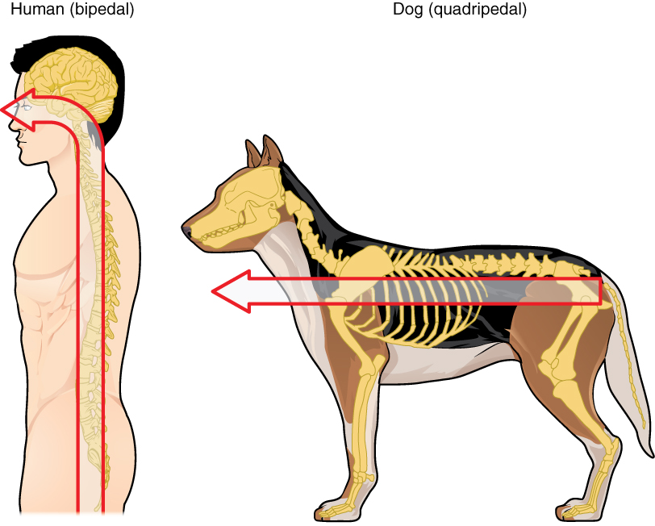

By the end of this section, you will be able to:
* Describe the growth and differentiation of the neural tube
* Relate the different stages of development to the adult structures of the central nervous system
* Explain the expansion of the ventricular system of the adult brain from the central canal of the neural tube
* Describe the connections of the diencephalon and cerebellum on the basis of patterns of embryonic development

The brain is a complex organ composed of gray parts and white matter, which can be hard to distinguish. Starting from an embryologic perspective allows you to understand more easily how the parts relate to each other. The embryonic nervous system begins as a very simple structure—essentially just a straight line, which then gets increasingly complex. Looking at the development of the nervous system with a couple of early snapshots makes it easier to understand the whole complex system.

Many structures that appear to be adjacent in the adult brain are not connected, and the connections that exist may seem arbitrary. But there is an underlying order to the system that comes from how different parts develop. By following the developmental pattern, it is possible to learn what the major regions of the nervous system are.

# The Neural Tube

To begin, a sperm cell and an egg cell fuse to become a fertilized egg. The fertilized egg cell, or zygote, starts dividing to generate the cells that make up an entire organism. Sixteen days after fertilization, the developing embryo’s cells belong to one of three germ layers that give rise to the different tissues in the body. The endoderm, or inner tissue, is responsible for generating the lining tissues of various spaces within the body, such as the mucosae of the digestive and respiratory systems. The mesoderm, or middle tissue, gives rise to most of the muscle and connective tissues. Finally the ectoderm, or outer tissue, develops into the integumentary system (the skin) and the nervous system. It is probably not difficult to see that the outer tissue of the embryo becomes the outer covering of the body. But how is it responsible for the nervous system?

As the embryo develops, a portion of the ectoderm differentiates into a specialized region of neuroectoderm, which is the precursor for the tissue of the nervous system. Molecular signals induce cells in this region to differentiate into the neuroepithelium, forming a **neural plate**{: data-type="term"}. The cells then begin to change shape, causing the tissue to buckle and fold inward ([\[link\]](#fig-ch13_01_01)). A **neural groove**{: data-type="term"} forms, visible as a line along the dorsal surface of the embryo. The ridge-like edge on either side of the neural groove is referred as the **neural fold**{: data-type="term"}. As the neural folds come together and converge, the underlying structure forms into a tube just beneath the ectoderm called the **neural tube**{: data-type="term"}. Cells from the neural folds then separate from the ectoderm to form a cluster of cells referred to as the **neural crest**{: data-type="term"}, which runs lateral to the neural tube. The neural crest migrates away from the nascent, or embryonic, central nervous system (CNS) that will form along the neural groove and develops into several parts of the peripheral nervous system (PNS), including the enteric nervous tissue. Many tissues that are not part of the nervous system also arise from the neural crest, such as craniofacial cartilage and bone, and melanocytes.

 {: #fig-ch13_01_01 data-media-type="image/jpg" data-title="Early Embryonic Development of Nervous System "}

At this point, the early nervous system is a simple, hollow tube. It runs from the anterior end of the embryo to the posterior end. Beginning at 25 days, the anterior end develops into the brain, and the posterior portion becomes the spinal cord. This is the most basic arrangement of tissue in the nervous system, and it gives rise to the more complex structures by the fourth week of development.

# Primary Vesicles

As the anterior end of the neural tube starts to develop into the brain, it undergoes a couple of enlargements; the result is the production of sac-like vesicles. Similar to a child’s balloon animal, the long, straight neural tube begins to take on a new shape. Three vesicles form at the first stage, which are called **primary vesicles**{: data-type="term"}. These vesicles are given names that are based on Greek words, the main root word being *enkephalon*, which means “brain” (en- = “inside”; kephalon = “head”). The prefix to each generally corresponds to its position along the length of the developing nervous system.

The **prosencephalon**{: data-type="term"} (pros- = “in front”) is the forward-most vesicle, and the term can be loosely translated to mean **forebrain**{: data-type="term"}. The **mesencephalon**{: data-type="term"} (mes- = “middle”) is the next vesicle, which can be called the **midbrain**{: data-type="term"}. The third vesicle at this stage is the **rhombencephalon**{: data-type="term"}. The first part of this word is also the root of the word rhombus, which is a geometrical figure with four sides of equal length (a square is a rhombus with 90° angles). Whereas prosencephalon and mesencephalon translate into the English words forebrain and midbrain, there is not a word for “four-sided-figure-brain.” However, the third vesicle can be called the **hindbrain**{: data-type="term"}. One way of thinking about how the brain is arranged is to use these three regions—forebrain, midbrain, and hindbrain—which are based on the primary vesicle stage of development ([\[link\]](#fig-ch13_01_02)**a**).

# Secondary Vesicles

The brain continues to develop, and the vesicles differentiate further (see [\[link\]](#fig-ch13_01_02)**b**). The three primary vesicles become five **secondary vesicles**{: data-type="term"}. The prosencephalon enlarges into two new vesicles called the **telencephalon**{: data-type="term"} and the **diencephalon**{: data-type="term"}. The telecephalon will become the cerebrum. The diencephalon gives rise to several adult structures; two that will be important are the thalamus and the hypothalamus. In the embryonic diencephalon, a structure known as the eye cup develops, which will eventually become the retina, the nervous tissue of the eye called the retina. This is a rare example of nervous tissue developing as part of the CNS structures in the embryo, but becoming a peripheral structure in the fully formed nervous system.

The mesencephalon does not differentiate into any finer divisions. The midbrain is an established region of the brain at the primary vesicle stage of development and remains that way. The rest of the brain develops around it and constitutes a large percentage of the mass of the brain. Dividing the brain into forebrain, midbrain, and hindbrain is useful in considering its developmental pattern, but the midbrain is a small proportion of the entire brain, relatively speaking.

The rhombencephalon develops into the **metencephalon**{: data-type="term"} and **myelencephalon**{: data-type="term"}. The metencephalon corresponds to the adult structure known as the pons and also gives rise to the cerebellum. The cerebellum (from the Latin meaning “little brain”) accounts for about 10 percent of the mass of the brain and is an important structure in itself. The most significant connection between the cerebellum and the rest of the brain is at the pons, because the pons and cerebellum develop out of the same vesicle. The myelencephalon corresponds to the adult structure known as the medulla oblongata. The structures that come from the mesencephalon and rhombencephalon, except for the cerebellum, are collectively considered the **brain stem**{: data-type="term"}, which specifically includes the midbrain, pons, and medulla.

  The primary vesicle stage has three regions, and (b) the secondary vesicle stage has five regions."){: #fig-ch13_01_02 data-media-type="image/jpg" data-title="Primary and Secondary Vesicle Stages of Development "}

 {: data-media-type="image/png"} 
Watch this [animation][1] to examine the development of the brain, starting with the neural tube. As the anterior end of the neural tube develops, it enlarges into the primary vesicles that establish the forebrain, midbrain, and hindbrain. Those structures continue to develop throughout the rest of embryonic development and into adolescence. They are the basis of the structure of the fully developed adult brain. How would you describe the difference in the relative sizes of the three regions of the brain when comparing the early (25th embryonic day) brain and the adult brain?

# Spinal Cord Development

While the brain is developing from the anterior neural tube, the spinal cord is developing from the posterior neural tube. However, its structure does not differ from the basic layout of the neural tube. It is a long, straight cord with a small, hollow space down the center. The neural tube is defined in terms of its anterior versus posterior portions, but it also has a dorsal–ventral dimension. As the neural tube separates from the rest of the ectoderm, the side closest to the surface is dorsal, and the deeper side is ventral.

As the spinal cord develops, the cells making up the wall of the neural tube proliferate and differentiate into the neurons and glia of the spinal cord. The dorsal tissues will be associated with sensory functions, and the ventral tissues will be associated with motor functions.

# Relating Embryonic Development to the Adult Brain

Embryonic development can help in understanding the structure of the adult brain because it establishes a framework on which more complex structures can be built. First, the neural tube establishes the anterior–posterior dimension of the nervous system, which is called the **neuraxis**{: data-type="term"}. The embryonic nervous system in mammals can be said to have a standard arrangement. Humans (and other primates, to some degree) make this complicated by standing up and walking on two legs. The anterior–posterior dimension of the neuraxis overlays the superior–inferior dimension of the body. However, there is a major curve between the brain stem and forebrain, which is called the **cephalic flexure**{: data-type="term"}. Because of this, the neuraxis starts in an inferior position—the end of the spinal cord—and ends in an anterior position, the front of the cerebrum. If this is confusing, just imagine a four-legged animal standing up on two legs. Without the flexure in the brain stem, and at the top of the neck, that animal would be looking straight up instead of straight in front ([\[link\]](#fig-ch13_01_03)).

 {: #fig-ch13_01_03 data-media-type="image/jpg" data-title="Human Neuraxis "}

In summary, the primary vesicles help to establish the basic regions of the nervous system: forebrain, midbrain, and hindbrain. These divisions are useful in certain situations, but they are not equivalent regions. The midbrain is small compared with the hindbrain and particularly the forebrain. The secondary vesicles go on to establish the major regions of the adult nervous system that will be followed in this text. The telencephalon is the cerebrum, which is the major portion of the human brain. The diencephalon continues to be referred to by this Greek name, because there is no better term for it (dia- = “through”). The diencephalon is between the cerebrum and the rest of the nervous system and can be described as the region through which all projections have to pass between the cerebrum and everything else. The brain stem includes the midbrain, pons, and medulla, which correspond to the mesencephalon, metencephalon, and myelencephalon. The cerebellum, being a large portion of the brain, is considered a separate region. [\[link\]](#tbl-ch13_01) connects the different stages of development to the adult structures of the CNS.

One other benefit of considering embryonic development is that certain connections are more obvious because of how these adult structures are related. The retina, which began as part of the diencephalon, is primarily connected to the diencephalon. The eyes are just inferior to the anterior-most part of the cerebrum, but the optic nerve extends back to the thalamus as the optic tract, with branches into a region of the hypothalamus. There is also a connection of the optic tract to the midbrain, but the mesencephalon is adjacent to the diencephalon, so that is not difficult to imagine. The cerebellum originates out of the metencephalon, and its largest white matter connection is to the pons, also from the metencephalon. There are connections between the cerebellum and both the medulla and midbrain, which are adjacent structures in the secondary vesicle stage of development. In the adult brain, the cerebellum seems close to the cerebrum, but there is no direct connection between them.

Another aspect of the adult CNS structures that relates to embryonic development is the ventricles—open spaces within the CNS where cerebrospinal fluid circulates. They are the remnant of the hollow center of the neural tube. The four ventricles and the tubular spaces associated with them can be linked back to the hollow center of the embryonic brain (see [\[link\]](#tbl-ch13_01)).

<table id="tbl-ch13_01" summary=""><thead>
<tr>
<th colspan="5">Stages of Embryonic Development</th>
</tr>
<tr>
<th>Neural tube</th>
<th>Primary vesicle stage</th>
<th>Secondary vesicle stage</th>
<th>Adult structures</th>
<th>Ventricles</th>
</tr>
</thead><tbody>
<tr>
<td>Anterior neural tube</td>
<td>Prosencephalon</td>
<td>Telencephalon</td>
<td>Cerebrum</td>
<td>Lateral ventricles</td>
</tr>
<tr>
<td>Anterior neural tube</td>
<td>Prosencephalon</td>
<td>Diencephalon</td>
<td>Diencephalon</td>
<td>Third ventricle</td>
</tr>
<tr>
<td>Anterior neural tube</td>
<td>Mesencephalon</td>
<td>Mesencephalon</td>
<td>Midbrain</td>
<td>Cerebral aqueduct</td>
</tr>
<tr>
<td>Anterior neural tube</td>
<td>Rhombencephalon</td>
<td>Metencephalon</td>
<td>Pons cerebellum</td>
<td>Fourth ventricle</td>
</tr>
<tr>
<td>Anterior neural tube</td>
<td>Rhombencephalon</td>
<td>Myelencephalon</td>
<td>Medulla</td>
<td>Fourth ventricle</td>
</tr>
<tr>
<td>Posterior neural tube</td>
<td />
<td />
<td>Spinal cord</td>
<td>Central canal</td>
</tr>
</tbody></table>

Disorders of the…

Nervous System Early formation of the nervous system depends on the formation of the neural tube. A groove forms along the dorsal surface of the embryo, which becomes deeper until its edges meet and close off to form the tube. If this fails to happen, especially in the posterior region where the spinal cord forms, a developmental defect called spina bifida occurs. The closing of the neural tube is important for more than just the proper formation of the nervous system. The surrounding tissues are dependent on the correct development of the tube. The connective tissues surrounding the CNS can be involved as well.

There are three classes of this disorder: occulta, meningocele, and myelomeningocele ([\[link\]](#fig-ch13_01_04)). The first type, spina bifida occulta, is the mildest because the vertebral bones do not fully surround the spinal cord, but the spinal cord itself is not affected. No functional differences may be noticed, which is what the word occulta means; it is hidden spina bifida. The other two types both involve the formation of a cyst—a fluid-filled sac of the connective tissues that cover the spinal cord called the meninges. “Meningocele” means that the meninges protrude through the spinal column but nerves may not be involved and few symptoms are present, though complications may arise later in life. “Myelomeningocele” means that the meninges protrude and spinal nerves are involved, and therefore severe neurological symptoms can be present.

Often surgery to close the opening or to remove the cyst is necessary. The earlier that surgery can be performed, the better the chances of controlling or limiting further damage or infection at the opening. For many children with meningocele, surgery will alleviate the pain, although they may experience some functional loss. Because the myelomeningocele form of spina bifida involves more extensive damage to the nervous tissue, neurological damage may persist, but symptoms can often be handled. Complications of the spinal cord may present later in life, but overall life expectancy is not reduced.

 Spina bifida is a birth defect of the spinal cord caused when the neural tube does not completely close, but the rest of development continues. The result is the emergence of meninges and neural tissue through the vertebral column. (b) Fetal myelomeningocele is evident in this ultrasound taken at 21 weeks."){: #fig-ch13_01_04 data-media-type="image/jpg" data-title="Spinal Bifida "}

 {: data-media-type="image/png"} 
Watch this [video][2] to learn about the white matter in the cerebrum that develops during childhood and adolescence. This is a composite of MRI images taken of the brains of people from 5 years of age through 20 years of age, demonstrating how the cerebrum changes. As the color changes to blue, the ratio of gray matter to white matter changes. The caption for the video describes it as “less gray matter,” which is another way of saying “more white matter.” If the brain does not finish developing until approximately 20 years of age, can teenagers be held responsible for behaving badly?

# Chapter Review

The development of the nervous system starts early in embryonic development. The outer layer of the embryo, the ectoderm, gives rise to the skin and the nervous system. A specialized region of this layer, the neuroectoderm, becomes a groove that folds in and becomes the neural tube beneath the dorsal surface of the embryo. The anterior end of the neural tube develops into the brain, and the posterior region becomes the spinal cord. Tissues at the edges of the neural groove, when it closes off, are called the neural crest and migrate through the embryo to give rise to PNS structures as well as some non-nervous tissues.

The brain develops from this early tube structure and gives rise to specific regions of the adult brain. As the neural tube grows and differentiates, it enlarges into three vesicles that correspond to the forebrain, midbrain, and hindbrain regions of the adult brain. Later in development, two of these three vesicles differentiate further, resulting in five vesicles. Those five vesicles can be aligned with the four major regions of the adult brain. The cerebrum is formed directly from the telencephalon. The diencephalon is the only region that keeps its embryonic name. The mesencephalon, metencephalon, and myelencephalon become the brain stem. The cerebellum also develops from the metencephalon and is a separate region of the adult brain.

The spinal cord develops out of the rest of the neural tube and retains the tube structure, with the nervous tissue thickening and the hollow center becoming a very small central canal through the cord. The rest of the hollow center of the neural tube corresponds to open spaces within the brain called the ventricles, where cerebrospinal fluid is found.

# Interactive Link Questions

Watch this [animation][1] to examine the development of the brain, starting with the neural tube. As the anterior end of the neural tube develops, it enlarges into the primary vesicles that establish the forebrain, midbrain, and hindbrain. Those structures continue to develop throughout the rest of embryonic development and into adolescence. They are the basis of the structure of the fully developed adult brain. How would you describe the difference in the relative sizes of the three regions of the brain when comparing the early (25th embryonic day) brain and the adult brain?

The three regions (forebrain, midbrain, and hindbrain) appear to be approximately equal in size when they are first established, but the midbrain in the adult is much smaller than the others—suggesting that it does not increase in size nearly as much as the forebrain or hindbrain.

Watch this [video][2] to learn about the white matter in the cerebrum that develops during childhood and adolescence. This is a composite of MRI images taken of the brains of people from 5 years of age through 20 years of age, demonstrating how the cerebrum changes. As the color changes to blue, the ratio of gray matter to white matter changes. The caption for the video describes it as “less gray matter,” which is another way of saying “more white matter.” If the brain does not finish developing until approximately 20 years of age, can teenagers be held responsible for behaving badly?

This is really a matter of opinion, but there are ethical issues to consider when a teenager’s behavior results in legal trouble.

# Multiple Choice

Aside from the nervous system, which other organ system develops out of the ectoderm?

1.  digestive
2.  respiratory
3.  integumentary
4.  urinary
{: data-number-style="lower-alpha"}

C

Which primary vesicle of the embryonic nervous system does not differentiate into more vesicles at the secondary stage?

1.  prosencephalon
2.  mesencephalon
3.  diencephalon
4.  rhombencephalon
{: data-number-style="lower-alpha"}

B

Which adult structure(s) arises from the diencephalon?

1.  thalamus, hypothalamus, retina
2.  midbrain, pons, medulla
3.  pons and cerebellum
4.  cerebrum
{: data-number-style="lower-alpha"}

A

Which non-nervous tissue develops from the neuroectoderm?

1.  respiratory mucosa
2.  vertebral bone
3.  digestive lining
4.  craniofacial bone
{: data-number-style="lower-alpha"}

D

Which structure is associated with the embryologic development of the peripheral nervous system?

1.  neural crest
2.  neuraxis
3.  rhombencephalon
4.  neural tube
{: data-number-style="lower-alpha"}

A

# Critical Thinking Questions

Studying the embryonic development of the nervous system makes it easier to understand the complexity of the adult nervous system. Give one example of how development in the embryonic nervous system explains a more complex structure in the adult nervous system.

The retina, a PNS structure in the adult, grows from the diencephalon in the embryonic nervous system. The mature connections from the retina through the optic nerve/tract are to the hypothalamus and thalamus of the diencephalon, and to the midbrain, which developed directly adjacent to the diencephalon as the mesencephalon in the embryo.

What happens in development that suggests that there is a special relationship between the skeletal structure of the head and the nervous system?

The neural crest gives rise to PNS structures (such as ganglia) and also to cartilage and bone of the face and cranium.

[1]: http://openstaxcollege.org/l/braindevel
[2]: http://openstaxcollege.org/l/whitematter
