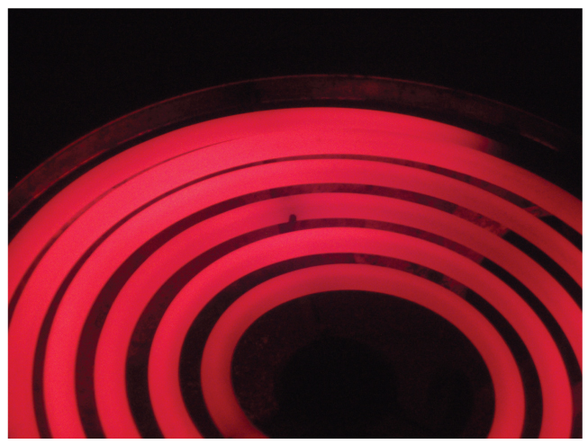

<cnx-pi data-type="cnx.flag.introduction"> class="introduction" </cnx-pi>

<cnx-pi data-type="cnx.eoc">class="summary" title="Chapter Review"</cnx-pi>

<cnx-pi data-type="cnx.eoc">class="interactive-exercise" title="Interactive Link Questions"</cnx-pi>

<cnx-pi data-type="cnx.eoc">class="multiple-choice" title="Review Questions" </cnx-pi>

<cnx-pi data-type="cnx.eoc">class="free-response" title="Critical Thinking Questions"</cnx-pi>

 {: #fig-ch14_00_01 data-title="Too Hot to Touch "}

Chapter Objectives

After studying this chapter, you will be able to:

* Describe the components of the somatic nervous system
* Name the modalities and submodalities of the sensory systems
* Distinguish between general and special senses
* Describe regions of the central nervous system that contribute to somatic functions
* Explain the stimulus-response motor pathway

The somatic nervous system is traditionally considered a division within the peripheral nervous system. However, this misses an important point: somatic refers to a functional division, whereas peripheral refers to an anatomic division. The somatic nervous system is responsible for our conscious perception of the environment and for our voluntary responses to that perception by means of skeletal muscles. Peripheral sensory neurons receive input from environmental stimuli, but the neurons that produce motor responses originate in the central nervous system. The distinction between the structures (i.e., anatomy) of the peripheral and central nervous systems and functions (i.e., physiology) of the somatic and autonomic systems can most easily be demonstrated through a simple reflex action. When you touch a hot stove, you pull your hand away. Sensory receptors in the skin sense extreme temperature and the early signs of tissue damage. This triggers an action potential, which travels along the sensory fiber from the skin, through the dorsal spinal root to the spinal cord, and directly activates a ventral horn motor neuron. That neuron sends a signal along its axon to excite the biceps brachii, causing contraction of the muscle and flexion of the forearm at the elbow to withdraw the hand from the hot stove. The withdrawal reflex has more components, such as inhibiting the opposing muscle and balancing posture while the arm is forcefully withdrawn, which will be further explored at the end of this chapter.

The basic withdrawal reflex explained above includes sensory input (the painful stimulus), central processing (the synapse in the spinal cord), and motor output (activation of a ventral motor neuron that causes contraction of the biceps brachii). Expanding the explanation of the withdrawal reflex can include inhibition of the opposing muscle, or cross extension, either of which increase the complexity of the example by involving more central neurons. A collateral branch of the sensory axon would inhibit another ventral horn motor neuron so that the triceps brachii do not contract and slow the withdrawal down. The cross extensor reflex provides a counterbalancing movement on the other side of the body, which requires another collateral of the sensory axon to activate contraction of the extensor muscles in the contralateral limb.

A more complex example of somatic function is conscious muscle movement. For example, reading of this text starts with visual sensory input to the retina, which then projects to the thalamus, and on to the cerebral cortex. A sequence of regions of the cerebral cortex process the visual information, starting in the primary visual cortex of the occipital lobe, and resulting in the conscious perception of these letters. Subsequent cognitive processing results in understanding of the content. As you continue reading, regions of the cerebral cortex in the frontal lobe plan how to move the eyes to follow the lines of text. The output from the cortex causes activity in motor neurons in the brain stem that cause movement of the extraocular muscles through the third, fourth, and sixth cranial nerves. This example also includes sensory input (the retinal projection to the thalamus), central processing (the thalamus and subsequent cortical activity), and motor output (activation of neurons in the brain stem that lead to coordinated contraction of extraocular muscles).

