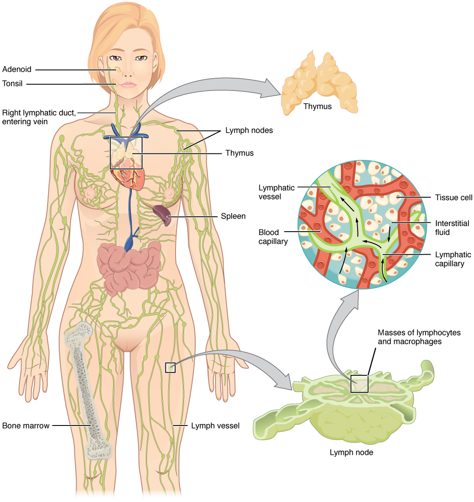
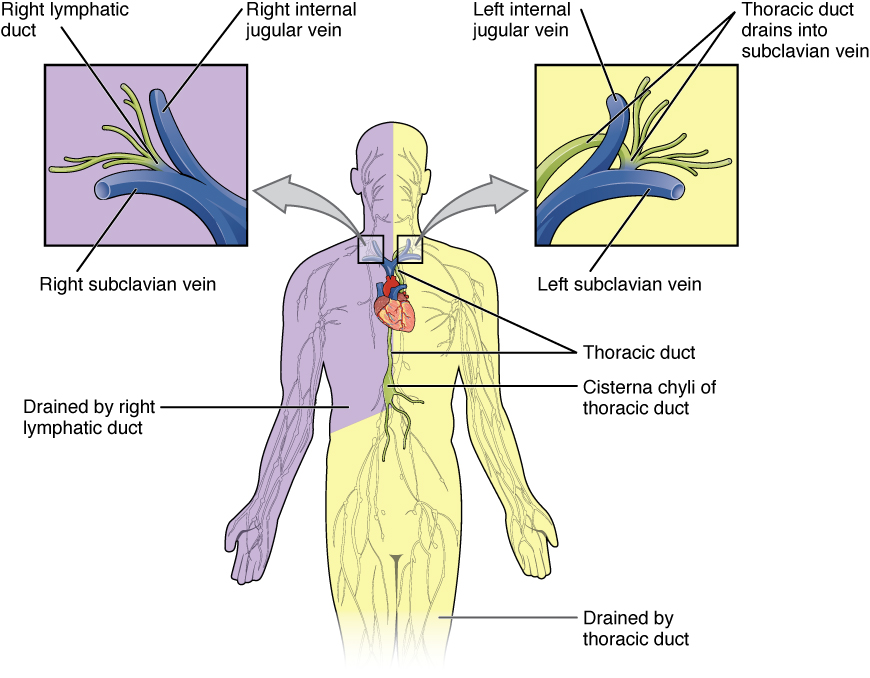
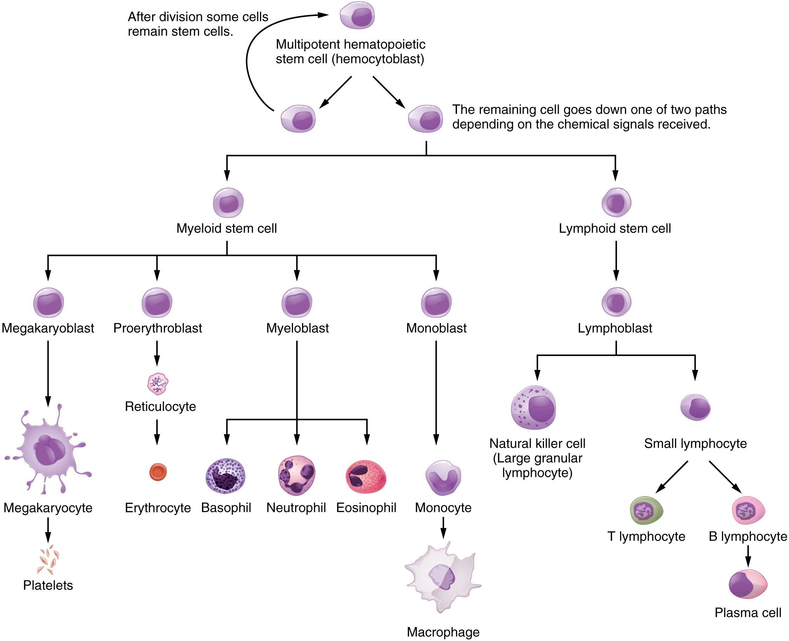
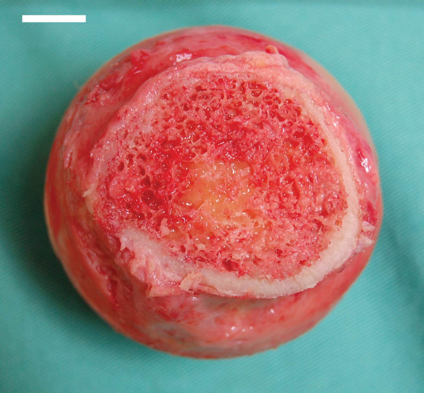

By the end of this section, you will be able to:
* Describe the structure and function of the lymphatic tissue (lymph fluid, vessels, ducts, and organs)
* Describe the structure and function of the primary and secondary lymphatic organs
* Discuss the cells of the immune system, how they function, and their relationship with the lymphatic system

The **immune system**{: data-type="term"} is the complex collection of cells and organs that destroys or neutralizes pathogens that would otherwise cause disease or death. The lymphatic system, for most people, is associated with the immune system to such a degree that the two systems are virtually indistinguishable. The **lymphatic system**{: data-type="term"} is the system of vessels, cells, and organs that carries excess fluids to the bloodstream and filters pathogens from the blood. The swelling of lymph nodes during an infection and the transport of lymphocytes via the lymphatic vessels are but two examples of the many connections between these critical organ systems.

### Functions of the Lymphatic System

A major function of the lymphatic system is to drain body fluids and return them to the bloodstream. Blood pressure causes leakage of fluid from the capillaries, resulting in the accumulation of fluid in the interstitial space—that is, spaces between individual cells in the tissues. In humans, 20 liters of plasma is released into the interstitial space of the tissues each day due to capillary filtration. Once this filtrate is out of the bloodstream and in the tissue spaces, it is referred to as interstitial fluid. Of this, 17 liters is reabsorbed directly by the blood vessels. But what happens to the remaining three liters? This is where the lymphatic system comes into play. It drains the excess fluid and empties it back into the bloodstream via a series of vessels, trunks, and ducts. **Lymph**{: data-type="term"} is the term used to describe interstitial fluid once it has entered the lymphatic system. When the lymphatic system is damaged in some way, such as by being blocked by cancer cells or destroyed by injury, protein-rich interstitial fluid accumulates (sometimes “backs up” from the lymph vessels) in the tissue spaces. This inappropriate accumulation of fluid referred to as lymphedema may lead to serious medical consequences.

As the vertebrate immune system evolved, the network of lymphatic vessels became convenient avenues for transporting the cells of the immune system. Additionally, the transport of dietary lipids and fat-soluble vitamins absorbed in the gut uses this system.

Cells of the immune system not only use lymphatic vessels to make their way from interstitial spaces back into the circulation, but they also use lymph nodes as major staging areas for the development of critical immune responses. A **lymph node**{: data-type="term"} is one of the small, bean-shaped organs located throughout the lymphatic system.

Visit this [website][1] for an overview of the lymphatic system. What are the three main components of the lymphatic system?

### Structure of the Lymphatic System

The lymphatic vessels begin as open-ended capillaries, which feed into larger and larger lymphatic vessels, and eventually empty into the bloodstream by a series of ducts. Along the way, the lymph travels through the lymph nodes, which are commonly found near the groin, armpits, neck, chest, and abdomen. Humans have about 500–600 lymph nodes throughout the body ([\[link\]](#fig-ch22_01_01)).

 {: #fig-ch22_01_01 data-title="Anatomy of the Lymphatic System"}

A major distinction between the lymphatic and cardiovascular systems in humans is that lymph is not actively pumped by the heart, but is forced through the vessels by the movements of the body, the contraction of skeletal muscles during body movements, and breathing. One-way valves (semi-lunar valves) in lymphatic vessels keep the lymph moving toward the heart. Lymph flows from the lymphatic capillaries, through lymphatic vessels, and then is dumped into the circulatory system via the lymphatic ducts located at the junction of the jugular and subclavian veins in the neck.

#### Lymphatic Capillaries

**Lymphatic capillaries**{: data-type="term"}, also called the terminal lymphatics, are vessels where interstitial fluid enters the lymphatic system to become lymph fluid. Located in almost every tissue in the body, these vessels are interlaced among the arterioles and venules of the circulatory system in the soft connective tissues of the body ([\[link\]](#fig-ch22_01_02)). Exceptions are the central nervous system, bone marrow, bones, teeth, and the cornea of the eye, which do not contain lymph vessels.

 . Interstitial fluid slips through spaces between the overlapping endothelial cells that compose the lymphatic capillary."){: #fig-ch22_01_02 data-title="Lymphatic Capillaries "}

Lymphatic capillaries are formed by a one cell-thick layer of endothelial cells and represent the open end of the system, allowing interstitial fluid to flow into them via overlapping cells (see [\[link\]](#fig-ch22_01_02)). When interstitial pressure is low, the endothelial flaps close to prevent “backflow.” As interstitial pressure increases, the spaces between the cells open up, allowing the fluid to enter. Entry of fluid into lymphatic capillaries is also enabled by the collagen filaments that anchor the capillaries to surrounding structures. As interstitial pressure increases, the filaments pull on the endothelial cell flaps, opening up them even further to allow easy entry of fluid.

In the small intestine, lymphatic capillaries called lacteals are critical for the transport of dietary lipids and lipid-soluble vitamins to the bloodstream. In the small intestine, dietary triglycerides combine with other lipids and proteins, and enter the lacteals to form a milky fluid called **chyle**{: data-type="term"}. The chyle then travels through the lymphatic system, eventually entering the bloodstream.

#### Larger Lymphatic Vessels, Trunks, and Ducts

The lymphatic capillaries empty into larger lymphatic vessels, which are similar to veins in terms of their three-tunic structure and the presence of valves. These one-way valves are located fairly close to one another, and each one causes a bulge in the lymphatic vessel, giving the vessels a beaded appearance (see [\[link\]](#fig-ch22_01_02)).

The superficial and deep lymphatics eventually merge to form larger lymphatic vessels known as **lymphatic trunks**{: data-type="term"}. On the right side of the body, the right sides of the head, thorax, and right upper limb drain lymph fluid into the right subclavian vein via the right lymphatic duct ([\[link\]](#fig-ch22_01_03)). On the left side of the body, the remaining portions of the body drain into the larger thoracic duct, which drains into the left subclavian vein. The thoracic duct itself begins just beneath the diaphragm in the **cisterna chyli**{: data-type="term"}, a sac-like chamber that receives lymph from the lower abdomen, pelvis, and lower limbs by way of the left and right lumbar trunks and the intestinal trunk.

 {: #fig-ch22_01_03 data-title="Major Trunks and Ducts of the Lymphatic System"}

The overall drainage system of the body is asymmetrical (see [\[link\]](#fig-ch22_01_03)). The **right lymphatic duct**{: data-type="term"} receives lymph from only the upper right side of the body. The lymph from the rest of the body enters the bloodstream through the **thoracic duct**{: data-type="term"} via all the remaining lymphatic trunks. In general, lymphatic vessels of the subcutaneous tissues of the skin, that is, the superficial lymphatics, follow the same routes as veins, whereas the deep lymphatic vessels of the viscera generally follow the paths of arteries.

### The Organization of Immune Function

The immune system is a collection of barriers, cells, and soluble proteins that interact and communicate with each other in extraordinarily complex ways. The modern model of immune function is organized into three phases based on the timing of their effects. The three temporal phases consist of the following:

* **Barrier defenses**{: data-type="term"} such as the skin and mucous membranes, which act instantaneously to prevent pathogenic invasion into the body tissues
* The rapid but nonspecific **innate immune response**{: data-type="term"}, which consists of a variety of specialized cells and soluble factors
* The slower but more specific and effective **adaptive immune response**{: data-type="term"}, which involves many cell types and soluble factors, but is primarily controlled by white blood cells (leukocytes) known as **lymphocytes**{: data-type="term"}, which help control immune responses

The cells of the blood, including all those involved in the immune response, arise in the bone marrow via various differentiation pathways from hematopoietic stem cells ([\[link\]](#fig-ch22_01_04)). In contrast with embryonic stem cells, hematopoietic stem cells are present throughout adulthood and allow for the continuous differentiation of blood cells to replace those lost to age or function. These cells can be divided into three classes based on function:

* Phagocytic cells, which ingest pathogens to destroy them
* Lymphocytes, which specifically coordinate the activities of adaptive immunity
* Cells containing cytoplasmic granules, which help mediate immune responses against parasites and intracellular pathogens such as viruses

 {: #fig-ch22_01_04 data-title="Hematopoietic System of the Bone Marrow"}

### Lymphocytes: B Cells, T Cells, Plasma Cells, and Natural Killer Cells

As stated above, lymphocytes are the primary cells of adaptive immune responses ([\[link\]](#tbl-ch22_01)). The two basic types of lymphocytes, B cells and T cells, are identical morphologically with a large central nucleus surrounded by a thin layer of cytoplasm. They are distinguished from each other by their surface protein markers as well as by the molecules they secrete. While B cells mature in red bone marrow and T cells mature in the thymus, they both initially develop from bone marrow. T cells migrate from bone marrow to the thymus gland where they further mature. B cells and T cells are found in many parts of the body, circulating in the bloodstream and lymph, and residing in secondary lymphoid organs, including the spleen and lymph nodes, which will be described later in this section. The human body contains approximately 1012 lymphocytes.

#### B Cells

**B cells**{: data-type="term"} are immune cells that function primarily by producing antibodies. An **antibody**{: data-type="term"} is any of the group of proteins that binds specifically to pathogen-associated molecules known as antigens. An **antigen**{: data-type="term"} is a chemical structure on the surface of a pathogen that binds to T or B lymphocyte antigen receptors. Once activated by binding to antigen, B cells differentiate into cells that secrete a soluble form of their surface antibodies. These activated B cells are known as plasma cells.

#### T Cells

The **T cell**{: data-type="term"}, on the other hand, does not secrete antibody but performs a variety of functions in the adaptive immune response. Different T cell types have the ability to either secrete soluble factors that communicate with other cells of the adaptive immune response or destroy cells infected with intracellular pathogens. The roles of T and B lymphocytes in the adaptive immune response will be discussed further in this chapter.

#### Plasma Cells

Another type of lymphocyte of importance is the plasma cell. A **plasma cell**{: data-type="term"} is a B cell that has differentiated in response to antigen binding, and has thereby gained the ability to secrete soluble antibodies. These cells differ in morphology from standard B and T cells in that they contain a large amount of cytoplasm packed with the protein-synthesizing machinery known as rough endoplasmic reticulum.

#### Natural Killer Cells

A fourth important lymphocyte is the natural killer cell, a participant in the innate immune response. A **natural killer cell (NK)**{: data-type="term"} is a circulating blood cell that contains cytotoxic (cell-killing) granules in its extensive cytoplasm. It shares this mechanism with the cytotoxic T cells of the adaptive immune response. NK cells are among the body’s first lines of defense against viruses and certain types of cancer.

<table id="tbl-ch22_01" summary=""><thead>
<tr>
<th colspan="2">Lymphocytes</th>
</tr>
<tr>
<th>Type of lymphocyte</th>
<th>Primary function</th>
</tr>
</thead><tbody>
<tr>
<td>B lymphocyte</td>
<td>Generates diverse antibodies</td>
</tr>
<tr>
<td>T lymphocyte</td>
<td>Secretes chemical messengers</td>
</tr>
<tr>
<td>Plasma cell</td>
<td>Secretes antibodies</td>
</tr>
<tr>
<td>NK cell</td>
<td>Destroys virally infected cells</td>
</tr>
</tbody></table>

Visit this [website][2] to learn about the many different cell types in the immune system and their very specialized jobs. What is the role of the dendritic cell in an HIV infection?

### Primary Lymphoid Organs and Lymphocyte Development

Understanding the differentiation and development of B and T cells is critical to the understanding of the adaptive immune response. It is through this process that the body (ideally) learns to destroy only pathogens and leaves the body’s own cells relatively intact. The **primary lymphoid organs**{: data-type="term"} are the bone marrow and thymus gland. The lymphoid organs are where lymphocytes mature, proliferate, and are selected, which enables them to attack pathogens without harming the cells of the body.

#### Bone Marrow

In the embryo, blood cells are made in the yolk sac. As development proceeds, this function is taken over by the spleen, lymph nodes, and liver. Later, the bone marrow takes over most hematopoietic functions, although the final stages of the differentiation of some cells may take place in other organs. The red **bone marrow**{: data-type="term"} is a loose collection of cells where hematopoiesis occurs, and the yellow bone marrow is a site of energy storage, which consists largely of fat cells ([\[link\]](#fig-ch22_01_05)). The B cell undergoes nearly all of its development in the red bone marrow, whereas the immature T cell, called a **thymocyte**{: data-type="term"}, leaves the bone marrow and matures largely in the thymus gland.

 {: #fig-ch22_01_05 data-title="Bone Marrow"}

#### Thymus

The **thymus**{: data-type="term"} gland is a bilobed organ found in the space between the sternum and the aorta of the heart ([\[link\]](#fig-ch22_01_06)). Connective tissue holds the lobes closely together but also separates them and forms a capsule.

 "){: #fig-ch22_01_06 data-title="Location, Structure, and Histology of the Thymus"}

View the [University of Michigan WebScope][3] to explore the tissue sample in greater detail.

The connective tissue capsule further divides the thymus into lobules via extensions called trabeculae. The outer region of the organ is known as the cortex and contains large numbers of thymocytes with some epithelial cells, macrophages, and dendritic cells (two types of phagocytic cells that are derived from monocytes). The cortex is densely packed so it stains more intensely than the rest of the thymus (see [\[link\]](#fig-ch22_01_06)). The medulla, where thymocytes migrate before leaving the thymus, contains a less dense collection of thymocytes, epithelial cells, and dendritic cells.

Aging and the…

Immune System By the year 2050, 25 percent of the population of the United States will be 60 years of age or older. The CDC estimates that 80 percent of those 60 years and older have one or more chronic disease associated with deficiencies of the immune systems. This loss of immune function with age is called immunosenescence. To treat this growing population, medical professionals must better understand the aging process. One major cause of age-related immune deficiencies is thymic involution, the shrinking of the thymus gland that begins at birth, at a rate of about three percent tissue loss per year, and continues until 35–45 years of age, when the rate declines to about one percent loss per year for the rest of one’s life. At that pace, the total loss of thymic epithelial tissue and thymocytes would occur at about 120 years of age. Thus, this age is a theoretical limit to a healthy human lifespan.

Thymic involution has been observed in all vertebrate species that have a thymus gland. Animal studies have shown that transplanted thymic grafts between inbred strains of mice involuted according to the age of the donor and not of the recipient, implying the process is genetically programmed. There is evidence that the thymic microenvironment, so vital to the development of naïve T cells, loses thymic epithelial cells according to the decreasing expression of the FOXN1 gene with age.

It is also known that thymic involution can be altered by hormone levels. Sex hormones such as estrogen and testosterone enhance involution, and the hormonal changes in pregnant women cause a temporary thymic involution that reverses itself, when the size of the thymus and its hormone levels return to normal, usually after lactation ceases. What does all this tell us? Can we reverse immunosenescence, or at least slow it down? The potential is there for using thymic transplants from younger donors to keep thymic output of naïve T cells high. Gene therapies that target gene expression are also seen as future possibilities. The more we learn through immunosenescence research, the more opportunities there will be to develop therapies, even though these therapies will likely take decades to develop. The ultimate goal is for everyone to live and be healthy longer, but there may be limits to immortality imposed by our genes and hormones.

### Secondary Lymphoid Organs and their Roles in Active Immune Responses

Lymphocytes develop and mature in the primary lymphoid organs, but they mount immune responses from the **secondary lymphoid organs**{: data-type="term"}. A **naïve lymphocyte**{: data-type="term"} is one that has left the primary organ and entered a secondary lymphoid organ. Naïve lymphocytes are fully functional immunologically, but have yet to encounter an antigen to respond to. In addition to circulating in the blood and lymph, lymphocytes concentrate in secondary lymphoid organs, which include the lymph nodes, spleen, and lymphoid nodules. All of these tissues have many features in common, including the following:

* The presence of lymphoid follicles, the sites of the formation of lymphocytes, with specific B cell-rich and T cell-rich areas
* An internal structure of reticular fibers with associated fixed macrophages
* **Germinal centers**{: data-type="term"}, which are the sites of rapidly dividing and differentiating B lymphocytes
* Specialized post-capillary vessels known as **high endothelial venules**{: data-type="term"}; the cells lining these venules are thicker and more columnar than normal endothelial cells, which allow cells from the blood to directly enter these tissues

#### Lymph Nodes

Lymph nodes function to remove debris and pathogens from the lymph, and are thus sometimes referred to as the “filters of the lymph” ([\[link\]](#fig-ch22_01_07)). Any bacteria that infect the interstitial fluid are taken up by the lymphatic capillaries and transported to a regional lymph node. Dendritic cells and macrophages within this organ internalize and kill many of the pathogens that pass through, thereby removing them from the body. The lymph node is also the site of adaptive immune responses mediated by T cells, B cells, and accessory cells of the adaptive immune system. Like the thymus, the bean-shaped lymph nodes are surrounded by a tough capsule of connective tissue and are separated into compartments by trabeculae, the extensions of the capsule. In addition to the structure provided by the capsule and trabeculae, the structural support of the lymph node is provided by a series of reticular fibers laid down by fibroblasts.

 "){: #fig-ch22_01_07 data-title="Structure and Histology of a Lymph Node "}

View the [University of Michigan WebScope][4] to explore the tissue sample in greater detail.

The major routes into the lymph node are via **afferent lymphatic vessels**{: data-type="term"} (see [\[link\]](#fig-ch22_01_07)). Cells and lymph fluid that leave the lymph node may do so by another set of vessels known as the **efferent lymphatic vessels**{: data-type="term"}. Lymph enters the lymph node via the subcapsular sinus, which is occupied by dendritic cells, macrophages, and reticular fibers. Within the cortex of the lymph node are lymphoid follicles, which consist of germinal centers of rapidly dividing B cells surrounded by a layer of T cells and other accessory cells. As the lymph continues to flow through the node, it enters the medulla, which consists of medullary cords of B cells and plasma cells, and the medullary sinuses where the lymph collects before leaving the node via the efferent lymphatic vessels.

#### Spleen

In addition to the lymph nodes, the **spleen**{: data-type="term"} is a major secondary lymphoid organ ([\[link\]](#fig-ch22_01_08)). It is about 12 cm (5 in) long and is attached to the lateral border of the stomach via the gastrosplenic ligament. The spleen is a fragile organ without a strong capsule, and is dark red due to its extensive vascularization. The spleen is sometimes called the “filter of the blood” because of its extensive vascularization and the presence of macrophages and dendritic cells that remove microbes and other materials from the blood, including dying red blood cells. The spleen also functions as the location of immune responses to blood-borne pathogens.

  The spleen is attached to the stomach. (b) A micrograph of spleen tissue shows the germinal center. The marginal zone is the region between the red pulp and white pulp, which sequesters particulate antigens from the circulation and presents these antigens to lymphocytes in the white pulp. EM &#xD7; 660. (Micrograph provided by the Regents of the University of Michigan Medical School &#xA9; 2012)"){: #fig-ch22_01_08 data-title="Spleen "}

The spleen is also divided by trabeculae of connective tissue, and within each splenic nodule is an area of red pulp, consisting of mostly red blood cells, and white pulp, which resembles the lymphoid follicles of the lymph nodes. Upon entering the spleen, the splenic artery splits into several arterioles (surrounded by white pulp) and eventually into sinusoids. Blood from the capillaries subsequently collects in the venous sinuses and leaves via the splenic vein. The red pulp consists of reticular fibers with fixed macrophages attached, free macrophages, and all of the other cells typical of the blood, including some lymphocytes. The white pulp surrounds a central arteriole and consists of germinal centers of dividing B cells surrounded by T cells and accessory cells, including macrophages and dendritic cells. Thus, the red pulp primarily functions as a filtration system of the blood, using cells of the relatively nonspecific immune response, and white pulp is where adaptive T and B cell responses are mounted.

#### Lymphoid Nodules

The other lymphoid tissues, the **lymphoid nodules**{: data-type="term"}, have a simpler architecture than the spleen and lymph nodes in that they consist of a dense cluster of lymphocytes without a surrounding fibrous capsule. These nodules are located in the respiratory and digestive tracts, areas routinely exposed to environmental pathogens.

**Tonsils**{: data-type="term"} are lymphoid nodules located along the inner surface of the pharynx and are important in developing immunity to oral pathogens ([\[link\]](#fig-ch22_01_09)). The tonsil located at the back of the throat, the pharyngeal tonsil, is sometimes referred to as the adenoid when swollen. Such swelling is an indication of an active immune response to infection. Histologically, tonsils do not contain a complete capsule, and the epithelial layer invaginates deeply into the interior of the tonsil to form tonsillar crypts. These structures, which accumulate all sorts of materials taken into the body through eating and breathing, actually “encourage” pathogens to penetrate deep into the tonsillar tissues where they are acted upon by numerous lymphoid follicles and eliminated. This seems to be the major function of tonsils—to help children’s bodies recognize, destroy, and develop immunity to common environmental pathogens so that they will be protected in their later lives. Tonsils are often removed in those children who have recurring throat infections, especially those involving the palatine tonsils on either side of the throat, whose swelling may interfere with their breathing and/or swallowing.

  The pharyngeal tonsil is located on the roof of the posterior superior wall of the nasopharynx. The palatine tonsils lay on each side of the pharynx. (b) A micrograph shows the palatine tonsil tissue. LM &#xD7; 40. (Micrograph provided by the Regents of the University of Michigan Medical School &#xA9; 2012)"){: #fig-ch22_01_09 data-title="Locations and Histology of the Tonsils "}

View the [University of Michigan WebScope][5] to explore the tissue sample in greater detail.

**Mucosa-associated lymphoid tissue (MALT)**{: data-type="term"} consists of an aggregate of lymphoid follicles directly associated with the mucous membrane epithelia. MALT makes up dome-shaped structures found underlying the mucosa of the gastrointestinal tract, breast tissue, lungs, and eyes. Peyer’s patches, a type of MALT in the small intestine, are especially important for immune responses against ingested substances ([\[link\]](#fig-ch22_01_10)). Peyer’s patches contain specialized endothelial cells called M (or microfold) cells that sample material from the intestinal lumen and transport it to nearby follicles so that adaptive immune responses to potential pathogens can be mounted.

 _Nodule.jpg> " LM &#xD7; 40. (Micrograph provided by the Regents of the University of Michigan Medical School &#xA9; 2012)"){: #fig-ch22_01_10 data-title="Mucosa-associated Lymphoid Tissue (MALT) Nodule"}

**Bronchus-associated lymphoid tissue (BALT)**{: data-type="term"} consists of lymphoid follicular structures with an overlying epithelial layer found along the bifurcations of the bronchi, and between bronchi and arteries. They also have the typically less-organized structure of other lymphoid nodules. These tissues, in addition to the tonsils, are effective against inhaled pathogens.

### Chapter Review

The lymphatic system is a series of vessels, ducts, and trunks that remove interstitial fluid from the tissues and return it the blood. The lymphatics are also used to transport dietary lipids and cells of the immune system. Cells of the immune system all come from the hematopoietic system of the bone marrow. Primary lymphoid organs, the bone marrow and thymus gland, are the locations where lymphocytes of the adaptive immune system proliferate and mature. Secondary lymphoid organs are site in which mature lymphocytes congregate to mount immune responses. Many immune system cells use the lymphatic and circulatory systems for transport throughout the body to search for and then protect against pathogens.

### Interactive Link Questions

Visit this [website][1] for an overview of the lymphatic system. What are the three main components of the lymphatic system?

The three main components are the lymph vessels, the lymph nodes, and the lymph.

Visit this [website][2] to learn about the many different cell types in the immune system and their very specialized jobs. What is the role of the dendritic cell in infection by HIV?

The dendritic cell transports the virus to a lymph node.

### Review Questions

Which of the following cells is phagocytic?

1.  plasma cell
2.  macrophage
3.  B cell
4.  NK cell
{: data-number-style="lower-alpha"}

B

Which structure allows lymph from the lower right limb to enter the bloodstream?

1.  thoracic duct
2.  right lymphatic duct
3.  right lymphatic trunk
4.  left lymphatic trunk
{: data-number-style="lower-alpha"}

A

Which of the following cells is important in the innate immune response?

1.  B cells
2.  T cells
3.  macrophages
4.  plasma cells
{: data-number-style="lower-alpha"}

C

Which of the following cells would be most active in early, antiviral immune responses the first time one is exposed to pathogen?

1.  macrophage
2.  T cell
3.  neutrophil
4.  natural killer cell
{: data-number-style="lower-alpha"}

D

Which of the lymphoid nodules is most likely to see food antigens first?

1.  tonsils
2.  Peyer’s patches
3.  bronchus-associated lymphoid tissue
4.  mucosa-associated lymphoid tissue
{: data-number-style="lower-alpha"}

A

### Critical Thinking Questions

Describe the flow of lymph from its origins in interstitial fluid to its emptying into the venous bloodstream.

The lymph enters through lymphatic capillaries, and then into larger lymphatic vessels. The lymph can only go in one direction due to valves in the vessels. The larger lymphatics merge to form trunks that enter into the blood via lymphatic ducts.

### Glossary
{: data-type="glossary-title"}

adaptive immune response
: relatively slow but very specific and effective immune response controlled by lymphocytes
^

afferent lymphatic vessels
: lead into a lymph node
^

antibody
: antigen-specific protein secreted by plasma cells; immunoglobulin
^

antigen
: molecule recognized by the receptors of B and T lymphocytes
^

barrier defenses
: antipathogen defenses deriving from a barrier that physically prevents pathogens from entering the body to establish an infection
^

B cells
: lymphocytes that act by differentiating into an antibody-secreting plasma cell
^

bone marrow
: tissue found inside bones; the site of all blood cell differentiation and maturation of B lymphocytes
^

bronchus-associated lymphoid tissue (BALT)
: lymphoid nodule associated with the respiratory tract
^

chyle
: lipid-rich lymph inside the lymphatic capillaries of the small intestine
^

cisterna chyli
: bag-like vessel that forms the beginning of the thoracic duct
^

efferent lymphatic vessels
: lead out of a lymph node
^

germinal centers
: clusters of rapidly proliferating B cells found in secondary lymphoid tissues
^

high endothelial venules
: vessels containing unique endothelial cells specialized to allow migration of lymphocytes from the blood to the lymph node
^

immune system
: series of barriers, cells, and soluble mediators that combine to response to infections of the body with pathogenic organisms
^

innate immune response
: rapid but relatively nonspecific immune response
^

lymph
: fluid contained within the lymphatic system
^

lymph node
: one of the bean-shaped organs found associated with the lymphatic vessels
^

lymphatic capillaries
: smallest of the lymphatic vessels and the origin of lymph flow
^

lymphatic system
: network of lymphatic vessels, lymph nodes, and ducts that carries lymph from the tissues and back to the bloodstream.
^

lymphatic trunks
: large lymphatics that collect lymph from smaller lymphatic vessels and empties into the blood via lymphatic ducts
^

lymphocytes
: white blood cells characterized by a large nucleus and small rim of cytoplasm
^

lymphoid nodules
: unencapsulated patches of lymphoid tissue found throughout the body
^

mucosa-associated lymphoid tissue (MALT)
: lymphoid nodule associated with the mucosa
^

naïve lymphocyte
: mature B or T cell that has not yet encountered antigen for the first time
^

natural killer cell (NK)
: cytotoxic lymphocyte of innate immune response
^

plasma cell
: differentiated B cell that is actively secreting antibody
^

primary lymphoid organ
: site where lymphocytes mature and proliferate; red bone marrow and thymus gland
^

right lymphatic duct
: drains lymph fluid from the upper right side of body into the right subclavian vein
^

secondary lymphoid organs
: sites where lymphocytes mount adaptive immune responses; examples include lymph nodes and spleen
^

spleen
: secondary lymphoid organ that filters pathogens from the blood (white pulp) and removes degenerating or damaged blood cells (red pulp)
^

T cell
: lymphocyte that acts by secreting molecules that regulate the immune system or by causing the destruction of foreign cells, viruses, and cancer cells
^

thoracic duct
: large duct that drains lymph from the lower limbs, left thorax, left upper limb, and the left side of the head
^

thymocyte
: immature T cell found in the thymus
^

thymus
: primary lymphoid organ; where T lymphocytes proliferate and mature
^

tonsils
: lymphoid nodules associated with the nasopharynx

[1]: http://openstaxcollege.org/l/lymphsystem
[2]: http://openstaxcollege.org/l/immunecells
[3]: http://openstaxcollege.org/l/thymusMG
[4]: http://openstaxcollege.org/l/lymphnodeMG
[5]: http://openstaxcollege.org/l/tonsilMG
