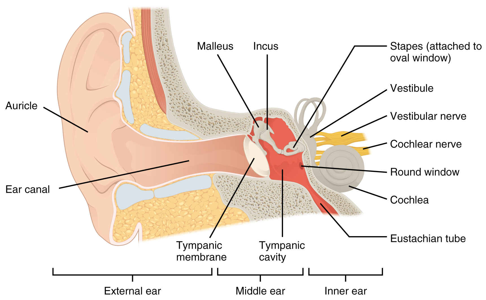
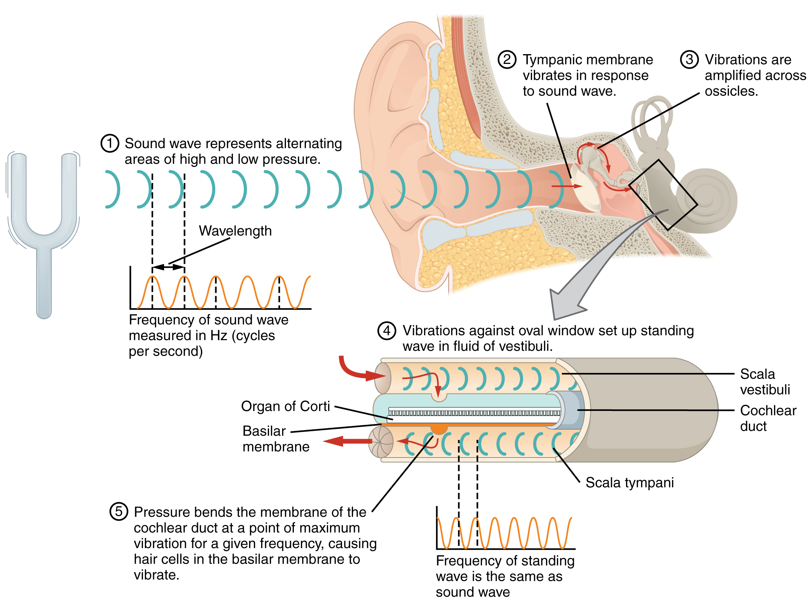
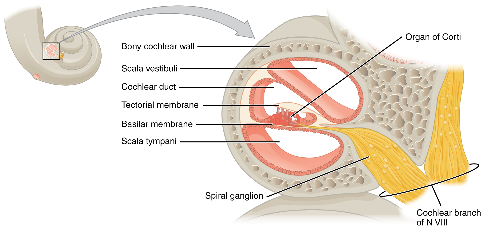
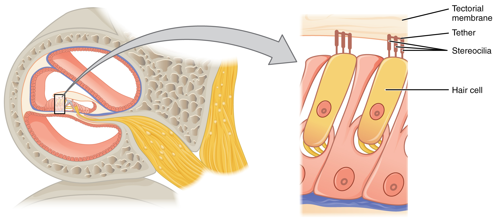
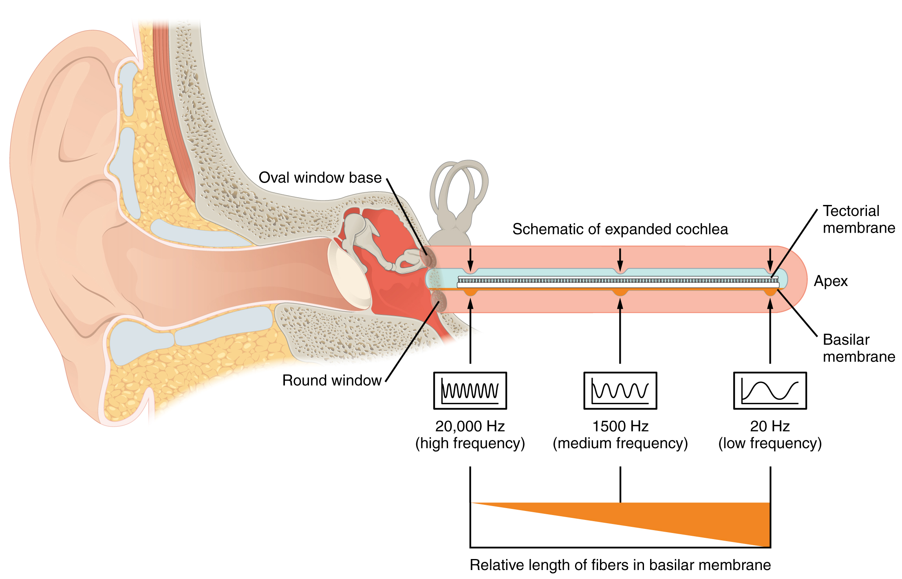
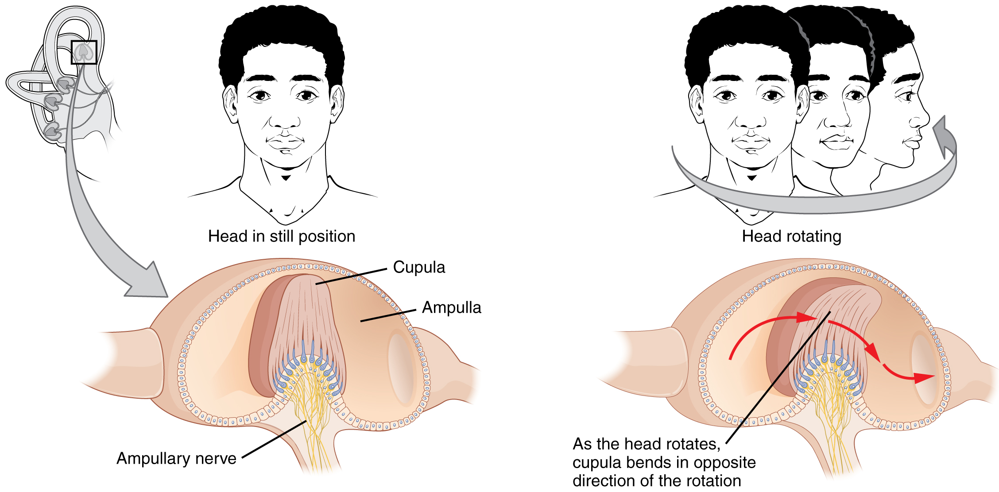
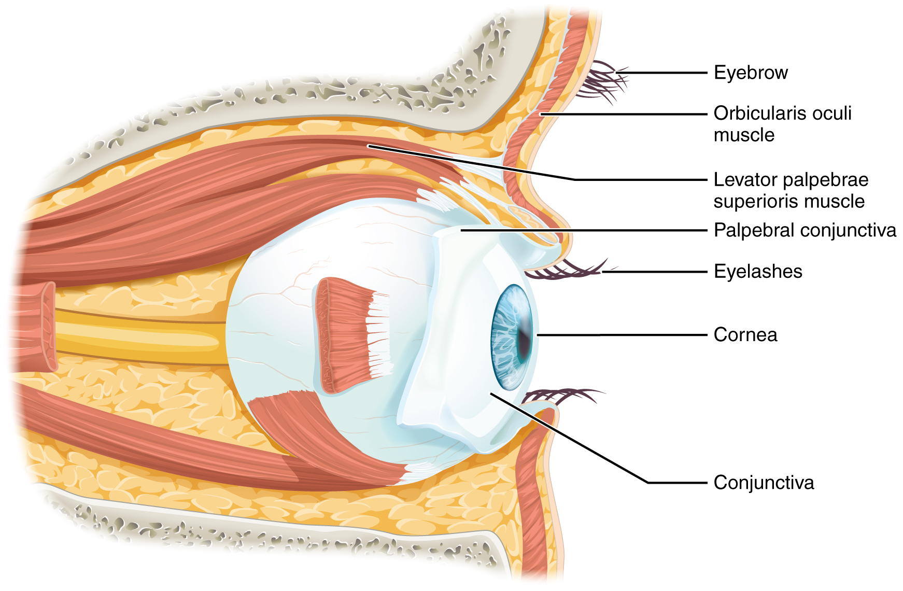
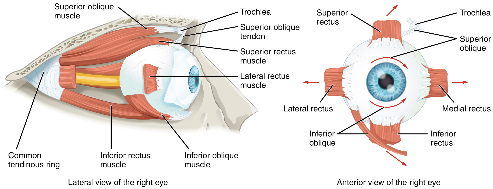
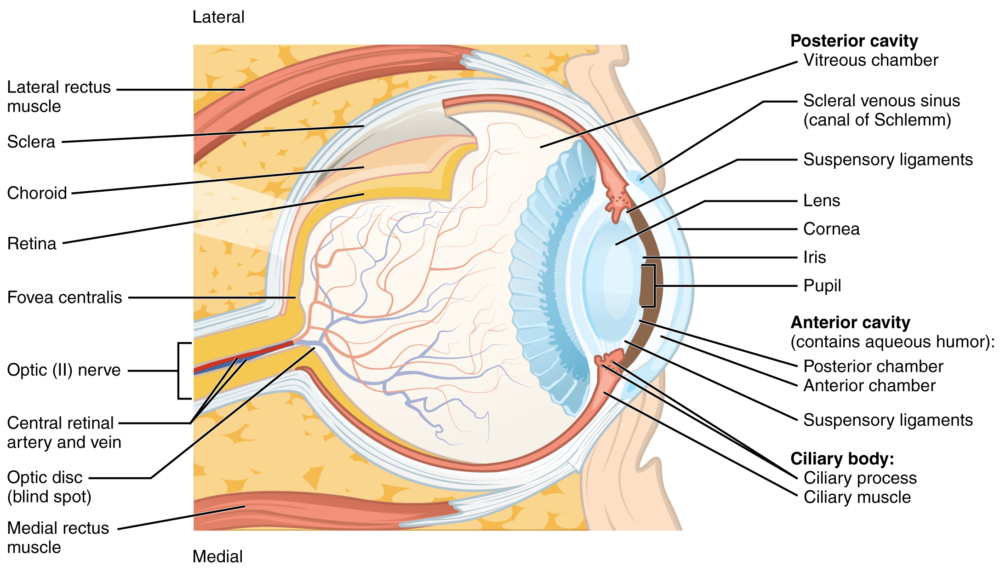
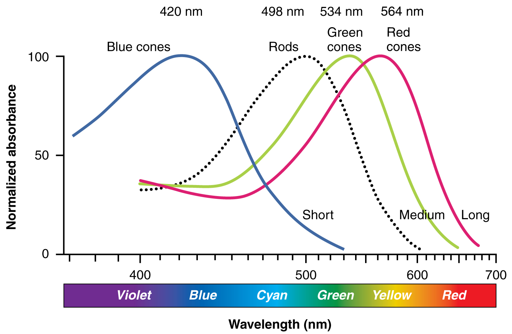

By the end of this section, you will be able to:
* Describe different types of sensory receptors
* Describe the structures responsible for the special senses of taste, smell, hearing, balance, and vision
* Distinguish how different tastes are transduced
* Describe the means of mechanoreception for hearing and balance
* List the supporting structures around the eye and describe the structure of the eyeball
* Describe the processes of phototransduction

A major role of sensory receptors is to help us learn about the environment around us, or about the state of our internal environment. Stimuli from varying sources, and of different types, are received and changed into the electrochemical signals of the nervous system. This occurs when a stimulus changes the cell membrane potential of a sensory neuron. The stimulus causes the sensory cell to produce an action potential that is relayed into the central nervous system (CNS), where it is integrated with other sensory information—or sometimes higher cognitive functions—to become a conscious perception of that stimulus. The central integration may then lead to a motor response.

Describing sensory function with the term sensation or perception is a deliberate distinction. Sensation is the activation of sensory receptor cells at the level of the stimulus. Perception is the central processing of sensory stimuli into a meaningful pattern. Perception is dependent on sensation, but not all sensations are perceived. Receptors are the cells or structures that detect sensations. A receptor cell is changed directly by a stimulus. A transmembrane protein receptor is a protein in the cell membrane that mediates a physiological change in a neuron, most often through the opening of ion channels or changes in the cell signaling processes. Transmembrane receptors are activated by chemicals called ligands. For example, a molecule in food can serve as a ligand for taste receptors. Other transmembrane proteins, which are not accurately called receptors, are sensitive to mechanical or thermal changes. Physical changes in these proteins increase ion flow across the membrane, and can generate an action potential or a graded potential in the sensory neurons.

# Sensory Receptors

Stimuli in the environment activate specialized receptor cells in the peripheral nervous system. Different types of stimuli are sensed by different types of receptor cells. Receptor cells can be classified into types on the basis of three different criteria: cell type, position, and function. Receptors can be classified structurally on the basis of cell type and their position in relation to stimuli they sense. They can also be classified functionally on the basis of the **transduction**{: data-type="term"} of stimuli, or how the mechanical stimulus, light, or chemical changed the cell membrane potential.

## Structural Receptor Types

The cells that interpret information about the environment can be either (1) a neuron that has a **free nerve ending**{: data-type="term"}, with dendrites embedded in tissue that would receive a sensation; (2) a neuron that has an **encapsulated ending**{: data-type="term"} in which the sensory nerve endings are encapsulated in connective tissue that enhances their sensitivity; or (3) a specialized **receptor cell**{: data-type="term"}, which has distinct structural components that interpret a specific type of stimulus ([\[link\]](#fig-ch14_01_01)). The pain and temperature receptors in the dermis of the skin are examples of neurons that have free nerve endings. Also located in the dermis of the skin are lamellated corpuscles, neurons with encapsulated nerve endings that respond to pressure and touch. The cells in the retina that respond to light stimuli are an example of a specialized receptor, a **photoreceptor**{: data-type="term"}.

  free nerve endings or (b) encapsulated endings. Photoreceptors in the eyes, such as rod cells, are examples of (c) specialized receptor cells. These cells release neurotransmitters onto a bipolar cell, which then synapses with the optic nerve neurons."){: #fig-ch14_01_01 data-title="Receptor Classification by Cell Type "}

Another way that receptors can be classified is based on their location relative to the stimuli. An **exteroceptor**{: data-type="term"} is a receptor that is located near a stimulus in the external environment, such as the somatosensory receptors that are located in the skin. An **interoceptor**{: data-type="term"} is one that interprets stimuli from internal organs and tissues, such as the receptors that sense the increase in blood pressure in the aorta or carotid sinus. Finally, a **proprioceptor**{: data-type="term"} is a receptor located near a moving part of the body, such as a muscle, that interprets the positions of the tissues as they move.

## Functional Receptor Types

A third classification of receptors is by how the receptor transduces stimuli into membrane potential changes. Stimuli are of three general types. Some stimuli are ions and macromolecules that affect transmembrane receptor proteins when these chemicals diffuse across the cell membrane. Some stimuli are physical variations in the environment that affect receptor cell membrane potentials. Other stimuli include the electromagnetic radiation from visible light. For humans, the only electromagnetic energy that is perceived by our eyes is visible light. Some other organisms have receptors that humans lack, such as the heat sensors of snakes, the ultraviolet light sensors of bees, or magnetic receptors in migratory birds.

Receptor cells can be further categorized on the basis of the type of stimuli they transduce. Chemical stimuli can be interpreted by a **chemoreceptor**{: data-type="term"} that interprets chemical stimuli, such as an object’s taste or smell. **Osmoreceptors**{: data-type="term"} respond to solute concentrations of body fluids. Additionally, pain is primarily a chemical sense that interprets the presence of chemicals from tissue damage, or similar intense stimuli, through a **nociceptor**{: data-type="term"}. Physical stimuli, such as pressure and vibration, as well as the sensation of sound and body position (balance), are interpreted through a **mechanoreceptor**{: data-type="term"}. Another physical stimulus that has its own type of receptor is temperature, which is sensed through a **thermoreceptor**{: data-type="term"} that is either sensitive to temperatures above (heat) or below (cold) normal body temperature.

# Sensory Modalities

Ask anyone what the senses are, and they are likely to list the five major senses—taste, smell, touch, hearing, and sight. However, these are not all of the senses. The most obvious omission from this list is balance. Also, what is referred to simply as touch can be further subdivided into pressure, vibration, stretch, and hair-follicle position, on the basis of the type of mechanoreceptors that perceive these touch sensations. Other overlooked senses include temperature perception by thermoreceptors and pain perception by nociceptors.

Within the realm of physiology, senses can be classified as either general or specific. A **general sense**{: data-type="term"} is one that is distributed throughout the body and has receptor cells within the structures of other organs. Mechanoreceptors in the skin, muscles, or the walls of blood vessels are examples of this type. General senses often contribute to the sense of touch, as described above, or to **proprioception**{: data-type="term"} (body movement) and **kinesthesia**{: data-type="term"} (body movement), or to a **visceral sense**{: data-type="term"}, which is most important to autonomic functions. A **special sense**{: data-type="term"} is one that has a specific organ devoted to it, namely the eye, inner ear, tongue, or nose.

Each of the senses is referred to as a **sensory modality**{: data-type="term"}. Modality refers to the way that information is encoded, which is similar to the idea of transduction. The main sensory modalities can be described on the basis of how each is transduced. The chemical senses are taste and smell. The general sense that is usually referred to as touch includes chemical sensation in the form of nociception, or pain. Pressure, vibration, muscle stretch, and the movement of hair by an external stimulus, are all sensed by mechanoreceptors. Hearing and balance are also sensed by mechanoreceptors. Finally, vision involves the activation of photoreceptors.

Listing all the different sensory modalities, which can number as many as 17, involves separating the five major senses into more specific categories, or **submodalities**{: data-type="term"}, of the larger sense. An individual sensory modality represents the sensation of a specific type of stimulus. For example, the general sense of touch, which is known as **somatosensation**{: data-type="term"}, can be separated into light pressure, deep pressure, vibration, itch, pain, temperature, or hair movement.

## Gustation (Taste)

Only a few recognized submodalities exist within the sense of taste, or **gustation**{: data-type="term"}. Until recently, only four tastes were recognized: sweet, salty, sour, and bitter. Research at the turn of the 20th century led to recognition of the fifth taste, umami, during the mid-1980s. **Umami**{: data-type="term"} is a Japanese word that means “delicious taste,” and is often translated to mean savory. Very recent research has suggested that there may also be a sixth taste for fats, or lipids.

Gustation is the special sense associated with the tongue. The surface of the tongue, along with the rest of the oral cavity, is lined by a stratified squamous epithelium. Raised bumps called **papillae**{: data-type="term"} (singular = papilla) contain the structures for gustatory transduction. There are four types of papillae, based on their appearance ([\[link\]](#fig-ch14_01_02)): circumvallate, foliate, filiform, and fungiform. Within the structure of the papillae are **taste buds**{: data-type="term"} that contain specialized **gustatory receptor cells**{: data-type="term"} for the transduction of taste stimuli. These receptor cells are sensitive to the chemicals contained within foods that are ingested, and they release neurotransmitters based on the amount of the chemical in the food. Neurotransmitters from the gustatory cells can activate sensory neurons in the facial, glossopharyngeal, and vagus cranial nerves.

"){: #fig-ch14_01_02 data-title="The Tongue "}

Salty taste is simply the perception of sodium ions (Na+) in the saliva. When you eat something salty, the salt crystals dissociate into the component ions Na+ and Cl–, which dissolve into the saliva in your mouth. The Na+ concentration becomes high outside the gustatory cells, creating a strong concentration gradient that drives the diffusion of the ion into the cells. The entry of Na+ into these cells results in the depolarization of the cell membrane and the generation of a receptor potential.

Sour taste is the perception of H+ concentration. Just as with sodium ions in salty flavors, these hydrogen ions enter the cell and trigger depolarization. Sour flavors are, essentially, the perception of acids in our food. Increasing hydrogen ion concentrations in the saliva (lowering saliva pH) triggers progressively stronger graded potentials in the gustatory cells. For example, orange juice—which contains citric acid—will taste sour because it has a pH value of approximately 3. Of course, it is often sweetened so that the sour taste is masked.

The first two tastes (salty and sour) are triggered by the cations Na+ and H+. The other tastes result from food molecules binding to a G protein–coupled receptor. A G protein signal transduction system ultimately leads to depolarization of the gustatory cell. The sweet taste is the sensitivity of gustatory cells to the presence of glucose dissolved in the saliva. Other monosaccharides such as fructose, or artificial sweeteners such as aspartame (NutraSweet™), saccharine, or sucralose (Splenda™) also activate the sweet receptors. The affinity for each of these molecules varies, and some will taste sweeter than glucose because they bind to the G protein–coupled receptor differently.

Bitter taste is similar to sweet in that food molecules bind to G protein–coupled receptors. However, there are a number of different ways in which this can happen because there are a large diversity of bitter-tasting molecules. Some bitter molecules depolarize gustatory cells, whereas others hyperpolarize gustatory cells. Likewise, some bitter molecules increase G protein activation within the gustatory cells, whereas other bitter molecules decrease G protein activation. The specific response depends on which molecule is binding to the receptor.

One major group of bitter-tasting molecules are alkaloids. **Alkaloids**{: data-type="term"} are nitrogen containing molecules that are commonly found in bitter-tasting plant products, such as coffee, hops (in beer), tannins (in wine), tea, and aspirin. By containing toxic alkaloids, the plant is less susceptible to microbe infection and less attractive to herbivores.

Therefore, the function of bitter taste may primarily be related to stimulating the gag reflex to avoid ingesting poisons. Because of this, many bitter foods that are normally ingested are often combined with a sweet component to make them more palatable (cream and sugar in coffee, for example). The highest concentration of bitter receptors appear to be in the posterior tongue, where a gag reflex could still spit out poisonous food.

The taste known as umami is often referred to as the savory taste. Like sweet and bitter, it is based on the activation of G protein–coupled receptors by a specific molecule. The molecule that activates this receptor is the amino acid L-glutamate. Therefore, the umami flavor is often perceived while eating protein-rich foods. Not surprisingly, dishes that contain meat are often described as savory.

Once the gustatory cells are activated by the taste molecules, they release neurotransmitters onto the dendrites of sensory neurons. These neurons are part of the facial and glossopharyngeal cranial nerves, as well as a component within the vagus nerve dedicated to the gag reflex. The facial nerve connects to taste buds in the anterior third of the tongue. The glossopharyngeal nerve connects to taste buds in the posterior two thirds of the tongue. The vagus nerve connects to taste buds in the extreme posterior of the tongue, verging on the pharynx, which are more sensitive to noxious stimuli such as bitterness.

  
Watch this [video][1] to learn about Dr. Danielle Reed of the Monell Chemical Senses Center in Philadelphia, Pennsylvania, who became interested in science at an early age because of her sensory experiences. She recognized that her sense of taste was unique compared with other people she knew. Now, she studies the genetic differences between people and their sensitivities to taste stimuli. In the video, there is a brief image of a person sticking out their tongue, which has been covered with a colored dye. This is how Dr. Reed is able to visualize and count papillae on the surface of the tongue. People fall into two groups known as “tasters” and “non-tasters” based on the density of papillae on their tongue, which also indicates the number of taste buds. Non-tasters can taste food, but they are not as sensitive to certain tastes, such as bitterness. Dr. Reed discovered that she is a non-taster, which explains why she perceived bitterness differently than other people she knew. Are you very sensitive to tastes? Can you see any similarities among the members of your family?

## Olfaction (Smell)

Like taste, the sense of smell, or **olfaction**{: data-type="term"}, is also responsive to chemical stimuli. The olfactory receptor neurons are located in a small region within the superior nasal cavity ([\[link\]](#fig-ch14_01_03)). This region is referred to as the **olfactory epithelium**{: data-type="term"} and contains bipolar sensory neurons. Each **olfactory sensory neuron**{: data-type="term"} has dendrites that extend from the apical surface of the epithelium into the mucus lining the cavity. As airborne molecules are inhaled through the nose, they pass over the olfactory epithelial region and dissolve into the mucus. These **odorant molecules**{: data-type="term"} bind to proteins that keep them dissolved in the mucus and help transport them to the olfactory dendrites. The odorant–protein complex binds to a receptor protein within the cell membrane of an olfactory dendrite. These receptors are G protein–coupled, and will produce a graded membrane potential in the olfactory neurons.

The axon of an olfactory neuron extends from the basal surface of the epithelium, through an olfactory foramen in the cribriform plate of the ethmoid bone, and into the brain. The group of axons called the olfactory tract connect to the **olfactory bulb**{: data-type="term"} on the ventral surface of the frontal lobe. From there, the axons split to travel to several brain regions. Some travel to the cerebrum, specifically to the primary olfactory cortex that is located in the inferior and medial areas of the temporal lobe. Others project to structures within the limbic system and hypothalamus, where smells become associated with long-term memory and emotional responses. This is how certain smells trigger emotional memories, such as the smell of food associated with one’s birthplace. Smell is the one sensory modality that does not synapse in the thalamus before connecting to the cerebral cortex. This intimate connection between the olfactory system and the cerebral cortex is one reason why smell can be a potent trigger of memories and emotion.

The nasal epithelium, including the olfactory cells, can be harmed by airborne toxic chemicals. Therefore, the olfactory neurons are regularly replaced within the nasal epithelium, after which the axons of the new neurons must find their appropriate connections in the olfactory bulb. These new axons grow along the axons that are already in place in the cranial nerve.

  The olfactory system begins in the peripheral structures of the nasal cavity. (b) The olfactory receptor neurons are within the olfactory epithelium. (c) Axons of the olfactory receptor neurons project through the cribriform plate of the ethmoid bone and synapse with the neurons of the olfactory bulb (tissue source: simian). LM &#xD7; 812. (Micrograph provided by the Regents of University of Michigan Medical School &#xA9; 2012)"){: #fig-ch14_01_03 data-title="The Olfactory System "}

Disorders of the…

Olfactory System: Anosmia Blunt force trauma to the face, such as that common in many car accidents, can lead to the loss of the olfactory nerve, and subsequently, loss of the sense of smell. This condition is known as **anosmia**{: data-type="term"}. When the frontal lobe of the brain moves relative to the ethmoid bone, the olfactory tract axons may be sheared apart. Professional fighters often experience anosmia because of repeated trauma to face and head. In addition, certain pharmaceuticals, such as antibiotics, can cause anosmia by killing all the olfactory neurons at once. If no axons are in place within the olfactory nerve, then the axons from newly formed olfactory neurons have no guide to lead them to their connections within the olfactory bulb. There are temporary causes of anosmia, as well, such as those caused by inflammatory responses related to respiratory infections or allergies.

Loss of the sense of smell can result in food tasting bland. A person with an impaired sense of smell may require additional spice and seasoning levels for food to be tasted. Anosmia may also be related to some presentations of mild depression, because the loss of enjoyment of food may lead to a general sense of despair.

The ability of olfactory neurons to replace themselves decreases with age, leading to age-related anosmia. This explains why some elderly people salt their food more than younger people do. However, this increased sodium intake can increase blood volume and blood pressure, increasing the risk of cardiovascular diseases in the elderly.

## Audition (Hearing)

Hearing, or **audition**{: data-type="term"}, is the transduction of sound waves into a neural signal that is made possible by the structures of the ear ([\[link\]](#fig-ch14_01_04)). The large, fleshy structure on the lateral aspect of the head is known as the **auricle**{: data-type="term"}. Some sources will also refer to this structure as the pinna, though that term is more appropriate for a structure that can be moved, such as the external ear of a cat. The C-shaped curves of the auricle direct sound waves toward the auditory canal. The canal enters the skull through the external auditory meatus of the temporal bone. At the end of the auditory canal is the **tympanic membrane**{: data-type="term"}, or ear drum, which vibrates after it is struck by sound waves. The auricle, ear canal, and tympanic membrane are often referred to as the **external ear**{: data-type="term"}. The **middle ear**{: data-type="term"} consists of a space spanned by three small bones called the **ossicles**{: data-type="term"}. The three ossicles are the **malleus**{: data-type="term"}, **incus**{: data-type="term"}, and **stapes**{: data-type="term"}, which are Latin names that roughly translate to hammer, anvil, and stirrup. The malleus is attached to the tympanic membrane and articulates with the incus. The incus, in turn, articulates with the stapes. The stapes is then attached to the **inner ear**{: data-type="term"}, where the sound waves will be transduced into a neural signal. The middle ear is connected to the pharynx through the Eustachian tube, which helps equilibrate air pressure across the tympanic membrane. The tube is normally closed but will pop open when the muscles of the pharynx contract during swallowing or yawning.

{: #fig-ch14_01_04 data-title="Structures of the Ear "}

The inner ear is often described as a bony labyrinth, as it is composed of a series of canals embedded within the temporal bone. It has two separate regions, the **cochlea**{: data-type="term"} and the **vestibule**{: data-type="term"}, which are responsible for hearing and balance, respectively. The neural signals from these two regions are relayed to the brain stem through separate fiber bundles. However, these two distinct bundles travel together from the inner ear to the brain stem as the vestibulocochlear nerve. Sound is transduced into neural signals within the cochlear region of the inner ear, which contains the sensory neurons of the **spiral ganglia**{: data-type="term"}. These ganglia are located within the spiral-shaped cochlea of the inner ear. The cochlea is attached to the stapes through the **oval window**{: data-type="term"}.

The oval window is located at the beginning of a fluid-filled tube within the cochlea called the **scala vestibuli**{: data-type="term"}. The scala vestibuli extends from the oval window, travelling above the **cochlear duct**{: data-type="term"}, which is the central cavity of the cochlea that contains the sound-transducing neurons. At the uppermost tip of the cochlea, the scala vestibuli curves over the top of the cochlear duct. The fluid-filled tube, now called the **scala tympani**{: data-type="term"}, returns to the base of the cochlea, this time travelling under the cochlear duct. The scala tympani ends at the **round window**{: data-type="term"}, which is covered by a membrane that contains the fluid within the scala. As vibrations of the ossicles travel through the oval window, the fluid of the scala vestibuli and scala tympani moves in a wave-like motion. The frequency of the fluid waves match the frequencies of the sound waves ([\[link\]](#fig-ch14_01_05)). The membrane covering the round window will bulge out or pucker in with the movement of the fluid within the scala tympani.

{: #fig-ch14_01_05 data-title="Transmission of Sound Waves to Cochlea "}

A cross-sectional view of the cochlea shows that the scala vestibuli and scala tympani run along both sides of the cochlear duct ([\[link\]](#fig-ch14_01_06)). The cochlear duct contains several **organs of Corti**{: data-type="term"}, which tranduce the wave motion of the two scala into neural signals. The organs of Corti lie on top of the **basilar membrane**{: data-type="term"}, which is the side of the cochlear duct located between the organs of Corti and the scala tympani. As the fluid waves move through the scala vestibuli and scala tympani, the basilar membrane moves at a specific spot, depending on the frequency of the waves. Higher frequency waves move the region of the basilar membrane that is close to the base of the cochlea. Lower frequency waves move the region of the basilar membrane that is near the tip of the cochlea.

{: #fig-ch14_01_06 data-title="Cross Section of the Cochlea "}

The organs of Corti contain **hair cells**{: data-type="term"}, which are named for the hair-like **stereocilia**{: data-type="term"} extending from the cell’s apical surfaces ([\[link\]](#fig-ch14_01_07)). The stereocilia are an array of microvilli-like structures arranged from tallest to shortest. Protein fibers tether adjacent hairs together within each array, such that the array will bend in response to movements of the basilar membrane. The stereocilia extend up from the hair cells to the overlying **tectorial membrane**{: data-type="term"}, which is attached medially to the organ of Corti. When the pressure waves from the scala move the basilar membrane, the tectorial membrane slides across the stereocilia. This bends the stereocilia either toward or away from the tallest member of each array. When the stereocilia bend toward the tallest member of their array, tension in the protein tethers opens ion channels in the hair cell membrane. This will depolarize the hair cell membrane, triggering nerve impulses that travel down the afferent nerve fibers attached to the hair cells. When the stereocilia bend toward the shortest member of their array, the tension on the tethers slackens and the ion channels close. When no sound is present, and the stereocilia are standing straight, a small amount of tension still exists on the tethers, keeping the membrane potential of the hair cell slightly depolarized.

 {: #fig-ch14_01_07 data-title="Hair Cell "}

"){: #fig-ch14_01_08 data-title="Cochlea and Organ of Corti "}

  
View the [ University of Michigan WebScope][2] to explore the tissue sample in greater detail. The basilar membrane is the thin membrane that extends from the central core of the cochlea to the edge. What is anchored to this membrane so that they can be activated by movement of the fluids within the cochlea?

As stated above, a given region of the basilar membrane will only move if the incoming sound is at a specific frequency. Because the tectorial membrane only moves where the basilar membrane moves, the hair cells in this region will also only respond to sounds of this specific frequency. Therefore, as the frequency of a sound changes, different hair cells are activated all along the basilar membrane. The cochlea encodes auditory stimuli for frequencies between 20 and 20,000 Hz, which is the range of sound that human ears can detect. The unit of Hertz measures the frequency of sound waves in terms of cycles produced per second. Frequencies as low as 20 Hz are detected by hair cells at the apex, or tip, of the cochlea. Frequencies in the higher ranges of 20 KHz are encoded by hair cells at the base of the cochlea, close to the round and oval windows ([\[link\]](#fig-ch14_01_09)). Most auditory stimuli contain a mixture of sounds at a variety of frequencies and intensities (represented by the amplitude of the sound wave). The hair cells along the length of the cochlear duct, which are each sensitive to a particular frequency, allow the cochlea to separate auditory stimuli by frequency, just as a prism separates visible light into its component colors.

{: #fig-ch14_01_09 data-title="Frequency Coding in the Cochlea "}

  
Watch this [video][3] to learn more about how the structures of the ear convert sound waves into a neural signal by moving the “hairs,” or stereocilia, of the cochlear duct. Specific locations along the length of the duct encode specific frequencies, or pitches. The brain interprets the meaning of the sounds we hear as music, speech, noise, etc. Which ear structures are responsible for the amplification and transfer of sound from the external ear to the inner ear?

  
Watch this [animation][4] to learn more about the inner ear and to see the cochlea unroll, with the base at the back of the image and the apex at the front. Specific wavelengths of sound cause specific regions of the basilar membrane to vibrate, much like the keys of a piano produce sound at different frequencies. Based on the animation, where do frequencies—from high to low pitches—cause activity in the hair cells within the cochlear duct?

## Equilibrium (Balance)

Along with audition, the inner ear is responsible for encoding information about **equilibrium**{: data-type="term"}, the sense of balance. A similar mechanoreceptor—a hair cell with stereocilia—senses head position, head movement, and whether our bodies are in motion. These cells are located within the vestibule of the inner ear. Head position is sensed by the **utricle**{: data-type="term"} and **saccule**{: data-type="term"}, whereas head movement is sensed by the **semicircular canals**{: data-type="term"}. The neural signals generated in the **vestibular ganglion**{: data-type="term"} are transmitted through the vestibulocochlear nerve to the brain stem and cerebellum.

The utricle and saccule are both largely composed of **macula**{: data-type="term"} tissue (plural = maculae). The macula is composed of hair cells surrounded by support cells. The stereocilia of the hair cells extend into a viscous gel called the **otolithic membrane**{: data-type="term"} ([\[link\]](#fig-ch14_01_10)). On top of the otolithic membrane is a layer of calcium carbonate crystals, called otoliths. The otoliths essentially make the otolithic membrane top-heavy. The otolithic membrane moves separately from the macula in response to head movements. Tilting the head causes the otolithic membrane to slide over the macula in the direction of gravity. The moving otolithic membrane, in turn, bends the sterocilia, causing some hair cells to depolarize as others hyperpolarize. The exact position of the head is interpreted by the brain based on the pattern of hair-cell depolarization.

{: #fig-ch14_01_10 data-title="Linear Acceleration Coding by Maculae "}

The semicircular canals are three ring-like extensions of the vestibule. One is oriented in the horizontal plane, whereas the other two are oriented in the vertical plane. The anterior and posterior vertical canals are oriented at approximately 45 degrees relative to the sagittal plane ([\[link\]](#fig-ch14_01_11)). The base of each semicircular canal, where it meets with the vestibule, connects to an enlarged region known as the **ampulla**{: data-type="term"}. The ampulla contains the hair cells that respond to rotational movement, such as turning the head while saying “no.” The stereocilia of these hair cells extend into the **cupula**{: data-type="term"}, a membrane that attaches to the top of the ampulla. As the head rotates in a plane parallel to the semicircular canal, the fluid lags, deflecting the cupula in the direction opposite to the head movement. The semicircular canals contain several ampullae, with some oriented horizontally and others oriented vertically. By comparing the relative movements of both the horizontal and vertical ampullae, the vestibular system can detect the direction of most head movements within three-dimensional (3-D) space.

{: #fig-ch14_01_11 data-title="Rotational Coding by Semicircular Canals "}

## Somatosensation (Touch)

Somatosensation is considered a general sense, as opposed to the special senses discussed in this section. Somatosensation is the group of sensory modalities that are associated with touch, proprioception, and interoception. These modalities include pressure, vibration, light touch, tickle, itch, temperature, pain, proprioception, and kinesthesia. This means that its receptors are not associated with a specialized organ, but are instead spread throughout the body in a variety of organs. Many of the somatosensory receptors are located in the skin, but receptors are also found in muscles, tendons, joint capsules, ligaments, and in the walls of visceral organs.

Two types of somatosensory signals that are transduced by free nerve endings are pain and temperature. These two modalities use thermoreceptors and nociceptors to transduce temperature and pain stimuli, respectively. Temperature receptors are stimulated when local temperatures differ from body temperature. Some thermoreceptors are sensitive to just cold and others to just heat. Nociception is the sensation of potentially damaging stimuli. Mechanical, chemical, or thermal stimuli beyond a set threshold will elicit painful sensations. Stressed or damaged tissues release chemicals that activate receptor proteins in the nociceptors. For example, the sensation of heat associated with spicy foods involves **capsaicin**{: data-type="term"}, the active molecule in hot peppers. Capsaicin molecules bind to a transmembrane ion channel in nociceptors that is sensitive to temperatures above 37°C. The dynamics of capsaicin binding with this transmembrane ion channel is unusual in that the molecule remains bound for a long time. Because of this, it will decrease the ability of other stimuli to elicit pain sensations through the activated nociceptor. For this reason, capsaicin can be used as a topical analgesic, such as in products such as Icy Hot™.

If you drag your finger across a textured surface, the skin of your finger will vibrate. Such low frequency vibrations are sensed by mechanoreceptors called Merkel cells, also known as type I cutaneous mechanoreceptors. Merkel cells are located in the stratum basale of the epidermis. Deep pressure and vibration is transduced by lamellated (Pacinian) corpuscles, which are receptors with encapsulated endings found deep in the dermis, or subcutaneous tissue. Light touch is transduced by the encapsulated endings known as tactile (Meissner) corpuscles. Follicles are also wrapped in a plexus of nerve endings known as the hair follicle plexus. These nerve endings detect the movement of hair at the surface of the skin, such as when an insect may be walking along the skin. Stretching of the skin is transduced by stretch receptors known as bulbous corpuscles. Bulbous corpuscles are also known as Ruffini corpuscles, or type II cutaneous mechanoreceptors.

Other somatosensory receptors are found in the joints and muscles. Stretch receptors monitor the stretching of tendons, muscles, and the components of joints. For example, have you ever stretched your muscles before or after exercise and noticed that you can only stretch so far before your muscles spasm back to a less stretched state? This spasm is a reflex that is initiated by stretch receptors to avoid muscle tearing. Such stretch receptors can also prevent over-contraction of a muscle. In skeletal muscle tissue, these stretch receptors are called muscle spindles. Golgi tendon organs similarly transduce the stretch levels of tendons. Bulbous corpuscles are also present in joint capsules, where they measure stretch in the components of the skeletal system within the joint. The types of nerve endings, their locations, and the stimuli they transduce are presented in [\[link\]](#tbl-ch14_01).

<table id="tbl-ch14_01" summary=""><caption>*No corresponding eponymous name.</caption><thead>
<tr>
<th colspan="4">Mechanoreceptors of Somatosensation</th>
</tr>
<tr>
<th>Name</th>
<th>Historical (eponymous) name</th>
<th>Location(s)</th>
<th>Stimuli</th>
</tr>
</thead><tbody>
<tr>
<td>Free nerve endings</td>
<td>*</td>
<td>Dermis, cornea, tongue, joint capsules, visceral organs</td>
<td>Pain, temperature, mechanical deformation</td>
</tr>
<tr>
<td>Mechanoreceptors</td>
<td>Merkel’s discs</td>
<td>Epidermal–dermal junction, mucosal membranes</td>
<td>Low frequency vibration (5–15 Hz)</td>
</tr>
<tr>
<td>Bulbous corpuscle</td>
<td>Ruffini’s corpuscle</td>
<td>Dermis, joint capsules</td>
<td>Stretch</td>
</tr>
<tr>
<td>Tactile corpuscle</td>
<td>Meissner’s corpuscle</td>
<td>Papillary dermis, especially in the fingertips and lips</td>
<td>Light touch, vibrations below 50 Hz</td>
</tr>
<tr>
<td>Lamellated corpuscle</td>
<td>Pacinian corpuscle</td>
<td>Deep dermis, subcutaneous tissue</td>
<td>Deep pressure, high-frequency vibration (around 250 Hz)</td>
</tr>
<tr>
<td>Hair follicle plexus</td>
<td>*</td>
<td>Wrapped around hair follicles in the dermis</td>
<td>Movement of hair</td>
</tr>
<tr>
<td>Muscle spindle</td>
<td>*</td>
<td>In line with skeletal muscle fibers</td>
<td>Muscle contraction and stretch</td>
</tr>
<tr>
<td>Tendon stretch organ</td>
<td>Golgi tendon organ</td>
<td>In line with tendons</td>
<td>Stretch of tendons</td>
</tr>
</tbody></table>

## Vision

**Vision**{: data-type="term"} is the special sense of sight that is based on the transduction of light stimuli received through the eyes. The eyes are located within either orbit in the skull. The bony orbits surround the eyeballs, protecting them and anchoring the soft tissues of the eye ([\[link\]](#fig-ch14_01_12)). The eyelids, with lashes at their leading edges, help to protect the eye from abrasions by blocking particles that may land on the surface of the eye. The inner surface of each lid is a thin membrane known as the **palpebral conjunctiva**{: data-type="term"}. The conjunctiva extends over the white areas of the eye (the sclera), connecting the eyelids to the eyeball. Tears are produced by the **lacrimal gland**{: data-type="term"}, located beneath the lateral edges of the nose. Tears produced by this gland flow through the **lacrimal duct**{: data-type="term"} to the medial corner of the eye, where the tears flow over the conjunctiva, washing away foreign particles.

 {: #fig-ch14_01_12 data-title="The Eye in the Orbit "}

Movement of the eye within the orbit is accomplished by the contraction of six **extraocular muscles**{: data-type="term"} that originate from the bones of the orbit and insert into the surface of the eyeball ([\[link\]](#fig-ch14_01_13)). Four of the muscles are arranged at the cardinal points around the eye and are named for those locations. They are the **superior rectus**{: data-type="term"}, **medial rectus**{: data-type="term"}, **inferior rectus**{: data-type="term"}, and **lateral rectus**{: data-type="term"}. When each of these muscles contract, the eye to moves toward the contracting muscle. For example, when the superior rectus contracts, the eye rotates to look up. The **superior oblique**{: data-type="term"} originates at the posterior orbit, near the origin of the four rectus muscles. However, the tendon of the oblique muscles threads through a pulley-like piece of cartilage known as the **trochlea**{: data-type="term"}. The tendon inserts obliquely into the superior surface of the eye. The angle of the tendon through the trochlea means that contraction of the superior oblique rotates the eye medially. The **inferior oblique**{: data-type="term"} muscle originates from the floor of the orbit and inserts into the inferolateral surface of the eye. When it contracts, it laterally rotates the eye, in opposition to the superior oblique. Rotation of the eye by the two oblique muscles is necessary because the eye is not perfectly aligned on the sagittal plane. When the eye looks up or down, the eye must also rotate slightly to compensate for the superior rectus pulling at approximately a 20-degree angle, rather than straight up. The same is true for the inferior rectus, which is compensated by contraction of the inferior oblique. A seventh muscle in the orbit is the **levator palpebrae superioris**{: data-type="term"}, which is responsible for elevating and retracting the upper eyelid, a movement that usually occurs in concert with elevation of the eye by the superior rectus (see [\[link\]](#fig-ch14_01_12)).

The extraocular muscles are innervated by three cranial nerves. The lateral rectus, which causes abduction of the eye, is innervated by the abducens nerve. The superior oblique is innervated by the trochlear nerve. All of the other muscles are innervated by the oculomotor nerve, as is the levator palpebrae superioris. The motor nuclei of these cranial nerves connect to the brain stem, which coordinates eye movements.

{: #fig-ch14_01_13 data-title="Extraocular Muscles "}

The eye itself is a hollow sphere composed of three layers of tissue. The outermost layer is the **fibrous tunic**{: data-type="term"}, which includes the white **sclera**{: data-type="term"} and clear **cornea**{: data-type="term"}. The sclera accounts for five sixths of the surface of the eye, most of which is not visible, though humans are unique compared with many other species in having so much of the “white of the eye” visible ([\[link\]](#fig-ch14_01_14)). The transparent cornea covers the anterior tip of the eye and allows light to enter the eye. The middle layer of the eye is the **vascular tunic**{: data-type="term"}, which is mostly composed of the choroid, ciliary body, and iris. The **choroid**{: data-type="term"} is a layer of highly vascularized connective tissue that provides a blood supply to the eyeball. The choroid is posterior to the **ciliary body**{: data-type="term"}, a muscular structure that is attached to the **lens**{: data-type="term"} by suspensory ligaments, or **zonule fibers**{: data-type="term"}. These two structures bend the lens, allowing it to focus light on the back of the eye. Overlaying the ciliary body, and visible in the anterior eye, is the **iris**{: data-type="term"}—the colored part of the eye. The iris is a smooth muscle that opens or closes the **pupil**{: data-type="term"}, which is the hole at the center of the eye that allows light to enter. The iris constricts the pupil in response to bright light and dilates the pupil in response to dim light. The innermost layer of the eye is the **neural tunic**{: data-type="term"}, or **retina**{: data-type="term"}, which contains the nervous tissue responsible for photoreception.

The eye is also divided into two cavities: the anterior cavity and the posterior cavity. The anterior cavity is the space between the cornea and lens, including the iris and ciliary body. It is filled with a watery fluid called the **aqueous humor**{: data-type="term"}. The posterior cavity is the space behind the lens that extends to the posterior side of the interior eyeball, where the retina is located. The posterior cavity is filled with a more viscous fluid called the **vitreous humor**{: data-type="term"}.

The retina is composed of several layers and contains specialized cells for the initial processing of visual stimuli. The photoreceptors (rods and cones) change their membrane potential when stimulated by light energy. The change in membrane potential alters the amount of neurotransmitter that the photoreceptor cells release onto **bipolar cells**{: data-type="term"} in the **outer synaptic layer**{: data-type="term"}. It is the bipolar cell in the retina that connects a photoreceptor to a **retinal ganglion cell (RGC)**{: data-type="term"} in the **inner synaptic layer**{: data-type="term"}. There, **amacrine cells**{: data-type="term"} additionally contribute to retinal processing before an action potential is produced by the RGC. The axons of RGCs, which lie at the innermost layer of the retina, collect at the **optic disc**{: data-type="term"} and leave the eye as the **optic nerve**{: data-type="term"} (see [\[link\]](#fig-ch14_01_14)). Because these axons pass through the retina, there are no photoreceptors at the very back of the eye, where the optic nerve begins. This creates a “blind spot” in the retina, and a corresponding blind spot in our visual field.

{: #fig-ch14_01_14 data-title="Structure of the Eye "}

Note that the photoreceptors in the retina (rods and cones) are located behind the axons, RGCs, bipolar cells, and retinal blood vessels. A significant amount of light is absorbed by these structures before the light reaches the photoreceptor cells. However, at the exact center of the retina is a small area known as the **fovea**{: data-type="term"}. At the fovea, the retina lacks the supporting cells and blood vessels, and only contains photoreceptors. Therefore, **visual acuity**{: data-type="term"}, or the sharpness of vision, is greatest at the fovea. This is because the fovea is where the least amount of incoming light is absorbed by other retinal structures (see [\[link\]](#fig-ch14_01_14)). As one moves in either direction from this central point of the retina, visual acuity drops significantly. In addition, each photoreceptor cell of the fovea is connected to a single RGC. Therefore, this RGC does not have to integrate inputs from multiple photoreceptors, which reduces the accuracy of visual transduction. Toward the edges of the retina, several photoreceptors converge on RGCs (through the bipolar cells) up to a ratio of 50 to 1. The difference in visual acuity between the fovea and peripheral retina is easily evidenced by looking directly at a word in the middle of this paragraph. The visual stimulus in the middle of the field of view falls on the fovea and is in the sharpest focus. Without moving your eyes off that word, notice that words at the beginning or end of the paragraph are not in focus. The images in your peripheral vision are focused by the peripheral retina, and have vague, blurry edges and words that are not as clearly identified. As a result, a large part of the neural function of the eyes is concerned with moving the eyes and head so that important visual stimuli are centered on the fovea.

Light falling on the retina causes chemical changes to pigment molecules in the photoreceptors, ultimately leading to a change in the activity of the RGCs. Photoreceptor cells have two parts, the **inner segment**{: data-type="term"} and the **outer segment**{: data-type="term"} ([\[link\]](#fig-ch14_01_15)). The inner segment contains the nucleus and other common organelles of a cell, whereas the outer segment is a specialized region in which photoreception takes place. There are two types of photoreceptors—rods and cones—which differ in the shape of their outer segment. The rod-shaped outer segments of the **rod photoreceptor**{: data-type="term"} contain a stack of membrane-bound discs that contain the photosensitive pigment **rhodopsin**{: data-type="term"}. The cone-shaped outer segments of the **cone photoreceptor**{: data-type="term"} contain their photosensitive pigments in infoldings of the cell membrane. There are three cone photopigments, called **opsins**{: data-type="term"}, which are each sensitive to a particular wavelength of light. The wavelength of visible light determines its color. The pigments in human eyes are specialized in perceiving three different primary colors: red, green, and blue.

 All photoreceptors have inner segments containing the nucleus and other important organelles and outer segments with membrane arrays containing the photosensitive opsin molecules. Rod outer segments are long columnar shapes with stacks of membrane-bound discs that contain the rhodopsin pigment. Cone outer segments are short, tapered shapes with folds of membrane in place of the discs in the rods. (b) Tissue of the retina shows a dense layer of nuclei of the rods and cones. LM &#xD7; 800. (Micrograph provided by the Regents of University of Michigan Medical School &#xA9; 2012)"){: #fig-ch14_01_15 data-title="Photoreceptor "}

At the molecular level, visual stimuli cause changes in the photopigment molecule that lead to changes in membrane potential of the photoreceptor cell. A single unit of light is called a **photon**{: data-type="term"}, which is described in physics as a packet of energy with properties of both a particle and a wave. The energy of a photon is represented by its wavelength, with each wavelength of visible light corresponding to a particular color. Visible light is electromagnetic radiation with a wavelength between 380 and 720 nm. Wavelengths of electromagnetic radiation longer than 720 nm fall into the infrared range, whereas wavelengths shorter than 380 nm fall into the ultraviolet range. Light with a wavelength of 380 nm is blue whereas light with a wavelength of 720 nm is dark red. All other colors fall between red and blue at various points along the wavelength scale.

Opsin pigments are actually transmembrane proteins that contain a cofactor known as **retinal**{: data-type="term"}. Retinal is a hydrocarbon molecule related to vitamin A. When a photon hits retinal, the long hydrocarbon chain of the molecule is biochemically altered. Specifically, photons cause some of the double-bonded carbons within the chain to switch from a *cis* to a <em>trans </em>conformation. This process is called **photoisomerization**{: data-type="term"}. Before interacting with a photon, retinal’s flexible double-bonded carbons are in the *cis* conformation. This molecule is referred to as 11-*cis*-retinal. A photon interacting with the molecule causes the flexible double-bonded carbons to change to the *trans*- conformation, forming all-*trans*-retinal, which has a straight hydrocarbon chain ([\[link\]](#fig-ch14_01_16)).

The shape change of retinal in the photoreceptors initiates visual transduction in the retina. Activation of retinal and the opsin proteins result in activation of a G protein. The G protein changes the membrane potential of the photoreceptor cell, which then releases less neurotransmitter into the outer synaptic layer of the retina. Until the retinal molecule is changed back to the 11-*cis*-retinal shape, the opsin cannot respond to light energy, which is called bleaching. When a large group of photopigments is bleached, the retina will send information as if opposing visual information is being perceived. After a bright flash of light, afterimages are usually seen in negative. The photoisomerization is reversed by a series of enzymatic changes so that the retinal responds to more light energy.

  one before a photon interacts with it and (b) one that is altered through photoisomerization."){: #fig-ch14_01_16 data-title="Retinal Isomers "}

The opsins are sensitive to limited wavelengths of light. Rhodopsin, the photopigment in rods, is most sensitive to light at a wavelength of 498 nm. The three color opsins have peak sensitivities of 564 nm, 534 nm, and 420 nm corresponding roughly to the primary colors of red, green, and blue ([\[link\]](#fig-ch14_01_17)). The absorbance of rhodopsin in the rods is much more sensitive than in the cone opsins; specifically, rods are sensitive to vision in low light conditions, and cones are sensitive to brighter conditions. In normal sunlight, rhodopsin will be constantly bleached while the cones are active. In a darkened room, there is not enough light to activate cone opsins, and vision is entirely dependent on rods. Rods are so sensitive to light that a single photon can result in an action potential from a rod’s corresponding RGC.

The three types of cone opsins, being sensitive to different wavelengths of light, provide us with color vision. By comparing the activity of the three different cones, the brain can extract color information from visual stimuli. For example, a bright blue light that has a wavelength of approximately 450 nm would activate the “red” cones minimally, the “green” cones marginally, and the “blue” cones predominantly. The relative activation of the three different cones is calculated by the brain, which perceives the color as blue. However, cones cannot react to low-intensity light, and rods do not sense the color of light. Therefore, our low-light vision is—in essence—in grayscale. In other words, in a dark room, everything appears as a shade of gray. If you think that you can see colors in the dark, it is most likely because your brain knows what color something is and is relying on that memory.

 {: #fig-ch14_01_17 data-title="Comparison of Color Sensitivity of Photopigments "}

  
Watch this [video][5] to learn more about a transverse section through the brain that depicts the visual pathway from the eye to the occipital cortex. The first half of the pathway is the projection from the RGCs through the optic nerve to the lateral geniculate nucleus in the thalamus on either side. This first fiber in the pathway synapses on a thalamic cell that then projects to the visual cortex in the occipital lobe where “seeing,” or visual perception, takes place. This video gives an abbreviated overview of the visual system by concentrating on the pathway from the eyes to the occipital lobe. The video makes the statement (at 0:45) that “specialized cells in the retina called ganglion cells convert the light rays into electrical signals.” What aspect of retinal processing is simplified by that statement? Explain your answer.

# Sensory Nerves

Once any sensory cell transduces a stimulus into a nerve impulse, that impulse has to travel along axons to reach the CNS. In many of the special senses, the axons leaving the sensory receptors have a **topographical**{: data-type="term"} arrangement, meaning that the location of the sensory receptor relates to the location of the axon in the nerve. For example, in the retina, axons from RGCs in the fovea are located at the center of the optic nerve, where they are surrounded by axons from the more peripheral RGCs.

## Spinal Nerves

Generally, spinal nerves contain afferent axons from sensory receptors in the periphery, such as from the skin, mixed with efferent axons travelling to the muscles or other effector organs. As the spinal nerve nears the spinal cord, it splits into dorsal and ventral roots. The dorsal root contains only the axons of sensory neurons, whereas the ventral roots contain only the axons of the motor neurons. Some of the branches will synapse with local neurons in the dorsal root ganglion, posterior (dorsal) horn, or even the anterior (ventral) horn, at the level of the spinal cord where they enter. Other branches will travel a short distance up or down the spine to interact with neurons at other levels of the spinal cord. A branch may also turn into the posterior (dorsal) column of the white matter to connect with the brain. For the sake of convenience, we will use the terms ventral and dorsal in reference to structures within the spinal cord that are part of these pathways. This will help to underscore the relationships between the different components. Typically, spinal nerve systems that connect to the brain are **contralateral**{: data-type="term"}, in that the right side of the body is connected to the left side of the brain and the left side of the body to the right side of the brain.

## Cranial Nerves

Cranial nerves convey specific sensory information from the head and neck directly to the brain. For sensations below the neck, the right side of the body is connected to the left side of the brain and the left side of the body to the right side of the brain. Whereas spinal information is contralateral, cranial nerve systems are mostly **ipsilateral**{: data-type="term"}, meaning that a cranial nerve on the right side of the head is connected to the right side of the brain. Some cranial nerves contain only sensory axons, such as the olfactory, optic, and vestibulocochlear nerves. Other cranial nerves contain both sensory and motor axons, including the trigeminal, facial, glossopharyngeal, and vagus nerves (however, the vagus nerve is not associated with the somatic nervous system). The general senses of somatosensation for the face travel through the trigeminal system.

# Chapter Review

The senses are olfaction (smell), gustation (taste), somatosensation (sensations associated with the skin and body), audition (hearing), equilibrium (balance), and vision. With the exception of somatosensation, this list represents the special senses, or those systems of the body that are associated with specific organs such as the tongue or eye. Somatosensation belongs to the general senses, which are those sensory structures that are distributed throughout the body and in the walls of various organs. The special senses are all primarily part of the somatic nervous system in that they are consciously perceived through cerebral processes, though some special senses contribute to autonomic function. The general senses can be divided into somatosensation, which is commonly considered touch, but includes tactile, pressure, vibration, temperature, and pain perception. The general senses also include the visceral senses, which are separate from the somatic nervous system function in that they do not normally rise to the level of conscious perception.

The cells that transduce sensory stimuli into the electrochemical signals of the nervous system are classified on the basis of structural or functional aspects of the cells. The structural classifications are either based on the anatomy of the cell that is interacting with the stimulus (free nerve endings, encapsulated endings, or specialized receptor cell), or where the cell is located relative to the stimulus (interoceptor, exteroceptor, proprioceptor). Thirdly, the functional classification is based on how the cell transduces the stimulus into a neural signal. Chemoreceptors respond to chemical stimuli and are the basis for olfaction and gustation. Related to chemoreceptors are osmoreceptors and nociceptors for fluid balance and pain reception, respectively. Mechanoreceptors respond to mechanical stimuli and are the basis for most aspects of somatosensation, as well as being the basis of audition and equilibrium in the inner ear. Thermoreceptors are sensitive to temperature changes, and photoreceptors are sensitive to light energy.

The nerves that convey sensory information from the periphery to the CNS are either spinal nerves, connected to the spinal cord, or cranial nerves, connected to the brain. Spinal nerves have mixed populations of fibers; some are motor fibers and some are sensory. The sensory fibers connect to the spinal cord through the dorsal root, which is attached to the dorsal root ganglion. Sensory information from the body that is conveyed through spinal nerves will project to the opposite side of the brain to be processed by the cerebral cortex. The cranial nerves can be strictly sensory fibers, such as the olfactory, optic, and vestibulocochlear nerves, or mixed sensory and motor nerves, such as the trigeminal, facial, glossopharyngeal, and vagus nerves. The cranial nerves are connected to the same side of the brain from which the sensory information originates.

# Interactive Link Questions

Watch this [video][1] to learn about Dr. Danielle Reed of the Monell Chemical Senses Center in Philadelphia, PA, who became interested in science at an early age because of her sensory experiences. She recognized that her sense of taste was unique compared with other people she knew. Now, she studies the genetic differences between people and their sensitivities to taste stimuli. In the video, there is a brief image of a person sticking out their tongue, which has been covered with a colored dye. This is how Dr. Reed is able to visualize and count papillae on the surface of the tongue. People fall into two large groups known as “tasters” and “non-tasters” on the basis of the density of papillae on their tongue, which also indicates the number of taste buds. Non-tasters can taste food, but they are not as sensitive to certain tastes, such as bitterness. Dr. Reed discovered that she is a non-taster, which explains why she perceived bitterness differently than other people she knew. Are you very sensitive to tastes? Can you see any similarities among the members of your family?

Answers will vary, but a typical answer might be: I can eat most anything (except mushrooms!), so I don’t think that I’m that sensitive to tastes. My whole family likes eating a variety of foods, so it seems that we all have the same level of sensitivity.

[[link]](#fig-ch14_01_08) The basilar membrane is the thin membrane that extends from the central core of the cochlea to the edge. What is anchored to this membrane so that they can be activated by movement of the fluids within the cochlea?

[[link]](#fig-ch14_01_08) The hair cells are located in the organ of Corti, which is located on the basilar membrane. The stereocilia of those cells would normally be attached to the tectorial membrane (though they are detached in the micrograph because of processing of the tissue).

Watch this [video][3] to learn more about how the structures of the ear convert sound waves into a neural signal by moving the “hairs,” or stereocilia, of the cochlear duct. Specific locations along the length of the duct encode specific frequencies, or pitches. The brain interprets the meaning of the sounds we hear as music, speech, noise, etc. Which ear structures are responsible for the amplification and transfer of sound from the external ear to the inner ear?

The small bones in the middle ear, the ossicles, amplify and transfer sound between the tympanic membrane of the external ear and the oval window of the inner ear.

Watch this [animation][4] to learn more about the inner ear and to see the cochlea unroll, with the base at the back of the image and the apex at the front. Specific wavelengths of sound cause specific regions of the basilar membrane to vibrate, much like the keys of a piano produce sound at different frequencies. Based on the animation, where do frequencies—from high to low pitches—cause activity in the hair cells within the cochlear duct?

High frequencies activate hair cells toward the base of the cochlea, and low frequencies activate hair cells toward the apex of the cochlea.

Watch this [video][5] to learn more about a transverse section through the brain that depicts the visual pathway from the eye to the occipital cortex. The first half of the pathway is the projection from the RGCs through the optic nerve to the lateral geniculate nucleus in the thalamus on either side. This first fiber in the pathway synapses on a thalamic cell that then projects to the visual cortex in the occipital lobe where “seeing,” or visual perception, takes place. This video gives an abbreviated overview of the visual system by concentrating on the pathway from the eyes to the occipital lobe. The video makes the statement (at 0:45) that “specialized cells in the retina called ganglion cells convert the light rays into electrical signals.” What aspect of retinal processing is simplified by that statement? Explain your answer.

Photoreceptors convert light energy, or photons, into an electrochemical signal. The retina contains bipolar cells and the RGCs that finally convert it into action potentials that are sent from the retina to the CNS. It is important to recognize when popular media and online sources oversimplify complex physiological processes so that misunderstandings are not generated. This video was created by a medical device manufacturer who might be trying to highlight other aspects of the visual system than retinal processing. The statement they make is not incorrect, it just bundles together several steps, which makes it sound like RGCs are the transducers, rather than photoreceptors.

# Review Questions

What type of receptor cell is responsible for transducing pain stimuli?

1.  mechanoreceptor
2.  nociceptor
3.  osmoreceptor
4.  photoreceptor
{: data-number-style="lower-alpha"}

B

Which of these cranial nerves is part of the gustatory system?

1.  olfactory
2.  trochlear
3.  trigeminal
4.  facial
{: data-number-style="lower-alpha"}

D

Which submodality of taste is sensitive to the pH of saliva?

1.  umami
2.  sour
3.  bitter
4.  sweet
{: data-number-style="lower-alpha"}

B

Axons from which neuron in the retina make up the optic nerve?

1.  amacrine cells
2.  photoreceptors
3.  bipolar cells
4.  retinal ganglion cells
{: data-number-style="lower-alpha"}

D

What type of receptor cell is involved in the sensations of sound and balance?

1.  photoreceptor
2.  chemoreceptor
3.  mechanoreceptor
4.  nociceptor
{: data-number-style="lower-alpha"}

C

# Critical Thinking Questions

The sweetener known as stevia can replace glucose in food. What does the molecular similarity of stevia to glucose mean for the gustatory sense?

The stevia molecule is similar to glucose such that it will bind to the glucose receptor in sweet-sensitive taste buds. However, it is not a substrate for the ATP-generating metabolism within cells.

Why does the blind spot from the optic disc in either eye not result in a blind spot in the visual field?

The visual field for each eye is projected onto the retina as light is focused by the lens. The visual information from the right visual field falls on the left side of the retina and vice versa. The optic disc in the right eye is on the medial side of the fovea, which would be the left side of the retina. However, the optic disc in the left eye would be on the right side of that fovea, so the right visual field falls on the side of the retina in the left field where there is no blind spot.

## Glossary
{: data-type="glossary-title"}

alkaloid
: substance, usually from a plant source, that is chemically basic with respect to pH and will stimulate bitter receptors
{: .definition}

amacrine cell
: type of cell in the retina that connects to the bipolar cells near the outer synaptic layer and provides the basis for early image processing within the retina
{: .definition}

ampulla
: in the ear, the structure at the base of a semicircular canal that contains the hair cells and cupula for transduction of rotational movement of the head
{: .definition}

anosmia
: loss of the sense of smell; usually the result of physical disruption of the first cranial nerve
{: .definition}

aqueous humor
: watery fluid that fills the anterior chamber containing the cornea, iris, ciliary body, and lens of the eye
{: .definition}

audition
: sense of hearing
{: .definition}

auricle
: fleshy external structure of the ear
{: .definition}

basilar membrane
: in the ear, the floor of the cochlear duct on which the organ of Corti sits
{: .definition}

bipolar cell
: cell type in the retina that connects the photoreceptors to the RGCs
{: .definition}

capsaicin
: molecule that activates nociceptors by interacting with a temperature-sensitive ion channel and is the basis for “hot” sensations in spicy food
{: .definition}

chemoreceptor
: sensory receptor cell that is sensitive to chemical stimuli, such as in taste, smell, or pain
{: .definition}

choroid
: highly vascular tissue in the wall of the eye that supplies the outer retina with blood
{: .definition}

ciliary body
: smooth muscle structure on the interior surface of the iris that controls the shape of the lens through the zonule fibers
{: .definition}

cochlea
: auditory portion of the inner ear containing structures to transduce sound stimuli
{: .definition}

cochlear duct
: space within the auditory portion of the inner ear that contains the organ of Corti and is adjacent to the scala tympani and scala vestibuli on either side
{: .definition}

cone photoreceptor
: one of the two types of retinal receptor cell that is specialized for color vision through the use of three photopigments distributed through three separate populations of cells
{: .definition}

contralateral
: word meaning “on the opposite side,” as in axons that cross the midline in a fiber tract
{: .definition}

cornea
: fibrous covering of the anterior region of the eye that is transparent so that light can pass through it
{: .definition}

cupula
: specialized structure within the base of a semicircular canal that bends the stereocilia of hair cells when the head rotates by way of the relative movement of the enclosed fluid
{: .definition}

encapsulated ending
: configuration of a sensory receptor neuron with dendrites surrounded by specialized structures to aid in transduction of a particular type of sensation, such as the lamellated corpuscles in the deep dermis and subcutaneous tissue
{: .definition}

equilibrium
: sense of balance that includes sensations of position and movement of the head
{: .definition}

external ear
: structures on the lateral surface of the head, including the auricle and the ear canal back to the tympanic membrane
{: .definition}

exteroceptor
: sensory receptor that is positioned to interpret stimuli from the external environment, such as photoreceptors in the eye or somatosensory receptors in the skin
{: .definition}

extraocular muscle
: one of six muscles originating out of the bones of the orbit and inserting into the surface of the eye which are responsible for moving the eye
{: .definition}

fibrous tunic
: outer layer of the eye primarily composed of connective tissue known as the sclera and cornea
{: .definition}

fovea
: exact center of the retina at which visual stimuli are focused for maximal acuity, where the retina is thinnest, at which there is nothing but photoreceptors
{: .definition}

free nerve ending
: configuration of a sensory receptor neuron with dendrites in the connective tissue of the organ, such as in the dermis of the skin, that are most often sensitive to chemical, thermal, and mechanical stimuli
{: .definition}

general sense
: any sensory system that is distributed throughout the body and incorporated into organs of multiple other systems, such as the walls of the digestive organs or the skin
{: .definition}

gustation
: sense of taste
{: .definition}

gustatory receptor cells
: sensory cells in the taste bud that transduce the chemical stimuli of gustation
{: .definition}

hair cells
: mechanoreceptor cells found in the inner ear that transduce stimuli for the senses of hearing and balance
{: .definition}

incus
: (also, anvil) ossicle of the middle ear that connects the malleus to the stapes
{: .definition}

inferior oblique
: extraocular muscle responsible for lateral rotation of the eye
{: .definition}

inferior rectus
: extraocular muscle responsible for looking down
{: .definition}

inner ear
: structure within the temporal bone that contains the sensory apparati of hearing and balance
{: .definition}

inner segment
: in the eye, the section of a photoreceptor that contains the nucleus and other major organelles for normal cellular functions
{: .definition}

inner synaptic layer
: layer in the retina where bipolar cells connect to RGCs
{: .definition}

interoceptor
: sensory receptor that is positioned to interpret stimuli from internal organs, such as stretch receptors in the wall of blood vessels
{: .definition}

ipsilateral
: word meaning on the same side, as in axons that do not cross the midline in a fiber tract
{: .definition}

iris
: colored portion of the anterior eye that surrounds the pupil
{: .definition}

kinesthesia
: sense of body movement based on sensations in skeletal muscles, tendons, joints, and the skin
{: .definition}

lacrimal duct
: duct in the medial corner of the orbit that drains tears into the nasal cavity
{: .definition}

lacrimal gland
: gland lateral to the orbit that produces tears to wash across the surface of the eye
{: .definition}

lateral rectus
: extraocular muscle responsible for abduction of the eye
{: .definition}

lens
: component of the eye that focuses light on the retina
{: .definition}

levator palpebrae superioris
: muscle that causes elevation of the upper eyelid, controlled by fibers in the oculomotor nerve
{: .definition}

macula
: enlargement at the base of a semicircular canal at which transduction of equilibrium stimuli takes place within the ampulla
{: .definition}

malleus
: (also, hammer) ossicle that is directly attached to the tympanic membrane
{: .definition}

mechanoreceptor
: receptor cell that transduces mechanical stimuli into an electrochemical signal
{: .definition}

medial rectus
: extraocular muscle responsible for adduction of the eye
{: .definition}

middle ear
: space within the temporal bone between the ear canal and bony labyrinth where the ossicles amplify sound waves from the tympanic membrane to the oval window
{: .definition}

neural tunic
: layer of the eye that contains nervous tissue, namely the retina
{: .definition}

nociceptor
: receptor cell that senses pain stimuli
{: .definition}

odorant molecules
: volatile chemicals that bind to receptor proteins in olfactory neurons to stimulate the sense of smell
{: .definition}

olfaction
: sense of smell
{: .definition}

olfactory bulb
: central target of the first cranial nerve; located on the ventral surface of the frontal lobe in the cerebrum
{: .definition}

olfactory epithelium
: region of the nasal epithelium where olfactory neurons are located
{: .definition}

olfactory sensory neuron
: receptor cell of the olfactory system, sensitive to the chemical stimuli of smell, the axons of which compose the first cranial nerve
{: .definition}

opsin
: protein that contains the photosensitive cofactor retinal for phototransduction
{: .definition}

optic disc
: spot on the retina at which RGC axons leave the eye and blood vessels of the inner retina pass
{: .definition}

optic nerve
: second cranial nerve, which is responsible visual sensation
{: .definition}

organ of Corti
: structure in the cochlea in which hair cells transduce movements from sound waves into electrochemical signals
{: .definition}

osmoreceptor
: receptor cell that senses differences in the concentrations of bodily fluids on the basis of osmotic pressure
{: .definition}

ossicles
: three small bones in the middle ear
{: .definition}

otolith
: layer of calcium carbonate crystals located on top of the otolithic membrane
{: .definition}

otolithic membrane
: gelatinous substance in the utricle and saccule of the inner ear that contains calcium carbonate crystals and into which the stereocilia of hair cells are embedded
{: .definition}

outer segment
: in the eye, the section of a photoreceptor that contains opsin molecules that transduce light stimuli
{: .definition}

outer synaptic layer
: layer in the retina at which photoreceptors connect to bipolar cells
{: .definition}

oval window
: membrane at the base of the cochlea where the stapes attaches, marking the beginning of the scala vestibuli
{: .definition}

palpebral conjunctiva
: membrane attached to the inner surface of the eyelids that covers the anterior surface of the cornea
{: .definition}

papilla
: for gustation, a bump-like projection on the surface of the tongue that contains taste buds
{: .definition}

photoisomerization
: chemical change in the retinal molecule that alters the bonding so that it switches from the 11-*cis*-retinal isomer to the all-*trans*-retinal isomer
{: .definition}

photon
: individual “packet” of light
{: .definition}

photoreceptor
: receptor cell specialized to respond to light stimuli
{: .definition}

proprioception
: sense of position and movement of the body
{: .definition}

proprioceptor
: receptor cell that senses changes in the position and kinesthetic aspects of the body
{: .definition}

pupil
: open hole at the center of the iris that light passes through into the eye
{: .definition}

receptor cell
: cell that transduces environmental stimuli into neural signals
{: .definition}

retina
: nervous tissue of the eye at which phototransduction takes place
{: .definition}

retinal
: cofactor in an opsin molecule that undergoes a biochemical change when struck by a photon (pronounced with a stress on the last syllable)
{: .definition}

retinal ganglion cell (RGC)
: neuron of the retina that projects along the second cranial nerve
{: .definition}

rhodopsin
: photopigment molecule found in the rod photoreceptors
{: .definition}

rod photoreceptor
: one of the two types of retinal receptor cell that is specialized for low-light vision
{: .definition}

round window
: membrane that marks the end of the scala tympani
{: .definition}

saccule
: structure of the inner ear responsible for transducing linear acceleration in the vertical plane
{: .definition}

scala tympani
: portion of the cochlea that extends from the apex to the round window
{: .definition}

scala vestibuli
: portion of the cochlea that extends from the oval window to the apex
{: .definition}

sclera
: white of the eye
{: .definition}

semicircular canals
: structures within the inner ear responsible for transducing rotational movement information
{: .definition}

sensory modality
: a particular system for interpreting and perceiving environmental stimuli by the nervous system
{: .definition}

somatosensation
: general sense associated with modalities lumped together as touch
{: .definition}

special sense
: any sensory system associated with a specific organ structure, namely smell, taste, sight, hearing, and balance
{: .definition}

spiral ganglion
: location of neuronal cell bodies that transmit auditory information along the eighth cranial nerve
{: .definition}

stapes
: (also, stirrup) ossicle of the middle ear that is attached to the inner ear
{: .definition}

stereocilia
: array of apical membrane extensions in a hair cell that transduce movements when they are bent
{: .definition}

submodality
: specific sense within a broader major sense such as sweet as a part of the sense of taste, or color as a part of vision
{: .definition}

superior oblique
: extraocular muscle responsible for medial rotation of the eye
{: .definition}

superior rectus
: extraocular muscle responsible for looking up
{: .definition}

taste buds
: structures within a papilla on the tongue that contain gustatory receptor cells
{: .definition}

tectorial membrane
: component of the organ of Corti that lays over the hair cells, into which the stereocilia are embedded
{: .definition}

thermoreceptor
: sensory receptor specialized for temperature stimuli
{: .definition}

topographical
: relating to positional information
{: .definition}

transduction
: process of changing an environmental stimulus into the electrochemical signals of the nervous system
{: .definition}

trochlea
: cartilaginous structure that acts like a pulley for the superior oblique muscle
{: .definition}

tympanic membrane
: ear drum
{: .definition}

umami
: taste submodality for sensitivity to the concentration of amino acids; also called the savory sense
{: .definition}

utricle
: structure of the inner ear responsible for transducing linear acceleration in the horizontal plane
{: .definition}

vascular tunic
: middle layer of the eye primarily composed of connective tissue with a rich blood supply
{: .definition}

vestibular ganglion
: location of neuronal cell bodies that transmit equilibrium information along the eighth cranial nerve
{: .definition}

vestibule
: in the ear, the portion of the inner ear responsible for the sense of equilibrium
{: .definition}

visceral sense
: sense associated with the internal organs
{: .definition}

vision
: special sense of sight based on transduction of light stimuli
{: .definition}

visual acuity
: property of vision related to the sharpness of focus, which varies in relation to retinal position
{: .definition}

vitreous humor
: viscous fluid that fills the posterior chamber of the eye
{: .definition}

zonule fibers
: fibrous connections between the ciliary body and the lens
{: .definition}

[1]: http://openstaxcollege.org/l/DanielleReed
[2]: http://openstaxcollege.org/l/cochleaMG
[3]: http://openstaxcollege.org/l/ear1
[4]: http://openstaxcollege.org/l/ear2
[5]: http://openstaxcollege.org/l/occipital
