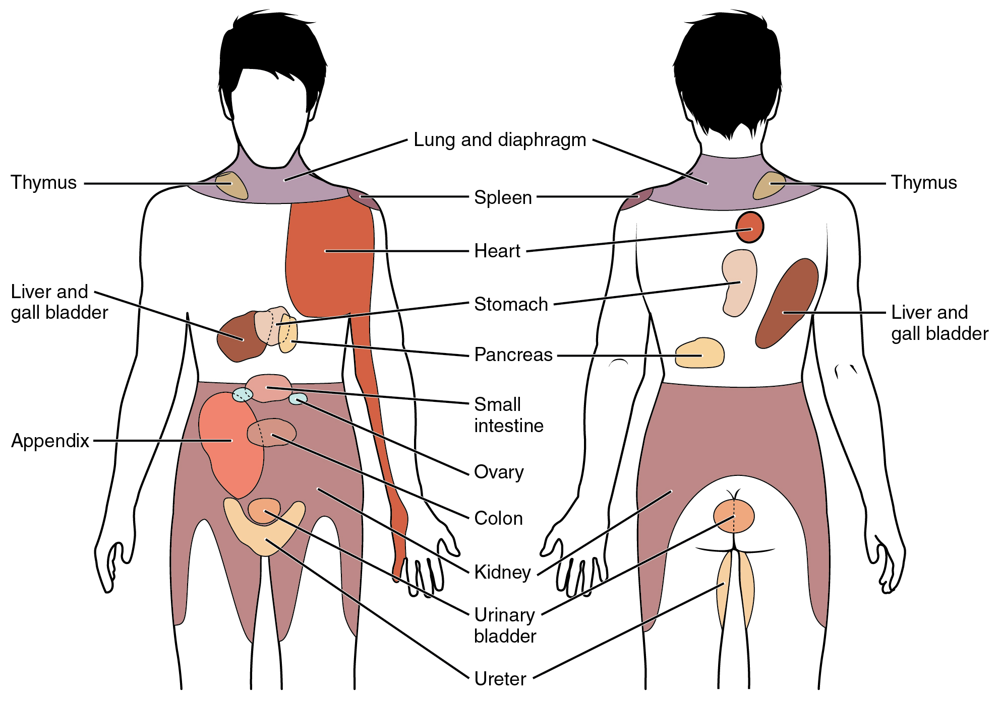

By the end of this section, you will be able to:
* Compare the structure of somatic and autonomic reflex arcs
* Explain the differences in sympathetic and parasympathetic reflexes
* Differentiate between short and long reflexes
* Determine the effect of the autonomic nervous system on the regulation of the various organ systems on the basis of the signaling molecules involved
* Describe the effects of drugs that affect autonomic function

The autonomic nervous system regulates organ systems through circuits that resemble the reflexes described in the somatic nervous system. The main difference between the somatic and autonomic systems is in what target tissues are effectors. Somatic responses are solely based on skeletal muscle contraction. The autonomic system, however, targets cardiac and smooth muscle, as well as glandular tissue. Whereas the basic circuit is a **reflex arc**{: data-type="term"}, there are differences in the structure of those reflexes for the somatic and autonomic systems.

# The Structure of Reflexes

One difference between a **somatic reflex**{: data-type="term"}, such as the withdrawal reflex, and a **visceral reflex**{: data-type="term"}, which is an autonomic reflex, is in the **efferent branch**{: data-type="term"}. The output of a somatic reflex is the lower motor neuron in the ventral horn of the spinal cord that projects directly to a skeletal muscle to cause its contraction. The output of a visceral reflex is a two-step pathway starting with the preganglionic fiber emerging from a lateral horn neuron in the spinal cord, or a cranial nucleus neuron in the brain stem, to a ganglion—followed by the postganglionic fiber projecting to a target effector. The other part of a reflex, the **afferent branch**{: data-type="term"}, is often the same between the two systems. Sensory neurons receiving input from the periphery—with cell bodies in the sensory ganglia, either of a cranial nerve or a dorsal root ganglion adjacent to the spinal cord—project into the CNS to initiate the reflex ([\[link\]](#fig-ch15_02_01)). The Latin root “effere” means “to carry.” Adding the prefix “ef-” suggests the meaning “to carry away,” whereas adding the prefix “af-” suggests “to carry toward or inward.”

 ![The top panel in this figure shows the autonomic efferent pathway. The spinal cord is shown on the left, and a myelinated axon is shown going from the spinal cord to the central neuron. An unmyelinated axon is shown going from the central neuron to the target effector. The bottom panel shows the somatic efferent pathway. The spinal cord is shown on the left, and a myelinated axon is shown going from the spinal cord to the target effector director. In both cases, magnified images show the synapses.](../resources/1505_Comparison_of_Somatic_and_Visceral_Reflexes.jpg "The afferent inputs to somatic and visceral reflexes are essentially the same, whereas the efferent branches are different. Somatic reflexes, for instance, involve a direct connection from the ventral horn of the spinal cord to the skeletal muscle. Visceral reflexes involve a projection from the central neuron to a ganglion, followed by a second projection from the ganglion to the target effector."){: #fig-ch15_02_01 data-title="Comparison of Somatic and Visceral Reflexes "}

## Afferent Branch

The afferent branch of a reflex arc does differ between somatic and visceral reflexes in some instances. Many of the inputs to visceral reflexes are from special or somatic senses, but particular senses are associated with the viscera that are not part of the conscious perception of the environment through the somatic nervous system. For example, there is a specific type of mechanoreceptor, called a **baroreceptor**{: data-type="term"}, in the walls of the aorta and carotid sinuses that senses the stretch of those organs when blood volume or pressure increases. You do not have a conscious perception of having high blood pressure, but that is an important afferent branch of the cardiovascular and, particularly, vasomotor reflexes. The sensory neuron is essentially the same as any other general sensory neuron. The baroreceptor apparatus is part of the ending of a unipolar neuron that has a cell body in a sensory ganglion. The baroreceptors from the carotid arteries have axons in the glossopharyngeal nerve, and those from the aorta have axons in the vagus nerve.

Though visceral senses are not primarily a part of conscious perception, those sensations sometimes make it to conscious awareness. If a visceral sense is strong enough, it will be perceived. The sensory homunculus—the representation of the body in the primary somatosensory cortex—only has a small region allotted for the perception of internal stimuli. If you swallow a large bolus of food, for instance, you will probably feel the lump of that food as it pushes through your esophagus, or even if your stomach is distended after a large meal. If you inhale especially cold air, you can feel it as it enters your larynx and trachea. These sensations are not the same as feeling high blood pressure or blood sugar levels.

When particularly strong visceral sensations rise to the level of conscious perception, the sensations are often felt in unexpected places. For example, strong visceral sensations of the heart will be felt as pain in the left shoulder and left arm. This irregular pattern of projection of conscious perception of visceral sensations is called **referred pain**{: data-type="term"}. Depending on the organ system affected, the referred pain will project to different areas of the body ([\[link\]](#fig-ch15_02_02)). The location of referred pain is not random, but a definitive explanation of the mechanism has not been established. The most broadly accepted theory for this phenomenon is that the visceral sensory fibers enter into the same level of the spinal cord as the somatosensory fibers of the referred pain location. By this explanation, the visceral sensory fibers from the mediastinal region, where the heart is located, would enter the spinal cord at the same level as the spinal nerves from the shoulder and arm, so the brain misinterprets the sensations from the mediastinal region as being from the axillary and brachial regions. Projections from the medial and inferior divisions of the cervical ganglia do enter the spinal cord at the middle to lower cervical levels, which is where the somatosensory fibers enter.

 {: #fig-ch15_02_02 data-title="Referred Pain Chart "}

Disorders of the…

Nervous System: Kehr’s Sign Kehr’s sign is the presentation of pain in the left shoulder, chest, and neck regions following rupture of the spleen. The spleen is in the upper-left abdominopelvic quadrant, but the pain is more in the shoulder and neck. How can this be? The sympathetic fibers connected to the spleen are from the celiac ganglion, which would be from the mid-thoracic to lower thoracic region whereas parasympathetic fibers are found in the vagus nerve, which connects in the medulla of the brain stem. However, the neck and shoulder would connect to the spinal cord at the mid-cervical level of the spinal cord. These connections do not fit with the expected correspondence of visceral and somatosensory fibers entering at the same level of the spinal cord.

The incorrect assumption would be that the visceral sensations are coming from the spleen directly. In fact, the visceral fibers are coming from the diaphragm. The nerve connecting to the diaphragm takes a special route. The phrenic nerve is connected to the spinal cord at cervical levels 3 to 5. The motor fibers that make up this nerve are responsible for the muscle contractions that drive ventilation. These fibers have left the spinal cord to enter the phrenic nerve, meaning that spinal cord damage below the mid-cervical level is not fatal by making ventilation impossible. Therefore, the visceral fibers from the diaphragm enter the spinal cord at the same level as the somatosensory fibers from the neck and shoulder.

The diaphragm plays a role in Kehr’s sign because the spleen is just inferior to the diaphragm in the upper-left quadrant of the abdominopelvic cavity. When the spleen ruptures, blood spills into this region. The accumulating hemorrhage then puts pressure on the diaphragm. The visceral sensation is actually in the diaphragm, so the referred pain is in a region of the body that corresponds to the diaphragm, not the spleen.

## Efferent Branch

The efferent branch of the visceral reflex arc begins with the projection from the central neuron along the preganglionic fiber. This fiber then makes a synapse on the ganglionic neuron that projects to the target effector.

The effector organs that are the targets of the autonomic system range from the iris and ciliary body of the eye to the urinary bladder and reproductive organs. The thoracolumbar output, through the various sympathetic ganglia, reaches all of these organs. The cranial component of the parasympathetic system projects from the eye to part of the intestines. The sacral component picks up with the majority of the large intestine and the pelvic organs of the urinary and reproductive systems.

## Short and Long Reflexes

Somatic reflexes involve sensory neurons that connect sensory receptors to the CNS and motor neurons that project back out to the skeletal muscles. Visceral reflexes that involve the thoracolumbar or craniosacral systems share similar connections. However, there are reflexes that do not need to involve any CNS components. A **long reflex**{: data-type="term"} has afferent branches that enter the spinal cord or brain and involve the efferent branches, as previously explained. A **short reflex**{: data-type="term"} is completely peripheral and only involves the local integration of sensory input with motor output ([\[link\]](#fig-ch15_02_03)).

 {: #fig-ch15_02_03 data-title="Short and Long Reflexes "}

The difference between short and long reflexes is in the involvement of the CNS. Somatic reflexes always involve the CNS, even in a monosynaptic reflex in which the sensory neuron directly activates the motor neuron. That synapse is in the spinal cord or brain stem, so it has to involve the CNS. However, in the autonomic system there is the possibility that the CNS is not involved. Because the efferent branch of a visceral reflex involves two neurons—the central neuron and the ganglionic neuron—a “short circuit” can be possible. If a sensory neuron projects directly to the ganglionic neuron and causes it to activate the effector target, then the CNS is not involved.

A division of the nervous system that is related to the autonomic nervous system is the enteric nervous system. The word enteric refers to the digestive organs, so this represents the nervous tissue that is part of the digestive system. There are a few myenteric plexuses in which the nervous tissue in the wall of the digestive tract organs can directly influence digestive function. If stretch receptors in the stomach are activated by the filling and distension of the stomach, a short reflex will directly activate the smooth muscle fibers of the stomach wall to increase motility to digest the excessive food in the stomach. No CNS involvement is needed because the stretch receptor is directly activating a neuron in the wall of the stomach that causes the smooth muscle to contract. That neuron, connected to the smooth muscle, is a postganglionic parasympathetic neuron that can be controlled by a fiber found in the vagus nerve.

  
Read this [article][1] to learn about a teenager who experiences a series of spells that suggest a stroke. He undergoes endless tests and seeks input from multiple doctors. In the end, one expert, one question, and a simple blood pressure cuff answers the question. Why would the heart have to beat faster when the teenager changes his body position from lying down to sitting, and then to standing?

# Balance in Competing Autonomic Reflex Arcs

The autonomic nervous system is important for homeostasis because its two divisions compete at the target effector. The balance of homeostasis is attributable to the competing inputs from the sympathetic and parasympathetic divisions (dual innervation). At the level of the target effector, the signal of which system is sending the message is strictly chemical. A signaling molecule binds to a receptor that causes changes in the target cell, which in turn causes the tissue or organ to respond to the changing conditions of the body.

## Competing Neurotransmitters

The postganglionic fibers of the sympathetic and parasympathetic divisions both release neurotransmitters that bind to receptors on their targets. Postganglionic sympathetic fibers release norepinephrine, with a minor exception, whereas postganglionic parasympathetic fibers release ACh. For any given target, the difference in which division of the autonomic nervous system is exerting control is just in what chemical binds to its receptors. The target cells will have adrenergic and muscarinic receptors. If norepinephrine is released, it will bind to the adrenergic receptors present on the target cell, and if ACh is released, it will bind to the muscarinic receptors on the target cell.

In the sympathetic system, there are exceptions to this pattern of dual innervation. The postganglionic sympathetic fibers that contact the blood vessels within skeletal muscle and that contact sweat glands do not release norepinephrine, they release ACh. This does not create any problem because there is no parasympathetic input to the sweat glands. Sweat glands have muscarinic receptors and produce and secrete sweat in response to the presence of ACh.

At most of the other targets of the autonomic system, the effector response is based on which neurotransmitter is released and what receptor is present. For example, regions of the heart that establish heart rate are contacted by postganglionic fibers from both systems. If norepinephrine is released onto those cells, it binds to an adrenergic receptor that causes the cells to depolarize faster, and the heart rate increases. If ACh is released onto those cells, it binds to a muscarinic receptor that causes the cells to hyperpolarize so that they cannot reach threshold as easily, and the heart rate slows. Without this parasympathetic input, the heart would work at a rate of approximately 100 beats per minute (bpm). The sympathetic system speeds that up, as it would during exercise, to 120–140 bpm, for example. The parasympathetic system slows it down to the resting heart rate of 60–80 bpm.

Another example is in the control of pupillary size ([\[link\]](#fig-ch15_02_04)). The afferent branch responds to light hitting the retina. Photoreceptors are activated, and the signal is transferred to the retinal ganglion cells that send an action potential along the optic nerve into the diencephalon. If light levels are low, the sympathetic system sends a signal out through the upper thoracic spinal cord to the superior cervical ganglion of the sympathetic chain. The postganglionic fiber then projects to the iris, where it releases norepinephrine onto the radial fibers of the iris (a smooth muscle). When those fibers contract, the pupil dilates—increasing the amount of light hitting the retina. If light levels are too high, the parasympathetic system sends a signal out from the Eddinger–Westphal nucleus through the oculomotor nerve. This fiber synapses in the ciliary ganglion in the posterior orbit. The postganglionic fiber then projects to the iris, where it releases ACh onto the circular fibers of the iris—another smooth muscle. When those fibers contract, the pupil constricts to limit the amount of light hitting the retina.

 {: #fig-ch15_02_04 data-title="Autonomic Control of Pupillary Size "}

In this example, the autonomic system is controlling how much light hits the retina. It is a homeostatic reflex mechanism that keeps the activation of photoreceptors within certain limits. In the context of avoiding a threat like the lioness on the savannah, the sympathetic response for fight or flight will increase pupillary diameter so that more light hits the retina and more visual information is available for running away. Likewise, the parasympathetic response of rest reduces the amount of light reaching the retina, allowing the photoreceptors to cycle through bleaching and be regenerated for further visual perception; this is what the homeostatic process is attempting to maintain.

  
Watch this [video][2] to learn about the pupillary reflexes. The pupillary light reflex involves sensory input through the optic nerve and motor response through the oculomotor nerve to the ciliary ganglion, which projects to the circular fibers of the iris. As shown in this short animation, pupils will constrict to limit the amount of light falling on the retina under bright lighting conditions. What constitutes the afferent and efferent branches of the competing reflex (dilation)?

## Autonomic Tone

Organ systems are balanced between the input from the sympathetic and parasympathetic divisions. When something upsets that balance, the homeostatic mechanisms strive to return it to its regular state. For each organ system, there may be more of a sympathetic or parasympathetic tendency to the resting state, which is known as the **autonomic tone**{: data-type="term"} of the system. For example, the heart rate was described above. Because the resting heart rate is the result of the parasympathetic system slowing the heart down from its intrinsic rate of 100 bpm, the heart can be said to be in parasympathetic tone.

In a similar fashion, another aspect of the cardiovascular system is primarily under sympathetic control. Blood pressure is partially determined by the contraction of smooth muscle in the walls of blood vessels. These tissues have adrenergic receptors that respond to the release of norepinephrine from postganglionic sympathetic fibers by constricting and increasing blood pressure. The hormones released from the adrenal medulla—epinephrine and norepinephrine—will also bind to these receptors. Those hormones travel through the bloodstream where they can easily interact with the receptors in the vessel walls. The parasympathetic system has no significant input to the systemic blood vessels, so the sympathetic system determines their tone.

There are a limited number of blood vessels that respond to sympathetic input in a different fashion. Blood vessels in skeletal muscle, particularly those in the lower limbs, are more likely to dilate. It does not have an overall effect on blood pressure to alter the tone of the vessels, but rather allows for blood flow to increase for those skeletal muscles that will be active in the fight-or-flight response. The blood vessels that have a parasympathetic projection are limited to those in the erectile tissue of the reproductive organs. Acetylcholine released by these postganglionic parasympathetic fibers cause the vessels to dilate, leading to the engorgement of the erectile tissue.

Homeostatic Imbalances

Orthostatic Hypotension Have you ever stood up quickly and felt dizzy for a moment? This is because, for one reason or another, blood is not getting to your brain so it is briefly deprived of oxygen. When you change position from sitting or lying down to standing, your cardiovascular system has to adjust for a new challenge, keeping blood pumping up into the head while gravity is pulling more and more blood down into the legs.

The reason for this is a sympathetic reflex that maintains the output of the heart in response to postural change. When a person stands up, proprioceptors indicate that the body is changing position. A signal goes to the CNS, which then sends a signal to the upper thoracic spinal cord neurons of the sympathetic division. The sympathetic system then causes the heart to beat faster and the blood vessels to constrict. Both changes will make it possible for the cardiovascular system to maintain the rate of blood delivery to the brain. Blood is being pumped superiorly through the internal branch of the carotid arteries into the brain, against the force of gravity. Gravity is not increasing while standing, but blood is more likely to flow down into the legs as they are extended for standing. This sympathetic reflex keeps the brain well oxygenated so that cognitive and other neural processes are not interrupted.

Sometimes this does not work properly. If the sympathetic system cannot increase cardiac output, then blood pressure into the brain will decrease, and a brief neurological loss can be felt. This can be brief, as a slight “wooziness” when standing up too quickly, or a loss of balance and neurological impairment for a period of time. The name for this is orthostatic hypotension, which means that blood pressure goes below the homeostatic set point when standing. It can be the result of standing up faster than the reflex can occur, which may be referred to as a benign “head rush,” or it may be the result of an underlying cause.

There are two basic reasons that orthostatic hypotension can occur. First, blood volume is too low and the sympathetic reflex is not effective. This hypovolemia may be the result of dehydration or medications that affect fluid balance, such as diuretics or vasodilators. Both of these medications are meant to lower blood pressure, which may be necessary in the case of systemic hypertension, and regulation of the medications may alleviate the problem. Sometimes increasing fluid intake or water retention through salt intake can improve the situation.

The second underlying cause of orthostatic hypotension is autonomic failure. There are several disorders that result in compromised sympathetic functions. The disorders range from diabetes to multiple system atrophy (a loss of control over many systems in the body), and addressing the underlying condition can improve the hypotension. For example, with diabetes, peripheral nerve damage can occur, which would affect the postganglionic sympathetic fibers. Getting blood glucose levels under control can improve neurological deficits associated with diabetes.

# Chapter Review

Autonomic nervous system function is based on the visceral reflex. This reflex is similar to the somatic reflex, but the efferent branch is composed of two neurons. The central neuron projects from the spinal cord or brain stem to synapse on the ganglionic neuron that projects to the effector. The afferent branch of the somatic and visceral reflexes is very similar, as many somatic and special senses activate autonomic responses. However, there are visceral senses that do not form part of conscious perception. If a visceral sensation, such as cardiac pain, is strong enough, it will rise to the level of consciousness. However, the sensory homunculus does not provide a representation of the internal structures to the same degree as the surface of the body, so visceral sensations are often experienced as referred pain, such as feelings of pain in the left shoulder and arm in connection with a heart attack.

The role of visceral reflexes is to maintain a balance of function in the organ systems of the body. The two divisions of the autonomic system each play a role in effecting change, usually in competing directions. The sympathetic system increases heart rate, whereas the parasympathetic system decreases heart rate. The sympathetic system dilates the pupil of the eye, whereas the parasympathetic system constricts the pupil. The competing inputs can contribute to the resting tone of the organ system. Heart rate is normally under parasympathetic tone, whereas blood pressure is normally under sympathetic tone. The heart rate is slowed by the autonomic system at rest, whereas blood vessels retain a slight constriction at rest.

In a few systems of the body, the competing input from the two divisions is not the norm. The sympathetic tone of blood vessels is caused by the lack of parasympathetic input to the systemic circulatory system. Only certain regions receive parasympathetic input that relaxes the smooth muscle wall of the blood vessels. Sweat glands are another example, which only receive input from the sympathetic system.

# Interactive Link Questions

Read this [article][1] to learn about a teenager who experiences a series of spells that suggest a stroke. He undergoes endless tests and seeks input from multiple doctors. In the end, one expert, one question, and a simple blood pressure cuff answers the question. Why would the heart have to beat faster when the teenager changes his body position from lying down to sitting, and then to standing?

The effect of gravity on circulation means that it is harder to get blood up from the legs as the body takes on a vertical orientation.

Watch this [video][2] to learn about the pupillary reflexes. The pupillary light reflex involves sensory input through the optic nerve and motor response through the oculomotor nerve to the ciliary ganglion, which projects to the circular fibers of the iris. As shown in this short animation, pupils will constrict to limit the amount of light falling on the retina under bright lighting conditions. What constitutes the afferent and efferent branches of the competing reflex (dilation)?

The optic nerve still carries the afferent input, but the output is from the thoracic spinal cord, through the superior cervical ganglion, to the radial fibers of the iris.

# Review Questions

Which of the following represents a sensory input that is *not* part of both the somatic and autonomic systems?

1.  vision
2.  taste
3.  baroreception
4.  proprioception
{: data-number-style="lower-alpha"}

C

What is the term for a reflex that does *not* include a CNS component?

1.  long reflex
2.  visceral reflex
3.  somatic reflex
4.  short reflex
{: data-number-style="lower-alpha"}

D

What neurotransmitter will result in constriction of the pupil?

1.  norepinephrine
2.  acetylcholine
3.  epinephrine
4.  serotonin
{: data-number-style="lower-alpha"}

B

What gland produces a secretion that causes fight-or-flight responses in effectors?

1.  adrenal medulla
2.  salivatory gland
3.  reproductive gland
4.  thymus
{: data-number-style="lower-alpha"}

A

Which of the following is an incorrect pairing?

1.  norepinephrine dilates the pupil
2.  epinephrine increases blood pressure
3.  acetylcholine decreases digestion
4.  norepinephrine increases heart rate
{: data-number-style="lower-alpha"}

C

# Critical Thinking Questions

Damage to internal organs will present as pain associated with a particular surface area of the body. Why would something like irritation to the diaphragm, which is between the thoracic and abdominal cavities, feel like pain in the shoulder or neck?

The nerves that carry sensory information from the diaphragm enter the spinal cord in the cervical region where somatic sensory fibers from the shoulder and neck would enter. The brain superimposes this experience onto the sensory homunculus where the somatic nerves are connected.

Medical practice is paying more attention to the autonomic system in considering disease states. Why would autonomic tone be important in considering cardiovascular disease?

Within the cardiovascular system, different aspects demonstrate variation in autonomic tone. Heart rate is under parasympathetic tone, and blood pressure is under sympathetic tone. Pharmaceuticals that treat cardiovascular disorders may be more effective if they work with the normal state of the autonomic system. Alternatively, some disorders may be exacerbated by autonomic deficits and common therapies might not be as effective.

[1]: http://openstaxcollege.org/l/strokespell
[2]: http://openstaxcollege.org/l/pupillary
