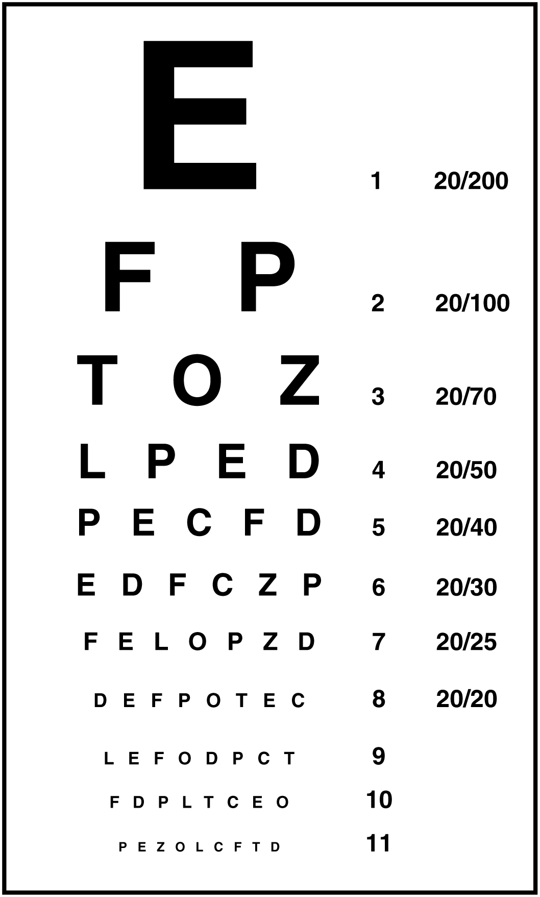
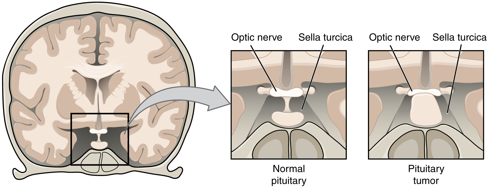
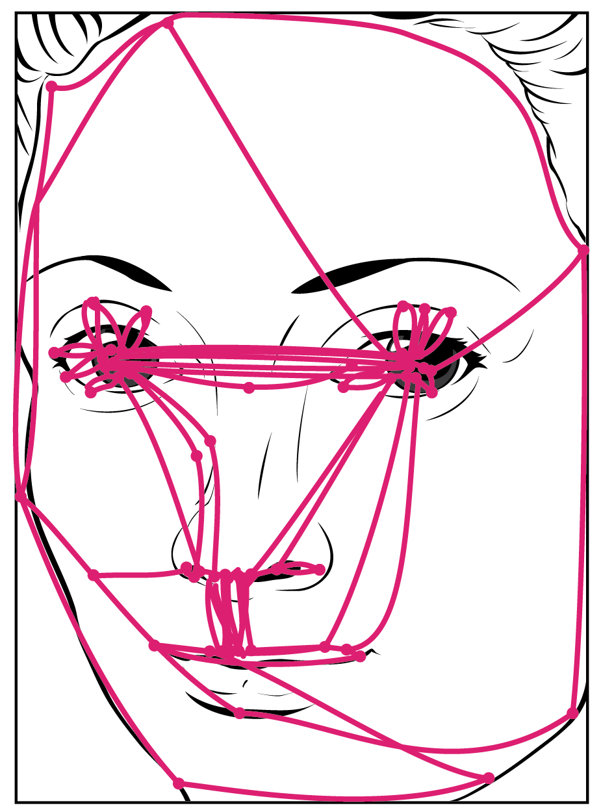
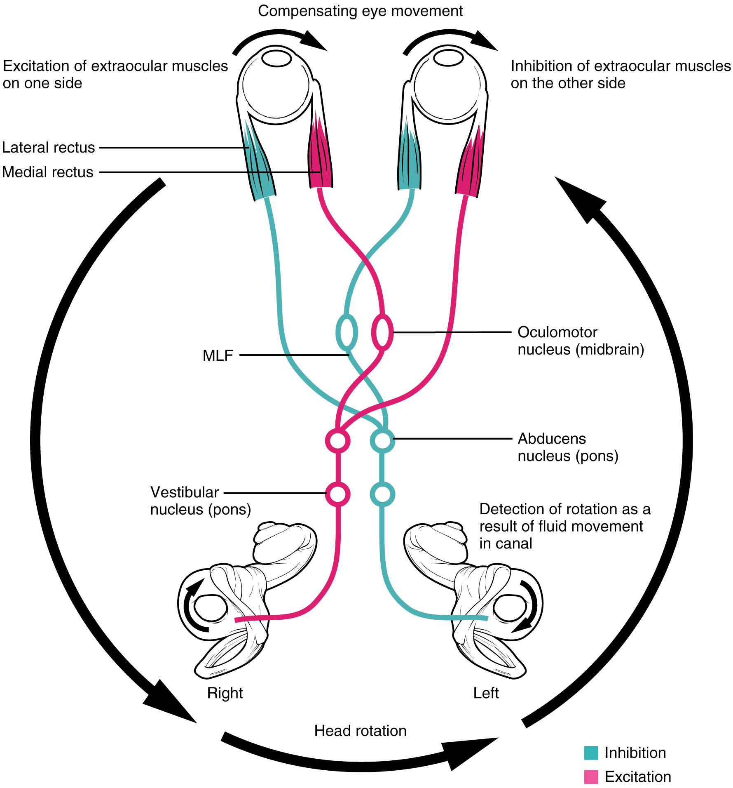
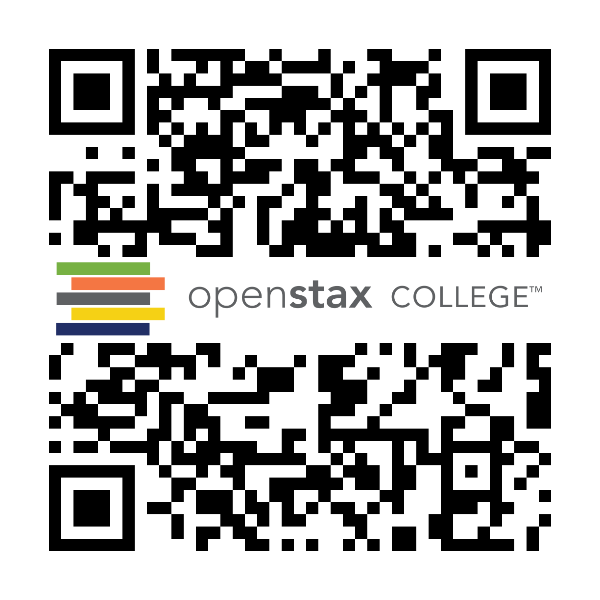
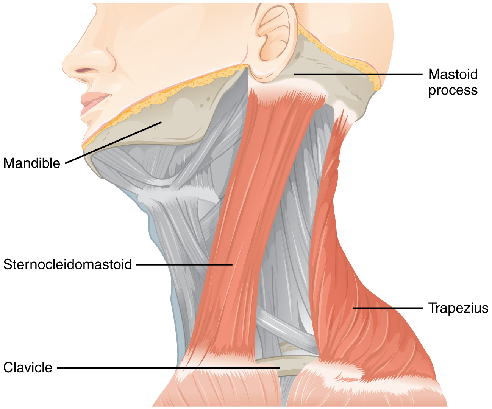

By the end of this section, you will be able to:
* Describe the functional grouping of cranial nerves
* Match the regions of the forebrain and brain stem that are connected to each cranial nerve
* Suggest diagnoses that would explain certain losses of function in the cranial nerves
* Relate cranial nerve deficits to damage of adjacent, unrelated structures

The twelve cranial nerves are typically covered in introductory anatomy courses, and memorizing their names is facilitated by numerous mnemonics developed by students over the years of this practice. But knowing the names of the nerves in order often leaves much to be desired in understanding what the nerves do. The nerves can be categorized by functions, and subtests of the cranial nerve exam can clarify these functional groupings.

Three of the nerves are strictly responsible for special senses whereas four others contain fibers for special and general senses. Three nerves are connected to the extraocular muscles resulting in the control of gaze. Four nerves connect to muscles of the face, oral cavity, and pharynx, controlling facial expressions, mastication, swallowing, and speech. Four nerves make up the cranial component of the parasympathetic nervous system responsible for pupillary constriction, salivation, and the regulation of the organs of the thoracic and upper abdominal cavities. Finally, one nerve controls the muscles of the neck, assisting with spinal control of the movement of the head and neck.

The cranial nerve exam allows directed tests of forebrain and brain stem structures. The twelve cranial nerves serve the head and neck. The vagus nerve (cranial nerve X) has autonomic functions in the thoracic and superior abdominal cavities. The special senses are served through the cranial nerves, as well as the general senses of the head and neck. The movement of the eyes, face, tongue, throat, and neck are all under the control of cranial nerves. Preganglionic parasympathetic nerve fibers that control pupillary size, salivary glands, and the thoracic and upper abdominal viscera are found in four of the nerves. Tests of these functions can provide insight into damage to specific regions of the brain stem and may uncover deficits in adjacent regions.

# Sensory Nerves

The olfactory, optic, and vestibulocochlear nerves (cranial nerves I, II, and VIII) are dedicated to four of the special senses: smell, vision, equilibrium, and hearing, respectively. Taste sensation is relayed to the brain stem through fibers of the facial and glossopharyngeal nerves. The trigeminal nerve is a mixed nerve that carries the general somatic senses from the head, similar to those coming through spinal nerves from the rest of the body.

Testing smell is straightforward, as common smells are presented to one nostril at a time. The patient should be able to recognize the smell of coffee or mint, indicating the proper functioning of the olfactory system. Loss of the sense of smell is called anosmia and can be lost following blunt trauma to the head or through aging. The short axons of the first cranial nerve regenerate on a regular basis. The neurons in the olfactory epithelium have a limited life span, and new cells grow to replace the ones that die off. The axons from these neurons grow back into the CNS by following the existing axons—representing one of the few examples of such growth in the mature nervous system. If all of the fibers are sheared when the brain moves within the cranium, such as in a motor vehicle accident, then no axons can find their way back to the olfactory bulb to re-establish connections. If the nerve is not completely severed, the anosmia may be temporary as new neurons can eventually reconnect.

Olfaction is not the pre-eminent sense, but its loss can be quite detrimental. The enjoyment of food is largely based on our sense of smell. Anosmia means that food will not seem to have the same taste, though the gustatory sense is intact, and food will often be described as being bland. However, the taste of food can be improved by adding ingredients (e.g., salt) that stimulate the gustatory sense.

Testing vision relies on the tests that are common in an optometry office. The **Snellen chart**{: data-type="term"} ([\[link\]](#fig-ch16_03_01)) demonstrates visual acuity by presenting standard Roman letters in a variety of sizes. The result of this test is a rough generalization of the acuity of a person based on the normal accepted acuity, such that a letter that subtends a visual angle of 5 minutes of an arc at 20 feet can be seen. To have 20/60 vision, for example, means that the smallest letters that a person can see at a 20-foot distance could be seen by a person with normal acuity from 60 feet away. Testing the extent of the visual field means that the examiner can establish the boundaries of peripheral vision as simply as holding their hands out to either side and asking the patient when the fingers are no longer visible without moving the eyes to track them. If it is necessary, further tests can establish the perceptions in the visual fields. Physical inspection of the optic disk, or where the optic nerve emerges from the eye, can be accomplished by looking through the pupil with an ophthalmoscope.

 {: #fig-ch16_03_01 data-media-type="image/jpg" data-title="The Snellen Chart"}

The optic nerves from both sides enter the cranium through the respective optic canals and meet at the optic chiasm at which fibers sort such that the two halves of the visual field are processed by the opposite sides of the brain. Deficits in visual field perception often suggest damage along the length of the optic pathway between the orbit and the diencephalon. For example, loss of peripheral vision may be the result of a pituitary tumor pressing on the optic chiasm ([\[link\]](#fig-ch16_03_02)). The pituitary, seated in the sella turcica of the sphenoid bone, is directly inferior to the optic chiasm. The axons that decussate in the chiasm are from the medial retinae of either eye, and therefore carry information from the peripheral visual field.

 {: #fig-ch16_03_02 data-media-type="image/jpg" data-title="Pituitary Tumor"}

The vestibulocochlear nerve (CN VIII) carries both equilibrium and auditory sensations from the inner ear to the medulla. Though the two senses are not directly related, anatomy is mirrored in the two systems. Problems with balance, such as vertigo, and deficits in hearing may both point to problems with the inner ear. Within the petrous region of the temporal bone is the bony labyrinth of the inner ear. The vestibule is the portion for equilibrium, composed of the utricle, saccule, and the three semicircular canals. The cochlea is responsible for transducing sound waves into a neural signal. The sensory nerves from these two structures travel side-by-side as the vestibulocochlear nerve, though they are really separate divisions. They both emerge from the inner ear, pass through the internal auditory meatus, and synapse in nuclei of the superior medulla. Though they are part of distinct sensory systems, the vestibular nuclei and the cochlear nuclei are close neighbors with adjacent inputs. Deficits in one or both systems could occur from damage that encompasses structures close to both. Damage to structures near the two nuclei can result in deficits to one or both systems.

Balance or hearing deficits may be the result of damage to the middle or inner ear structures. Ménière\'s disease is a disorder that can affect both equilibrium and audition in a variety of ways. The patient can suffer from vertigo, a low-frequency ringing in the ears, or a loss of hearing. From patient to patient, the exact presentation of the disease can be different. Additionally, within a single patient, the symptoms and signs may change as the disease progresses. Use of the neurological exam subtests for the vestibulocochlear nerve illuminates the changes a patient may go through. The disease appears to be the result of accumulation, or over-production, of fluid in the inner ear, in either the vestibule or cochlea.

Tests of equilibrium are important for coordination and gait and are related to other aspects of the neurological exam. The vestibulo-ocular reflex involves the cranial nerves for gaze control. Balance and equilibrium, as tested by the Romberg test, are part of spinal and cerebellar processes and involved in those components of the neurological exam, as discussed later.

Hearing is tested by using a tuning fork in a couple of different ways. The **Rinne test**{: data-type="term"} involves using a tuning fork to distinguish between **conductive hearing**{: data-type="term"} and **sensorineural hearing**{: data-type="term"}. Conductive hearing relies on vibrations being conducted through the ossicles of the middle ear. Sensorineural hearing is the transmission of sound stimuli through the neural components of the inner ear and cranial nerve. A vibrating tuning fork is placed on the mastoid process and the patient indicates when the sound produced from this is no longer present. Then the fork is immediately moved to just next to the ear canal so the sound travels through the air. If the sound is not heard through the ear, meaning the sound is conducted better through the temporal bone than through the ossicles, a conductive hearing deficit is present. The **Weber test**{: data-type="term"} also uses a tuning fork to differentiate between conductive versus sensorineural hearing loss. In this test, the tuning fork is placed at the top of the skull, and the sound of the tuning fork reaches both inner ears by travelling through bone. In a healthy patient, the sound would appear equally loud in both ears. With unilateral conductive hearing loss, however, the tuning fork sounds louder in the ear with hearing loss. This is because the sound of the tuning fork has to compete with background noise coming from the outer ear, but in conductive hearing loss, the background noise is blocked in the damaged ear, allowing the tuning fork to sound relatively louder in that ear. With unilateral sensorineural hearing loss, however, damage to the cochlea or associated nervous tissue means that the tuning fork sounds quieter in that ear.

The trigeminal system of the head and neck is the equivalent of the ascending spinal cord systems of the dorsal column and the spinothalamic pathways. Somatosensation of the face is conveyed along the nerve to enter the brain stem at the level of the pons. Synapses of those axons, however, are distributed across nuclei found throughout the brain stem. The mesencephalic nucleus processes proprioceptive information of the face, which is the movement and position of facial muscles. It is the sensory component of the **jaw-jerk reflex**{: data-type="term"}, a stretch reflex of the masseter muscle. The chief nucleus, located in the pons, receives information about light touch as well as proprioceptive information about the mandible, which are both relayed to the thalamus and, ultimately, to the postcentral gyrus of the parietal lobe. The spinal trigeminal nucleus, located in the medulla, receives information about crude touch, pain, and temperature to be relayed to the thalamus and cortex. Essentially, the projection through the chief nucleus is analogous to the dorsal column pathway for the body, and the projection through the spinal trigeminal nucleus is analogous to the spinothalamic pathway.

Subtests for the sensory component of the trigeminal system are the same as those for the sensory exam targeting the spinal nerves. The primary sensory subtest for the trigeminal system is sensory discrimination. A cotton-tipped applicator, which is cotton attached to the end of a thin wooden stick, can be used easily for this. The wood of the applicator can be snapped so that a pointed end is opposite the soft cotton-tipped end. The cotton end provides a touch stimulus, while the pointed end provides a painful, or sharp, stimulus. While the patient’s eyes are closed, the examiner touches the two ends of the applicator to the patient’s face, alternating randomly between them. The patient must identify whether the stimulus is sharp or dull. These stimuli are processed by the trigeminal system separately. Contact with the cotton tip of the applicator is a light touch, relayed by the chief nucleus, but contact with the pointed end of the applicator is a painful stimulus relayed by the spinal trigeminal nucleus. Failure to discriminate these stimuli can localize problems within the brain stem. If a patient cannot recognize a painful stimulus, that might indicate damage to the spinal trigeminal nucleus in the medulla. The medulla also contains important regions that regulate the cardiovascular, respiratory, and digestive systems, as well as being the pathway for ascending and descending tracts between the brain and spinal cord. Damage, such as a stroke, that results in changes in sensory discrimination may indicate these unrelated regions are affected as well.

# Gaze Control

The three nerves that control the extraocular muscles are the oculomotor, trochlear, and abducens nerves, which are the third, fourth, and sixth cranial nerves. As the name suggests, the abducens nerve is responsible for abducting the eye, which it controls through contraction of the lateral rectus muscle. The trochlear nerve controls the superior oblique muscle to rotate the eye along its axis in the orbit medially, which is called **intorsion**{: data-type="term"}, and is a component of focusing the eyes on an object close to the face. The oculomotor nerve controls all the other extraocular muscles, as well as a muscle of the upper eyelid. Movements of the two eyes need to be coordinated to locate and track visual stimuli accurately. When moving the eyes to locate an object in the horizontal plane, or to track movement horizontally in the visual field, the lateral rectus muscle of one eye and medial rectus muscle of the other eye are both active. The lateral rectus is controlled by neurons of the abducens nucleus in the superior medulla, whereas the medial rectus is controlled by neurons in the oculomotor nucleus of the midbrain.

Coordinated movement of both eyes through different nuclei requires integrated processing through the brain stem. In the midbrain, the superior colliculus integrates visual stimuli with motor responses to initiate eye movements. The **paramedian pontine reticular formation (PPRF)**{: data-type="term"} will initiate a rapid eye movement, or **saccade**{: data-type="term"}, to bring the eyes to bear on a visual stimulus quickly. These areas are connected to the oculomotor, trochlear, and abducens nuclei by the **medial longitudinal fasciculus (MLF)**{: data-type="term"} that runs through the majority of the brain stem. The MLF allows for **conjugate gaze**{: data-type="term"}, or the movement of the eyes in the same direction, during horizontal movements that require the lateral and medial rectus muscles. Control of conjugate gaze strictly in the vertical direction is contained within the oculomotor complex. To elevate the eyes, the oculomotor nerve on either side stimulates the contraction of both superior rectus muscles; to depress the eyes, the oculomotor nerve on either side stimulates the contraction of both inferior rectus muscles.

Purely vertical movements of the eyes are not very common. Movements are often at an angle, so some horizontal components are necessary, adding the medial and lateral rectus muscles to the movement. The rapid movement of the eyes used to locate and direct the fovea onto visual stimuli is called a saccade. Notice that the paths that are traced in [\[link\]](#fig-ch16_03_03) are not strictly vertical. The movements between the nose and the mouth are closest, but still have a slant to them. Also, the superior and inferior rectus muscles are not perfectly oriented with the line of sight. The origin for both muscles is medial to their insertions, so elevation and depression may require the lateral rectus muscles to compensate for the slight adduction inherent in the contraction of those muscles, requiring MLF activity as well.

 {: #fig-ch16_03_03 data-media-type="image/jpg" data-title="Saccadic Eye Movements"}

Testing eye movement is simply a matter of having the patient track the tip of a pen as it is passed through the visual field. This may appear similar to testing visual field deficits related to the optic nerve, but the difference is that the patient is asked to not move the eyes while the examiner moves a stimulus into the peripheral visual field. Here, the extent of movement is the point of the test. The examiner is watching for conjugate movements representing proper function of the related nuclei and the MLF. Failure of one eye to abduct while the other adducts in a horizontal movement is referred to as **internuclear ophthalmoplegia**{: data-type="term"}. When this occurs, the patient will experience **diplopia**{: data-type="term"}, or double vision, as the two eyes are temporarily pointed at different stimuli. Diplopia is not restricted to failure of the lateral rectus, because any of the extraocular muscles may fail to move one eye in perfect conjugation with the other.

The final aspect of testing eye movements is to move the tip of the pen in toward the patient’s face. As visual stimuli move closer to the face, the two medial recti muscles cause the eyes to move in the one nonconjugate movement that is part of gaze control. When the two eyes move to look at something closer to the face, they both adduct, which is referred to as **convergence**{: data-type="term"}. To keep the stimulus in focus, the eye also needs to change the shape of the lens, which is controlled through the parasympathetic fibers of the oculomotor nerve. The change in focal power of the eye is referred to as **accommodation**{: data-type="term"}. Accommodation ability changes with age; focusing on nearer objects, such as the written text of a book or on a computer screen, may require corrective lenses later in life. Coordination of the skeletal muscles for convergence and coordination of the smooth muscles of the ciliary body for accommodation are referred to as the **accommodation–convergence reflex**{: data-type="term"}.

A crucial function of the cranial nerves is to keep visual stimuli centered on the fovea of the retina. The **vestibulo-ocular reflex (VOR)**{: data-type="term"} coordinates all of the components ([\[link\]](#fig-ch16_03_04)), both sensory and motor, that make this possible. If the head rotates in one direction—for example, to the right—the horizontal pair of semicircular canals in the inner ear indicate the movement by increased activity on the right and decreased activity on the left. The information is sent to the abducens nuclei and oculomotor nuclei on either side to coordinate the lateral and medial rectus muscles. The left lateral rectus and right medial rectus muscles will contract, rotating the eyes in the opposite direction of the head, while nuclei controlling the right lateral rectus and left medial rectus muscles will be inhibited to reduce antagonism of the contracting muscles. These actions stabilize the visual field by compensating for the head rotation with opposite rotation of the eyes in the orbits. Deficits in the VOR may be related to vestibular damage, such as in Ménière’s disease, or from dorsal brain stem damage that would affect the eye movement nuclei or their connections through the MLF.

{: #fig-ch16_03_04 data-media-type="image/jpg" data-title="Vestibulo-ocular Reflex"}

# Nerves of the Face and Oral Cavity

An iconic part of a doctor’s visit is the inspection of the oral cavity and pharynx, suggested by the directive to “open your mouth and say ‘ah.’” This is followed by inspection, with the aid of a tongue depressor, of the back of the mouth, or the opening of the oral cavity into the pharynx known as the **fauces**{: data-type="term"}. Whereas this portion of a medical exam inspects for signs of infection, such as in tonsillitis, it is also the means to test the functions of the cranial nerves that are associated with the oral cavity.

The facial and glossopharyngeal nerves convey gustatory stimulation to the brain. Testing this is as simple as introducing salty, sour, bitter, or sweet stimuli to either side of the tongue. The patient should respond to the taste stimulus before retracting the tongue into the mouth. Stimuli applied to specific locations on the tongue will dissolve into the saliva and may stimulate taste buds connected to either the left or right of the nerves, masking any lateral deficits. Along with taste, the glossopharyngeal nerve relays general sensations from the pharyngeal walls. These sensations, along with certain taste stimuli, can stimulate the gag reflex. If the examiner moves the tongue depressor to contact the lateral wall of the fauces, this should elicit the gag reflex. Stimulation of either side of the fauces should elicit an equivalent response. The motor response, through contraction of the muscles of the pharynx, is mediated through the vagus nerve. Normally, the vagus nerve is considered autonomic in nature. The vagus nerve directly stimulates the contraction of skeletal muscles in the pharynx and larynx to contribute to the swallowing and speech functions. Further testing of vagus motor function has the patient repeating consonant sounds that require movement of the muscles around the fauces. The patient is asked to say “lah-kah-pah” or a similar set of alternating sounds while the examiner observes the movements of the soft palate and arches between the palate and tongue.

The facial and glossopharyngeal nerves are also responsible for the initiation of salivation. Neurons in the salivary nuclei of the medulla project through these two nerves as preganglionic fibers, and synapse in ganglia located in the head. The parasympathetic fibers of the facial nerve synapse in the pterygopalatine ganglion, which projects to the submandibular gland and sublingual gland. The parasympathetic fibers of the glossopharyngeal nerve synapse in the otic ganglion, which projects to the parotid gland. Salivation in response to food in the oral cavity is based on a visceral reflex arc within the facial or glossopharyngeal nerves. Other stimuli that stimulate salivation are coordinated through the hypothalamus, such as the smell and sight of food.

The hypoglossal nerve is the motor nerve that controls the muscles of the tongue, except for the palatoglossus muscle, which is controlled by the vagus nerve. There are two sets of muscles of the tongue. The **extrinsic muscles of the tongue**{: data-type="term"} are connected to other structures, whereas the **intrinsic muscles of the tongue**{: data-type="term"} are completely contained within the lingual tissues. While examining the oral cavity, movement of the tongue will indicate whether hypoglossal function is impaired. The test for hypoglossal function is the “stick out your tongue” part of the exam. The genioglossus muscle is responsible for protrusion of the tongue. If the hypoglossal nerves on both sides are working properly, then the tongue will stick straight out. If the nerve on one side has a deficit, the tongue will stick out to that side—pointing to the side with damage. Loss of function of the tongue can interfere with speech and swallowing. Additionally, because the location of the hypoglossal nerve and nucleus is near the cardiovascular center, inspiratory and expiratory areas for respiration, and the vagus nuclei that regulate digestive functions, a tongue that protrudes incorrectly can suggest damage in adjacent structures that have nothing to do with controlling the tongue.

 {: data-media-type="image/png"} 
Watch this short [video][1] to see an examination of the facial nerve using some simple tests. The facial nerve controls the muscles of facial expression. Severe deficits will be obvious in watching someone use those muscles for normal control. One side of the face might not move like the other side. But directed tests, especially for contraction against resistance, require a formal testing of the muscles. The muscles of the upper and lower face need to be tested. The strength test in this video involves the patient squeezing her eyes shut and the examiner trying to pry her eyes open. Why does the examiner ask her to try a second time?

# Motor Nerves of the Neck

The accessory nerve, also referred to as the spinal accessory nerve, innervates the sternocleidomastoid and trapezius muscles ([\[link\]](#fig-ch16_03_05)). When both the sternocleidomastoids contract, the head flexes forward; individually, they cause rotation to the opposite side. The trapezius can act as an antagonist, causing extension and hyperextension of the neck. These two superficial muscles are important for changing the position of the head. Both muscles also receive input from cervical spinal nerves. Along with the spinal accessory nerve, these nerves contribute to elevating the scapula and clavicle through the trapezius, which is tested by asking the patient to shrug both shoulders, and watching for asymmetry. For the sternocleidomastoid, those spinal nerves are primarily sensory projections, whereas the trapezius also has lateral insertions to the clavicle and scapula, and receives motor input from the spinal cord. Calling the nerve the spinal accessory nerve suggests that it is aiding the spinal nerves. Though that is not precisely how the name originated, it does help make the association between the function of this nerve in controlling these muscles and the role these muscles play in movements of the trunk or shoulders.

 {: #fig-ch16_03_05 data-media-type="image/jpg" data-title="Muscles Controlled by the Accessory Nerve"}

To test these muscles, the patient is asked to flex and extend the neck or shrug the shoulders against resistance, testing the strength of the muscles. Lateral flexion of the neck toward the shoulder tests both at the same time. Any difference on one side versus the other would suggest damage on the weaker side. These strength tests are common for the skeletal muscles controlled by spinal nerves and are a significant component of the motor exam. Deficits associated with the accessory nerve may have an effect on orienting the head, as described with the VOR.

Homeostatic Imbalances

The Pupillary Light Response The autonomic control of pupillary size in response to a bright light involves the sensory input of the optic nerve and the parasympathetic motor output of the oculomotor nerve. When light hits the retina, specialized photosensitive ganglion cells send a signal along the optic nerve to the pretectal nucleus in the superior midbrain. A neuron from this nucleus projects to the Eddinger–Westphal nuclei in the oculomotor complex in both sides of the midbrain. Neurons in this nucleus give rise to the preganglionic parasympathetic fibers that project through the oculomotor nerve to the ciliary ganglion in the posterior orbit. The postganglionic parasympathetic fibers from the ganglion project to the iris, where they release acetylcholine onto circular fibers that constrict the pupil to reduce the amount of light hitting the retina. The sympathetic nervous system is responsible for dilating the pupil when light levels are low.

Shining light in one eye will elicit constriction of both pupils. The efferent limb of the pupillary light reflex is bilateral. Light shined in one eye causes a constriction of that pupil, as well as constriction of the contralateral pupil. Shining a penlight in the eye of a patient is a very artificial situation, as both eyes are normally exposed to the same light sources. Testing this reflex can illustrate whether the optic nerve or the oculomotor nerve is damaged. If shining the light in one eye results in no changes in pupillary size but shining light in the opposite eye elicits a normal, bilateral response, the damage is associated with the optic nerve on the nonresponsive side. If light in either eye elicits a response in only one eye, the problem is with the oculomotor system.

If light in the right eye only causes the left pupil to constrict, the direct reflex is lost and the consensual reflex is intact, which means that the right oculomotor nerve (or Eddinger–Westphal nucleus) is damaged. Damage to the right oculomotor connections will be evident when light is shined in the left eye. In that case, the direct reflex is intact but the consensual reflex is lost, meaning that the left pupil will constrict while the right does not.

# The Cranial Nerve Exam

The cranial nerves can be separated into four major groups associated with the subtests of the cranial nerve exam. First are the sensory nerves, then the nerves that control eye movement, the nerves of the oral cavity and superior pharynx, and the nerve that controls movements of the neck.

The olfactory, optic, and vestibulocochlear nerves are strictly sensory nerves for smell, sight, and balance and hearing, whereas the trigeminal, facial, and glossopharyngeal nerves carry somatosensation of the face, and taste—separated between the anterior two-thirds of the tongue and the posterior one-third. Special senses are tested by presenting the particular stimuli to each receptive organ. General senses can be tested through sensory discrimination of touch versus painful stimuli.

The oculomotor, trochlear, and abducens nerves control the extraocular muscles and are connected by the medial longitudinal fasciculus to coordinate gaze. Testing conjugate gaze is as simple as having the patient follow a visual target, like a pen tip, through the visual field ending with an approach toward the face to test convergence and accommodation. Along with the vestibular functions of the eighth nerve, the vestibulo-ocular reflex stabilizes gaze during head movements by coordinating equilibrium sensations with the eye movement systems.

The trigeminal nerve controls the muscles of chewing, which are tested for stretch reflexes. Motor functions of the facial nerve are usually obvious if facial expressions are compromised, but can be tested by having the patient raise their eyebrows, smile, and frown. Movements of the tongue, soft palate, or superior pharynx can be observed directly while the patient swallows, while the gag reflex is elicited, or while the patient says repetitive consonant sounds. The motor control of the gag reflex is largely controlled by fibers in the vagus nerve and constitutes a test of that nerve because the parasympathetic functions of that nerve are involved in visceral regulation, such as regulating the heartbeat and digestion.

Movement of the head and neck using the sternocleidomastoid and trapezius muscles is controlled by the accessory nerve. Flexing of the neck and strength testing of those muscles reviews the function of that nerve.

# Interactive Link Questions

Watch this short [video][1] to see an examination of the facial nerve using some simple tests. The facial nerve controls the muscles of facial expression. Severe deficits will be obvious in watching someone use those muscles for normal control. One side of the face might not move like the other side. But directed tests, especially for contraction against resistance, require a formal testing of the muscles. The muscles of the upper and lower face need to be tested. The strength test in this video involves the patient squeezing her eyes shut and the examiner trying to pry her eyes open. Why does the examiner ask her to try a second time?

She has just demonstrated voluntary control by closing her eyes, but when he provides the resistance that she needs to hold tight against, she has already relaxed the muscles enough for him to pull them open. She needs to squeeze them tighter to demonstrate the strength she has in the orbicular oculi.

# Review Questions

Without olfactory sensation to complement gustatory stimuli, food will taste bland unless it is seasoned with which substance?

1.  salt
2.  thyme
3.  garlic
4.  olive oil
{: data-number-style="lower-alpha"}

A

Which of the following cranial nerves is<em> not</em> part of the VOR?

1.  optic
2.  oculomotor
3.  abducens
4.  vestibulocochlear
{: data-number-style="lower-alpha"}

A

Which nerve is responsible for controlling the muscles that result in the gag reflex?

1.  trigeminal
2.  facial
3.  glossopharyngeal
4.  vagus
{: data-number-style="lower-alpha"}

D

Which nerve is responsible for taste, as well as salivation, in the anterior oral cavity?

1.  facial
2.  glossopharyngeal
3.  vagus
4.  hypoglossal
{: data-number-style="lower-alpha"}

A

Which of the following nerves controls movements of the neck?

1.  oculomotor
2.  vestibulocochlear
3.  spinal accessory
4.  hypoglossal
{: data-number-style="lower-alpha"}

C

# Critical Thinking Questions

As a person ages, their ability to focus on near objects (accommodation) changes. If a person is already myopic (near-sighted), why would corrective lenses not be necessary to read a book or computer screen?

If the person already has problems focusing on far objects, and wears corrective lenses to see farther objects, then as accommodation changes, focusing on a reading surface might still be in their naturally near-sighted range.

When a patient flexes their neck, the head tips to the right side. Also, their tongue sticks out slightly to the left when they try to stick it straight out. Where is the damage to the brain stem most likely located?

The medulla is where the accessory nerve, which controls the sternocleidomastoid muscle, and the hypoglossal nerve, which controls the genioglossus muscle, are both located. The weakness of the left side of the neck, and the tendency of the tongue to point to that side, both show that the damage is on the left side of the brain stem.

[1]: http://openstaxcollege.org/l/facialnerve
