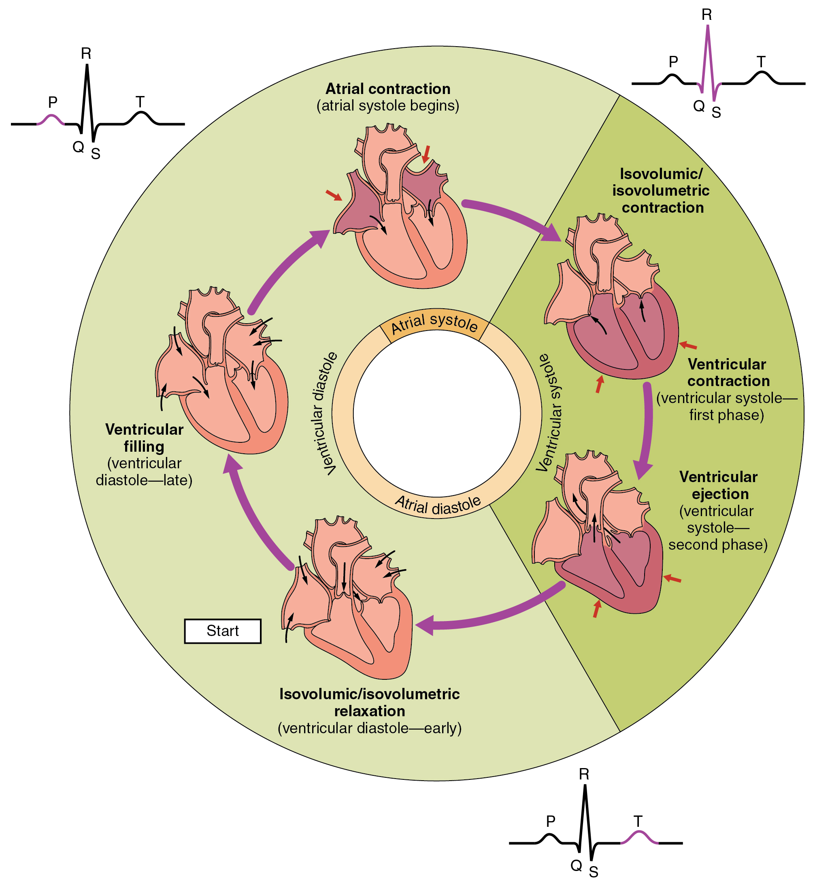
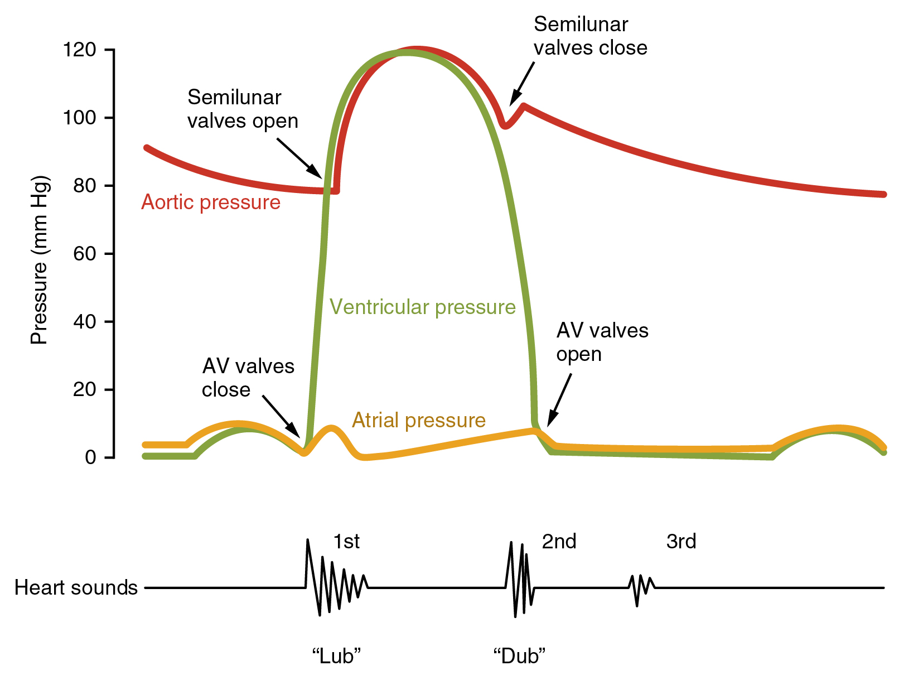
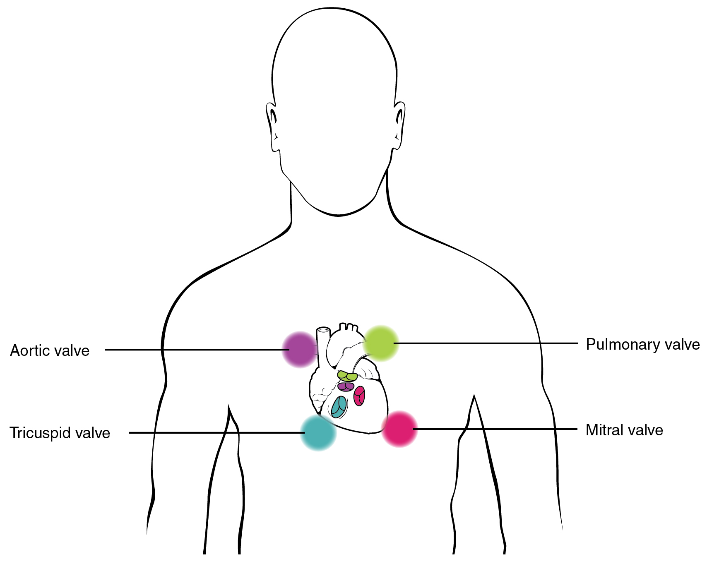

By the end of this section, you will be able to:
* Describe the relationship between blood pressure and blood flow
* Summarize the events of the cardiac cycle
* Compare atrial and ventricular systole and diastole
* Relate heart sounds detected by auscultation to action of heart’s valves

The period of time that begins with contraction of the atria and ends with ventricular relaxation is known as the **cardiac cycle**{: data-type="term"} ([\[link\]](#fig-ch20_03_01)). The period of contraction that the heart undergoes while it pumps blood into circulation is called **systole**{: data-type="term"}. The period of relaxation that occurs as the chambers fill with blood is called **diastole**{: data-type="term"}. Both the atria and ventricles undergo systole and diastole, and it is essential that these components be carefully regulated and coordinated to ensure blood is pumped efficiently to the body.

 {: #fig-ch20_03_01 data-title="Overview of the Cardiac Cycle "}

# Pressures and Flow

Fluids, whether gases or liquids, are materials that flow according to pressure gradients—that is, they move from regions that are higher in pressure to regions that are lower in pressure. Accordingly, when the heart chambers are relaxed (diastole), blood will flow into the atria from the veins, which are higher in pressure. As blood flows into the atria, the pressure will rise, so the blood will initially move passively from the atria into the ventricles. When the action potential triggers the muscles in the atria to contract (atrial systole), the pressure within the atria rises further, pumping blood into the ventricles. During ventricular systole, pressure rises in the ventricles, pumping blood into the pulmonary trunk from the right ventricle and into the aorta from the left ventricle. Again, as you consider this flow and relate it to the conduction pathway, the elegance of the system should become apparent.

# Phases of the Cardiac Cycle

At the beginning of the cardiac cycle, both the atria and ventricles are relaxed (diastole). Blood is flowing into the right atrium from the superior and inferior venae cavae and the coronary sinus. Blood flows into the left atrium from the four pulmonary veins. The two atrioventricular valves, the tricuspid and mitral valves, are both open, so blood flows unimpeded from the atria and into the ventricles. Approximately 70–80 percent of ventricular filling occurs by this method. The two semilunar valves, the pulmonary and aortic valves, are closed, preventing backflow of blood into the right and left ventricles from the pulmonary trunk on the right and the aorta on the left.

## Atrial Systole and Diastole

Contraction of the atria follows depolarization, represented by the P wave of the ECG. As the atrial muscles contract from the superior portion of the atria toward the atrioventricular septum, pressure rises within the atria and blood is pumped into the ventricles through the open atrioventricular (tricuspid, and mitral or bicuspid) valves. At the start of atrial systole, the ventricles are normally filled with approximately 70–80 percent of their capacity due to inflow during diastole. Atrial contraction, also referred to as the “atrial kick,” contributes the remaining 20–30 percent of filling (see [\[link\]](#fig-ch20_03_01)). Atrial systole lasts approximately 100 ms and ends prior to ventricular systole, as the atrial muscle returns to diastole.

## Ventricular Systole

Ventricular systole (see [\[link\]](#fig-ch20_03_01)) follows the depolarization of the ventricles and is represented by the QRS complex in the ECG. It may be conveniently divided into two phases, lasting a total of 270 ms. At the end of atrial systole and just prior to atrial contraction, the ventricles contain approximately 130 mL blood in a resting adult in a standing position. This volume is known as the **end diastolic volume (EDV)**{: data-type="term"} or **preload**{: data-type="term"}.

Initially, as the muscles in the ventricle contract, the pressure of the blood within the chamber rises, but it is not yet high enough to open the semilunar (pulmonary and aortic) valves and be ejected from the heart. However, blood pressure quickly rises above that of the atria that are now relaxed and in diastole. This increase in pressure causes blood to flow back toward the atria, closing the tricuspid and mitral valves. Since blood is not being ejected from the ventricles at this early stage, the volume of blood within the chamber remains constant. Consequently, this initial phase of ventricular systole is known as **isovolumic contraction**{: data-type="term"}, also called isovolumetric contraction (see [\[link\]](#fig-ch20_03_01)).

In the second phase of ventricular systole, the **ventricular ejection phase**{: data-type="term"}, the contraction of the ventricular muscle has raised the pressure within the ventricle to the point that it is greater than the pressures in the pulmonary trunk and the aorta. Blood is pumped from the heart, pushing open the pulmonary and aortic semilunar valves. Pressure generated by the left ventricle will be appreciably greater than the pressure generated by the right ventricle, since the existing pressure in the aorta will be so much higher. Nevertheless, both ventricles pump the same amount of blood. This quantity is referred to as stroke volume. Stroke volume will normally be in the range of 70–80 mL. Since ventricular systole began with an EDV of approximately 130 mL of blood, this means that there is still 50–60 mL of blood remaining in the ventricle following contraction. This volume of blood is known as the **end systolic volume (ESV)**{: data-type="term"}.

## Ventricular Diastole

Ventricular relaxation, or diastole, follows repolarization of the ventricles and is represented by the T wave of the ECG. It too is divided into two distinct phases and lasts approximately 430 ms.

During the early phase of ventricular diastole, as the ventricular muscle relaxes, pressure on the remaining blood within the ventricle begins to fall. When pressure within the ventricles drops below pressure in both the pulmonary trunk and aorta, blood flows back toward the heart, producing the dicrotic notch (small dip) seen in blood pressure tracings. The semilunar valves close to prevent backflow into the heart. Since the atrioventricular valves remain closed at this point, there is no change in the volume of blood in the ventricle, so the early phase of ventricular diastole is called the **isovolumic ventricular relaxation phase**{: data-type="term"}, also called isovolumetric ventricular relaxation phase (see [\[link\]](#fig-ch20_03_01)).

In the second phase of ventricular diastole, called late ventricular diastole, as the ventricular muscle relaxes, pressure on the blood within the ventricles drops even further. Eventually, it drops below the pressure in the atria. When this occurs, blood flows from the atria into the ventricles, pushing open the tricuspid and mitral valves. As pressure drops within the ventricles, blood flows from the major veins into the relaxed atria and from there into the ventricles. Both chambers are in diastole, the atrioventricular valves are open, and the semilunar valves remain closed (see [\[link\]](#fig-ch20_03_01)). The cardiac cycle is complete.

[\[link\]](#fig-ch20_03_02) illustrates the relationship between the cardiac cycle and the ECG.

 . The P wave represents depolarization of the atria and is followed by atrial contraction (systole). Atrial systole extends until the QRS complex, at which point, the atria relax. The QRS complex represents depolarization of the ventricles and is followed by ventricular contraction. The T wave represents the repolarization of the ventricles and marks the beginning of ventricular relaxation."){: #fig-ch20_03_02 data-title="Relationship between the Cardiac Cycle and ECG "}

# Heart Sounds

One of the simplest, yet effective, diagnostic techniques applied to assess the state of a patient’s heart is auscultation using a stethoscope.

In a normal, healthy heart, there are only two audible **heart sounds**{: data-type="term"}\: S1 and S2. S1 is the sound created by the closing of the atrioventricular valves during ventricular contraction and is normally described as a “lub,” or first heart sound. The second heart sound, S2, is the sound of the closing of the semilunar valves during ventricular diastole and is described as a “dub” ([\[link\]](#fig-ch20_03_03)). In both cases, as the valves close, the openings within the atrioventricular septum guarded by the valves will become reduced, and blood flow through the opening will become more turbulent until the valves are fully closed. There is a third heart sound, S3, but it is rarely heard in healthy individuals. It may be the sound of blood flowing into the atria, or blood sloshing back and forth in the ventricle, or even tensing of the chordae tendineae. S3 may be heard in youth, some athletes, and pregnant women. If the sound is heard later in life, it may indicate congestive heart failure, warranting further tests. Some cardiologists refer to the collective S1, S2, and S3 sounds as the “Kentucky gallop,” because they mimic those produced by a galloping horse. The fourth heart sound, S4, results from the contraction of the atria pushing blood into a stiff or hypertrophic ventricle, indicating failure of the left ventricle. S4 occurs prior to S1 and the collective sounds S4, S1, and S2 are referred to by some cardiologists as the “Tennessee gallop,” because of their similarity to the sound produced by a galloping horse with a different gait. A few individuals may have both S3 and S4, and this combined sound is referred to as S7.

 {: #fig-ch20_03_03 data-title="Heart Sounds and the Cardiac Cycle "}

The term **murmur**{: data-type="term"} is used to describe an unusual sound coming from the heart that is caused by the turbulent flow of blood. Murmurs are graded on a scale of 1 to 6, with 1 being the most common, the most difficult sound to detect, and the least serious. The most severe is a 6. Phonocardiograms or auscultograms can be used to record both normal and abnormal sounds using specialized electronic stethoscopes.

During auscultation, it is common practice for the clinician to ask the patient to breathe deeply. This procedure not only allows for listening to airflow, but it may also amplify heart murmurs. Inhalation increases blood flow into the right side of the heart and may increase the amplitude of right-sided heart murmurs. Expiration partially restricts blood flow into the left side of the heart and may amplify left-sided heart murmurs. [\[link\]](#fig-ch20_03_04) indicates proper placement of the bell of the stethoscope to facilitate auscultation.

 {: #fig-ch20_03_04 data-title="Stethoscope Placement for Auscultation "}

# Chapter Review

The cardiac cycle comprises a complete relaxation and contraction of both the atria and ventricles, and lasts approximately 0.8 seconds. Beginning with all chambers in diastole, blood flows passively from the veins into the atria and past the atrioventricular valves into the ventricles. The atria begin to contract (atrial systole), following depolarization of the atria, and pump blood into the ventricles. The ventricles begin to contract (ventricular systole), raising pressure within the ventricles. When ventricular pressure rises above the pressure in the atria, blood flows toward the atria, producing the first heart sound, S1 or lub. As pressure in the ventricles rises above two major arteries, blood pushes open the two semilunar valves and moves into the pulmonary trunk and aorta in the ventricular ejection phase. Following ventricular repolarization, the ventricles begin to relax (ventricular diastole), and pressure within the ventricles drops. As ventricular pressure drops, there is a tendency for blood to flow back into the atria from the major arteries, producing the dicrotic notch in the ECG and closing the two semilunar valves. The second heart sound, S2 or dub, occurs when the semilunar valves close. When the pressure falls below that of the atria, blood moves from the atria into the ventricles, opening the atrioventricular valves and marking one complete heart cycle. The valves prevent backflow of blood. Failure of the valves to operate properly produces turbulent blood flow within the heart; the resulting heart murmur can often be heard with a stethoscope.

# Review Questions

The cardiac cycle consists of a distinct relaxation and contraction phase. Which term is typically used to refer ventricular contraction while no blood is being ejected?

1.  systole
2.  diastole
3.  quiescent
4.  isovolumic contraction
{: data-number-style="lower-alpha"}

D

Most blood enters the ventricle during \_\_\_\_\_\_\_\_.

1.  atrial systole
2.  atrial diastole
3.  ventricular systole
4.  isovolumic contraction
{: data-number-style="lower-alpha"}

B

The first heart sound represents which portion of the cardiac cycle?

1.  atrial systole
2.  ventricular systole
3.  closing of the atrioventricular valves
4.  closing of the semilunar valves
{: data-number-style="lower-alpha"}

C

Ventricular relaxation immediately follows \_\_\_\_\_\_\_\_.

1.  atrial depolarization
2.  ventricular repolarization
3.  ventricular depolarization
4.  atrial repolarization
{: data-number-style="lower-alpha"}

B

# Critical Thinking Questions

Describe one cardiac cycle, beginning with both atria and ventricles relaxed.

The cardiac cycle comprises a complete relaxation and contraction of both the atria and ventricles, and lasts approximately 0.8 seconds. Beginning with all chambers in diastole, blood flows passively from the veins into the atria and past the atrioventricular valves into the ventricles. The atria begin to contract following depolarization of the atria and pump blood into the ventricles. The ventricles begin to contract, raising pressure within the ventricles. When ventricular pressure rises above the pressure in the two major arteries, blood pushes open the two semilunar valves and moves into the pulmonary trunk and aorta in the ventricular ejection phase. Following ventricular repolarization, the ventricles begin to relax, and pressure within the ventricles drops. When the pressure falls below that of the atria, blood moves from the atria into the ventricles, opening the atrioventricular valves and marking one complete heart cycle.

