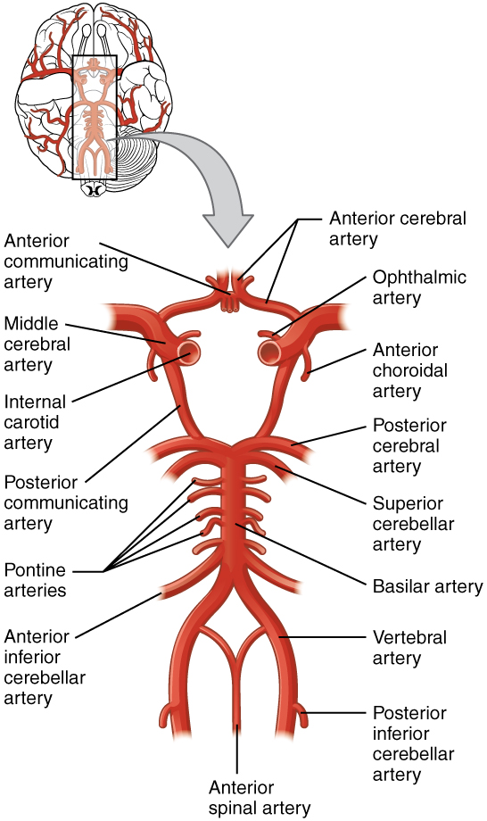
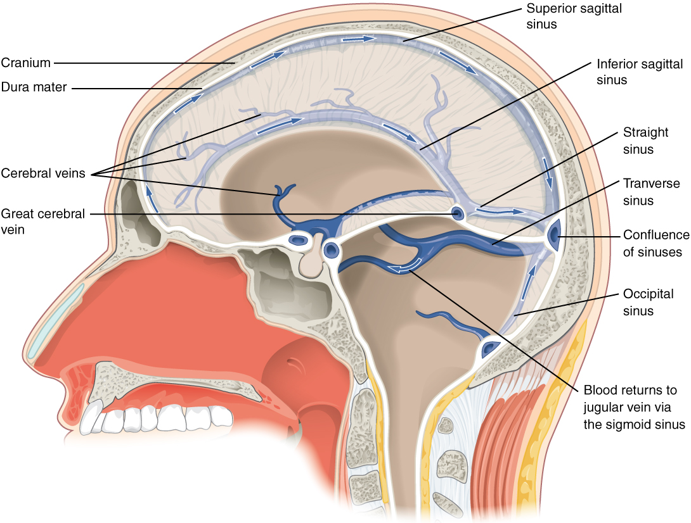
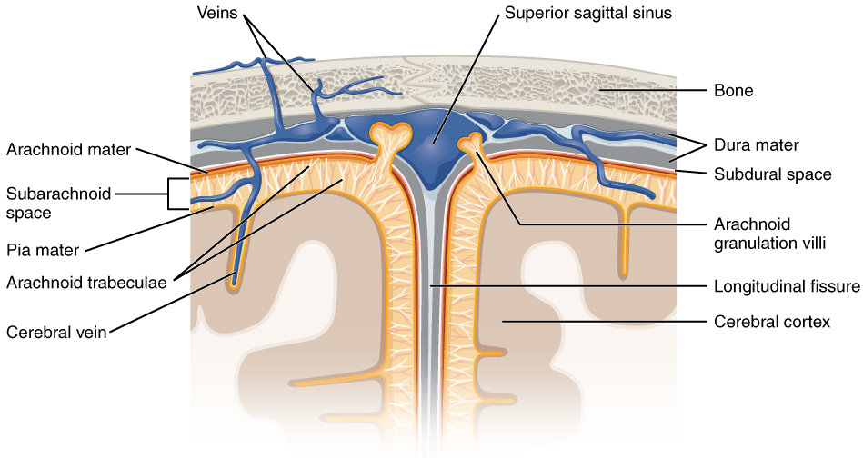
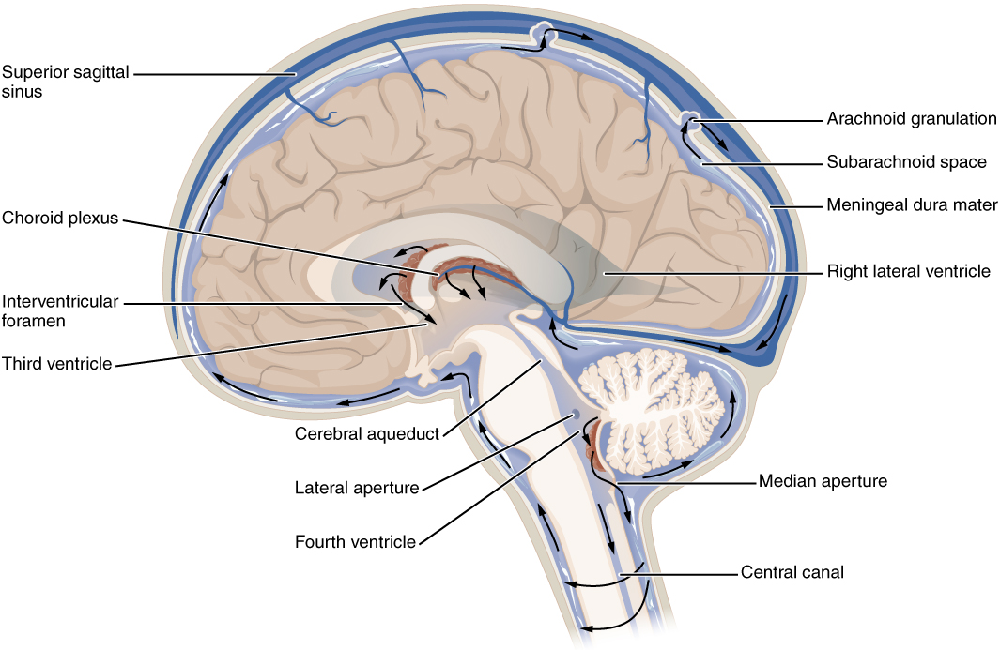

By the end of this section, you will be able to:
* Describe the vessels that supply the CNS with blood
* Name the components of the ventricular system and the regions of the brain in which each is located
* Explain the production of cerebrospinal fluid and its flow through the ventricles
* Explain how a disruption in circulation would result in a stroke

The CNS is crucial to the operation of the body, and any compromise in the brain and spinal cord can lead to severe difficulties. The CNS has a privileged blood supply, as suggested by the blood-brain barrier. The function of the tissue in the CNS is crucial to the survival of the organism, so the contents of the blood cannot simply pass into the central nervous tissue. To protect this region from the toxins and pathogens that may be traveling through the blood stream, there is strict control over what can move out of the general systems and into the brain and spinal cord. Because of this privilege, the CNS needs specialized structures for the maintenance of circulation. This begins with a unique arrangement of blood vessels carrying fresh blood into the CNS. Beyond the supply of blood, the CNS filters that blood into cerebrospinal fluid (CSF), which is then circulated through the cavities of the brain and spinal cord called ventricles.

# Blood Supply to the Brain

A lack of oxygen to the CNS can be devastating, and the cardiovascular system has specific regulatory reflexes to ensure that the blood supply is not interrupted. There are multiple routes for blood to get into the CNS, with specializations to protect that blood supply and to maximize the ability of the brain to get an uninterrupted perfusion.

## Arterial Supply

The major artery carrying recently oxygenated blood away from the heart is the aorta. The very first branches off the aorta supply the heart with nutrients and oxygen. The next branches give rise to the **common carotid arteries**{: data-type="term"}, which further branch into the **internal carotid arteries**{: data-type="term"}. The external carotid arteries supply blood to the tissues on the surface of the cranium. The bases of the common carotids contain stretch receptors that immediately respond to the drop in blood pressure upon standing. The **orthostatic reflex**{: data-type="term"} is a reaction to this change in body position, so that blood pressure is maintained against the increasing effect of gravity (orthostatic means “standing up”). Heart rate increases—a reflex of the sympathetic division of the autonomic nervous system—and this raises blood pressure.

The internal carotid artery enters the cranium through the **carotid canal**{: data-type="term"} in the temporal bone. A second set of vessels that supply the CNS are the **vertebral arteries**{: data-type="term"}, which are protected as they pass through the neck region by the transverse foramina of the cervical vertebrae. The vertebral arteries enter the cranium through the **foramen magnum**{: data-type="term"} of the occipital bone. Branches off the left and right vertebral arteries merge into the **anterior spinal artery**{: data-type="term"} supplying the anterior aspect of the spinal cord, found along the anterior median fissure. The two vertebral arteries then merge into the **basilar artery**{: data-type="term"}, which gives rise to branches to the brain stem and cerebellum. The left and right internal carotid arteries and branches of the basilar artery all become the **circle of Willis**{: data-type="term"}, a confluence of arteries that can maintain perfusion of the brain even if narrowing or a blockage limits flow through one part ([\[link\]](#fig-ch13_03_01)).

 {: #fig-ch13_03_01 data-title="Circle of Willis "}

  
Watch this [animation][1] to see how blood flows to the brain and passes through the circle of Willis before being distributed through the cerebrum. The circle of Willis is a specialized arrangement of arteries that ensure constant perfusion of the cerebrum even in the event of a blockage of one of the arteries in the circle. The animation shows the normal direction of flow through the circle of Willis to the middle cerebral artery. Where would the blood come from if there were a blockage just posterior to the middle cerebral artery on the left?

## Venous Return

After passing through the CNS, blood returns to the circulation through a series of **dural sinuses**{: data-type="term"} and veins ([\[link\]](#fig-ch13_03_02)). The **superior sagittal sinus**{: data-type="term"} runs in the groove of the longitudinal fissure, where it absorbs CSF from the meninges. The superior sagittal sinus drains to the confluence of sinuses, along with the **occipital sinuses**{: data-type="term"} and **straight sinus**{: data-type="term"}, to then drain into the **transverse sinuses**{: data-type="term"}. The transverse sinuses connect to the **sigmoid sinuses**{: data-type="term"}, which then connect to the **jugular veins**{: data-type="term"}. From there, the blood continues toward the heart to be pumped to the lungs for reoxygenation.

 {: #fig-ch13_03_02 data-title="Dural Sinuses and Veins "}

# Protective Coverings of the Brain and Spinal Cord

The outer surface of the CNS is covered by a series of membranes composed of connective tissue called the **meninges**{: data-type="term"}, which protect the brain. The **dura mater**{: data-type="term"} is a thick fibrous layer and a strong protective sheath over the entire brain and spinal cord. It is anchored to the inner surface of the cranium and vertebral cavity. The **arachnoid mater**{: data-type="term"} is a membrane of thin fibrous tissue that forms a loose sac around the CNS. Beneath the arachnoid is a thin, filamentous mesh called the **arachnoid trabeculae**{: data-type="term"}, which looks like a spider web, giving this layer its name. Directly adjacent to the surface of the CNS is the **pia mater**{: data-type="term"}, a thin fibrous membrane that follows the convolutions of gyri and sulci in the cerebral cortex and fits into other grooves and indentations ([\[link\]](#fig-ch13_03_03)).

 {: #fig-ch13_03_03 data-title="Meningeal Layers of Superior Sagittal Sinus "}

## Dura Mater

Like a thick cap covering the brain, the dura mater is a tough outer covering. The name comes from the Latin for “tough mother” to represent its physically protective role. It encloses the entire CNS and the major blood vessels that enter the cranium and vertebral cavity. It is directly attached to the inner surface of the bones of the cranium and to the very end of the vertebral cavity.

There are infoldings of the dura that fit into large crevasses of the brain. Two infoldings go through the midline separations of the cerebrum and cerebellum; one forms a shelf-like tent between the occipital lobes of the cerebrum and the cerebellum, and the other surrounds the pituitary gland. The dura also surrounds and supports the venous sinuses.

## Arachnoid Mater

The middle layer of the meninges is the arachnoid, named for the spider-web–like trabeculae between it and the pia mater. The arachnoid defines a sac-like enclosure around the CNS. The trabeculae are found in the **subarachnoid space**{: data-type="term"}, which is filled with circulating CSF. The arachnoid emerges into the dural sinuses as the **arachnoid granulations**{: data-type="term"}, where the CSF is filtered back into the blood for drainage from the nervous system.

The subarachnoid space is filled with circulating CSF, which also provides a liquid cushion to the brain and spinal cord. Similar to clinical blood work, a sample of CSF can be withdrawn to find chemical evidence of neuropathology or metabolic traces of the biochemical functions of nervous tissue.

## Pia Mater

The outer surface of the CNS is covered in the thin fibrous membrane of the pia mater. It is thought to have a continuous layer of cells providing a fluid-impermeable membrane. The name pia mater comes from the Latin for “tender mother,” suggesting the thin membrane is a gentle covering for the brain. The pia extends into every convolution of the CNS, lining the inside of the sulci in the cerebral and cerebellar cortices. At the end of the spinal cord, a thin filament extends from the inferior end of CNS at the upper lumbar region of the vertebral column to the sacral end of the vertebral column. Because the spinal cord does not extend through the lower lumbar region of the vertebral column, a needle can be inserted through the dura and arachnoid layers to withdraw CSF. This procedure is called a **lumbar puncture**{: data-type="term"} and avoids the risk of damaging the central tissue of the spinal cord. Blood vessels that are nourishing the central nervous tissue are between the pia mater and the nervous tissue.

Disorders of the…

Meninges Meningitis is an inflammation of the meninges, the three layers of fibrous membrane that surround the CNS. Meningitis can be caused by infection by bacteria or viruses. The particular pathogens are not special to meningitis; it is just an inflammation of that specific set of tissues from what might be a broader infection. Bacterial meningitis can be caused by *Streptococcus*, *Staphylococcus*, or the tuberculosis pathogen, among many others. Viral meningitis is usually the result of common enteroviruses (such as those that cause intestinal disorders), but may be the result of the herpes virus or West Nile virus. Bacterial meningitis tends to be more severe.

The symptoms associated with meningitis can be fever, chills, nausea, vomiting, light sensitivity, soreness of the neck, or severe headache. More important are the neurological symptoms, such as changes in mental state (confusion, memory deficits, and other dementia-type symptoms). A serious risk of meningitis can be damage to peripheral structures because of the nerves that pass through the meninges. Hearing loss is a common result of meningitis.

The primary test for meningitis is a lumbar puncture. A needle inserted into the lumbar region of the spinal column through the dura mater and arachnoid membrane into the subarachnoid space can be used to withdraw the fluid for chemical testing. Fatality occurs in 5 to 40 percent of children and 20 to 50 percent of adults with bacterial meningitis. Treatment of bacterial meningitis is through antibiotics, but viral meningitis cannot be treated with antibiotics because viruses do not respond to that type of drug. Fortunately, the viral forms are milder.

  
Watch this [video][2] that describes the procedure known as the lumbar puncture, a medical procedure used to sample the CSF. Because of the anatomy of the CNS, it is a relative safe location to insert a needle. Why is the lumbar puncture performed in the lower lumbar area of the vertebral column?

# The Ventricular System

Cerebrospinal fluid (CSF) circulates throughout and around the CNS. In other tissues, water and small molecules are filtered through capillaries as the major contributor to the interstitial fluid. In the brain, CSF is produced in special structures to perfuse through the nervous tissue of the CNS and is continuous with the interstitial fluid. Specifically, CSF circulates to remove metabolic wastes from the interstitial fluids of nervous tissues and return them to the blood stream. The **ventricles**{: data-type="term"} are the open spaces within the brain where CSF circulates. In some of these spaces, CSF is produced by filtering of the blood that is performed by a specialized membrane known as a choroid plexus. The CSF circulates through all of the ventricles to eventually emerge into the subarachnoid space where it will be reabsorbed into the blood.

## The Ventricles

There are four ventricles within the brain, all of which developed from the original hollow space within the neural tube, the **central canal**{: data-type="term"}. The first two are named the **lateral ventricles**{: data-type="term"} and are deep within the cerebrum. These ventricles are connected to the **third ventricle**{: data-type="term"} by two openings called the **interventricular foramina**{: data-type="term"}. The third ventricle is the space between the left and right sides of the diencephalon, which opens into the **cerebral aqueduct**{: data-type="term"} that passes through the midbrain. The aqueduct opens into the **fourth ventricle**{: data-type="term"}, which is the space between the cerebellum and the pons and upper medulla ([\[link\]](#fig-ch13_03_04)).

 {: #fig-ch13_03_04 data-title="Cerebrospinal Fluid Circulation "}

As the telencephalon enlarges and grows into the cranial cavity, it is limited by the space within the skull. The telencephalon is the most anterior region of what was the neural tube, but cannot grow past the limit of the frontal bone of the skull. Because the cerebrum fits into this space, it takes on a C-shaped formation, through the frontal, parietal, occipital, and finally temporal regions. The space within the telencephalon is stretched into this same C-shape. The two ventricles are in the left and right sides, and were at one time referred to as the first and second ventricles. The interventricular foramina connect the frontal region of the lateral ventricles with the third ventricle.

The third ventricle is the space bounded by the medial walls of the hypothalamus and thalamus. The two thalami touch in the center in most brains as the massa intermedia, which is surrounded by the third ventricle. The cerebral aqueduct opens just inferior to the epithalamus and passes through the midbrain. The tectum and tegmentum of the midbrain are the roof and floor of the cerebral aqueduct, respectively. The aqueduct opens up into the fourth ventricle. The floor of the fourth ventricle is the dorsal surface of the pons and upper medulla (that gray matter making a continuation of the tegmentum of the midbrain). The fourth ventricle then narrows into the central canal of the spinal cord.

The ventricular system opens up to the subarachnoid space from the fourth ventricle. The single **median aperture**{: data-type="term"} and the pair of **lateral apertures**{: data-type="term"} connect to the subarachnoid space so that CSF can flow through the ventricles and around the outside of the CNS. Cerebrospinal fluid is produced within the ventricles by a type of specialized membrane called a **choroid plexus**{: data-type="term"}. Ependymal cells (one of the types of glial cells described in the introduction to the nervous system) surround blood capillaries and filter the blood to make CSF. The fluid is a clear solution with a limited amount of the constituents of blood. It is essentially water, small molecules, and electrolytes. Oxygen and carbon dioxide are dissolved into the CSF, as they are in blood, and can diffuse between the fluid and the nervous tissue.

## Cerebrospinal Fluid Circulation

The choroid plexuses are found in all four ventricles. Observed in dissection, they appear as soft, fuzzy structures that may still be pink, depending on how well the circulatory system is cleared in preparation of the tissue. The CSF is produced from components extracted from the blood, so its flow out of the ventricles is tied to the pulse of cardiovascular circulation.

From the lateral ventricles, the CSF flows into the third ventricle, where more CSF is produced, and then through the cerebral aqueduct into the fourth ventricle where even more CSF is produced. A very small amount of CSF is filtered at any one of the plexuses, for a total of about 500 milliliters daily, but it is continuously made and pulses through the ventricular system, keeping the fluid moving. From the fourth ventricle, CSF can continue down the central canal of the spinal cord, but this is essentially a cul-de-sac, so more of the fluid leaves the ventricular system and moves into the subarachnoid space through the median and lateral apertures.

Within the subarachnoid space, the CSF flows around all of the CNS, providing two important functions. As with elsewhere in its circulation, the CSF picks up metabolic wastes from the nervous tissue and moves it out of the CNS. It also acts as a liquid cushion for the brain and spinal cord. By surrounding the entire system in the subarachnoid space, it provides a thin buffer around the organs within the strong, protective dura mater. The arachnoid granulations are outpocketings of the arachnoid membrane into the dural sinuses so that CSF can be reabsorbed into the blood, along with the metabolic wastes. From the dural sinuses, blood drains out of the head and neck through the jugular veins, along with the rest of the circulation for blood, to be reoxygenated by the lungs and wastes to be filtered out by the kidneys ([\[link\]](#tbl-ch13_02)).

  
Watch this [animation][3] that shows the flow of CSF through the brain and spinal cord, and how it originates from the ventricles and then spreads into the space within the meninges, where the fluids then move into the venous sinuses to return to the cardiovascular circulation. What are the structures that produce CSF and where are they found? How are the structures indicated in this animation?

<table id="tbl-ch13_02" summary="Components of CSF Circulation"><thead>
<tr>
<th colspan="7">Components of CSF Circulation</th>
</tr>
<tr>
<th />
<th>Lateral ventricles</th>
<th>Third ventricle</th>
<th>Cerebral aqueduct</th>
<th>Fourth ventricle</th>
<th>Central canal</th>
<th>Subarachnoid space</th>
</tr>
</thead><tbody>
<tr>
<td><strong>Location in CNS</strong></td>
<td>Cerebrum</td>
<td>Diencephalon</td>
<td>Midbrain</td>
<td>Between pons/upper medulla and cerebellum</td>
<td>Spinal cord</td>
<td>External to entire CNS</td>
</tr>
<tr>
<td><strong>Blood vessel structure</strong></td>
<td>Choroid plexus</td>
<td>Choroid plexus</td>
<td>None</td>
<td>Choroid plexus</td>
<td>None</td>
<td>Arachnoid granulations</td>
</tr>
</tbody></table>

Disorders of the…

Central Nervous System The supply of blood to the brain is crucial to its ability to perform many functions. Without a steady supply of oxygen, and to a lesser extent glucose, the nervous tissue in the brain cannot keep up its extensive electrical activity. These nutrients get into the brain through the blood, and if blood flow is interrupted, neurological function is compromised.

The common name for a disruption of blood supply to the brain is a stroke. It is caused by a blockage to an artery in the brain. The blockage is from some type of embolus: a blood clot, a fat embolus, or an air bubble. When the blood cannot travel through the artery, the surrounding tissue that is deprived starves and dies. Strokes will often result in the loss of very specific functions. A stroke in the lateral medulla, for example, can cause a loss in the ability to swallow. Sometimes, seemingly unrelated functions will be lost because they are dependent on structures in the same region. Along with the swallowing in the previous example, a stroke in that region could affect sensory functions from the face or extremities because important white matter pathways also pass through the lateral medulla. Loss of blood flow to specific regions of the cortex can lead to the loss of specific higher functions, from the ability to recognize faces to the ability to move a particular region of the body. Severe or limited memory loss can be the result of a temporal lobe stroke.

Related to strokes are transient ischemic attacks (TIAs), which can also be called “mini-strokes.” These are events in which a physical blockage may be temporary, cutting off the blood supply and oxygen to a region, but not to the extent that it causes cell death in that region. While the neurons in that area are recovering from the event, neurological function may be lost. Function can return if the area is able to recover from the event.

Recovery from a stroke (or TIA) is strongly dependent on the speed of treatment. Often, the person who is present and notices something is wrong must then make a decision. The mnemonic **<u data-effect="underline">F</u><u data-effect="underline">A</u><u data-effect="underline">S</u><u data-effect="underline">T</u>** helps people remember what to look for when someone is dealing with sudden losses of neurological function. If someone complains of feeling “funny,” check these things quickly: Look at the person’s face. Does he or she have problems moving **<u data-effect="underline">F</u>**ace muscles and making regular facial expressions? Ask the person to raise his or her **<u data-effect="underline">A</u>**rms above the head. Can the person lift one arm but not the other? Has the person’s **<u data-effect="underline">S</u>**peech changed? Is he or she slurring words or having trouble saying things? If any of these things have happened, then it is **<u data-effect="underline">T</u>**ime to call for help.

Sometimes, treatment with blood-thinning drugs can alleviate the problem, and recovery is possible. If the tissue is damaged, the amazing thing about the nervous system is that it is adaptable. With physical, occupational, and speech therapy, victims of strokes can recover, or more accurately relearn, functions.

# Chapter Review

The CNS has a privileged blood supply established by the blood-brain barrier. Establishing this barrier are anatomical structures that help to protect and isolate the CNS. The arterial blood to the brain comes from the internal carotid and vertebral arteries, which both contribute to the unique circle of Willis that provides constant perfusion of the brain even if one of the blood vessels is blocked or narrowed. That blood is eventually filtered to make a separate medium, the CSF, that circulates within the spaces of the brain and then into the surrounding space defined by the meninges, the protective covering of the brain and spinal cord.

The blood that nourishes the brain and spinal cord is behind the glial-cell–enforced blood-brain barrier, which limits the exchange of material from blood vessels with the interstitial fluid of the nervous tissue. Thus, metabolic wastes are collected in cerebrospinal fluid that circulates through the CNS. This fluid is produced by filtering blood at the choroid plexuses in the four ventricles of the brain. It then circulates through the ventricles and into the subarachnoid space, between the pia mater and the arachnoid mater. From the arachnoid granulations, CSF is reabsorbed into the blood, removing the waste from the privileged central nervous tissue.

The blood, now with the reabsorbed CSF, drains out of the cranium through the dural sinuses. The dura mater is the tough outer covering of the CNS, which is anchored to the inner surface of the cranial and vertebral cavities. It surrounds the venous space known as the dural sinuses, which connect to the jugular veins, where blood drains from the head and neck.

# Interactive Link Questions

Watch this [animation][1] to see how blood flows to the brain and passes through the circle of Willis before being distributed through the cerebrum. The circle of Willis is a specialized arrangement of arteries that ensure constant perfusion of the cerebrum even in the event of a blockage of one of the arteries in the circle. The animation shows the normal direction of flow through the circle of Willis to the middle cerebral artery. Where would the blood come from if there were a blockage just posterior to the middle cerebral artery on the left?

If blood could not get to the middle cerebral artery through the posterior circulation, the blood would flow around the circle of Willis to reach that artery from an anterior vessel. Blood flow would just reverse within the circle.

Watch this [video][2] that describes the procedure known as the lumbar puncture, a medical procedure used to sample the CSF. Because of the anatomy of the CNS, it is a relative safe location to insert a needle. Why is the lumbar puncture performed in the lower lumbar area of the vertebral column?

The spinal cord ends in the upper lumbar area of the vertebral column, so a needle inserted lower than that will not damage the nervous tissue of the CNS.

Watch this [animation][3] that shows the flow of CSF through the brain and spinal cord, and how it originates from the ventricles and then spreads into the space within the meninges, where the fluids then move into the venous sinuses to return to the cardiovascular circulation. What are the structures that produce CSF and where are they found? How are the structures indicated in this animation?

The choroid plexuses of the ventricles make CSF. As shown, there is a little of the blue color appearing in each ventricle that is joined by the color flowing from the other ventricles.

# Review Questions

What blood vessel enters the cranium to supply the brain with fresh, oxygenated blood?

1.  common carotid artery
2.  jugular vein
3.  internal carotid artery
4.  aorta
{: data-number-style="lower-alpha"}

C

Which layer of the meninges surrounds and supports the sinuses that form the route through which blood drains from the CNS?

1.  dura mater
2.  arachnoid mater
3.  subarachnoid
4.  pia mater
{: data-number-style="lower-alpha"}

A

What type of glial cell is responsible for filtering blood to produce CSF at the choroid plexus?

1.  ependymal cell
2.  astrocyte
3.  oligodendrocyte
4.  Schwann cell
{: data-number-style="lower-alpha"}

A

Which portion of the ventricular system is found within the diencephalon?

1.  lateral ventricles
2.  third ventricle
3.  cerebral aqueduct
4.  fourth ventricle
{: data-number-style="lower-alpha"}

B

What condition causes a stroke?

1.  inflammation of meninges
2.  lumbar puncture
3.  infection of cerebral spinal fluid
4.  disruption of blood to the brain
{: data-number-style="lower-alpha"}

D

# Critical Thinking Questions

Why can the circle of Willis maintain perfusion of the brain even if there is a blockage in one part of the structure?

The structure is a circular connection of blood vessels, so that blood coming up from one of the arteries can flow in either direction around the circle and avoid any blockage or narrowing of the blood vessels.

Meningitis is an inflammation of the meninges that can have severe effects on neurological function. Why is infection of this structure potentially so dangerous?

The nerves that connect the periphery to the CNS pass through these layers of tissue and can be damaged by that inflammation, causing a loss of important neurological functions.

## Glossary
{: data-type="glossary-title"}

anterior spinal artery
: blood vessel from the merged branches of the vertebral arteries that runs along the anterior surface of the spinal cord
{: .definition}

arachnoid granulation
: outpocket of the arachnoid membrane into the dural sinuses that allows for reabsorption of CSF into the blood
{: .definition}

arachnoid mater
: middle layer of the meninges named for the spider-web–like trabeculae that extend between it and the pia mater
{: .definition}

arachnoid trabeculae
: filaments between the arachnoid and pia mater within the subarachnoid space
{: .definition}

basilar artery
: blood vessel from the merged vertebral arteries that runs along the dorsal surface of the brain stem
{: .definition}

carotid canal
: opening in the temporal bone through which the internal carotid artery enters the cranium
{: .definition}

central canal
: hollow space within the spinal cord that is the remnant of the center of the neural tube
{: .definition}

cerebral aqueduct
: connection of the ventricular system between the third and fourth ventricles located in the midbrain
{: .definition}

choroid plexus
: specialized structures containing ependymal cells lining blood capillaries that filter blood to produce CSF in the four ventricles of the brain
{: .definition}

circle of Willis
: unique anatomical arrangement of blood vessels around the base of the brain that maintains perfusion of blood into the brain even if one component of the structure is blocked or narrowed
{: .definition}

common carotid artery
: blood vessel that branches off the aorta (or the brachiocephalic artery on the right) and supplies blood to the head and neck
{: .definition}

dura mater
: tough, fibrous, outer layer of the meninges that is attached to the inner surface of the cranium and vertebral column and surrounds the entire CNS
{: .definition}

dural sinus
: any of the venous structures surrounding the brain, enclosed within the dura mater, which drain blood from the CNS to the common venous return of the jugular veins
{: .definition}

foramen magnum
: large opening in the occipital bone of the skull through which the spinal cord emerges and the vertebral arteries enter the cranium
{: .definition}

fourth ventricle
: the portion of the ventricular system that is in the region of the brain stem and opens into the subarachnoid space through the median and lateral apertures
{: .definition}

internal carotid artery
: branch from the common carotid artery that enters the cranium and supplies blood to the brain
{: .definition}

interventricular foramina
: openings between the lateral ventricles and third ventricle allowing for the passage of CSF
{: .definition}

jugular veins
: blood vessels that return “used” blood from the head and neck
{: .definition}

lateral apertures
: pair of openings from the fourth ventricle to the subarachnoid space on either side and between the medulla and cerebellum
{: .definition}

lateral ventricles
: portions of the ventricular system that are in the region of the cerebrum
{: .definition}

lumbar puncture
: procedure used to withdraw CSF from the lower lumbar region of the vertebral column that avoids the risk of damaging CNS tissue because the spinal cord ends at the upper lumbar vertebrae
{: .definition}

median aperture
: singular opening from the fourth ventricle into the subarachnoid space at the midline between the medulla and cerebellum
{: .definition}

meninges
: protective outer coverings of the CNS composed of connective tissue
{: .definition}

occipital sinuses
: dural sinuses along the edge of the occipital lobes of the cerebrum
{: .definition}

orthostatic reflex
: sympathetic function that maintains blood pressure when standing to offset the increased effect of gravity
{: .definition}

pia mater
: thin, innermost membrane of the meninges that directly covers the surface of the CNS
{: .definition}

sigmoid sinuses
: dural sinuses that drain directly into the jugular veins
{: .definition}

straight sinus
: dural sinus that drains blood from the deep center of the brain to collect with the other sinuses
{: .definition}

subarachnoid space
: space between the arachnoid mater and pia mater that contains CSF and the fibrous connections of the arachnoid trabeculae
{: .definition}

superior sagittal sinus
: dural sinus that runs along the top of the longitudinal fissure and drains blood from the majority of the outer cerebrum
{: .definition}

third ventricle
: portion of the ventricular system that is in the region of the diencephalon
{: .definition}

transverse sinuses
: dural sinuses that drain along either side of the occipital–cerebellar space
{: .definition}

ventricles
: remnants of the hollow center of the neural tube that are spaces for cerebrospinal fluid to circulate through the brain
{: .definition}

vertebral arteries
: arteries that ascend along either side of the vertebral column through the transverse foramina of the cervical vertebrae and enter the cranium through the foramen magnum
{: .definition}

[1]: http://openstaxcollege.org/l/bloodflow1
[2]: http://openstaxcollege.org/l/lumbarpuncture
[3]: http://openstaxcollege.org/l/CSFflow
